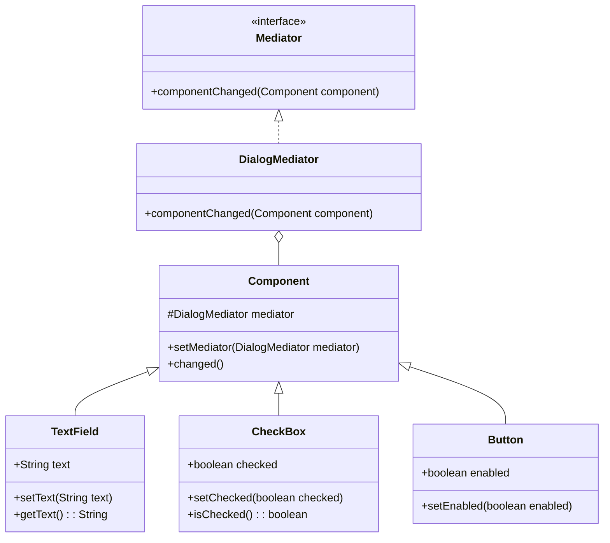

## 5.6.4 Use Cases and Examples

The Mediator pattern is a behavioral design pattern that promotes loose coupling by encapsulating the interactions between a set of objects. It allows objects to communicate without knowing each other's details, thus reducing dependencies and enhancing flexibility. In this section, we will delve into practical use cases of the Mediator pattern, focusing on GUI frameworks and chat systems, and provide detailed code examples to illustrate these applications.

### Real-World Applications of the Mediator Pattern

The Mediator pattern is particularly useful in scenarios where multiple objects need to interact in a complex manner. By centralizing communication through a mediator, we can simplify the interaction logic and make the system more maintainable. Let's explore some real-world applications:

#### 1. GUI Frameworks

In graphical user interface (GUI) frameworks, the Mediator pattern is often used to manage interactions between various components, such as buttons, text fields, and sliders. Without a mediator, each component would need to be aware of the others, leading to a tightly coupled system. By introducing a mediator, components can communicate indirectly, making the system more modular and easier to modify.

##### Example: A Simple Dialog Box

Consider a dialog box with several UI components: a text field, a checkbox, and a button. The button should only be enabled if the text field is not empty and the checkbox is checked. Implementing this logic directly in the components would lead to a tangled web of dependencies. Instead, we can use a mediator to coordinate these interactions.

```java
// Mediator interface
interface DialogMediator {
    void componentChanged(Component component);
}

// Concrete Mediator
class Dialog implements DialogMediator {
    private TextField textField;
    private CheckBox checkBox;
    private Button button;

    public Dialog(TextField textField, CheckBox checkBox, Button button) {
        this.textField = textField;
        this.checkBox = checkBox;
        this.button = button;
        textField.setMediator(this);
        checkBox.setMediator(this);
        button.setMediator(this);
    }

    @Override
    public void componentChanged(Component component) {
        if (component == textField || component == checkBox) {
            button.setEnabled(!textField.getText().isEmpty() && checkBox.isChecked());
        }
    }
}

// Abstract Component
abstract class Component {
    protected DialogMediator mediator;

    public void setMediator(DialogMediator mediator) {
        this.mediator = mediator;
    }

    public void changed() {
        mediator.componentChanged(this);
    }
}

// Concrete Components
class TextField extends Component {
    private String text;

    public String getText() {
        return text;
    }

    public void setText(String text) {
        this.text = text;
        changed();
    }
}

class CheckBox extends Component {
    private boolean checked;

    public boolean isChecked() {
        return checked;
    }

    public void setChecked(boolean checked) {
        this.checked = checked;
        changed();
    }
}

class Button extends Component {
    private boolean enabled;

    public void setEnabled(boolean enabled) {
        this.enabled = enabled;
        System.out.println("Button enabled: " + enabled);
    }
}
```

In this example, the `Dialog` class acts as the mediator, coordinating the interactions between the `TextField`, `CheckBox`, and `Button`. Each component notifies the mediator when its state changes, and the mediator updates the button's enabled state accordingly.

#### 2. Chat Systems

In collaborative environments like chat applications, the Mediator pattern can be used to manage the communication between users. Each user can be represented as a component, and the chat room acts as the mediator, handling message delivery and user interactions.

##### Example: A Simple Chat Room

Let's implement a simple chat room where users can send messages to each other through a mediator.

```java
// Mediator interface
interface ChatMediator {
    void sendMessage(String message, User user);
    void addUser(User user);
}

// Concrete Mediator
class ChatRoom implements ChatMediator {
    private List<User> users = new ArrayList<>();

    @Override
    public void sendMessage(String message, User user) {
        for (User u : users) {
            // Message should not be received by the user sending it
            if (u != user) {
                u.receive(message);
            }
        }
    }

    @Override
    public void addUser(User user) {
        users.add(user);
    }
}

// Abstract Colleague
abstract class User {
    protected ChatMediator mediator;
    protected String name;

    public User(ChatMediator mediator, String name) {
        this.mediator = mediator;
        this.name = name;
    }

    public abstract void send(String message);
    public abstract void receive(String message);
}

// Concrete Colleague
class ChatUser extends User {
    public ChatUser(ChatMediator mediator, String name) {
        super(mediator, name);
    }

    @Override
    public void send(String message) {
        System.out.println(this.name + " sends: " + message);
        mediator.sendMessage(message, this);
    }

    @Override
    public void receive(String message) {
        System.out.println(this.name + " receives: " + message);
    }
}

// Usage
public class ChatApplication {
    public static void main(String[] args) {
        ChatMediator chatRoom = new ChatRoom();

        User user1 = new ChatUser(chatRoom, "Alice");
        User user2 = new ChatUser(chatRoom, "Bob");
        User user3 = new ChatUser(chatRoom, "Charlie");

        chatRoom.addUser(user1);
        chatRoom.addUser(user2);
        chatRoom.addUser(user3);

        user1.send("Hello, everyone!");
    }
}
```

In this example, the `ChatRoom` class serves as the mediator, managing the communication between `ChatUser` instances. When a user sends a message, the mediator delivers it to all other users in the chat room.

### GUI Frameworks and Mediator Pattern

GUI frameworks often employ the Mediator pattern to handle complex interactions between components. By centralizing the interaction logic, mediators can simplify the development and maintenance of user interfaces.

#### Example: Mediator in a GUI Framework

Consider a more complex GUI application with multiple windows and dialogs. Each window might contain several components that need to interact with each other. By using a mediator, we can manage these interactions without creating dependencies between the components.

```java
// Mediator interface
interface WindowMediator {
    void notify(Component sender, String event);
}

// Concrete Mediator
class MainWindow implements WindowMediator {
    private Button saveButton;
    private Button loadButton;
    private TextField inputField;

    public MainWindow(Button saveButton, Button loadButton, TextField inputField) {
        this.saveButton = saveButton;
        this.loadButton = loadButton;
        this.inputField = inputField;
        saveButton.setMediator(this);
        loadButton.setMediator(this);
        inputField.setMediator(this);
    }

    @Override
    public void notify(Component sender, String event) {
        if (sender == inputField && event.equals("textChanged")) {
            saveButton.setEnabled(!inputField.getText().isEmpty());
        } else if (sender == saveButton && event.equals("click")) {
            System.out.println("Saving data: " + inputField.getText());
        } else if (sender == loadButton && event.equals("click")) {
            System.out.println("Loading data...");
            inputField.setText("Loaded data");
        }
    }
}

// Usage
public class GUIApplication {
    public static void main(String[] args) {
        Button saveButton = new Button();
        Button loadButton = new Button();
        TextField inputField = new TextField();

        MainWindow mainWindow = new MainWindow(saveButton, loadButton, inputField);

        inputField.setText("New data");
        saveButton.click();
        loadButton.click();
    }
}
```

In this example, the `MainWindow` class acts as the mediator, coordinating the interactions between the `Button` and `TextField` components. The mediator handles events such as button clicks and text changes, updating the UI accordingly.

### Mediator Pattern in Collaborative Environments

Collaborative environments, such as chat systems and collaborative editing tools, benefit greatly from the Mediator pattern. By centralizing communication, mediators can manage user interactions and ensure that changes are propagated efficiently.

#### Example: Collaborative Document Editing

In a collaborative document editing application, multiple users can edit the same document simultaneously. A mediator can manage the synchronization of changes and ensure that all users see the most up-to-date version of the document.

```java
// Mediator interface
interface DocumentMediator {
    void updateContent(String content, Editor editor);
    void addEditor(Editor editor);
}

// Concrete Mediator
class Document implements DocumentMediator {
    private List<Editor> editors = new ArrayList<>();
    private String content = "";

    @Override
    public void updateContent(String content, Editor editor) {
        this.content = content;
        for (Editor e : editors) {
            if (e != editor) {
                e.refresh(content);
            }
        }
    }

    @Override
    public void addEditor(Editor editor) {
        editors.add(editor);
    }
}

// Abstract Colleague
abstract class Editor {
    protected DocumentMediator mediator;
    protected String name;

    public Editor(DocumentMediator mediator, String name) {
        this.mediator = mediator;
        this.name = name;
    }

    public abstract void edit(String content);
    public abstract void refresh(String content);
}

// Concrete Colleague
class TextEditor extends Editor {
    public TextEditor(DocumentMediator mediator, String name) {
        super(mediator, name);
    }

    @Override
    public void edit(String content) {
        System.out.println(this.name + " edits: " + content);
        mediator.updateContent(content, this);
    }

    @Override
    public void refresh(String content) {
        System.out.println(this.name + " refreshes content: " + content);
    }
}

// Usage
public class CollaborativeEditingApplication {
    public static void main(String[] args) {
        DocumentMediator document = new Document();

        Editor editor1 = new TextEditor(document, "Alice");
        Editor editor2 = new TextEditor(document, "Bob");

        document.addEditor(editor1);
        document.addEditor(editor2);

        editor1.edit("Hello, world!");
    }
}
```

In this example, the `Document` class acts as the mediator, managing the synchronization of content between `TextEditor` instances. When an editor makes changes, the mediator updates the content and notifies all other editors.

### Try It Yourself

To deepen your understanding of the Mediator pattern, try modifying the examples provided:

- **GUI Example**: Add a new component, such as a slider, and update the mediator logic to handle its interactions.
- **Chat System**: Implement a private messaging feature where users can send messages directly to specific users.
- **Collaborative Editing**: Add a version control feature that tracks changes and allows users to revert to previous versions.

### Visualizing the Mediator Pattern

To better understand the interactions facilitated by the Mediator pattern, let's visualize the relationships between components and the mediator using a class diagram.



In this diagram, the `DialogMediator` class implements the `Mediator` interface and manages the interactions between `Component` instances, such as `TextField`, `CheckBox`, and `Button`.

### References and Links

For further reading on the Mediator pattern and its applications, consider the following resources:

- [Design Patterns: Elements of Reusable Object-Oriented Software](https://en.wikipedia.org/wiki/Design_Patterns) by Erich Gamma, Richard Helm, Ralph Johnson, and John Vlissides.
- [Refactoring Guru: Mediator Pattern](https://refactoring.guru/design-patterns/mediator)
- [Java Design Patterns: Mediator](https://www.journaldev.com/1730/mediator-design-pattern-java)

### Knowledge Check

Before we conclude, let's reinforce your understanding with a few questions:

- How does the Mediator pattern promote loose coupling between components?
- What are the benefits of using a mediator in a GUI framework?
- How can the Mediator pattern be applied to collaborative environments like chat systems?

### Embrace the Journey

Remember, mastering design patterns is an ongoing journey. As you continue to explore and apply these patterns, you'll gain a deeper understanding of their benefits and nuances. Keep experimenting, stay curious, and enjoy the process!

## Quiz Time!



### What is the primary purpose of the Mediator pattern?

- [x] To centralize communication between components
- [ ] To increase coupling between components
- [ ] To eliminate the need for interfaces
- [ ] To replace all other design patterns

> **Explanation:** The Mediator pattern centralizes communication between components, reducing dependencies and promoting loose coupling.

### In a GUI framework, what role does the Mediator pattern play?

- [x] It manages interactions between UI components
- [ ] It handles low-level rendering tasks
- [ ] It replaces the need for event listeners
- [ ] It directly manipulates the DOM

> **Explanation:** The Mediator pattern manages interactions between UI components, simplifying the interaction logic and reducing dependencies.

### How does the Mediator pattern benefit chat systems?

- [x] It centralizes message delivery and user interactions
- [ ] It encrypts messages for security
- [ ] It provides a user interface for chat rooms
- [ ] It stores chat history

> **Explanation:** The Mediator pattern centralizes message delivery and user interactions, ensuring efficient communication between users.

### Which of the following is a key advantage of using the Mediator pattern?

- [x] Reduced complexity in component interactions
- [ ] Increased dependency between components
- [ ] Elimination of all design patterns
- [ ] Direct access to component internals

> **Explanation:** The Mediator pattern reduces complexity in component interactions by centralizing communication, making the system more maintainable.

### In the provided GUI example, what triggers the mediator to update the button's enabled state?

- [x] Changes in the text field or checkbox
- [ ] Button clicks
- [ ] Window resizing
- [ ] Keyboard shortcuts

> **Explanation:** The mediator updates the button's enabled state based on changes in the text field or checkbox.

### How can the Mediator pattern be applied to collaborative document editing?

- [x] By managing synchronization of content between editors
- [ ] By encrypting document content
- [ ] By providing a user interface for editing
- [ ] By storing document versions

> **Explanation:** The Mediator pattern manages synchronization of content between editors, ensuring all users see the most up-to-date version.

### What is a common modification to try in the GUI example?

- [x] Adding a new component and updating mediator logic
- [ ] Removing the mediator entirely
- [ ] Hardcoding component interactions
- [ ] Using global variables for state management

> **Explanation:** A common modification is to add a new component and update the mediator logic to handle its interactions, demonstrating the pattern's flexibility.

### Which design pattern is often used in conjunction with the Mediator pattern in GUI frameworks?

- [x] Observer pattern
- [ ] Singleton pattern
- [ ] Factory pattern
- [ ] Prototype pattern

> **Explanation:** The Observer pattern is often used in conjunction with the Mediator pattern in GUI frameworks to handle event-driven interactions.

### What is a potential drawback of the Mediator pattern?

- [x] The mediator can become a complex monolith
- [ ] It increases coupling between components
- [ ] It eliminates the need for interfaces
- [ ] It reduces system maintainability

> **Explanation:** A potential drawback is that the mediator can become a complex monolith if it handles too many interactions, making it harder to maintain.

### True or False: The Mediator pattern eliminates the need for direct communication between components.

- [x] True
- [ ] False

> **Explanation:** True. The Mediator pattern eliminates the need for direct communication between components by centralizing interactions through a mediator.


