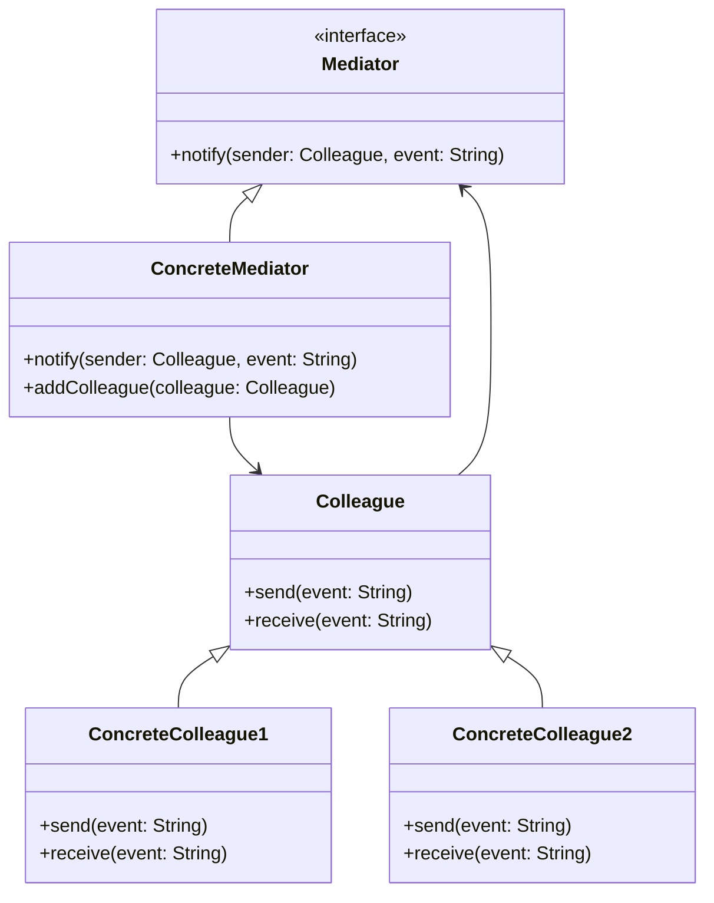
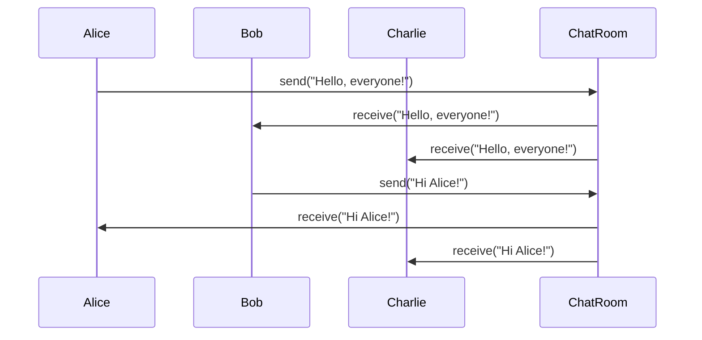

## 5.6 Mediator Pattern

In the realm of software design, the Mediator Pattern stands out as a powerful tool for managing complex interactions between objects. By encapsulating how a set of objects interact, the Mediator Pattern promotes loose coupling, thereby enhancing the maintainability and scalability of your code. In this section, we will delve into the intricacies of the Mediator Pattern, exploring its intent, structure, benefits, and potential drawbacks, all while providing practical examples and visual aids to solidify your understanding.

### Understanding the Mediator Pattern

The Mediator Pattern is a behavioral design pattern that defines an object, known as the mediator, to encapsulate how a set of objects interact. This pattern is particularly useful in scenarios where multiple objects need to collaborate, but direct communication between them would lead to a tangled web of dependencies. By introducing a mediator, we can centralize communication, allowing objects to interact indirectly through the mediator.

#### Intent of the Mediator Pattern

The primary intent of the Mediator Pattern is to reduce the dependencies between interacting objects, also known as colleagues. By having a mediator manage the interactions, we can achieve:

- **Loose Coupling**: Colleague objects are decoupled from each other, making the system easier to maintain and extend.
- **Centralized Control**: The mediator centralizes the control logic, simplifying the management of complex interactions.
- **Improved Reusability**: Colleague objects can be reused in different contexts without modification, as they are not tightly bound to specific interactions.

### Problems Solved by the Mediator Pattern

In a typical object-oriented system, objects often need to communicate with each other to perform their tasks. However, direct communication between objects can lead to several issues:

1. **Tight Coupling**: When objects are directly dependent on each other, changes in one object can ripple through the system, leading to fragile code.
2. **Complex Interactions**: As the number of interacting objects increases, managing their interactions becomes increasingly complex.
3. **Reduced Reusability**: Objects that are tightly coupled to specific interactions are difficult to reuse in different contexts.

The Mediator Pattern addresses these issues by introducing a mediator object that manages the interactions between colleague objects. This approach decouples the colleagues, reduces the complexity of interactions, and enhances the reusability of the objects.

### Structure of the Mediator Pattern

The Mediator Pattern consists of the following key components:

- **Mediator Interface**: Defines the interface for communication between colleague objects.
- **Concrete Mediator**: Implements the mediator interface and coordinates the interactions between colleague objects.
- **Colleague Classes**: Represent the objects that interact with each other through the mediator.

#### UML Diagram

To better understand the structure of the Mediator Pattern, let's examine a UML diagram illustrating the relationships between the mediator and colleague classes.



In this diagram, the `Mediator` interface defines the method `notify`, which is implemented by the `ConcreteMediator`. The `ConcreteMediator` manages the interactions between `ConcreteColleague1` and `ConcreteColleague2`, both of which implement the `Colleague` interface.

### Implementing the Mediator Pattern in Java

Let's explore how to implement the Mediator Pattern in Java with a practical example. We'll create a simple chat room application where users (colleagues) communicate through a chat room (mediator).

#### Step 1: Define the Mediator Interface

First, we define the `ChatMediator` interface, which declares the method for sending messages.

```java
public interface ChatMediator {
    void sendMessage(String message, User user);
    void addUser(User user);
}
```

#### Step 2: Implement the Concrete Mediator

Next, we implement the `ChatRoom` class, which acts as the concrete mediator. It manages the list of users and facilitates message sending.

```java
import java.util.ArrayList;
import java.util.List;

public class ChatRoom implements ChatMediator {
    private List<User> users;

    public ChatRoom() {
        this.users = new ArrayList<>();
    }

    @Override
    public void addUser(User user) {
        this.users.add(user);
    }

    @Override
    public void sendMessage(String message, User user) {
        for (User u : this.users) {
            // Message should not be received by the user sending it
            if (u != user) {
                u.receive(message);
            }
        }
    }
}
```

#### Step 3: Define the Colleague Class

We then define the `User` class, which represents a colleague in the chat room.

```java
public abstract class User {
    protected ChatMediator mediator;
    protected String name;

    public User(ChatMediator mediator, String name) {
        this.mediator = mediator;
        this.name = name;
    }

    public abstract void send(String message);
    public abstract void receive(String message);
}
```

#### Step 4: Implement Concrete Colleague Classes

Finally, we implement the `ConcreteUser` class, which extends the `User` class and interacts with the chat room.

```java
public class ConcreteUser extends User {

    public ConcreteUser(ChatMediator mediator, String name) {
        super(mediator, name);
    }

    @Override
    public void send(String message) {
        System.out.println(this.name + ": Sending Message = " + message);
        mediator.sendMessage(message, this);
    }

    @Override
    public void receive(String message) {
        System.out.println(this.name + ": Received Message = " + message);
    }
}
```

#### Step 5: Demonstrate the Mediator Pattern

Let's demonstrate the Mediator Pattern by creating a chat room and adding users to it.

```java
public class MediatorPatternDemo {
    public static void main(String[] args) {
        ChatMediator mediator = new ChatRoom();

        User user1 = new ConcreteUser(mediator, "Alice");
        User user2 = new ConcreteUser(mediator, "Bob");
        User user3 = new ConcreteUser(mediator, "Charlie");

        mediator.addUser(user1);
        mediator.addUser(user2);
        mediator.addUser(user3);

        user1.send("Hello, everyone!");
        user2.send("Hi Alice!");
    }
}
```

### Benefits of the Mediator Pattern

The Mediator Pattern offers several benefits:

- **Reduced Complexity**: By centralizing communication, the mediator reduces the complexity of interactions between objects.
- **Improved Maintainability**: Loose coupling between colleague objects makes the system easier to maintain and extend.
- **Enhanced Reusability**: Colleague objects can be reused in different contexts without modification.
- **Centralized Control**: The mediator provides a single point of control for managing interactions, simplifying the coordination of complex behaviors.

### Potential Drawbacks of the Mediator Pattern

While the Mediator Pattern offers significant advantages, it also has potential drawbacks:

- **Increased Complexity in Mediator**: As the number of interactions increases, the mediator can become a complex and monolithic component.
- **Single Point of Failure**: The mediator becomes a critical component, and any issues with it can affect the entire system.
- **Overhead**: Introducing a mediator adds an additional layer of abstraction, which can introduce overhead in some scenarios.

### Visualizing the Mediator Pattern

To further illustrate the Mediator Pattern, let's visualize the flow of communication in our chat room example using a sequence diagram.



In this diagram, we see how messages are sent from one user to the chat room and then distributed to other users, demonstrating the centralized communication facilitated by the mediator.

### Try It Yourself

To deepen your understanding of the Mediator Pattern, try modifying the code examples provided:

- **Add More Users**: Introduce additional users to the chat room and observe how the mediator manages their interactions.
- **Implement Private Messaging**: Extend the `ChatMediator` to support private messages between specific users.
- **Enhance the Mediator**: Add logging or message filtering capabilities to the `ChatRoom` mediator.

### Knowledge Check

To reinforce your understanding of the Mediator Pattern, consider the following questions:

1. How does the Mediator Pattern promote loose coupling between objects?
2. What are the key components of the Mediator Pattern?
3. How does the mediator manage interactions between colleague objects?
4. What are the potential drawbacks of using the Mediator Pattern?
5. How can the Mediator Pattern improve the maintainability of a system?

### Conclusion

The Mediator Pattern is a valuable tool for managing complex interactions between objects in a software system. By encapsulating communication within a mediator, we can achieve loose coupling, centralized control, and improved reusability. While the pattern introduces some complexity and potential drawbacks, its benefits often outweigh these concerns, making it a powerful addition to your design pattern toolkit.

## Quiz Time!



### What is the primary intent of the Mediator Pattern?

- [x] To reduce dependencies between interacting objects
- [ ] To increase the complexity of object interactions
- [ ] To tightly couple objects for better performance
- [ ] To eliminate the need for communication between objects

> **Explanation:** The Mediator Pattern aims to reduce dependencies between interacting objects by centralizing communication through a mediator.

### Which component of the Mediator Pattern coordinates interactions between colleague objects?

- [x] Concrete Mediator
- [ ] Colleague Class
- [ ] Mediator Interface
- [ ] Concrete Colleague

> **Explanation:** The Concrete Mediator implements the mediator interface and coordinates interactions between colleague objects.

### What is a potential drawback of the Mediator Pattern?

- [x] Increased complexity in the mediator
- [ ] Reduced reusability of colleague objects
- [ ] Tighter coupling between objects
- [ ] Lack of centralized control

> **Explanation:** As the number of interactions increases, the mediator can become a complex and monolithic component.

### How does the Mediator Pattern improve maintainability?

- [x] By promoting loose coupling between objects
- [ ] By increasing the number of dependencies
- [ ] By centralizing all logic in colleague objects
- [ ] By eliminating the need for a mediator

> **Explanation:** Loose coupling between objects makes the system easier to maintain and extend.

### What is the role of the Colleague Class in the Mediator Pattern?

- [x] To represent objects that interact through the mediator
- [ ] To implement the mediator interface
- [ ] To manage the list of users in a chat room
- [ ] To eliminate the need for communication between objects

> **Explanation:** Colleague classes represent objects that interact with each other through the mediator.

### In the provided chat room example, what method does a user call to send a message?

- [x] send(String message)
- [ ] receive(String message)
- [ ] notify(String message)
- [ ] addUser(User user)

> **Explanation:** The `send(String message)` method is called by a user to send a message through the mediator.

### What is a benefit of using the Mediator Pattern?

- [x] Reduced complexity of interactions
- [ ] Increased complexity of interactions
- [ ] Tighter coupling between objects
- [ ] Elimination of the need for communication

> **Explanation:** The mediator reduces the complexity of interactions by centralizing communication.

### How can the Mediator Pattern enhance reusability?

- [x] By decoupling colleague objects from specific interactions
- [ ] By tightly coupling objects to specific interactions
- [ ] By centralizing all logic in colleague objects
- [ ] By eliminating the need for a mediator

> **Explanation:** Decoupling colleague objects from specific interactions allows them to be reused in different contexts.

### What is a potential issue with having a single mediator in a system?

- [x] It becomes a single point of failure
- [ ] It increases the reusability of colleague objects
- [ ] It eliminates the need for communication
- [ ] It reduces the complexity of interactions

> **Explanation:** The mediator becomes a critical component, and any issues with it can affect the entire system.

### True or False: The Mediator Pattern eliminates the need for communication between objects.

- [ ] True
- [x] False

> **Explanation:** The Mediator Pattern does not eliminate communication but centralizes it through a mediator to reduce dependencies.


