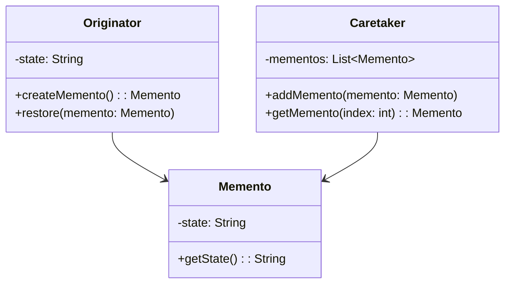
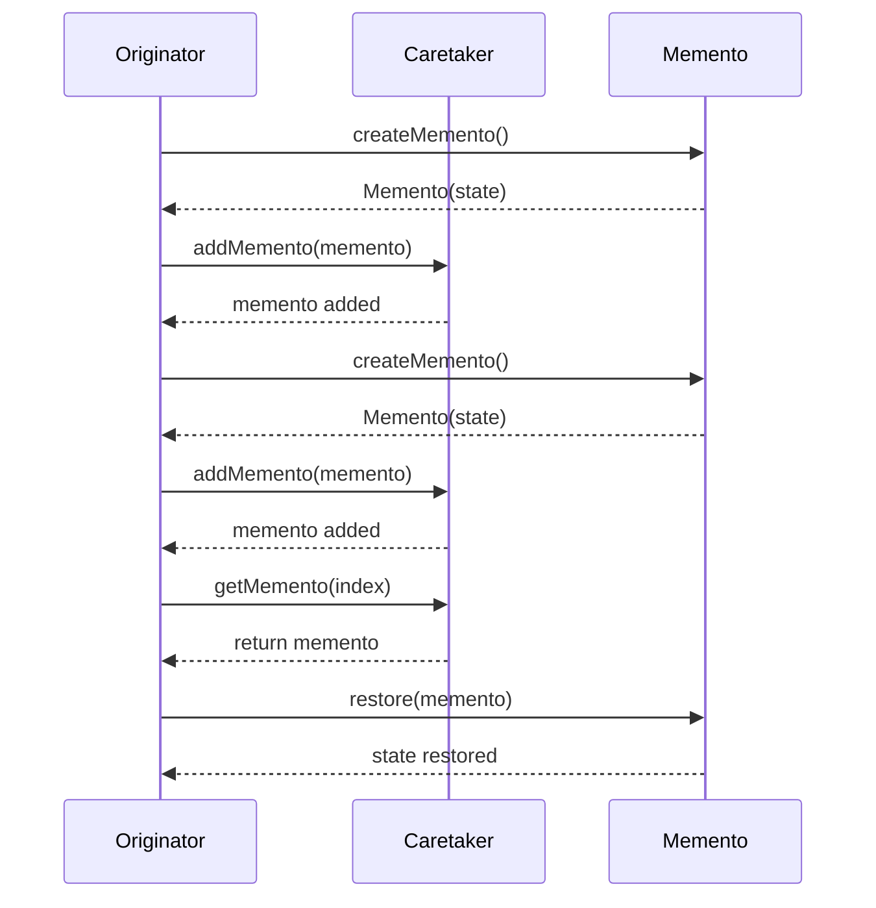

## 5.7.1 Implementing Memento in Java

In this section, we will delve into the Memento design pattern, a behavioral pattern that allows us to capture and restore an object's state without violating encapsulation. This pattern is particularly useful in scenarios where you need to implement undo mechanisms or maintain historical states of an object. Let's explore how to implement the Memento pattern in Java, complete with detailed explanations and code examples.

### Understanding the Memento Pattern

The Memento pattern is designed to capture an object's internal state so that it can be restored later. It involves three primary components:

1. **Originator**: The object whose state needs to be saved and restored.
2. **Memento**: A representation of the Originator's state at a particular point in time.
3. **Caretaker**: Manages the mementos and is responsible for storing and retrieving them.

Let's visualize the interaction between these components using a class diagram:



### Step-by-Step Implementation

#### Step 1: Define the Memento Class

The Memento class is a simple data holder that stores the state of the Originator. It should not expose any methods that allow modification of its state, ensuring encapsulation.

```java
public class Memento {
    private final String state;

    public Memento(String state) {
        this.state = state;
    }

    public String getState() {
        return state;
    }
}
```

In this example, the Memento class holds a single state, represented as a `String`. The state is immutable, as indicated by the `final` keyword, ensuring that once a Memento is created, its state cannot be changed.

#### Step 2: Implement the Originator Class

The Originator is responsible for creating and restoring its state using Mementos. It provides methods to create a Memento and restore its state from a Memento.

```java
public class Originator {
    private String state;

    public void setState(String state) {
        System.out.println("Setting state to " + state);
        this.state = state;
    }

    public String getState() {
        return state;
    }

    public Memento createMemento() {
        System.out.println("Creating Memento with state: " + state);
        return new Memento(state);
    }

    public void restore(Memento memento) {
        state = memento.getState();
        System.out.println("State restored to " + state);
    }
}
```

The `Originator` class has methods to set its state, create a Memento, and restore its state from a Memento. The `createMemento` method captures the current state, while the `restore` method updates the state based on a given Memento.

#### Step 3: Create the Caretaker Class

The Caretaker is responsible for managing Mementos. It stores Mementos and provides methods to retrieve them.

```java
import java.util.ArrayList;
import java.util.List;

public class Caretaker {
    private final List<Memento> mementos = new ArrayList<>();

    public void addMemento(Memento memento) {
        mementos.add(memento);
        System.out.println("Memento added. Total mementos: " + mementos.size());
    }

    public Memento getMemento(int index) {
        return mementos.get(index);
    }
}
```

The `Caretaker` class uses a `List` to store Memento objects. It provides methods to add a Memento to the list and retrieve a Memento by its index.

### Putting It All Together

Now that we have defined the Memento, Originator, and Caretaker classes, let's see how they work together in a simple example.

```java
public class MementoPatternDemo {
    public static void main(String[] args) {
        Originator originator = new Originator();
        Caretaker caretaker = new Caretaker();

        originator.setState("State1");
        caretaker.addMemento(originator.createMemento());

        originator.setState("State2");
        caretaker.addMemento(originator.createMemento());

        originator.setState("State3");
        System.out.println("Current State: " + originator.getState());

        originator.restore(caretaker.getMemento(1));
        System.out.println("Restored to State: " + originator.getState());

        originator.restore(caretaker.getMemento(0));
        System.out.println("Restored to State: " + originator.getState());
    }
}
```

In this example, we create an `Originator` and a `Caretaker`. We change the state of the Originator and save its state using the Caretaker. Later, we restore the Originator's state to previous states using the saved Mementos.

### Try It Yourself

To better understand the Memento pattern, try modifying the code examples:

- **Experiment with Different Data Types**: Change the state in the Memento to other data types, such as `int` or custom objects.
- **Implement Undo and Redo**: Extend the Caretaker to support undo and redo operations by maintaining a pointer to the current state.
- **Add Timestamps**: Modify the Memento to include timestamps and print them when restoring states.

### Visualizing the Memento Pattern in Action

To further illustrate the Memento pattern, let's visualize the process of saving and restoring states using a sequence diagram.



### Best Practices and Considerations

When implementing the Memento pattern, consider the following best practices:

- **Encapsulation**: Ensure that the Memento class does not expose methods that allow its state to be modified. This maintains the integrity of the saved state.
- **Memory Management**: Be mindful of memory usage, especially if the Originator's state is large or if many Mementos are created. Consider strategies to limit the number of stored Mementos.
- **Serialization**: For complex states, consider using serialization to store Mementos, especially if you need to persist them beyond the application's lifecycle.

### Knowledge Check

Before we wrap up, let's pose a few questions to reinforce your understanding:

- What is the primary purpose of the Memento pattern?
- How does the Caretaker manage Mementos?
- Why is encapsulation important in the Memento pattern?

### Summary

In this section, we explored the Memento design pattern and its implementation in Java. We learned how to capture and restore an object's state using Mementos, and how the Originator, Memento, and Caretaker interact to achieve this. By following the provided examples and best practices, you can effectively implement the Memento pattern in your Java applications.

Remember, this is just the beginning. As you progress, you'll discover more ways to leverage design patterns to create robust and maintainable software. Keep experimenting, stay curious, and enjoy the journey!

## Quiz Time!



### What is the primary role of the Memento class in the Memento pattern?

- [x] To store the state of the Originator
- [ ] To modify the state of the Originator
- [ ] To manage the collection of Mementos
- [ ] To handle user inputs

> **Explanation:** The Memento class is responsible for storing the state of the Originator without exposing it to other objects.

### Which component of the Memento pattern is responsible for creating and restoring Mementos?

- [x] Originator
- [ ] Caretaker
- [ ] Memento
- [ ] Observer

> **Explanation:** The Originator is responsible for creating Mementos to capture its state and restoring its state from a Memento.

### What is the main responsibility of the Caretaker in the Memento pattern?

- [x] To manage the storage and retrieval of Mementos
- [ ] To modify the state of the Originator
- [ ] To create Mementos
- [ ] To encapsulate state

> **Explanation:** The Caretaker manages the storage and retrieval of Mementos, ensuring that the Originator's state can be restored later.

### Why is encapsulation important in the Memento pattern?

- [x] To prevent external objects from modifying the Memento's state
- [ ] To allow the Caretaker to modify the Originator's state
- [ ] To expose the internal state of the Originator
- [ ] To simplify the creation of Mementos

> **Explanation:** Encapsulation ensures that the Memento's state cannot be modified by external objects, preserving the integrity of the saved state.

### In the Memento pattern, which class is responsible for restoring the state of the Originator?

- [x] Originator
- [ ] Caretaker
- [ ] Memento
- [ ] Observer

> **Explanation:** The Originator is responsible for restoring its state from a Memento.

### What is a potential downside of using the Memento pattern?

- [x] Increased memory usage due to storing multiple states
- [ ] Difficulty in implementing the pattern
- [ ] Lack of encapsulation
- [ ] Inability to restore states

> **Explanation:** The Memento pattern can lead to increased memory usage if many states are stored, especially if the state is large.

### How can you limit the memory usage when using the Memento pattern?

- [x] By limiting the number of stored Mementos
- [ ] By exposing the Memento's state
- [ ] By modifying the Originator's state directly
- [ ] By using the Observer pattern

> **Explanation:** Limiting the number of stored Mementos can help manage memory usage effectively.

### Which of the following is a common use case for the Memento pattern?

- [x] Implementing undo functionality
- [ ] Managing user inputs
- [ ] Handling concurrent requests
- [ ] Logging system events

> **Explanation:** The Memento pattern is commonly used to implement undo functionality by capturing and restoring previous states.

### What is the relationship between the Originator and the Memento in the Memento pattern?

- [x] The Originator creates and uses the Memento to save and restore its state
- [ ] The Memento modifies the Originator's state directly
- [ ] The Caretaker modifies the Memento's state
- [ ] The Memento manages the collection of Originators

> **Explanation:** The Originator creates a Memento to save its state and uses it to restore its state later.

### True or False: The Caretaker should modify the state stored in a Memento.

- [ ] True
- [x] False

> **Explanation:** The Caretaker should not modify the state stored in a Memento; it should only manage the storage and retrieval of Mementos.


