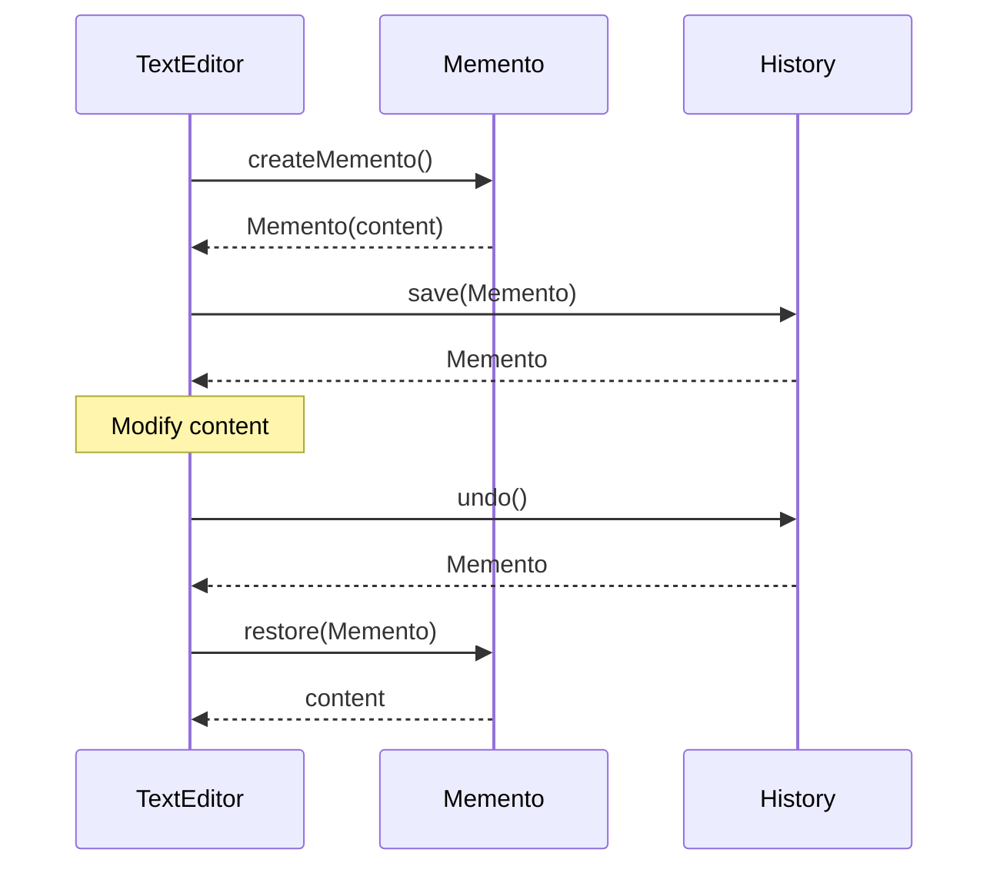
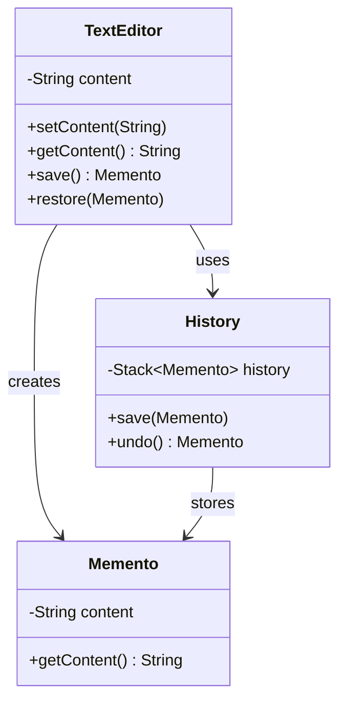

## 5.7.2 Originator, Memento, and Caretaker Roles

In the world of software design patterns, the Memento Pattern stands out as a powerful tool for managing the state of an object. It allows an object to save its state so that it can be restored later, without exposing its internal structure. This pattern is particularly useful in scenarios where you need to implement undo or rollback functionalities. In this section, we will delve into the three main participants of the Memento Pattern: the Originator, the Memento, and the Caretaker. We will explore their roles, responsibilities, and interactions, supported by detailed code examples and diagrams.

### Understanding the Memento Pattern

Before we dive into the specifics of each role, let's briefly revisit the Memento Pattern. The pattern is primarily used to capture and externalize an object's internal state so that the object can be restored to this state later. This is done without violating encapsulation, meaning the internal state details are hidden from other objects.

The Memento Pattern is composed of three key participants:

1. **Originator**: The object whose state needs to be saved and restored.
2. **Memento**: The object that stores the state of the Originator.
3. **Caretaker**: The object responsible for managing the lifecycle of Mementos.

Let's explore each of these roles in detail.

### The Originator

#### Role and Responsibilities

The Originator is the central figure in the Memento Pattern. It is the object whose state we want to save and restore. The Originator is responsible for creating a Memento containing a snapshot of its current state and for using a Memento to restore its state.

**Key Responsibilities:**

- **Creating Mementos**: The Originator creates a Memento object that captures its current internal state.
- **Restoring State**: The Originator uses a Memento to restore its state to what it was at the time the Memento was created.
- **Managing State**: The Originator maintains its internal state and provides methods to modify it.

#### Code Example

Let's consider a simple example where we have a `TextEditor` class that acts as the Originator. This class can save and restore its text content.

```java
public class TextEditor {
    private String content;

    // Sets the content of the text editor
    public void setContent(String content) {
        this.content = content;
    }

    // Returns the current content of the text editor
    public String getContent() {
        return content;
    }

    // Saves the current state inside a Memento
    public Memento save() {
        return new Memento(content);
    }

    // Restores the state from a Memento
    public void restore(Memento memento) {
        this.content = memento.getContent();
    }

    // Memento class to store the state of the TextEditor
    public static class Memento {
        private final String content;

        private Memento(String content) {
            this.content = content;
        }

        private String getContent() {
            return content;
        }
    }
}
```

In this example, the `TextEditor` class can save its current content into a `Memento` and restore it later. The `Memento` class is nested within the `TextEditor` to encapsulate the state details.

### The Memento

#### Role and Responsibilities

The Memento is a simple object that stores the state of the Originator. It is designed to be immutable once created, ensuring that the stored state cannot be altered. The Memento does not expose any operations that would allow external objects to modify its state.

**Key Responsibilities:**

- **State Storage**: The Memento stores the state of the Originator.
- **Immutability**: Once created, the Memento's state cannot be changed.
- **Encapsulation**: The Memento does not expose its internal state to other objects, preserving encapsulation.

#### Code Example

In the previous code example, the `Memento` class is a static inner class within the `TextEditor`. It encapsulates the state of the `TextEditor` and provides a method to retrieve the stored state.

```java
public static class Memento {
    private final String content;

    private Memento(String content) {
        this.content = content;
    }

    private String getContent() {
        return content;
    }
}
```

The `Memento` class is private and only accessible by the `TextEditor`, ensuring that the state is not exposed to other parts of the application.

### The Caretaker

#### Role and Responsibilities

The Caretaker is responsible for managing the lifecycle of Mementos. It keeps track of the Mementos and ensures that they are available when needed. The Caretaker does not modify or inspect the contents of the Mementos; it simply stores and retrieves them.

**Key Responsibilities:**

- **Memento Management**: The Caretaker stores and retrieves Mementos as needed.
- **Lifecycle Management**: The Caretaker manages the lifecycle of Mementos, ensuring that they are available for restoring the Originator's state.
- **Encapsulation**: The Caretaker does not inspect or modify the contents of the Mementos.

#### Code Example

Let's extend our example to include a `History` class that acts as the Caretaker. This class will manage a list of Mementos.

```java
import java.util.Stack;

public class History {
    private final Stack<TextEditor.Memento> history = new Stack<>();

    // Saves a new Memento to the history
    public void save(TextEditor.Memento memento) {
        history.push(memento);
    }

    // Restores the last saved state
    public TextEditor.Memento undo() {
        if (!history.isEmpty()) {
            return history.pop();
        }
        return null;
    }
}
```

In this example, the `History` class uses a `Stack` to store Mementos. It provides methods to save a new Memento and to undo the last change by restoring the previous state.

### Interaction Between Participants

To understand how these participants interact, let's consider a sequence diagram that illustrates the process of saving and restoring the state using the Memento Pattern.



### Try It Yourself

To get a hands-on understanding of the Memento Pattern, try modifying the code examples provided. Here are a few suggestions:

- **Add More State**: Extend the `TextEditor` class to include additional state, such as font size or color, and update the `Memento` class accordingly.
- **Implement Redo**: Modify the `History` class to support redo functionality, allowing you to revert an undo operation.
- **Limit History Size**: Implement a mechanism to limit the size of the history stack, discarding the oldest Mementos when the limit is reached.

### Visualizing the Memento Pattern

To further illustrate the Memento Pattern, let's look at a class diagram that shows the relationships between the Originator, Memento, and Caretaker.



### Practical Applications

The Memento Pattern is widely used in applications where undo functionality is required. Some common use cases include:

- **Text Editors**: Allowing users to undo and redo changes to documents.
- **Graphics Software**: Enabling users to revert changes to images or drawings.
- **Game Development**: Saving and restoring game states for checkpoints or save points.

### Knowledge Check

To reinforce your understanding of the Memento Pattern, consider the following questions:

1. What are the key responsibilities of the Originator in the Memento Pattern?
2. How does the Memento ensure encapsulation of the Originator's state?
3. What role does the Caretaker play in managing Mementos?
4. How can the Memento Pattern be used to implement undo functionality in a text editor?
5. What are some potential challenges when using the Memento Pattern in a large application?

### Summary

In this section, we explored the Memento Pattern and its three main participants: the Originator, the Memento, and the Caretaker. We discussed their roles and responsibilities, provided code examples, and visualized their interactions. The Memento Pattern is a powerful tool for managing state in software applications, and understanding its components is essential for implementing effective state management solutions.

Remember, this is just the beginning. As you progress, you'll build more complex and interactive applications. Keep experimenting, stay curious, and enjoy the journey!

## Quiz Time!



### What is the primary role of the Originator in the Memento Pattern?

- [x] To create and restore Mementos
- [ ] To manage the lifecycle of Mementos
- [ ] To store the state of the Originator
- [ ] To modify the state of the Memento

> **Explanation:** The Originator is responsible for creating Mementos that capture its state and for restoring its state from a Memento.

### How does the Memento ensure encapsulation?

- [x] By not exposing its internal state to other objects
- [ ] By allowing the Originator to modify its state
- [ ] By storing multiple states of the Originator
- [ ] By managing the lifecycle of Mementos

> **Explanation:** The Memento ensures encapsulation by not exposing its internal state to other objects, preserving the Originator's encapsulation.

### What is the role of the Caretaker in the Memento Pattern?

- [ ] To create and restore Mementos
- [x] To manage the lifecycle of Mementos
- [ ] To store the state of the Originator
- [ ] To modify the state of the Memento

> **Explanation:** The Caretaker is responsible for managing the lifecycle of Mementos, storing and retrieving them as needed.

### In the provided code example, what does the `History` class represent?

- [ ] The Originator
- [ ] The Memento
- [x] The Caretaker
- [ ] The State

> **Explanation:** The `History` class acts as the Caretaker, managing the storage and retrieval of Mementos.

### How can the Memento Pattern be used in a text editor?

- [x] To implement undo and redo functionality
- [ ] To manage user input
- [ ] To store document metadata
- [ ] To format text

> **Explanation:** The Memento Pattern can be used in a text editor to implement undo and redo functionality by saving and restoring the document's state.

### What is a potential challenge when using the Memento Pattern?

- [x] Managing large numbers of Mementos can consume significant memory
- [ ] The Memento exposes the Originator's state
- [ ] The Caretaker modifies the Memento's state
- [ ] The Originator cannot restore its state

> **Explanation:** Managing large numbers of Mementos can consume significant memory, which is a potential challenge when using the Memento Pattern.

### What is a common use case for the Memento Pattern?

- [x] Implementing undo functionality in applications
- [ ] Managing user authentication
- [ ] Formatting text in a document
- [ ] Rendering graphics

> **Explanation:** A common use case for the Memento Pattern is implementing undo functionality in applications, such as text editors or graphics software.

### How does the Memento Pattern preserve encapsulation?

- [x] By not exposing the internal state of the Originator
- [ ] By allowing the Caretaker to modify the Memento
- [ ] By storing multiple states of the Originator
- [ ] By managing the lifecycle of Mementos

> **Explanation:** The Memento Pattern preserves encapsulation by not exposing the internal state of the Originator to other objects.

### What is the relationship between the Originator and the Memento?

- [x] The Originator creates and uses the Memento
- [ ] The Memento modifies the Originator's state
- [ ] The Caretaker creates the Memento
- [ ] The Memento manages the lifecycle of the Originator

> **Explanation:** The Originator creates and uses the Memento to save and restore its state.

### True or False: The Caretaker can modify the state of the Memento.

- [ ] True
- [x] False

> **Explanation:** False. The Caretaker does not modify the state of the Memento; it only manages the storage and retrieval of Mementos.


