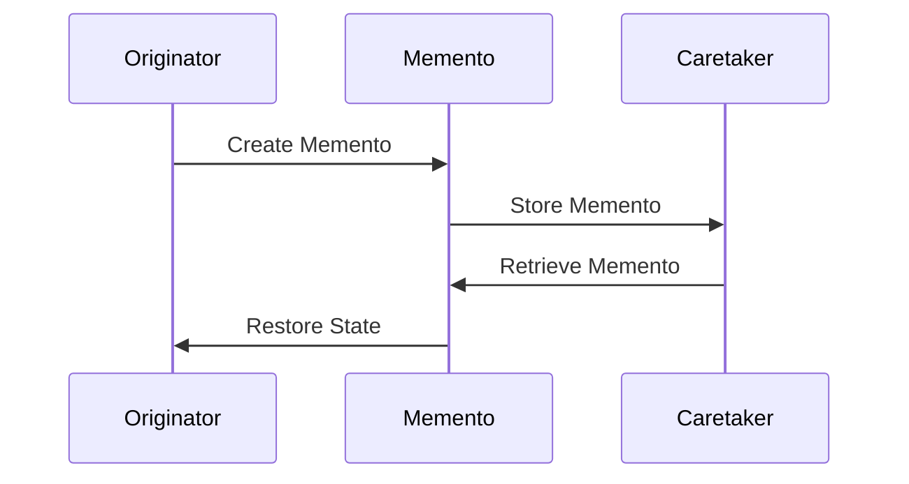

## 5.7.3 Handling State Restoration

In the realm of software design, managing the state of objects is crucial for creating robust and maintainable applications. The Memento Pattern is a powerful tool that allows us to capture and restore the state of an object without violating encapsulation. In this section, we will delve into the techniques for effectively managing state restoration in Java, focusing on the Memento Pattern. We will explore methods for restoring complex object states, provide examples of state restoration in different scenarios, and highlight considerations such as immutable objects and deep vs. shallow copies. Additionally, we will discuss how to handle exceptions and errors during the restoration process.

### Understanding the Memento Pattern

Before we dive into state restoration, let's briefly revisit the Memento Pattern. The Memento Pattern is a behavioral design pattern that allows an object to save its state to be restored later. This pattern is particularly useful for implementing undo mechanisms, stateful applications, and scenarios where the internal state of an object needs to be preserved and restored.

The Memento Pattern involves three key components:

1. **Originator**: The object whose state needs to be saved and restored.
2. **Memento**: A representation of the Originator's state. It is typically an immutable object that holds the state information.
3. **Caretaker**: The entity responsible for storing and managing Memento objects. It does not modify or access the contents of a Memento.

### Techniques for Restoring Complex Object States

Restoring the state of an object can be straightforward or complex, depending on the nature of the object and its dependencies. Here are some techniques to consider when dealing with complex object states:

#### 1. Deep vs. Shallow Copies

When restoring an object's state, it's essential to understand the difference between deep and shallow copies:

- **Shallow Copy**: A shallow copy creates a new object but does not create copies of the objects that the original object references. Instead, it copies the references to these objects. This means that changes to the referenced objects will affect both the original and the copied object.

- **Deep Copy**: A deep copy creates a new object and recursively copies all objects referenced by the original object. This ensures that the copied object is entirely independent of the original.

In the context of the Memento Pattern, deciding between deep and shallow copies depends on the specific requirements of your application. If the state of the object includes complex data structures or mutable objects, a deep copy may be necessary to ensure complete independence.

**Example: Deep Copy in Java**

```java
import java.io.*;

class ComplexObject implements Serializable {
    private String name;
    private int value;
    private NestedObject nestedObject;

    public ComplexObject(String name, int value, NestedObject nestedObject) {
        this.name = name;
        this.value = value;
        this.nestedObject = nestedObject;
    }

    // Deep copy using serialization
    public ComplexObject deepCopy() throws IOException, ClassNotFoundException {
        ByteArrayOutputStream byteArrayOutputStream = new ByteArrayOutputStream();
        ObjectOutputStream objectOutputStream = new ObjectOutputStream(byteArrayOutputStream);
        objectOutputStream.writeObject(this);

        ByteArrayInputStream byteArrayInputStream = new ByteArrayInputStream(byteArrayOutputStream.toByteArray());
        ObjectInputStream objectInputStream = new ObjectInputStream(byteArrayInputStream);
        return (ComplexObject) objectInputStream.readObject();
    }

    // Getters and setters
}

class NestedObject implements Serializable {
    private String description;

    public NestedObject(String description) {
        this.description = description;
    }

    // Getters and setters
}
```

In this example, we use Java's serialization mechanism to create a deep copy of a `ComplexObject`. This approach ensures that all nested objects are also copied, providing a completely independent copy.

#### 2. Immutable Objects

Immutable objects are inherently easier to manage when it comes to state restoration. Since immutable objects cannot be modified after creation, there is no risk of accidental changes affecting the restored state. When designing your application, consider using immutable objects for state representation whenever possible.

**Example: Immutable Object in Java**

```java
final class ImmutableState {
    private final String state;

    public ImmutableState(String state) {
        this.state = state;
    }

    public String getState() {
        return state;
    }
}
```

In this example, `ImmutableState` is an immutable class with a final field. Once an instance is created, its state cannot be changed, making it ideal for use in the Memento Pattern.

### State Restoration in Different Scenarios

Let's explore some scenarios where state restoration is essential and how the Memento Pattern can be applied effectively.

#### Scenario 1: Undo Mechanism in Text Editor

Consider a text editor application where users can perform actions such as typing, deleting, and formatting text. Implementing an undo mechanism allows users to revert to previous states of the document.

**Implementation Example**

```java
import java.util.Stack;

// Originator
class TextEditor {
    private StringBuilder content;

    public TextEditor() {
        content = new StringBuilder();
    }

    public void type(String words) {
        content.append(words);
    }

    public String getContent() {
        return content.toString();
    }

    public TextMemento save() {
        return new TextMemento(content.toString());
    }

    public void restore(TextMemento memento) {
        content = new StringBuilder(memento.getContent());
    }
}

// Memento
class TextMemento {
    private final String content;

    public TextMemento(String content) {
        this.content = content;
    }

    public String getContent() {
        return content;
    }
}

// Caretaker
class TextEditorHistory {
    private Stack<TextMemento> history = new Stack<>();

    public void save(TextMemento memento) {
        history.push(memento);
    }

    public TextMemento undo() {
        if (!history.isEmpty()) {
            return history.pop();
        }
        return null;
    }
}

public class Main {
    public static void main(String[] args) {
        TextEditor editor = new TextEditor();
        TextEditorHistory history = new TextEditorHistory();

        editor.type("Hello, ");
        history.save(editor.save());

        editor.type("World!");
        history.save(editor.save());

        System.out.println("Current Content: " + editor.getContent());

        editor.restore(history.undo());
        System.out.println("After Undo: " + editor.getContent());

        editor.restore(history.undo());
        System.out.println("After Undo: " + editor.getContent());
    }
}
```

In this example, the `TextEditor` class acts as the Originator, `TextMemento` represents the Memento, and `TextEditorHistory` serves as the Caretaker. The application allows users to type text and undo their actions, restoring previous states of the document.

#### Scenario 2: Game State Management

In a game application, managing the state of the game is crucial for features like saving progress and implementing checkpoints. The Memento Pattern can be used to capture and restore the game state at different points in time.

**Implementation Example**

```java
import java.util.ArrayList;
import java.util.List;

// Originator
class Game {
    private int level;
    private int score;

    public Game(int level, int score) {
        this.level = level;
        this.score = score;
    }

    public void play(int newScore) {
        score += newScore;
    }

    public GameMemento save() {
        return new GameMemento(level, score);
    }

    public void restore(GameMemento memento) {
        this.level = memento.getLevel();
        this.score = memento.getScore();
    }

    @Override
    public String toString() {
        return "Level: " + level + ", Score: " + score;
    }
}

// Memento
class GameMemento {
    private final int level;
    private final int score;

    public GameMemento(int level, int score) {
        this.level = level;
        this.score = score;
    }

    public int getLevel() {
        return level;
    }

    public int getScore() {
        return score;
    }
}

// Caretaker
class GameHistory {
    private List<GameMemento> history = new ArrayList<>();

    public void save(GameMemento memento) {
        history.add(memento);
    }

    public GameMemento restore(int index) {
        if (index >= 0 && index < history.size()) {
            return history.get(index);
        }
        return null;
    }
}

public class GameDemo {
    public static void main(String[] args) {
        Game game = new Game(1, 100);
        GameHistory history = new GameHistory();

        game.play(50);
        history.save(game.save());

        game.play(30);
        history.save(game.save());

        System.out.println("Current Game State: " + game);

        game.restore(history.restore(0));
        System.out.println("Restored to First Save: " + game);

        game.restore(history.restore(1));
        System.out.println("Restored to Second Save: " + game);
    }
}
```

In this example, the `Game` class is the Originator, `GameMemento` represents the Memento, and `GameHistory` acts as the Caretaker. The game state can be saved and restored at different points, allowing players to return to previous states.

### Handling Exceptions and Errors During Restoration

When restoring an object's state, it's essential to handle exceptions and errors gracefully. Here are some strategies to consider:

#### 1. Validation and Error Checking

Before restoring a state, validate the Memento to ensure it contains valid data. This can prevent errors caused by corrupted or incomplete state information.

**Example: Validation Before Restoration**

```java
public void restore(TextMemento memento) {
    if (memento != null && memento.getContent() != null) {
        content = new StringBuilder(memento.getContent());
    } else {
        throw new IllegalArgumentException("Invalid memento provided for restoration.");
    }
}
```

In this example, we check if the `memento` is not null and contains valid content before restoring the state. If the validation fails, an exception is thrown.

#### 2. Exception Handling

Implement exception handling to manage unexpected errors during the restoration process. This can include logging errors, providing user feedback, or implementing fallback mechanisms.

**Example: Exception Handling During Restoration**

```java
public void restore(GameMemento memento) {
    try {
        if (memento != null) {
            this.level = memento.getLevel();
            this.score = memento.getScore();
        } else {
            throw new IllegalArgumentException("Invalid memento provided for restoration.");
        }
    } catch (Exception e) {
        System.err.println("Failed to restore game state: " + e.getMessage());
        // Implement fallback or recovery logic here
    }
}
```

In this example, we use a try-catch block to handle exceptions during the restoration process. If an error occurs, an error message is logged, and additional recovery logic can be implemented.

### Visualizing State Restoration

To better understand the flow of state restoration using the Memento Pattern, let's visualize the process using a sequence diagram.



**Diagram Description**: This sequence diagram illustrates the process of state restoration using the Memento Pattern. The Originator creates a Memento, which is stored by the Caretaker. When restoration is needed, the Caretaker retrieves the Memento, and the Originator restores its state.

### Try It Yourself

To deepen your understanding of state restoration using the Memento Pattern, try modifying the code examples provided:

1. **Extend the Text Editor Example**: Add additional features such as redo functionality or support for multiple documents.

2. **Enhance the Game Example**: Implement a feature to save and restore multiple game states, allowing players to switch between different save points.

3. **Experiment with Deep and Shallow Copies**: Modify the `ComplexObject` example to use shallow copies and observe the impact on state restoration.

### Key Takeaways

- The Memento Pattern is a powerful tool for managing state restoration in Java applications.
- Understanding the difference between deep and shallow copies is crucial for effective state management.
- Immutable objects simplify state restoration by eliminating the risk of accidental modifications.
- Proper validation and exception handling are essential for ensuring reliable state restoration.
- Visualizing the process using diagrams can enhance understanding and communication.

### Conclusion

Handling state restoration is a critical aspect of software design, especially in applications where state management is complex and dynamic. By leveraging the Memento Pattern and the techniques discussed in this section, you can create robust and maintainable applications that effectively manage object states. Remember to experiment with the examples provided, explore different scenarios, and continue learning to master state restoration in Java.

## Quiz Time!



### What is the primary purpose of the Memento Pattern?

- [x] To capture and restore an object's state without violating encapsulation.
- [ ] To manage object creation and destruction.
- [ ] To define a family of algorithms and make them interchangeable.
- [ ] To provide a simplified interface to a complex subsystem.

> **Explanation:** The Memento Pattern is designed to capture and restore an object's state without violating encapsulation, making it ideal for implementing undo mechanisms and stateful applications.

### Which component of the Memento Pattern is responsible for storing and managing Memento objects?

- [ ] Originator
- [x] Caretaker
- [ ] Memento
- [ ] Observer

> **Explanation:** The Caretaker is responsible for storing and managing Memento objects, ensuring that the Originator's state can be restored when needed.

### What is the difference between deep and shallow copies?

- [ ] Deep copies create new objects, while shallow copies reuse existing objects.
- [x] Deep copies create independent copies of all referenced objects, while shallow copies only copy references.
- [ ] Deep copies are faster to create than shallow copies.
- [ ] Shallow copies are more memory-efficient than deep copies.

> **Explanation:** Deep copies create independent copies of all referenced objects, ensuring complete independence from the original, while shallow copies only copy references to the original objects.

### Why are immutable objects beneficial for state restoration?

- [ ] They are easier to serialize.
- [ ] They require less memory.
- [x] They cannot be modified after creation, reducing the risk of accidental changes.
- [ ] They improve performance.

> **Explanation:** Immutable objects cannot be modified after creation, which reduces the risk of accidental changes affecting the restored state, making them ideal for state restoration.

### How can you handle exceptions during state restoration?

- [ ] Ignore them and continue execution.
- [x] Use try-catch blocks to manage unexpected errors and implement recovery logic.
- [ ] Log them and terminate the program.
- [ ] Rethrow them to the calling method.

> **Explanation:** Using try-catch blocks allows you to manage unexpected errors during state restoration and implement recovery logic to ensure reliable operation.

### What is the role of the Originator in the Memento Pattern?

- [x] To create and restore Memento objects representing its state.
- [ ] To manage the storage of Memento objects.
- [ ] To define the structure of Memento objects.
- [ ] To observe changes in the Memento objects.

> **Explanation:** The Originator is responsible for creating and restoring Memento objects that represent its state, allowing it to save and restore its state as needed.

### In the text editor example, what is the purpose of the `TextEditorHistory` class?

- [ ] To format the text content.
- [x] To store and manage the history of Memento objects for undo functionality.
- [ ] To provide a user interface for the text editor.
- [ ] To handle text input and output.

> **Explanation:** The `TextEditorHistory` class acts as the Caretaker, storing and managing the history of Memento objects to enable undo functionality in the text editor.

### What is a potential drawback of using deep copies for state restoration?

- [ ] They are less reliable than shallow copies.
- [ ] They do not preserve object references.
- [x] They can be more memory-intensive and slower to create.
- [ ] They cannot handle complex data structures.

> **Explanation:** Deep copies can be more memory-intensive and slower to create because they involve copying all referenced objects, which can be resource-intensive for complex data structures.

### Which of the following is a benefit of using the Memento Pattern?

- [x] It allows state restoration without violating encapsulation.
- [ ] It simplifies object creation.
- [ ] It enhances performance by reducing memory usage.
- [ ] It provides a single point of access to a subsystem.

> **Explanation:** The Memento Pattern allows state restoration without violating encapsulation, making it a valuable tool for managing object states in a controlled manner.

### True or False: The Memento Pattern can be used to implement an undo mechanism in applications.

- [x] True
- [ ] False

> **Explanation:** True. The Memento Pattern is commonly used to implement undo mechanisms in applications by capturing and restoring previous states of an object.


