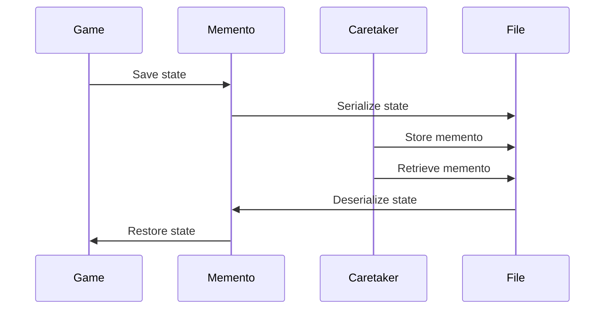

## 5.7.4 Serialization and Memento

In this section, we delve into the fascinating intersection of Java serialization and the Memento design pattern. We'll explore how serialization can be leveraged to capture and store the state of objects as mementos, allowing for easy restoration of previous states. This approach can be particularly useful in scenarios where preserving the history of an object's state is crucial, such as in undo mechanisms or stateful applications. 

### Understanding Serialization in Java

Serialization is a process in Java that allows an object to be converted into a byte stream, which can then be reverted back into a copy of the object. This process is essential for persisting object states, transferring objects over a network, or storing them in files.

**Key Concepts:**

- **Serializable Interface**: In Java, an object must implement the `Serializable` interface to be eligible for serialization. This interface is a marker interface, meaning it doesn't contain any methods but signals to the JVM that the object can be serialized.

- **ObjectOutputStream and ObjectInputStream**: These classes are used to write objects to a stream and read them back, respectively.

- **Transient Keyword**: Fields marked as `transient` are not included in the serialization process. This is useful for fields that should not be persisted, such as passwords or sensitive information.

### The Memento Pattern Recap

The Memento pattern is a behavioral design pattern that allows an object to save its state to be restored later. It involves three primary components:

- **Originator**: The object whose state needs to be saved and restored.
- **Memento**: A representation of the Originator's state.
- **Caretaker**: Manages the mementos and is responsible for storing and restoring them.

### Integrating Serialization with Memento

By integrating serialization with the Memento pattern, we can efficiently capture and store the state of an object. This approach is particularly beneficial when the state needs to be persisted beyond the application's runtime, such as saving to a file or database.

#### Code Example: Serialization with Memento

Let's consider a simple example where we have a `Game` object that we want to save and restore using the Memento pattern with serialization.

```java
import java.io.*;

class Game implements Serializable {
    private static final long serialVersionUID = 1L;
    private String level;
    private int score;

    public Game(String level, int score) {
        this.level = level;
        this.score = score;
    }

    public void setLevel(String level) {
        this.level = level;
    }

    public void setScore(int score) {
        this.score = score;
    }

    public String getLevel() {
        return level;
    }

    public int getScore() {
        return score;
    }

    public Memento save() {
        return new Memento(this);
    }

    public void restore(Memento memento) {
        Game game = memento.getSavedGame();
        this.level = game.getLevel();
        this.score = game.getScore();
    }

    @Override
    public String toString() {
        return "Game [level=" + level + ", score=" + score + "]";
    }
}

class Memento {
    private final Game game;

    public Memento(Game game) {
        this.game = deepCopy(game);
    }

    public Game getSavedGame() {
        return game;
    }

    private Game deepCopy(Game game) {
        try {
            ByteArrayOutputStream bos = new ByteArrayOutputStream();
            ObjectOutputStream out = new ObjectOutputStream(bos);
            out.writeObject(game);
            out.flush();
            ByteArrayInputStream bis = new ByteArrayInputStream(bos.toByteArray());
            ObjectInputStream in = new ObjectInputStream(bis);
            return (Game) in.readObject();
        } catch (IOException | ClassNotFoundException e) {
            throw new RuntimeException("Failed to copy object", e);
        }
    }
}

class Caretaker {
    private Memento memento;

    public void saveState(Game game) {
        memento = game.save();
    }

    public void restoreState(Game game) {
        game.restore(memento);
    }
}

public class SerializationMementoExample {
    public static void main(String[] args) {
        Game game = new Game("Level 1", 100);
        Caretaker caretaker = new Caretaker();

        System.out.println("Initial State: " + game);
        caretaker.saveState(game);

        game.setLevel("Level 2");
        game.setScore(200);
        System.out.println("Changed State: " + game);

        caretaker.restoreState(game);
        System.out.println("Restored State: " + game);
    }
}
```

**Explanation:**

- **Game Class**: Represents the Originator. It implements `Serializable` to allow its state to be serialized.
- **Memento Class**: Captures the state of the `Game` object. It uses a deep copy mechanism to serialize and deserialize the `Game` object, ensuring a complete state capture.
- **Caretaker Class**: Manages the memento, storing and restoring the state of the `Game` object.

### Benefits of Using Serialization with Memento

- **Persistence**: Serialized mementos can be stored in files or databases, allowing for long-term state preservation.
- **Network Transfer**: Serialized objects can be transferred over a network, facilitating distributed applications.
- **Ease of Implementation**: Java's built-in serialization mechanism simplifies the process of capturing and restoring object states.

### Drawbacks and Considerations

- **Performance Overhead**: Serialization can introduce performance overhead, especially for large objects or complex object graphs.
- **Security Concerns**: Serialized data can be vulnerable to tampering or unauthorized access. It's crucial to ensure that serialized data is handled securely.
- **Non-Serializable Members**: If an object contains non-serializable members, special handling is required. This can be achieved by marking such fields as `transient` or implementing custom serialization logic.

### Handling Non-Serializable Members

When dealing with objects that have non-serializable members, you can use the `transient` keyword to exclude them from serialization. Alternatively, you can implement custom serialization logic by overriding the `writeObject` and `readObject` methods.

#### Example: Custom Serialization

```java
import java.io.*;

class CustomGame implements Serializable {
    private static final long serialVersionUID = 1L;
    private String level;
    private transient int score; // Non-serializable field

    public CustomGame(String level, int score) {
        this.level = level;
        this.score = score;
    }

    private void writeObject(ObjectOutputStream oos) throws IOException {
        oos.defaultWriteObject();
        oos.writeInt(score); // Manually serialize the non-serializable field
    }

    private void readObject(ObjectInputStream ois) throws IOException, ClassNotFoundException {
        ois.defaultReadObject();
        score = ois.readInt(); // Manually deserialize the non-serializable field
    }

    @Override
    public String toString() {
        return "CustomGame [level=" + level + ", score=" + score + "]";
    }
}

public class CustomSerializationExample {
    public static void main(String[] args) {
        CustomGame game = new CustomGame("Level 1", 100);

        try (ObjectOutputStream oos = new ObjectOutputStream(new FileOutputStream("game.ser"))) {
            oos.writeObject(game);
        } catch (IOException e) {
            e.printStackTrace();
        }

        try (ObjectInputStream ois = new ObjectInputStream(new FileInputStream("game.ser"))) {
            CustomGame deserializedGame = (CustomGame) ois.readObject();
            System.out.println("Deserialized Game: " + deserializedGame);
        } catch (IOException | ClassNotFoundException e) {
            e.printStackTrace();
        }
    }
}
```

**Explanation:**

- **Custom Serialization Logic**: The `writeObject` and `readObject` methods are overridden to manually handle the serialization and deserialization of the `score` field, which is marked as `transient`.

### Visualizing Serialization and Memento

To better understand the flow of serialization within the Memento pattern, let's visualize the process using a sequence diagram.



**Diagram Explanation:**

- The `Game` object saves its state to a `Memento`.
- The `Memento` serializes the state and stores it in a file.
- The `Caretaker` manages the storage and retrieval of the memento.
- When restoring, the `Caretaker` retrieves the memento, and the `Memento` deserializes the state back to the `Game` object.

### Try It Yourself

Experiment with the code examples provided by making the following modifications:

1. **Add More Fields**: Extend the `Game` class with additional fields and observe how serialization handles them.
2. **Implement Custom Serialization**: Try implementing custom serialization for different data types, such as collections or complex objects.
3. **Secure Serialization**: Explore ways to secure serialized data, such as encryption or using secure serialization libraries.

### Knowledge Check

- **What is the purpose of the `Serializable` interface in Java?**
- **How does the `transient` keyword affect serialization?**
- **What are the benefits of using serialization with the Memento pattern?**
- **How can you handle non-serializable members in an object?**

### Key Takeaways

- Serialization is a powerful tool for capturing and restoring object states in the Memento pattern.
- While serialization offers persistence and ease of implementation, it also introduces performance and security considerations.
- Handling non-serializable members requires careful planning and potentially custom serialization logic.

### Embrace the Journey

Remember, mastering design patterns and serialization is a journey. As you continue to explore these concepts, you'll discover new ways to enhance your applications' functionality and maintainability. Keep experimenting, stay curious, and enjoy the process!

## Quiz Time!



### What is the primary purpose of the Memento pattern?

- [x] To capture and restore an object's state
- [ ] To manage object creation
- [ ] To handle object interactions
- [ ] To define object interfaces

> **Explanation:** The Memento pattern is used to capture and restore an object's state without violating encapsulation.

### Which Java interface must an object implement to be serializable?

- [x] Serializable
- [ ] Cloneable
- [ ] Comparable
- [ ] Iterable

> **Explanation:** An object must implement the `Serializable` interface to be eligible for serialization in Java.

### What does the `transient` keyword do in Java serialization?

- [x] Excludes a field from serialization
- [ ] Includes a field in serialization
- [ ] Makes a field immutable
- [ ] Allows a field to be modified

> **Explanation:** The `transient` keyword is used to exclude fields from the serialization process.

### What is a potential drawback of using serialization?

- [x] Performance overhead
- [ ] Increased security
- [ ] Simplified implementation
- [ ] Enhanced readability

> **Explanation:** Serialization can introduce performance overhead, especially with large or complex objects.

### How can non-serializable members be handled in a serializable class?

- [x] By marking them as `transient`
- [ ] By making them `final`
- [x] By implementing custom serialization
- [ ] By removing them

> **Explanation:** Non-serializable members can be excluded using the `transient` keyword or handled with custom serialization logic.

### What class is used to write objects to a stream in Java?

- [x] ObjectOutputStream
- [ ] FileOutputStream
- [ ] DataOutputStream
- [ ] PrintStream

> **Explanation:** The `ObjectOutputStream` class is used to write objects to a stream in Java.

### Which component of the Memento pattern is responsible for managing mementos?

- [x] Caretaker
- [ ] Originator
- [ ] Memento
- [ ] Observer

> **Explanation:** The Caretaker is responsible for managing mementos, including storing and restoring them.

### What is the role of the `writeObject` method in custom serialization?

- [x] To manually serialize non-serializable fields
- [ ] To read objects from a stream
- [ ] To convert objects to strings
- [ ] To encrypt serialized data

> **Explanation:** The `writeObject` method is used in custom serialization to manually handle the serialization of non-serializable fields.

### What is a benefit of using serialization with the Memento pattern?

- [x] Long-term state preservation
- [ ] Increased complexity
- [ ] Reduced security
- [ ] Limited flexibility

> **Explanation:** Serialization allows for long-term state preservation by storing mementos in files or databases.

### True or False: Serialization can be used to transfer objects over a network.

- [x] True
- [ ] False

> **Explanation:** Serialization converts objects into a byte stream, which can be transferred over a network.


