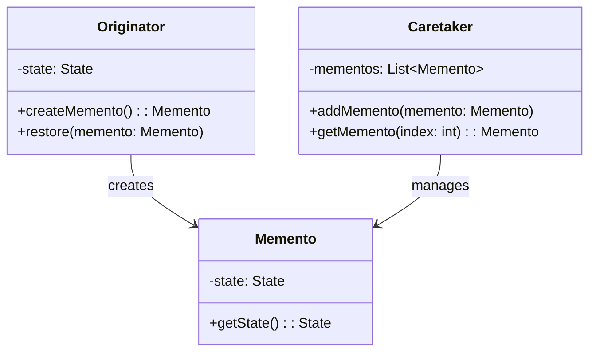

## 5.7.5 Use Cases and Examples

The Memento Pattern is a powerful tool in the software engineer's toolkit, particularly when dealing with scenarios that require undo functionality or state management. In this section, we will explore practical applications of the Memento Pattern, focusing on its use in text editors for implementing undo mechanisms and in games for saving and loading game states. We will also provide detailed code examples to illustrate these concepts.

### Understanding the Memento Pattern

Before diving into specific use cases, let's briefly recap the Memento Pattern. The Memento Pattern is a behavioral design pattern that allows capturing and externalizing an object's internal state so that it can be restored later without violating encapsulation. This pattern involves three primary components:

1. **Originator**: The object whose state needs to be saved and restored.
2. **Memento**: The object that stores the state of the Originator.
3. **Caretaker**: The object responsible for keeping track of the memento.

### Use Case 1: Implementing Undo Functionality in Text Editors

One of the most common applications of the Memento Pattern is in text editors, where users frequently rely on undo and redo functionalities. Let's explore how the Memento Pattern can be used to implement these features.

#### Scenario: Text Editor with Undo Functionality

Imagine a simple text editor where users can type text, delete it, and undo their actions. The Memento Pattern can be employed to capture the state of the text at various points, allowing users to revert to previous states.

#### Code Example: Text Editor with Memento Pattern

Below is a Java implementation of a text editor using the Memento Pattern:

```java
// Originator class
class TextEditor {
    private StringBuilder text;

    public TextEditor() {
        this.text = new StringBuilder();
    }

    public void write(String words) {
        text.append(words);
    }

    public String getText() {
        return text.toString();
    }

    public EditorMemento save() {
        return new EditorMemento(text.toString());
    }

    public void restore(EditorMemento memento) {
        text = new StringBuilder(memento.getText());
    }

    // Memento class
    public static class EditorMemento {
        private final String text;

        private EditorMemento(String text) {
            this.text = text;
        }

        private String getText() {
            return text;
        }
    }
}

// Caretaker class
class Caretaker {
    private final Stack<TextEditor.EditorMemento> history = new Stack<>();

    public void save(TextEditor editor) {
        history.push(editor.save());
    }

    public void undo(TextEditor editor) {
        if (!history.isEmpty()) {
            editor.restore(history.pop());
        }
    }
}

// Main class to demonstrate functionality
public class TextEditorDemo {
    public static void main(String[] args) {
        TextEditor editor = new TextEditor();
        Caretaker caretaker = new Caretaker();

        editor.write("Hello, ");
        caretaker.save(editor);

        editor.write("World!");
        caretaker.save(editor);

        System.out.println("Current Text: " + editor.getText());

        caretaker.undo(editor);
        System.out.println("After Undo: " + editor.getText());

        caretaker.undo(editor);
        System.out.println("After Second Undo: " + editor.getText());
    }
}
```

In this example, the `TextEditor` class acts as the Originator, the `EditorMemento` class represents the Memento, and the `Caretaker` class manages the memento history. The `TextEditorDemo` class demonstrates how the editor can save and restore its state.

### Use Case 2: Saving and Loading Game States

Another significant application of the Memento Pattern is in game development, where saving and loading game states is crucial. Players expect to be able to save their progress and return to it later.

#### Scenario: Game with Save and Load Functionality

Consider a game where players can save their progress at any point and load it later. The Memento Pattern can be used to capture the game's state, including player position, inventory, and other relevant data.

#### Code Example: Game State Management with Memento Pattern

Below is a Java implementation of a simple game using the Memento Pattern to save and load game states:

```java
// Originator class
class Game {
    private String level;
    private int score;

    public void set(String level, int score) {
        this.level = level;
        this.score = score;
    }

    public void display() {
        System.out.println("Level: " + level + ", Score: " + score);
    }

    public GameMemento save() {
        return new GameMemento(level, score);
    }

    public void restore(GameMemento memento) {
        this.level = memento.getLevel();
        this.score = memento.getScore();
    }

    // Memento class
    public static class GameMemento {
        private final String level;
        private final int score;

        private GameMemento(String level, int score) {
            this.level = level;
            this.score = score;
        }

        private String getLevel() {
            return level;
        }

        private int getScore() {
            return score;
        }
    }
}

// Caretaker class
class GameCaretaker {
    private final Stack<Game.GameMemento> saveHistory = new Stack<>();

    public void save(Game game) {
        saveHistory.push(game.save());
    }

    public void load(Game game) {
        if (!saveHistory.isEmpty()) {
            game.restore(saveHistory.pop());
        }
    }
}

// Main class to demonstrate functionality
public class GameDemo {
    public static void main(String[] args) {
        Game game = new Game();
        GameCaretaker caretaker = new GameCaretaker();

        game.set("Level 1", 1000);
        caretaker.save(game);

        game.set("Level 2", 2000);
        caretaker.save(game);

        game.display();

        caretaker.load(game);
        game.display();

        caretaker.load(game);
        game.display();
    }
}
```

In this example, the `Game` class serves as the Originator, the `GameMemento` class is the Memento, and the `GameCaretaker` class manages the saved states. The `GameDemo` class demonstrates saving and loading game states.

### Visualizing the Memento Pattern

To better understand the flow of the Memento Pattern, let's visualize it using a class diagram:



This diagram illustrates the relationship between the Originator, Memento, and Caretaker classes. The Originator creates Mementos, which are managed by the Caretaker.

### Try It Yourself

To deepen your understanding of the Memento Pattern, try modifying the code examples provided:

1. **Extend the Text Editor**: Add redo functionality to the text editor example. This will require maintaining a separate stack for redo operations.
2. **Enhance the Game Example**: Add more game attributes, such as player health or inventory, and ensure they are saved and restored correctly.
3. **Create a New Application**: Implement the Memento Pattern in a different context, such as a drawing application where users can undo and redo changes to their artwork.

### Knowledge Check

Before we conclude, let's review some key concepts:

- The Memento Pattern is ideal for scenarios where you need to save and restore an object's state.
- It is commonly used in applications requiring undo functionality, such as text editors and games.
- The pattern involves three main components: Originator, Memento, and Caretaker.

### Conclusion

The Memento Pattern is a versatile design pattern that provides a robust solution for managing state in applications. Whether you're implementing undo functionality in a text editor or managing game states, the Memento Pattern offers a structured approach to capturing and restoring state without compromising encapsulation. By understanding and applying this pattern, you can enhance the functionality and user experience of your applications.

## Quiz Time!



### What is the primary purpose of the Memento Pattern?

- [x] To capture and restore an object's internal state without violating encapsulation
- [ ] To allow objects to communicate with each other
- [ ] To provide a way to access elements of a collection sequentially
- [ ] To define a family of algorithms and make them interchangeable

> **Explanation:** The Memento Pattern is designed to capture and restore an object's internal state without violating encapsulation, making it ideal for undo mechanisms and state management.

### Which component of the Memento Pattern is responsible for storing the state of the Originator?

- [ ] Originator
- [x] Memento
- [ ] Caretaker
- [ ] Observer

> **Explanation:** The Memento is the component that stores the state of the Originator, allowing it to be restored later.

### In the context of the Memento Pattern, what role does the Caretaker play?

- [ ] It modifies the state of the Originator
- [ ] It creates the Memento
- [x] It manages the Memento's lifecycle
- [ ] It provides an interface for creating objects

> **Explanation:** The Caretaker is responsible for managing the lifecycle of the Memento, including storing and retrieving it as needed.

### How can the Memento Pattern be applied in game development?

- [x] By saving and loading game states
- [ ] By managing player interactions
- [ ] By rendering graphics
- [ ] By optimizing performance

> **Explanation:** The Memento Pattern is commonly used in game development to save and load game states, allowing players to resume their progress.

### What is a common use case for the Memento Pattern in text editors?

- [x] Implementing undo functionality
- [ ] Formatting text
- [ ] Spell checking
- [ ] Printing documents

> **Explanation:** Text editors often use the Memento Pattern to implement undo functionality, allowing users to revert to previous states.

### Which of the following is NOT a component of the Memento Pattern?

- [ ] Originator
- [ ] Memento
- [x] Adapter
- [ ] Caretaker

> **Explanation:** The Adapter is not a component of the Memento Pattern. The pattern consists of the Originator, Memento, and Caretaker.

### What is the main advantage of using the Memento Pattern?

- [x] It allows state restoration without breaking encapsulation
- [ ] It simplifies object creation
- [ ] It enhances communication between objects
- [ ] It improves performance

> **Explanation:** The main advantage of the Memento Pattern is that it allows state restoration without breaking encapsulation, preserving the integrity of the object's internal state.

### In the provided text editor example, what does the `save()` method in the `TextEditor` class do?

- [x] It creates a new Memento object with the current state
- [ ] It writes text to the editor
- [ ] It restores the editor to a previous state
- [ ] It clears the editor's content

> **Explanation:** The `save()` method in the `TextEditor` class creates a new Memento object that captures the current state of the editor.

### How does the Caretaker manage multiple states in the Memento Pattern?

- [x] By using a stack to store Memento objects
- [ ] By modifying the Originator directly
- [ ] By creating new Originator objects
- [ ] By using a queue to store Memento objects

> **Explanation:** The Caretaker manages multiple states by using a stack to store Memento objects, allowing for easy retrieval and restoration of previous states.

### True or False: The Memento Pattern can be used to implement redo functionality in applications.

- [x] True
- [ ] False

> **Explanation:** True. The Memento Pattern can be extended to implement redo functionality by maintaining separate stacks for undo and redo operations.


