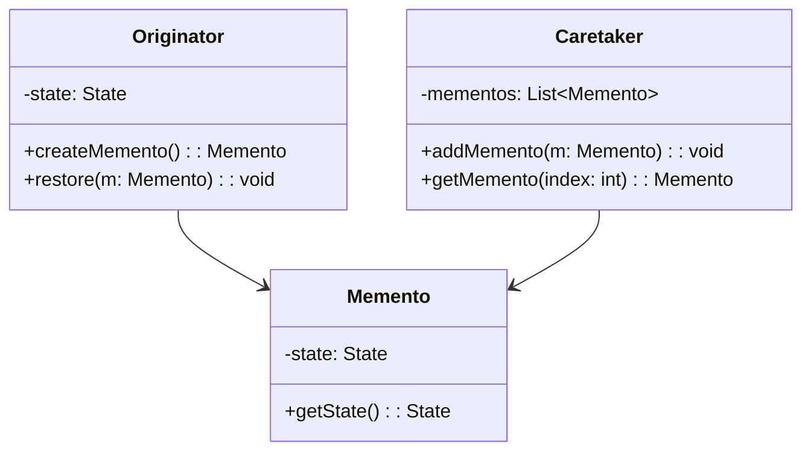
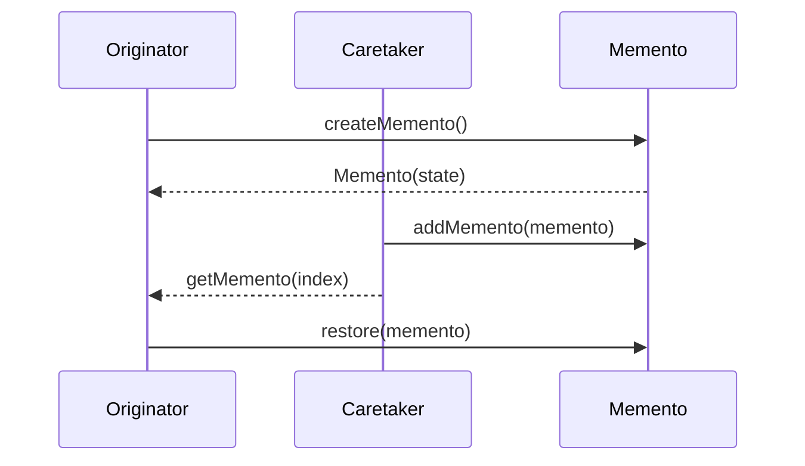

## 5.7 Memento Pattern

The Memento Pattern is a behavioral design pattern that provides the ability to restore an object to its previous state. This pattern is particularly useful in implementing undo mechanisms, where the system needs to revert to a prior state without exposing the internal details of the objects involved. Let's delve into the intricacies of the Memento Pattern, its components, and its application in Java.

### Understanding the Memento Pattern

The primary purpose of the Memento Pattern is to capture and externalize an object's internal state so that it can be restored later, all while maintaining encapsulation. Encapsulation is a fundamental principle of object-oriented programming that restricts access to the internal state of an object. The Memento Pattern respects this principle by ensuring that the state is stored and restored without exposing the details of the object's implementation.

#### Problem Solved by the Memento Pattern

In many applications, especially those with complex user interfaces or workflows, users expect the ability to undo actions. Implementing an undo mechanism can be challenging, as it requires the system to remember previous states and revert to them when necessary. The Memento Pattern addresses this challenge by providing a structured way to capture and restore object states.

### Key Components of the Memento Pattern

The Memento Pattern involves three primary roles:

1. **Originator**: The object whose state needs to be saved and restored. It creates a memento containing a snapshot of its current state and uses the memento to restore its state later.

2. **Memento**: A representation of the Originator's state at a particular point in time. It is a simple object that stores the state and provides no operations that can alter it.

3. **Caretaker**: Manages the mementos. It is responsible for storing and retrieving mementos, but it does not modify or inspect the contents of a memento.

### UML Diagram of the Memento Pattern

To better understand the relationships between these components, let's look at a UML diagram:



### Implementing the Memento Pattern in Java

Let's explore a practical example of implementing the Memento Pattern in Java. We'll create a simple text editor that allows users to type text and undo their actions.

#### Step 1: Define the Originator

The `TextEditor` class acts as the Originator. It maintains the current state of the text and provides methods to create and restore mementos.

```java
public class TextEditor {
    private StringBuilder text;

    public TextEditor() {
        this.text = new StringBuilder();
    }

    public void type(String words) {
        text.append(words);
    }

    public String getText() {
        return text.toString();
    }

    public Memento save() {
        return new Memento(text.toString());
    }

    public void restore(Memento memento) {
        text = new StringBuilder(memento.getState());
    }
}
```

#### Step 2: Define the Memento

The `Memento` class stores the state of the `TextEditor`. It is a simple class with a private state and a method to access it.

```java
public class Memento {
    private final String state;

    public Memento(String state) {
        this.state = state;
    }

    public String getState() {
        return state;
    }
}
```

#### Step 3: Define the Caretaker

The `Caretaker` class manages the mementos. It stores a list of mementos and provides methods to add and retrieve them.

```java
import java.util.ArrayList;
import java.util.List;

public class Caretaker {
    private List<Memento> mementos = new ArrayList<>();

    public void addMemento(Memento memento) {
        mementos.add(memento);
    }

    public Memento getMemento(int index) {
        return mementos.get(index);
    }
}
```

#### Step 4: Using the Memento Pattern

Now, let's see how the Memento Pattern can be used in practice:

```java
public class MementoPatternDemo {
    public static void main(String[] args) {
        TextEditor editor = new TextEditor();
        Caretaker caretaker = new Caretaker();

        editor.type("Hello, ");
        caretaker.addMemento(editor.save());

        editor.type("World!");
        caretaker.addMemento(editor.save());

        System.out.println("Current Text: " + editor.getText());

        editor.restore(caretaker.getMemento(0));
        System.out.println("After Undo: " + editor.getText());
    }
}
```

### Benefits and Considerations

#### Benefits

- **Encapsulation**: The Memento Pattern maintains encapsulation by not exposing the internal state of the Originator.
- **Undo Mechanism**: It provides a straightforward way to implement undo functionality.
- **State Management**: It allows for easy state management and restoration.

#### Considerations

- **Memory Usage**: Storing multiple mementos can consume significant memory, especially if the state is large or changes frequently.
- **Complexity**: Managing mementos and ensuring they are correctly restored can add complexity to the system.

### Try It Yourself

Experiment with the Memento Pattern by modifying the code examples:

- **Add More Features**: Extend the `TextEditor` to support additional features like formatting or multiple lines.
- **Optimize Memory Usage**: Implement a strategy to limit the number of mementos stored to save memory.
- **Enhance the Caretaker**: Add functionality to the `Caretaker` to manage mementos more efficiently, such as removing old mementos.

### Visualizing the Memento Pattern

To further illustrate the Memento Pattern, let's visualize the process of creating and restoring mementos using a sequence diagram:



### Knowledge Check

- **What is the primary purpose of the Memento Pattern?**
- **How does the Memento Pattern maintain encapsulation?**
- **What are the roles of the Originator, Memento, and Caretaker?**
- **What are some considerations when using the Memento Pattern?**

### Embrace the Journey

Remember, the Memento Pattern is just one tool in your design pattern toolkit. As you continue to explore and apply design patterns, you'll gain a deeper understanding of how to build robust and maintainable software. Keep experimenting, stay curious, and enjoy the journey!

## Quiz Time!



### What is the primary purpose of the Memento Pattern?

- [x] To capture and externalize an object's internal state for later restoration.
- [ ] To provide a simplified interface to a complex subsystem.
- [ ] To define a one-to-many dependency between objects.
- [ ] To allow incompatible interfaces to work together.

> **Explanation:** The Memento Pattern is designed to capture and externalize an object's internal state so that it can be restored later without violating encapsulation.

### Which role in the Memento Pattern is responsible for creating a memento?

- [x] Originator
- [ ] Memento
- [ ] Caretaker
- [ ] Observer

> **Explanation:** The Originator is responsible for creating a memento that contains a snapshot of its current state.

### What does the Caretaker do in the Memento Pattern?

- [x] Manages the mementos by storing and retrieving them.
- [ ] Modifies the contents of a memento.
- [ ] Provides a simplified interface to a complex subsystem.
- [ ] Encapsulates a request as an object.

> **Explanation:** The Caretaker manages the mementos by storing and retrieving them, but it does not modify or inspect the contents of a memento.

### How does the Memento Pattern maintain encapsulation?

- [x] By not exposing the internal state of the Originator.
- [ ] By providing a simplified interface to a complex subsystem.
- [ ] By defining a one-to-many dependency between objects.
- [ ] By allowing incompatible interfaces to work together.

> **Explanation:** The Memento Pattern maintains encapsulation by not exposing the internal state of the Originator, ensuring that the state is stored and restored without revealing implementation details.

### What is a potential drawback of using the Memento Pattern?

- [x] Increased memory usage due to storing multiple mementos.
- [ ] Difficulty in implementing undo functionality.
- [ ] Lack of encapsulation.
- [ ] Inability to manage state changes.

> **Explanation:** A potential drawback of using the Memento Pattern is increased memory usage, especially if the state is large or changes frequently.

### In the Memento Pattern, which class stores the state of the Originator?

- [x] Memento
- [ ] Caretaker
- [ ] Originator
- [ ] Observer

> **Explanation:** The Memento class stores the state of the Originator at a particular point in time.

### Which of the following is NOT a role in the Memento Pattern?

- [x] Observer
- [ ] Originator
- [ ] Memento
- [ ] Caretaker

> **Explanation:** The Observer is not a role in the Memento Pattern. The roles are Originator, Memento, and Caretaker.

### What is the main challenge when implementing the Memento Pattern?

- [x] Managing memory usage due to multiple mementos.
- [ ] Ensuring compatibility between interfaces.
- [ ] Simplifying complex subsystems.
- [ ] Defining a one-to-many dependency.

> **Explanation:** The main challenge when implementing the Memento Pattern is managing memory usage, especially if the state is large or changes frequently.

### Which pattern is particularly useful for implementing undo mechanisms?

- [x] Memento Pattern
- [ ] Adapter Pattern
- [ ] Observer Pattern
- [ ] Facade Pattern

> **Explanation:** The Memento Pattern is particularly useful for implementing undo mechanisms, as it allows the system to remember previous states and revert to them when necessary.

### True or False: The Caretaker modifies the contents of a memento.

- [ ] True
- [x] False

> **Explanation:** False. The Caretaker does not modify the contents of a memento; it only manages the storage and retrieval of mementos.


