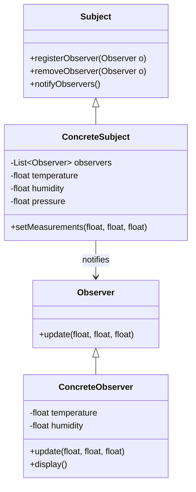

## 5.8.1 Implementing Observer in Java

The Observer pattern is a fundamental design pattern in software engineering, enabling an object, known as the subject, to maintain a list of dependents, called observers, and automatically notify them of any state changes. This pattern is particularly useful in scenarios where a change in one object requires updates to others, promoting a loose coupling between the subject and its observers.

In this section, we will delve into the implementation of the Observer pattern in Java, exploring both custom implementations and Java's built-in mechanisms. We will also discuss how observers register with subjects, receive updates, and address thread safety considerations during notifications.

### Understanding the Observer Pattern

The Observer pattern is part of the behavioral design patterns, which focus on the interaction and responsibility of objects. In the Observer pattern, the subject maintains a list of observers and notifies them of state changes, usually by calling one of their methods. This pattern is widely used in event-driven systems, such as GUI frameworks and real-time monitoring applications.

#### Key Components of the Observer Pattern

1. **Subject**: The core entity that holds the state and notifies observers of any changes.
2. **Observer**: An interface or abstract class that defines the update method, which is called by the subject.
3. **ConcreteSubject**: A specific implementation of the subject that maintains state and notifies observers.
4. **ConcreteObserver**: A specific implementation of the observer that reacts to state changes in the subject.

### Implementing a Custom Observer Pattern in Java

Let's begin by implementing a custom Observer pattern in Java. We'll create a simple weather monitoring system where the `WeatherStation` acts as the subject, and different display units act as observers.

#### Step-by-Step Implementation

1. **Define the Observer Interface**

```java
public interface Observer {
    void update(float temperature, float humidity, float pressure);
}
```

2. **Create the Subject Interface**

```java
import java.util.ArrayList;
import java.util.List;

public interface Subject {
    void registerObserver(Observer o);
    void removeObserver(Observer o);
    void notifyObservers();
}
```

3. **Implement the ConcreteSubject**

```java
public class WeatherStation implements Subject {
    private List<Observer> observers;
    private float temperature;
    private float humidity;
    private float pressure;

    public WeatherStation() {
        observers = new ArrayList<>();
    }

    @Override
    public void registerObserver(Observer o) {
        observers.add(o);
    }

    @Override
    public void removeObserver(Observer o) {
        observers.remove(o);
    }

    @Override
    public void notifyObservers() {
        for (Observer observer : observers) {
            observer.update(temperature, humidity, pressure);
        }
    }

    public void setMeasurements(float temperature, float humidity, float pressure) {
        this.temperature = temperature;
        this.humidity = humidity;
        this.pressure = pressure;
        notifyObservers();
    }
}
```

4. **Implement the ConcreteObserver**

```java
public class CurrentConditionsDisplay implements Observer {
    private float temperature;
    private float humidity;

    @Override
    public void update(float temperature, float humidity, float pressure) {
        this.temperature = temperature;
        this.humidity = humidity;
        display();
    }

    public void display() {
        System.out.println("Current conditions: " + temperature + "F degrees and " + humidity + "% humidity");
    }
}
```

5. **Test the Implementation**

```java
public class WeatherStationTest {
    public static void main(String[] args) {
        WeatherStation weatherStation = new WeatherStation();
        CurrentConditionsDisplay currentDisplay = new CurrentConditionsDisplay();

        weatherStation.registerObserver(currentDisplay);

        weatherStation.setMeasurements(80, 65, 30.4f);
        weatherStation.setMeasurements(82, 70, 29.2f);
    }
}
```

### Java's Built-in Observer Mechanism

Java provides a built-in mechanism for implementing the Observer pattern through the `java.util.Observable` class and the `java.util.Observer` interface. However, it's important to note that these classes have been deprecated since Java 9 due to design issues, such as the `Observable` class not being an interface and requiring subclassing.

Despite the deprecation, understanding Java's built-in mechanism can be beneficial for maintaining legacy code.

#### Using Java's Built-in Observer

1. **Implement the ConcreteSubject**

```java
import java.util.Observable;

public class WeatherData extends Observable {
    private float temperature;
    private float humidity;
    private float pressure;

    public void setMeasurements(float temperature, float humidity, float pressure) {
        this.temperature = temperature;
        this.humidity = humidity;
        this.pressure = pressure;
        setChanged();
        notifyObservers();
    }

    public float getTemperature() {
        return temperature;
    }

    public float getHumidity() {
        return humidity;
    }

    public float getPressure() {
        return pressure;
    }
}
```

2. **Implement the ConcreteObserver**

```java
import java.util.Observable;
import java.util.Observer;

public class ForecastDisplay implements Observer {
    private float currentPressure = 29.92f;
    private float lastPressure;

    @Override
    public void update(Observable observable, Object arg) {
        if (observable instanceof WeatherData) {
            WeatherData weatherData = (WeatherData) observable;
            lastPressure = currentPressure;
            currentPressure = weatherData.getPressure();
            display();
        }
    }

    public void display() {
        System.out.println("Forecast: " + (currentPressure > lastPressure ? "Improving weather on the way!" : "Watch out for cooler, rainy weather"));
    }
}
```

3. **Test the Built-in Implementation**

```java
public class WeatherDataTest {
    public static void main(String[] args) {
        WeatherData weatherData = new WeatherData();
        ForecastDisplay forecastDisplay = new ForecastDisplay();

        weatherData.addObserver(forecastDisplay);

        weatherData.setMeasurements(80, 65, 30.4f);
        weatherData.setMeasurements(82, 70, 29.2f);
    }
}
```

### Thread Safety Considerations

When implementing the Observer pattern, especially in a multi-threaded environment, thread safety is a critical consideration. The subject may be accessed by multiple threads simultaneously, leading to potential race conditions.

#### Strategies for Ensuring Thread Safety

1. **Synchronized Methods**: Use synchronized methods to control access to the subject's state and observer list.

```java
public synchronized void registerObserver(Observer o) {
    observers.add(o);
}

public synchronized void removeObserver(Observer o) {
    observers.remove(o);
}

public synchronized void notifyObservers() {
    for (Observer observer : observers) {
        observer.update(temperature, humidity, pressure);
    }
}
```

2. **Copy-on-Write**: Use a `CopyOnWriteArrayList` for the observer list to handle concurrent modifications safely.

```java
import java.util.concurrent.CopyOnWriteArrayList;

public class WeatherStation implements Subject {
    private CopyOnWriteArrayList<Observer> observers;
    // Other fields and methods remain the same
}
```

3. **Immutable Data**: Pass immutable data to observers to prevent changes during notification.

4. **ExecutorService**: Use an `ExecutorService` to manage notification threads, ensuring that notifications are handled asynchronously and do not block the subject.

```java
import java.util.concurrent.ExecutorService;
import java.util.concurrent.Executors;

public class WeatherStation implements Subject {
    private ExecutorService executor = Executors.newFixedThreadPool(10);
    // Other fields and methods remain the same

    @Override
    public void notifyObservers() {
        for (Observer observer : observers) {
            executor.submit(() -> observer.update(temperature, humidity, pressure));
        }
    }
}
```

### Visualizing the Observer Pattern

To better understand the interaction between subjects and observers, let's visualize the Observer pattern using a class diagram.



### Try It Yourself

To deepen your understanding of the Observer pattern, try modifying the code examples provided:

- **Add New Observers**: Implement additional observer classes, such as a `StatisticsDisplay` or `HeatIndexDisplay`, and register them with the `WeatherStation`.
- **Change Notification Logic**: Modify the `WeatherStation` to notify observers only when the temperature exceeds a certain threshold.
- **Implement a GUI**: Create a simple GUI using Java Swing or JavaFX to display weather updates in real-time.

### Knowledge Check

1. **Why is the Observer pattern useful in event-driven systems?**
2. **What are the main components of the Observer pattern?**
3. **How does Java's built-in Observer mechanism differ from a custom implementation?**
4. **What are some strategies for ensuring thread safety in the Observer pattern?**

### Conclusion

The Observer pattern is a powerful tool for managing dependencies between objects, allowing for flexible and scalable design. By understanding both custom implementations and Java's built-in mechanisms, you can effectively apply this pattern to a wide range of applications. Remember to consider thread safety when implementing the Observer pattern in multi-threaded environments.

### Further Reading

For more information on the Observer pattern and its applications, consider exploring the following resources:

- [Design Patterns: Elements of Reusable Object-Oriented Software](https://en.wikipedia.org/wiki/Design_Patterns) by Erich Gamma et al.
- [Java Concurrency in Practice](https://www.oreilly.com/library/view/java-concurrency-in/0321349601/) by Brian Goetz

## Quiz Time!



### What is the primary purpose of the Observer pattern?

- [x] To allow objects to be notified of changes in other objects
- [ ] To manage object creation
- [ ] To encapsulate a request as an object
- [ ] To provide a simplified interface to a complex subsystem

> **Explanation:** The Observer pattern allows objects (observers) to be notified of changes in another object (subject), promoting loose coupling.

### Which of the following is NOT a component of the Observer pattern?

- [ ] Subject
- [ ] Observer
- [x] Adapter
- [ ] ConcreteObserver

> **Explanation:** The Adapter is not a component of the Observer pattern; it is a separate design pattern used to allow incompatible interfaces to work together.

### How does Java's built-in Observer mechanism differ from a custom implementation?

- [x] Java's built-in mechanism uses `Observable` and `Observer` classes, which are deprecated.
- [ ] Java's built-in mechanism requires manual notification of observers.
- [ ] Java's built-in mechanism does not support multiple observers.
- [ ] Java's built-in mechanism automatically handles thread safety.

> **Explanation:** Java's built-in mechanism uses the `Observable` class and `Observer` interface, which have been deprecated due to design limitations.

### What is a common strategy for ensuring thread safety in the Observer pattern?

- [ ] Using global variables
- [x] Using synchronized methods
- [ ] Using static methods
- [ ] Using public fields

> **Explanation:** Synchronized methods are a common strategy to ensure thread safety by controlling access to shared resources.

### Which Java class can be used to manage concurrent modifications safely in an observer list?

- [ ] ArrayList
- [ ] LinkedList
- [x] CopyOnWriteArrayList
- [ ] HashMap

> **Explanation:** `CopyOnWriteArrayList` is designed to handle concurrent modifications safely, making it suitable for observer lists.

### True or False: The Observer pattern promotes tight coupling between subjects and observers.

- [ ] True
- [x] False

> **Explanation:** The Observer pattern promotes loose coupling between subjects and observers, allowing them to interact without being tightly bound.

### What is the role of the `setChanged()` method in Java's built-in Observer mechanism?

- [x] It marks the observable object as having been changed.
- [ ] It notifies all observers of a change.
- [ ] It registers a new observer.
- [ ] It removes an observer.

> **Explanation:** The `setChanged()` method marks the observable object as changed, allowing `notifyObservers()` to proceed with notifications.

### In a custom Observer pattern implementation, what method is typically used to notify observers?

- [ ] update()
- [ ] registerObserver()
- [x] notifyObservers()
- [ ] removeObserver()

> **Explanation:** The `notifyObservers()` method is typically used to notify all registered observers of a change.

### Which of the following is a benefit of using the Observer pattern?

- [x] It allows for dynamic relationships between objects.
- [ ] It simplifies object creation.
- [ ] It provides a global point of access to an object.
- [ ] It reduces the number of classes in a system.

> **Explanation:** The Observer pattern allows for dynamic relationships between objects, enabling flexible and scalable designs.

### True or False: Java's `Observer` and `Observable` classes are recommended for new projects.

- [ ] True
- [x] False

> **Explanation:** Java's `Observer` and `Observable` classes are deprecated and not recommended for new projects due to design limitations.


