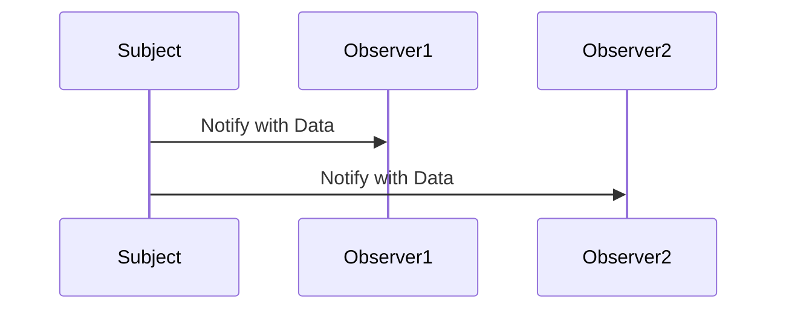
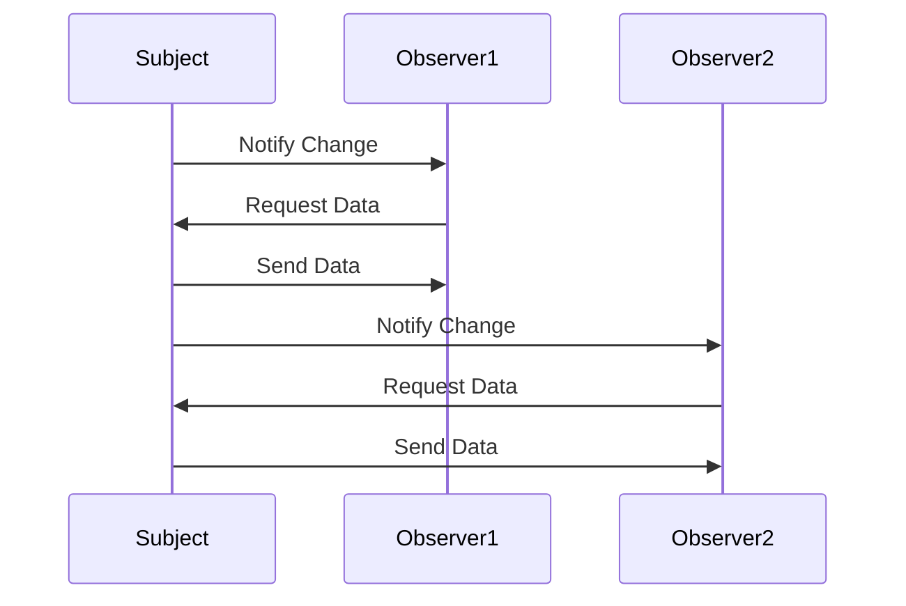

## 5.8.2 Push vs. Pull Notification Models

In the realm of software design patterns, the Observer pattern is a fundamental concept that facilitates communication between objects. It allows an object, known as the subject, to maintain a list of dependents, called observers, and notify them of any state changes. This pattern is widely used in event-driven systems, GUIs, and real-time applications. Within the Observer pattern, two primary strategies exist for notifying observers about changes: the push model and the pull model. Understanding these models is crucial for designing efficient and responsive systems.

### Understanding the Observer Pattern

Before delving into the push and pull models, let's briefly revisit the Observer pattern. The Observer pattern defines a one-to-many dependency between objects. When the state of the subject changes, all its observers are notified and updated automatically. This pattern promotes loose coupling between the subject and its observers, allowing for dynamic and flexible systems.

### Push Notification Model

In the push model, the subject sends detailed updates to its observers. This means that whenever a change occurs, the subject pushes all relevant data to each observer. The observers do not need to query the subject for additional information; they receive everything they need in the notification.

#### Advantages of the Push Model

1. **Immediate Updates**: Observers receive all the necessary data as soon as a change occurs, allowing them to react immediately.
2. **Simplified Observer Logic**: Since observers receive complete information, they do not need to query the subject for additional details, simplifying their implementation.
3. **Reduced Latency**: The push model can reduce latency in systems where immediate response to changes is critical.

#### Disadvantages of the Push Model

1. **Increased Bandwidth Usage**: Sending detailed updates to all observers can lead to increased bandwidth usage, especially if the data is large or the number of observers is high.
2. **Potential for Unnecessary Updates**: Observers may receive data they do not need, leading to inefficiencies.
3. **Tight Coupling**: The subject needs to know what data each observer requires, which can lead to tighter coupling between the subject and its observers.

#### Implementing the Push Model in Java

Let's explore how to implement the push model in Java with a simple example. Consider a weather station that notifies various displays (observers) about temperature changes.

```java
import java.util.ArrayList;
import java.util.List;

// Subject interface
interface Subject {
    void registerObserver(Observer o);
    void removeObserver(Observer o);
    void notifyObservers();
}

// Observer interface
interface Observer {
    void update(float temperature);
}

// Concrete Subject
class WeatherStation implements Subject {
    private List<Observer> observers;
    private float temperature;

    public WeatherStation() {
        observers = new ArrayList<>();
    }

    public void setTemperature(float temperature) {
        this.temperature = temperature;
        notifyObservers();
    }

    @Override
    public void registerObserver(Observer o) {
        observers.add(o);
    }

    @Override
    public void removeObserver(Observer o) {
        observers.remove(o);
    }

    @Override
    public void notifyObservers() {
        for (Observer observer : observers) {
            observer.update(temperature);
        }
    }
}

// Concrete Observer
class TemperatureDisplay implements Observer {
    private float temperature;

    @Override
    public void update(float temperature) {
        this.temperature = temperature;
        display();
    }

    public void display() {
        System.out.println("Current temperature: " + temperature + "°C");
    }
}

// Demonstration
public class PushModelDemo {
    public static void main(String[] args) {
        WeatherStation weatherStation = new WeatherStation();
        TemperatureDisplay display = new TemperatureDisplay();

        weatherStation.registerObserver(display);
        weatherStation.setTemperature(25.0f);
    }
}
```

In this example, the `WeatherStation` class acts as the subject, and the `TemperatureDisplay` class is the observer. When the temperature changes, the weather station pushes the new temperature to all registered displays.

### Pull Notification Model

In contrast to the push model, the pull model involves the subject notifying observers that a change has occurred, but without providing detailed data. Instead, observers must pull the necessary information from the subject.

#### Advantages of the Pull Model

1. **Reduced Bandwidth Usage**: Only minimal information is sent in the notification, reducing bandwidth usage.
2. **Decoupling**: The subject does not need to know what specific data each observer requires, promoting loose coupling.
3. **Flexibility**: Observers can decide what data to retrieve and when, allowing for more flexible and adaptive systems.

#### Disadvantages of the Pull Model

1. **Increased Latency**: Observers must query the subject for data, which can introduce latency.
2. **Complex Observer Logic**: Observers need to implement logic to pull the necessary data, increasing complexity.
3. **Potential for Stale Data**: If observers do not pull data immediately, they may work with outdated information.

#### Implementing the Pull Model in Java

Let's modify the previous example to demonstrate the pull model.

```java
// Subject interface remains the same

// Observer interface
interface Observer {
    void update(Subject subject);
}

// Concrete Subject
class WeatherStation implements Subject {
    private List<Observer> observers;
    private float temperature;

    public WeatherStation() {
        observers = new ArrayList<>();
    }

    public void setTemperature(float temperature) {
        this.temperature = temperature;
        notifyObservers();
    }

    public float getTemperature() {
        return temperature;
    }

    @Override
    public void registerObserver(Observer o) {
        observers.add(o);
    }

    @Override
    public void removeObserver(Observer o) {
        observers.remove(o);
    }

    @Override
    public void notifyObservers() {
        for (Observer observer : observers) {
            observer.update(this);
        }
    }
}

// Concrete Observer
class TemperatureDisplay implements Observer {
    private float temperature;

    @Override
    public void update(Subject subject) {
        if (subject instanceof WeatherStation) {
            WeatherStation weatherStation = (WeatherStation) subject;
            this.temperature = weatherStation.getTemperature();
            display();
        }
    }

    public void display() {
        System.out.println("Current temperature: " + temperature + "°C");
    }
}

// Demonstration
public class PullModelDemo {
    public static void main(String[] args) {
        WeatherStation weatherStation = new WeatherStation();
        TemperatureDisplay display = new TemperatureDisplay();

        weatherStation.registerObserver(display);
        weatherStation.setTemperature(25.0f);
    }
}
```

In this pull model implementation, the `update` method in the `Observer` interface takes the `Subject` as a parameter. The observer then pulls the necessary data from the subject.

### Comparing Push and Pull Models

When deciding between the push and pull models, consider the following factors:

- **Data Volume**: If the data to be sent is large, the pull model may be more efficient as it reduces bandwidth usage.
- **Observer Complexity**: The push model simplifies observer logic, while the pull model requires observers to implement data retrieval logic.
- **Coupling**: The pull model promotes loose coupling, as the subject does not need to know the details of what data each observer requires.
- **Latency**: The push model provides immediate updates, while the pull model may introduce latency due to data retrieval.
- **Use Case Requirements**: Consider the specific requirements of your application. For real-time systems, the push model may be more suitable, while for systems with varying data needs, the pull model offers flexibility.

### Choosing the Appropriate Model

Selecting the right notification model depends on the specific needs of your application. Here are some guidelines to help you make an informed decision:

- **Use the Push Model When**:
  - Immediate updates are critical.
  - Observers require the same set of data.
  - Bandwidth usage is not a concern.

- **Use the Pull Model When**:
  - Observers require different subsets of data.
  - Bandwidth usage needs to be minimized.
  - Loose coupling is a priority.

### Visualizing Push and Pull Models

To further illustrate the differences between the push and pull models, let's visualize the flow of information in each model using Mermaid.js diagrams.

#### Push Model Diagram



In the push model, the subject sends data directly to each observer.

#### Pull Model Diagram



In the pull model, the subject notifies observers of a change, and observers request the data they need.

### Try It Yourself

To deepen your understanding, try modifying the code examples:

- **Experiment with Different Data**: Change the type of data being pushed or pulled and observe how it affects the implementation.
- **Add More Observers**: Register multiple observers and see how the notification models handle them.
- **Implement Additional Features**: Add features like filtering or conditional updates to the observers.

### Knowledge Check

- What are the key differences between the push and pull models?
- How does the choice of notification model affect system performance and design?
- Can you think of a real-world scenario where each model would be appropriate?

### Conclusion

Understanding the push and pull notification models within the Observer pattern is essential for designing efficient and responsive systems. By carefully considering the advantages and disadvantages of each model, you can choose the one that best fits your application's needs. Remember, this is just the beginning. As you progress, you'll build more complex and interactive systems. Keep experimenting, stay curious, and enjoy the journey!

## Quiz Time!



### Which model sends detailed updates to observers?

- [x] Push Model
- [ ] Pull Model
- [ ] Both
- [ ] Neither

> **Explanation:** The push model sends detailed updates to observers, providing them with all necessary information immediately.

### What is a disadvantage of the push model?

- [x] Increased bandwidth usage
- [ ] Reduced latency
- [ ] Simplified observer logic
- [ ] Loose coupling

> **Explanation:** The push model can lead to increased bandwidth usage as it sends detailed updates to all observers.

### In which model do observers request data from the subject?

- [ ] Push Model
- [x] Pull Model
- [ ] Both
- [ ] Neither

> **Explanation:** In the pull model, observers request the necessary data from the subject after being notified of a change.

### Which model promotes loose coupling?

- [ ] Push Model
- [x] Pull Model
- [ ] Both
- [ ] Neither

> **Explanation:** The pull model promotes loose coupling because the subject does not need to know what specific data each observer requires.

### When is the push model more suitable?

- [x] When immediate updates are critical
- [ ] When observers require different subsets of data
- [ ] When bandwidth usage needs to be minimized
- [ ] When loose coupling is a priority

> **Explanation:** The push model is more suitable when immediate updates are critical, as it provides observers with all necessary information right away.

### Which model can introduce latency due to data retrieval?

- [ ] Push Model
- [x] Pull Model
- [ ] Both
- [ ] Neither

> **Explanation:** The pull model can introduce latency because observers must request data from the subject after being notified of a change.

### What is an advantage of the pull model?

- [x] Reduced bandwidth usage
- [ ] Immediate updates
- [ ] Simplified observer logic
- [ ] Tight coupling

> **Explanation:** The pull model reduces bandwidth usage by only sending minimal information in the notification.

### Which model requires observers to implement data retrieval logic?

- [ ] Push Model
- [x] Pull Model
- [ ] Both
- [ ] Neither

> **Explanation:** In the pull model, observers must implement logic to retrieve the necessary data from the subject.

### What is a potential issue with the pull model?

- [x] Potential for stale data
- [ ] Increased bandwidth usage
- [ ] Immediate updates
- [ ] Simplified observer logic

> **Explanation:** The pull model can lead to stale data if observers do not pull data immediately after being notified of a change.

### True or False: The push model is always better than the pull model.

- [ ] True
- [x] False

> **Explanation:** The push model is not always better than the pull model; the choice depends on the specific requirements of the application.


