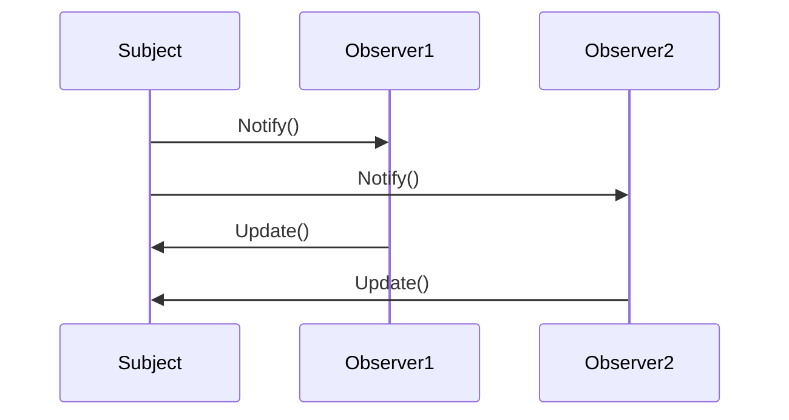

## 5.8.3 Java's `Observer` and `Observable`

In this section, we delve into Java's historical support for the Observer pattern through the `Observer` and `Observable` classes, explore the reasons behind their deprecation, and introduce modern alternatives for implementing this pattern. The Observer pattern is a fundamental design pattern that facilitates communication between objects in a one-to-many relationship, allowing an object (the subject) to notify multiple observers of state changes.

### Understanding Java's Built-in `Observer` and `Observable`

Java's `Observer` and `Observable` classes were part of the `java.util` package and provided a straightforward way to implement the Observer pattern. The `Observable` class served as the subject, maintaining a list of observers and notifying them of changes, while the `Observer` interface defined the update method that observers needed to implement.

#### How `Observer` and `Observable` Worked

The `Observable` class provided methods to add, remove, and notify observers. Here's a brief overview of how these classes were used:

- **Observable Class**: This class maintained a list of observers and provided methods such as `addObserver(Observer o)`, `deleteObserver(Observer o)`, and `notifyObservers()`. It also had a `setChanged()` method to indicate that the state had changed.

- **Observer Interface**: This interface had a single method, `update(Observable o, Object arg)`, which was called when the `Observable` object changed.

Let's look at a simple example to illustrate how these classes were used:

```java
import java.util.Observable;
import java.util.Observer;

// The Observable class
class WeatherData extends Observable {
    private float temperature;

    public void setTemperature(float temperature) {
        this.temperature = temperature;
        setChanged(); // Mark the observable as changed
        notifyObservers(temperature); // Notify all observers
    }
}

// The Observer class
class WeatherDisplay implements Observer {
    private float temperature;

    @Override
    public void update(Observable o, Object arg) {
        if (o instanceof WeatherData) {
            this.temperature = (float) arg;
            display();
        }
    }

    public void display() {
        System.out.println("Current temperature: " + temperature);
    }
}

// Main class to demonstrate
public class WeatherStation {
    public static void main(String[] args) {
        WeatherData weatherData = new WeatherData();
        WeatherDisplay weatherDisplay = new WeatherDisplay();

        weatherData.addObserver(weatherDisplay);
        weatherData.setTemperature(25.0f);
    }
}
```

### Deprecation of `Observer` and `Observable`

Despite their utility, `Observer` and `Observable` were deprecated in Java 9. Several reasons contributed to this decision:

1. **Lack of Flexibility**: The `Observable` class required subclassing, which limited its flexibility. It could not be used with existing classes that needed to implement the observer pattern without modification.

2. **Thread Safety Concerns**: The `Observable` class was not thread-safe, making it unsuitable for concurrent applications without additional synchronization.

3. **Limited Functionality**: The built-in classes provided a basic implementation that lacked features such as property change events, which are often needed in modern applications.

4. **Java's Evolution**: As Java evolved, more robust and flexible alternatives became available, making the built-in classes obsolete.

### Alternatives to `Observer` and `Observable`

With the deprecation of `Observer` and `Observable`, developers have several alternatives for implementing the Observer pattern in Java:

#### Property Change Listeners

JavaBeans provide a `PropertyChangeListener` interface that can be used to implement the Observer pattern. This approach is more flexible and supports property change events.

Here's an example using `PropertyChangeListener`:

```java
import java.beans.PropertyChangeListener;
import java.beans.PropertyChangeSupport;

// The Subject class
class WeatherData {
    private float temperature;
    private PropertyChangeSupport support;

    public WeatherData() {
        support = new PropertyChangeSupport(this);
    }

    public void addPropertyChangeListener(PropertyChangeListener pcl) {
        support.addPropertyChangeListener(pcl);
    }

    public void removePropertyChangeListener(PropertyChangeListener pcl) {
        support.removePropertyChangeListener(pcl);
    }

    public void setTemperature(float temperature) {
        float oldTemperature = this.temperature;
        this.temperature = temperature;
        support.firePropertyChange("temperature", oldTemperature, temperature);
    }
}

// The Observer class
class WeatherDisplay implements PropertyChangeListener {
    private float temperature;

    @Override
    public void propertyChange(java.beans.PropertyChangeEvent evt) {
        if ("temperature".equals(evt.getPropertyName())) {
            this.temperature = (float) evt.getNewValue();
            display();
        }
    }

    public void display() {
        System.out.println("Current temperature: " + temperature);
    }
}

// Main class to demonstrate
public class WeatherStation {
    public static void main(String[] args) {
        WeatherData weatherData = new WeatherData();
        WeatherDisplay weatherDisplay = new WeatherDisplay();

        weatherData.addPropertyChangeListener(weatherDisplay);
        weatherData.setTemperature(25.0f);
    }
}
```

#### Third-Party Libraries

Several third-party libraries provide robust implementations of the Observer pattern. Notable examples include:

- **RxJava**: A library for composing asynchronous and event-based programs using observable sequences.

- **Guava EventBus**: A library from Google that provides a simple publish-subscribe event system.

Here's a brief example using RxJava:

```java
import io.reactivex.rxjava3.subjects.PublishSubject;

// Main class to demonstrate
public class WeatherStation {
    public static void main(String[] args) {
        PublishSubject<Float> temperatureSubject = PublishSubject.create();

        temperatureSubject.subscribe(temp -> System.out.println("Current temperature: " + temp));

        temperatureSubject.onNext(25.0f);
    }
}
```

### Visualizing the Observer Pattern

To better understand the dynamics of the Observer pattern, let's visualize the interaction between the subject and observers using a sequence diagram.



In this diagram, the subject notifies each observer of a change, and the observers update themselves accordingly.

### Implementing the Observer Pattern Without Deprecated Classes

Let's explore how to implement the Observer pattern using modern Java features and best practices:

#### Using Java 8 Streams and Lambdas

Java 8 introduced streams and lambdas, which can be leveraged to implement the Observer pattern in a functional style.

```java
import java.util.ArrayList;
import java.util.List;
import java.util.function.Consumer;

// The Subject class
class WeatherData {
    private float temperature;
    private List<Consumer<Float>> observers = new ArrayList<>();

    public void addObserver(Consumer<Float> observer) {
        observers.add(observer);
    }

    public void removeObserver(Consumer<Float> observer) {
        observers.remove(observer);
    }

    public void setTemperature(float temperature) {
        this.temperature = temperature;
        notifyObservers();
    }

    private void notifyObservers() {
        observers.forEach(observer -> observer.accept(temperature));
    }
}

// Main class to demonstrate
public class WeatherStation {
    public static void main(String[] args) {
        WeatherData weatherData = new WeatherData();

        weatherData.addObserver(temp -> System.out.println("Display 1: Current temperature: " + temp));
        weatherData.addObserver(temp -> System.out.println("Display 2: Current temperature: " + temp));

        weatherData.setTemperature(25.0f);
    }
}
```

### Try It Yourself

To deepen your understanding, try modifying the code examples above. Here are some suggestions:

- **Add More Observers**: Implement additional observers that react differently to temperature changes.
- **Implement Unsubscription**: Modify the code to allow observers to unsubscribe from notifications.
- **Use Different Data Types**: Experiment with different data types for the observed state, such as humidity or pressure.

### Knowledge Check

Before we conclude, let's reinforce what we've learned:

- **Why were `Observer` and `Observable` deprecated?**
- **What are some modern alternatives to these classes?**
- **How can you implement the Observer pattern using Java 8 features?**

### Conclusion

The deprecation of `Observer` and `Observable` in Java marks a shift towards more flexible and robust implementations of the Observer pattern. By leveraging modern Java features and third-party libraries, developers can create more maintainable and scalable applications. Remember, this is just the beginning. As you progress, you'll continue to build more complex systems that effectively utilize design patterns. Keep experimenting, stay curious, and enjoy the journey!

## Quiz Time!



### Why were Java's `Observer` and `Observable` classes deprecated?

- [x] Lack of flexibility and thread safety concerns
- [ ] They were never widely used
- [ ] They were too complex to implement
- [ ] They were replaced by JavaFX

> **Explanation:** The classes were deprecated due to lack of flexibility, thread safety concerns, and limited functionality.

### Which Java feature can be used as an alternative to `Observer` and `Observable`?

- [x] PropertyChangeListener
- [ ] JavaFX
- [ ] Java Applets
- [ ] JavaBeans

> **Explanation:** PropertyChangeListener is a Java feature that can be used to implement the Observer pattern.

### What is a key benefit of using RxJava for implementing the Observer pattern?

- [x] It supports asynchronous and event-based programming
- [ ] It is built into the Java standard library
- [ ] It simplifies GUI development
- [ ] It is specifically designed for database operations

> **Explanation:** RxJava is a library for composing asynchronous and event-based programs using observable sequences.

### How can Java 8 streams and lambdas be used in the Observer pattern?

- [x] By using functional interfaces to handle notifications
- [ ] By creating new classes for each observer
- [ ] By using reflection to notify observers
- [ ] By implementing custom annotations

> **Explanation:** Java 8 streams and lambdas can be used to implement the Observer pattern in a functional style by using functional interfaces.

### What is the role of the `PropertyChangeSupport` class?

- [x] It helps manage property change listeners and fire events
- [ ] It provides a GUI framework for Java applications
- [ ] It is used for database connectivity
- [ ] It manages thread synchronization

> **Explanation:** The `PropertyChangeSupport` class helps manage property change listeners and fire property change events.

### Which library provides a simple publish-subscribe event system?

- [x] Guava EventBus
- [ ] JavaFX
- [ ] Apache Commons
- [ ] JavaBeans

> **Explanation:** Guava EventBus is a library from Google that provides a simple publish-subscribe event system.

### What is a common use case for the Observer pattern?

- [x] Implementing event-driven systems
- [ ] Managing database transactions
- [ ] Creating GUI layouts
- [ ] Handling file I/O operations

> **Explanation:** The Observer pattern is commonly used in event-driven systems to notify observers of state changes.

### How does the `PropertyChangeListener` interface differ from the `Observer` interface?

- [x] It supports property change events with more flexibility
- [ ] It requires subclassing
- [ ] It is not thread-safe
- [ ] It is deprecated

> **Explanation:** The `PropertyChangeListener` interface supports property change events and offers more flexibility compared to the `Observer` interface.

### What is a benefit of using third-party libraries for the Observer pattern?

- [x] They offer more features and flexibility
- [ ] They are built into the Java standard library
- [ ] They simplify GUI development
- [ ] They are specifically designed for database operations

> **Explanation:** Third-party libraries often provide more features and flexibility compared to the built-in Java classes.

### True or False: Java's `Observer` and `Observable` classes are still recommended for new projects.

- [ ] True
- [x] False

> **Explanation:** Java's `Observer` and `Observable` classes are deprecated and not recommended for new projects.


