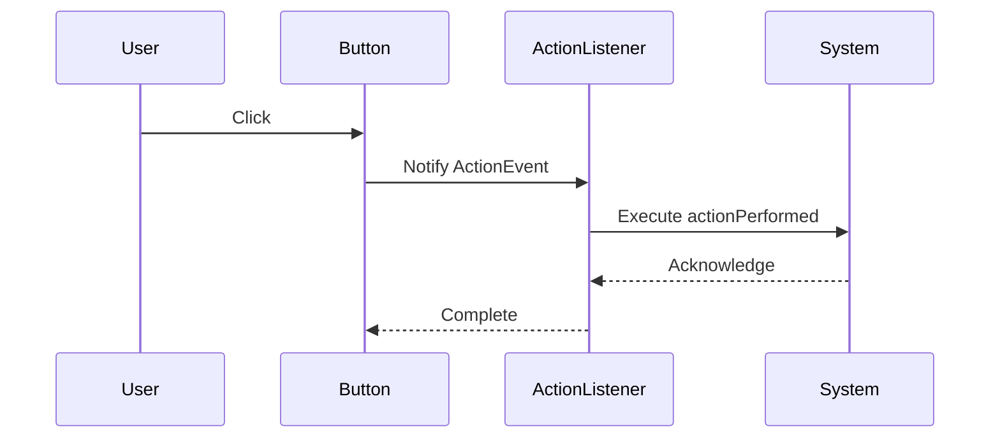

## 5.8.4 Event Handling in GUI Frameworks

In the realm of graphical user interfaces (GUIs), event handling is a cornerstone of interactive applications. Java, with its rich set of GUI frameworks like Swing and JavaFX, provides robust mechanisms for managing events. At the heart of these mechanisms lies the Observer pattern, a behavioral design pattern that facilitates communication between objects in a decoupled manner. This section delves into how the Observer pattern is utilized in Java GUI frameworks for event handling, the role of listeners and event objects, and best practices for implementing efficient and maintainable event-driven systems.

### Understanding the Observer Pattern in GUI Context

The Observer pattern defines a one-to-many dependency between objects so that when one object changes state, all its dependents are notified and updated automatically. In GUI frameworks, this pattern is pivotal for managing user interactions. The GUI components act as subjects that generate events, while listeners act as observers that respond to these events.

#### Key Components of the Observer Pattern

1. **Subject**: In the context of GUIs, the subject is typically a component that generates events, such as a button or a text field.
2. **Observer**: Observers are entities that listen for events from subjects. In Java, these are often implemented as listener interfaces.
3. **Event Object**: This encapsulates information about the event, such as the source of the event and any relevant data.
4. **Listener Interface**: Defines the methods that must be implemented by observers to handle specific types of events.

### Event Handling in Java Swing

Swing, a part of Java's standard library, is a lightweight GUI toolkit that provides a rich set of components for building desktop applications. Event handling in Swing is primarily based on the Observer pattern, where components generate events and listeners handle them.

#### Implementing Event Handling in Swing

Let's explore a simple example to illustrate event handling in Swing using the Observer pattern.

```java
import javax.swing.*;
import java.awt.event.ActionEvent;
import java.awt.event.ActionListener;

public class SwingObserverExample {
    public static void main(String[] args) {
        JFrame frame = new JFrame("Swing Observer Example");
        JButton button = new JButton("Click Me");

        // Adding an ActionListener to the button
        button.addActionListener(new ActionListener() {
            @Override
            public void actionPerformed(ActionEvent e) {
                System.out.println("Button clicked!");
            }
        });

        frame.setDefaultCloseOperation(JFrame.EXIT_ON_CLOSE);
        frame.getContentPane().add(button);
        frame.setSize(300, 200);
        frame.setVisible(true);
    }
}
```

**Explanation**:
- **JButton** acts as the subject that generates an `ActionEvent` when clicked.
- **ActionListener** is the observer that listens for `ActionEvent` and executes the `actionPerformed` method when the event occurs.
- **ActionEvent** is the event object that carries information about the event.

#### Best Practices for Swing Event Handling

1. **Use Anonymous Classes or Lambdas**: For simple event handling, consider using anonymous classes or lambda expressions to keep the code concise.
2. **Separate Business Logic**: Keep the event handling logic separate from business logic to enhance maintainability.
3. **Avoid Long-Running Tasks**: Perform long-running tasks in a separate thread to prevent the GUI from becoming unresponsive.

### Event Handling in JavaFX

JavaFX is a modern GUI toolkit for Java that provides advanced features for building rich internet applications. It offers a more flexible and powerful event handling model compared to Swing.

#### Implementing Event Handling in JavaFX

Here's an example of event handling in JavaFX using the Observer pattern.

```java
import javafx.application.Application;
import javafx.scene.Scene;
import javafx.scene.control.Button;
import javafx.scene.layout.StackPane;
import javafx.stage.Stage;

public class JavaFXObserverExample extends Application {
    @Override
    public void start(Stage primaryStage) {
        Button button = new Button("Click Me");

        // Adding an EventHandler to the button
        button.setOnAction(event -> System.out.println("Button clicked!"));

        StackPane root = new StackPane();
        root.getChildren().add(button);

        Scene scene = new Scene(root, 300, 200);
        primaryStage.setTitle("JavaFX Observer Example");
        primaryStage.setScene(scene);
        primaryStage.show();
    }

    public static void main(String[] args) {
        launch(args);
    }
}
```

**Explanation**:
- **Button** in JavaFX acts as the subject.
- **EventHandler** is the observer that listens for `ActionEvent`.
- **Lambda Expression** is used to define the event handling logic concisely.

#### Best Practices for JavaFX Event Handling

1. **Use Lambda Expressions**: JavaFX supports lambda expressions, making event handling more concise and readable.
2. **Leverage Binding and Properties**: Use JavaFX's property binding features to automatically update UI components in response to data changes.
3. **Utilize Platform.runLater**: For updating UI components from non-UI threads, use `Platform.runLater` to ensure thread safety.

### Listeners and Event Objects

Listeners in Java GUI frameworks are interfaces that define methods for handling specific types of events. Event objects encapsulate information about the event and are passed to listeners when an event occurs.

#### Role of Listeners

Listeners act as observers in the Observer pattern. They register with subjects to receive notifications about specific events. In Java, listeners are typically implemented as interfaces with methods that must be overridden to handle events.

```java
// Example of a custom listener interface
public interface CustomListener {
    void onEventOccurred(CustomEvent event);
}

// Example of a custom event object
public class CustomEvent {
    private final String message;

    public CustomEvent(String message) {
        this.message = message;
    }

    public String getMessage() {
        return message;
    }
}
```

#### Implementing Custom Listeners

To implement custom listeners, define an interface with methods for handling events and create event objects to encapsulate event data.

```java
public class CustomComponent {
    private List<CustomListener> listeners = new ArrayList<>();

    public void addCustomListener(CustomListener listener) {
        listeners.add(listener);
    }

    public void removeCustomListener(CustomListener listener) {
        listeners.remove(listener);
    }

    public void triggerEvent() {
        CustomEvent event = new CustomEvent("Custom event occurred");
        for (CustomListener listener : listeners) {
            listener.onEventOccurred(event);
        }
    }
}
```

**Explanation**:
- **CustomComponent** acts as the subject that manages a list of listeners.
- **addCustomListener** and **removeCustomListener** methods allow observers to register and unregister.
- **triggerEvent** method notifies all registered listeners when an event occurs.

### Visualizing Event Handling in GUI Frameworks

To better understand how event handling works in GUI frameworks, let's visualize the interaction between components, events, and listeners using a sequence diagram.



**Diagram Explanation**:
- **User** interacts with the **Button** by clicking it.
- **Button** generates an `ActionEvent` and notifies the **ActionListener**.
- **ActionListener** executes the `actionPerformed` method, performing the desired action.
- **System** acknowledges the action, and control returns to the **Button**.

### Best Practices for Implementing Event Handling in GUIs

1. **Decouple Components**: Use the Observer pattern to decouple GUI components from event handling logic, promoting reusability and maintainability.
2. **Use Appropriate Listener Interfaces**: Choose the right listener interface for the type of event you want to handle.
3. **Avoid Blocking the Event Dispatch Thread**: Perform long-running tasks in separate threads to keep the GUI responsive.
4. **Leverage Built-in Features**: Utilize built-in features like property binding in JavaFX to simplify event handling.
5. **Test Event Handling Logic**: Write unit tests for event handling logic to ensure correctness and reliability.

### Try It Yourself

Experiment with the provided code examples by modifying them to handle different types of events or add additional components. For instance, try adding a text field that updates its content when a button is clicked, or implement a custom event listener for a new type of event.

### References and Further Reading

- [Java Swing Documentation](https://docs.oracle.com/javase/8/docs/technotes/guides/swing/)
- [JavaFX Documentation](https://openjfx.io/)
- [Observer Pattern on Wikipedia](https://en.wikipedia.org/wiki/Observer_pattern)

### Knowledge Check

To reinforce your understanding of event handling in GUI frameworks, consider the following questions and challenges:

1. Explain how the Observer pattern facilitates event handling in Java GUI frameworks.
2. Describe the role of listeners and event objects in the event handling process.
3. Implement a custom event listener for a new type of event in a JavaFX application.
4. Discuss the differences between event handling in Swing and JavaFX.
5. What are some best practices for implementing event handling in GUI applications?

### Embrace the Journey

Remember, mastering event handling in GUI frameworks is a journey. As you experiment with different components and events, you'll gain a deeper understanding of how to build interactive and responsive applications. Keep exploring, stay curious, and enjoy the process of creating dynamic user interfaces!

## Quiz Time!



### What design pattern is primarily used for event handling in GUI frameworks?

- [x] Observer Pattern
- [ ] Singleton Pattern
- [ ] Factory Pattern
- [ ] Strategy Pattern

> **Explanation:** The Observer pattern is used to manage event handling in GUI frameworks, allowing components to notify listeners of events.

### In Java Swing, what role does the `ActionListener` interface play?

- [x] It acts as an observer that listens for `ActionEvent`.
- [ ] It acts as a subject that generates events.
- [ ] It encapsulates event data.
- [ ] It manages the GUI layout.

> **Explanation:** `ActionListener` is an observer that listens for `ActionEvent` and executes the `actionPerformed` method when an event occurs.

### Which JavaFX method is used to handle button click events?

- [x] setOnAction
- [ ] addActionListener
- [ ] handleEvent
- [ ] setEventHandler

> **Explanation:** In JavaFX, the `setOnAction` method is used to handle button click events by setting an `EventHandler`.

### What is a best practice for handling long-running tasks in GUI applications?

- [x] Perform them in a separate thread to keep the GUI responsive.
- [ ] Execute them directly in the event handling method.
- [ ] Use a loop to manage execution.
- [ ] Avoid using threads for simplicity.

> **Explanation:** Long-running tasks should be performed in a separate thread to prevent the GUI from becoming unresponsive.

### How can you decouple GUI components from event handling logic?

- [x] Use the Observer pattern to separate concerns.
- [ ] Combine event handling logic with GUI components.
- [ ] Use static methods for event handling.
- [ ] Avoid using interfaces for listeners.

> **Explanation:** The Observer pattern helps decouple GUI components from event handling logic, promoting reusability and maintainability.

### Which JavaFX feature simplifies event handling by automatically updating UI components?

- [x] Property binding
- [ ] Event dispatching
- [ ] Action listeners
- [ ] Event objects

> **Explanation:** Property binding in JavaFX allows automatic updates of UI components in response to data changes, simplifying event handling.

### What is the purpose of an event object in event handling?

- [x] It encapsulates information about the event.
- [ ] It generates the event.
- [ ] It listens for events.
- [ ] It manages the GUI layout.

> **Explanation:** An event object encapsulates information about the event, such as the source and any relevant data, and is passed to listeners.

### Which method is used in JavaFX to ensure thread safety when updating UI components from non-UI threads?

- [x] Platform.runLater
- [ ] Thread.sleep
- [ ] EventQueue.invokeLater
- [ ] Thread.run

> **Explanation:** `Platform.runLater` is used in JavaFX to update UI components from non-UI threads safely.

### What is a key difference between event handling in Swing and JavaFX?

- [x] JavaFX supports lambda expressions for event handling.
- [ ] Swing uses property binding.
- [ ] JavaFX does not support event handling.
- [ ] Swing uses `setOnAction` for event handling.

> **Explanation:** JavaFX supports lambda expressions, making event handling more concise and readable compared to Swing.

### True or False: In Java GUI frameworks, listeners are typically implemented as classes with methods that must be overridden.

- [x] True
- [ ] False

> **Explanation:** Listeners in Java GUI frameworks are typically implemented as interfaces with methods that must be overridden to handle events.


