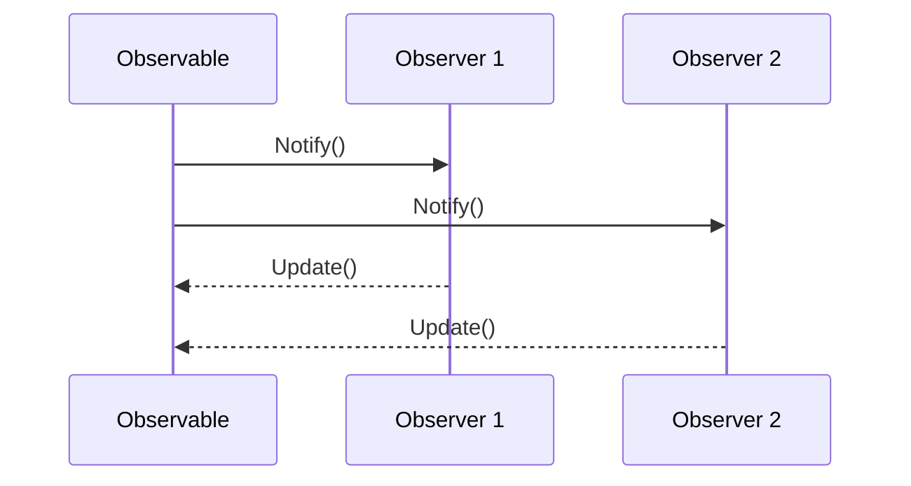

## 5.8.5 Use Cases and Examples

The Observer pattern is a cornerstone of software design, particularly in scenarios that require a one-to-many relationship between objects. This pattern is instrumental in ensuring that when one object changes state, all its dependents are notified and updated automatically. In this section, we will delve into various real-world applications of the Observer pattern, focusing on data binding in MVC architectures and real-time data updates in applications. We will provide comprehensive examples and code snippets to illustrate these concepts.

### Real-World Applications of the Observer Pattern

The Observer pattern is widely used in software development for its ability to promote loose coupling and enhance the scalability of applications. Here are some common scenarios where the Observer pattern is effectively utilized:

1. **Graphical User Interfaces (GUIs):** In GUI applications, the Observer pattern is used to synchronize the state of UI components with the underlying data model. For instance, when a user updates a form field, the change is propagated to other components that depend on that data.

2. **Event Management Systems:** The Observer pattern is ideal for implementing event-driven systems where multiple listeners need to respond to events, such as user actions or system notifications.

3. **Real-Time Data Feeds:** Applications that require real-time data updates, such as stock market tickers or live sports scores, benefit from the Observer pattern to ensure that all subscribers receive the latest information.

4. **Model-View-Controller (MVC) Architectures:** In MVC, the Observer pattern is often used to keep the view updated with changes in the model, facilitating seamless data binding and synchronization.

### Data Binding in MVC Architectures

In the Model-View-Controller (MVC) architecture, the Observer pattern plays a crucial role in maintaining synchronization between the model and the view. Let's explore how data binding works in MVC using observers.

#### How Data Binding Works

Data binding in MVC involves establishing a connection between the model (which holds the data) and the view (which displays the data). When the model changes, the view is automatically updated to reflect these changes. This is achieved through the Observer pattern, where the view acts as an observer of the model.

**Example: Implementing Data Binding in Java**

Let's consider a simple example of a temperature monitoring application. The model holds the temperature data, and the view displays it. We'll use the Observer pattern to ensure that any change in the temperature is immediately reflected in the view.

```java
import java.util.Observable;
import java.util.Observer;

// The Model class
class TemperatureModel extends Observable {
    private float temperature;

    public float getTemperature() {
        return temperature;
    }

    public void setTemperature(float temperature) {
        this.temperature = temperature;
        setChanged();
        notifyObservers();
    }
}

// The View class
class TemperatureView implements Observer {
    @Override
    public void update(Observable o, Object arg) {
        if (o instanceof TemperatureModel) {
            TemperatureModel model = (TemperatureModel) o;
            System.out.println("Temperature updated: " + model.getTemperature() + "°C");
        }
    }
}

// Main application
public class TemperatureApp {
    public static void main(String[] args) {
        TemperatureModel model = new TemperatureModel();
        TemperatureView view = new TemperatureView();

        // Register the view as an observer
        model.addObserver(view);

        // Update the temperature
        model.setTemperature(25.0f);
        model.setTemperature(30.0f);
    }
}
```

**Explanation:**

- **TemperatureModel:** This class extends `Observable` and represents the model in MVC. It holds the temperature data and notifies observers whenever the temperature changes.
- **TemperatureView:** This class implements `Observer` and represents the view. It updates the display whenever it receives a notification from the model.
- **TemperatureApp:** This is the main application class that creates instances of the model and view, registers the view as an observer, and updates the temperature.

### Real-Time Data Updates in Applications

Real-time data updates are essential in applications that require instantaneous feedback, such as financial trading platforms, social media feeds, and live sports updates. The Observer pattern is perfectly suited for these scenarios, as it allows multiple components to be notified of changes in real-time.

#### Case Study: Stock Market Ticker

Let's consider a stock market ticker application that displays real-time stock prices. The application consists of a data source that provides stock prices and multiple display components that show the prices to users. We'll use the Observer pattern to ensure that all display components are updated whenever the stock prices change.

**Example: Implementing a Stock Market Ticker in Java**

```java
import java.util.Observable;
import java.util.Observer;
import java.util.HashMap;
import java.util.Map;

// The StockData class
class StockData extends Observable {
    private Map<String, Double> stockPrices = new HashMap<>();

    public void setStockPrice(String stock, double price) {
        stockPrices.put(stock, price);
        setChanged();
        notifyObservers(stock);
    }

    public double getStockPrice(String stock) {
        return stockPrices.getOrDefault(stock, 0.0);
    }
}

// The StockDisplay class
class StockDisplay implements Observer {
    private String stock;

    public StockDisplay(String stock) {
        this.stock = stock;
    }

    @Override
    public void update(Observable o, Object arg) {
        if (o instanceof StockData) {
            StockData stockData = (StockData) o;
            System.out.println("Updated price for " + stock + ": " + stockData.getStockPrice(stock));
        }
    }
}

// Main application
public class StockTickerApp {
    public static void main(String[] args) {
        StockData stockData = new StockData();

        StockDisplay googleDisplay = new StockDisplay("GOOGL");
        StockDisplay appleDisplay = new StockDisplay("AAPL");

        // Register displays as observers
        stockData.addObserver(googleDisplay);
        stockData.addObserver(appleDisplay);

        // Update stock prices
        stockData.setStockPrice("GOOGL", 2800.50);
        stockData.setStockPrice("AAPL", 150.25);
    }
}
```

**Explanation:**

- **StockData:** This class extends `Observable` and represents the data source for stock prices. It maintains a map of stock prices and notifies observers whenever a stock price changes.
- **StockDisplay:** This class implements `Observer` and represents a display component. It updates the displayed price whenever it receives a notification from the data source.
- **StockTickerApp:** This is the main application class that creates instances of the data source and display components, registers the displays as observers, and updates the stock prices.

### Try It Yourself

To deepen your understanding of the Observer pattern, try modifying the examples above:

- **Temperature Monitoring:** Add a second view that displays the temperature in Fahrenheit. Ensure that both views are updated when the temperature changes.
- **Stock Market Ticker:** Implement a feature that allows users to subscribe to or unsubscribe from specific stocks. Ensure that only subscribed displays are updated when a stock price changes.

### Visualizing the Observer Pattern

To better understand the flow of notifications in the Observer pattern, let's visualize the interactions between the observable and its observers.



**Diagram Explanation:**

- The `Observable` notifies all registered observers when a change occurs.
- Each `Observer` receives the notification and updates itself accordingly.

### References and Links

For further reading on the Observer pattern and its applications, consider the following resources:

- [Java Observer and Observable (deprecated)](https://docs.oracle.com/javase/8/docs/api/java/util/Observer.html)
- [Observer Pattern on Wikipedia](https://en.wikipedia.org/wiki/Observer_pattern)
- [Design Patterns: Elements of Reusable Object-Oriented Software](https://www.amazon.com/Design-Patterns-Elements-Reusable-Object-Oriented/dp/0201633612) by Erich Gamma et al.

### Knowledge Check

To reinforce your understanding of the Observer pattern, consider the following questions:

- What are the key components of the Observer pattern?
- How does the Observer pattern promote loose coupling in software design?
- In what scenarios is the Observer pattern particularly useful?

### Embrace the Journey

Remember, mastering design patterns is a journey. As you continue to explore and apply the Observer pattern in your projects, you'll gain deeper insights into its benefits and nuances. Keep experimenting, stay curious, and enjoy the process of becoming a more proficient software engineer!

## Quiz Time!



### What is the primary purpose of the Observer pattern?

- [x] To define a one-to-many dependency between objects so that when one object changes state, all its dependents are notified.
- [ ] To encapsulate a request as an object, thereby allowing for parameterization.
- [ ] To provide a simplified interface to a complex subsystem.
- [ ] To allow an object to alter its behavior when its internal state changes.

> **Explanation:** The Observer pattern is designed to define a one-to-many dependency between objects, ensuring that when one object changes state, all its dependents are notified and updated automatically.

### In the Observer pattern, which component is responsible for notifying observers of changes?

- [x] Observable
- [ ] Observer
- [ ] Subject
- [ ] Listener

> **Explanation:** The `Observable` component is responsible for notifying all registered observers when a change occurs.

### How does the Observer pattern promote loose coupling?

- [x] By allowing objects to interact without knowing each other's concrete classes.
- [ ] By encapsulating algorithms in separate classes.
- [ ] By providing a unified interface to a set of interfaces in a subsystem.
- [ ] By defining a family of algorithms and making them interchangeable.

> **Explanation:** The Observer pattern promotes loose coupling by allowing objects to interact without knowing each other's concrete classes, thus reducing dependencies.

### Which of the following is a common use case for the Observer pattern?

- [x] Real-time data updates in applications
- [ ] Managing access to a resource
- [ ] Creating a complex object step by step
- [ ] Separating an abstraction from its implementation

> **Explanation:** Real-time data updates in applications are a common use case for the Observer pattern, as it allows multiple components to be notified of changes in real-time.

### What is the role of the `Observer` in the Observer pattern?

- [x] To receive updates from the `Observable` and react accordingly.
- [ ] To manage the lifecycle of objects.
- [ ] To encapsulate a request as an object.
- [ ] To provide a simplified interface to a complex subsystem.

> **Explanation:** The `Observer` is responsible for receiving updates from the `Observable` and reacting accordingly, such as updating the display or processing data.

### In the provided temperature monitoring example, what triggers the notification to observers?

- [x] Calling `setChanged()` and `notifyObservers()` in the `TemperatureModel`.
- [ ] Directly calling the `update()` method on the `Observer`.
- [ ] Modifying the `temperature` variable.
- [ ] Registering a new observer.

> **Explanation:** The notification to observers is triggered by calling `setChanged()` and `notifyObservers()` in the `TemperatureModel`, which indicates that the state has changed and observers should be notified.

### What is a potential drawback of using the Observer pattern?

- [x] It can lead to memory leaks if observers are not properly managed.
- [ ] It tightly couples the observable and observer classes.
- [ ] It requires a complex interface for communication.
- [ ] It limits the number of observers that can be registered.

> **Explanation:** A potential drawback of using the Observer pattern is that it can lead to memory leaks if observers are not properly managed, as they may continue to receive notifications even after they are no longer needed.

### How can the Observer pattern be used in an MVC architecture?

- [x] By keeping the view updated with changes in the model.
- [ ] By managing the lifecycle of controllers.
- [ ] By encapsulating user input as commands.
- [ ] By providing a simplified interface to the model.

> **Explanation:** In an MVC architecture, the Observer pattern is used to keep the view updated with changes in the model, ensuring that the user interface reflects the current state of the data.

### Which Java classes are traditionally used to implement the Observer pattern?

- [x] `Observable` and `Observer`
- [ ] `Subject` and `Listener`
- [ ] `Publisher` and `Subscriber`
- [ ] `Notifier` and `Receiver`

> **Explanation:** The `Observable` and `Observer` classes are traditionally used to implement the Observer pattern in Java, although they have been deprecated in favor of more modern approaches.

### True or False: The Observer pattern is only suitable for GUI applications.

- [x] False
- [ ] True

> **Explanation:** False. The Observer pattern is suitable for a wide range of applications beyond GUI, including event management systems, real-time data feeds, and more.




