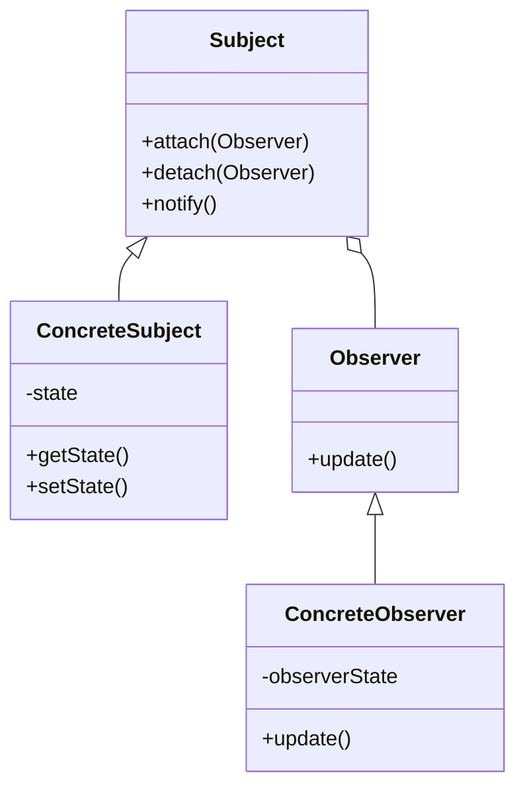
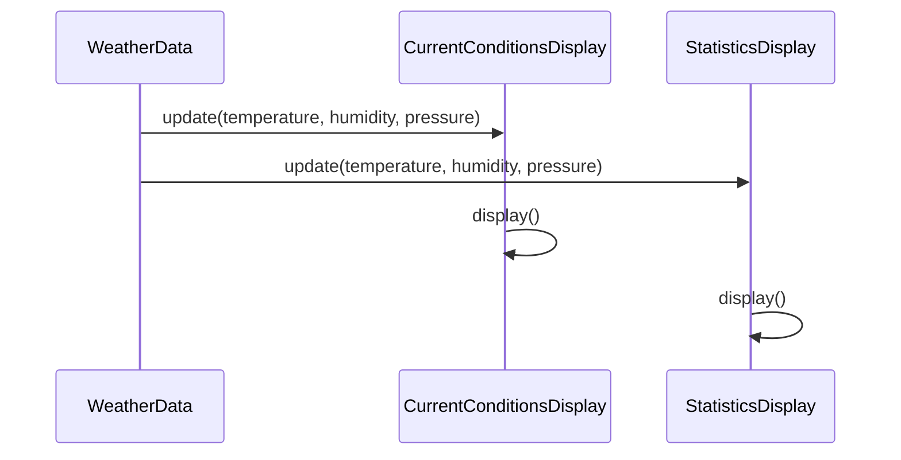

## 5.8 Observer Pattern

The Observer Pattern is a cornerstone of software design, particularly in systems where maintaining consistency across multiple objects is crucial. It defines a one-to-many dependency between objects, ensuring that when one object changes state, all its dependents are notified and updated automatically. This pattern is widely used in event-driven systems, GUI frameworks, and real-time data processing applications.

### Understanding the Observer Pattern

#### Intent of the Observer Pattern

The primary intent of the Observer Pattern is to establish a relationship between objects such that a change in one object (the Subject) triggers an automatic update in all dependent objects (Observers). This pattern promotes loose coupling between the Subject and Observers, allowing them to interact without needing to know each other's details.

#### Problem Solved by the Observer Pattern

In complex systems, maintaining consistency between related objects can be challenging. For example, consider a stock market application where multiple displays show the current price of a stock. If the stock price changes, all displays must be updated to reflect the new price. Without a systematic approach, this could lead to inconsistent states, with some displays showing outdated information. The Observer Pattern solves this problem by ensuring that all dependent objects are notified and updated whenever the Subject changes state.

### Key Roles in the Observer Pattern

#### Subject

The Subject is the core component that maintains a list of its dependents, known as Observers. It provides methods to attach, detach, and notify Observers. The Subject is responsible for notifying Observers of any state changes.

#### Observer

Observers are entities that need to be informed about changes in the Subject. They define an interface for updating themselves in response to notifications from the Subject. Each Observer registers itself with the Subject to receive updates.

### UML Diagram of the Observer Pattern

Below is a UML diagram illustrating the structure of the Observer Pattern:



**Diagram Description**: This UML diagram depicts the relationship between the Subject, ConcreteSubject, Observer, and ConcreteObserver. The Subject maintains a list of Observers and notifies them of state changes. ConcreteSubject extends Subject and manages its state. ConcreteObserver implements the Observer interface and updates its state in response to notifications.

### Implementing the Observer Pattern in Java

Let's delve into a practical implementation of the Observer Pattern in Java. We'll create a simple weather monitoring system where weather stations (Subjects) notify displays (Observers) of temperature changes.

#### Step 1: Define the Observer Interface

```java
// Observer interface
public interface Observer {
    void update(float temperature, float humidity, float pressure);
}
```

**Explanation**: The `Observer` interface declares the `update` method, which Observers must implement to receive updates from the Subject.

#### Step 2: Create the Subject Interface

```java
// Subject interface
public interface Subject {
    void registerObserver(Observer o);
    void removeObserver(Observer o);
    void notifyObservers();
}
```

**Explanation**: The `Subject` interface defines methods for registering, removing, and notifying Observers. This ensures that the Subject can manage its list of Observers effectively.

#### Step 3: Implement the ConcreteSubject

```java
import java.util.ArrayList;
import java.util.List;

// ConcreteSubject class
public class WeatherData implements Subject {
    private List<Observer> observers;
    private float temperature;
    private float humidity;
    private float pressure;

    public WeatherData() {
        observers = new ArrayList<>();
    }

    @Override
    public void registerObserver(Observer o) {
        observers.add(o);
    }

    @Override
    public void removeObserver(Observer o) {
        observers.remove(o);
    }

    @Override
    public void notifyObservers() {
        for (Observer observer : observers) {
            observer.update(temperature, humidity, pressure);
        }
    }

    public void setMeasurements(float temperature, float humidity, float pressure) {
        this.temperature = temperature;
        this.humidity = humidity;
        this.pressure = pressure;
        notifyObservers();
    }
}
```

**Explanation**: The `WeatherData` class implements the `Subject` interface. It maintains a list of Observers and notifies them whenever the weather measurements change.

#### Step 4: Implement the ConcreteObserver

```java
// ConcreteObserver class
public class CurrentConditionsDisplay implements Observer {
    private float temperature;
    private float humidity;

    @Override
    public void update(float temperature, float humidity, float pressure) {
        this.temperature = temperature;
        this.humidity = humidity;
        display();
    }

    public void display() {
        System.out.println("Current conditions: " + temperature + "F degrees and " + humidity + "% humidity");
    }
}
```

**Explanation**: The `CurrentConditionsDisplay` class implements the `Observer` interface. It updates its state and displays the current weather conditions when notified by the `WeatherData` subject.

#### Step 5: Test the Observer Pattern

```java
public class WeatherStation {
    public static void main(String[] args) {
        WeatherData weatherData = new WeatherData();
        CurrentConditionsDisplay currentDisplay = new CurrentConditionsDisplay();

        weatherData.registerObserver(currentDisplay);
        weatherData.setMeasurements(80, 65, 30.4f);
        weatherData.setMeasurements(82, 70, 29.2f);
    }
}
```

**Explanation**: The `WeatherStation` class demonstrates the Observer Pattern in action. It creates a `WeatherData` subject and a `CurrentConditionsDisplay` observer, registers the observer, and updates the weather measurements.

### Advantages of the Observer Pattern

- **Loose Coupling**: The Observer Pattern promotes loose coupling between the Subject and Observers. The Subject only knows that it has a list of Observers, and each Observer implements a specific interface. This allows for flexibility and scalability in the system.
- **Dynamic Relationships**: Observers can be added or removed at runtime, allowing for dynamic changes in the system's behavior.
- **Broadcast Communication**: The Subject can broadcast updates to all registered Observers, ensuring consistent state across multiple objects.

### Potential Issues with the Observer Pattern

- **Memory Leaks**: If Observers are not properly removed from the Subject's list, they may continue to receive updates even after they are no longer needed, leading to memory leaks.
- **Performance Overhead**: Notifying a large number of Observers can introduce performance overhead, especially if the update process is complex.
- **Order of Notifications**: The order in which Observers are notified is not guaranteed, which may lead to unexpected behavior if Observers depend on a specific order of updates.

### Try It Yourself

To deepen your understanding of the Observer Pattern, try modifying the code examples provided:

- **Add More Observers**: Implement additional observer classes, such as `StatisticsDisplay` or `ForecastDisplay`, and register them with the `WeatherData` subject.
- **Experiment with Different Data**: Change the weather measurements and observe how the displays update.
- **Implement Unregistering**: Add functionality to unregister observers and test how it affects the notification process.

### Visualizing the Observer Pattern in Action

To further illustrate the Observer Pattern, let's visualize the interaction between the Subject and Observers using a sequence diagram:



**Diagram Description**: This sequence diagram shows the flow of notifications from the `WeatherData` subject to the `CurrentConditionsDisplay` and `StatisticsDisplay` observers. Each observer updates its state and displays the information upon receiving the update.

### References and Further Reading

- [Design Patterns: Elements of Reusable Object-Oriented Software](https://en.wikipedia.org/wiki/Design_Patterns) by Erich Gamma, Richard Helm, Ralph Johnson, and John Vlissides
- [Observer Pattern on Wikipedia](https://en.wikipedia.org/wiki/Observer_pattern)
- [Java Observer and Observable Classes](https://docs.oracle.com/javase/8/docs/api/java/util/Observable.html) (Note: Deprecated in Java 9)

### Knowledge Check

Before we conclude, let's reinforce what we've learned with a few questions:

- What is the primary intent of the Observer Pattern?
- How does the Observer Pattern promote loose coupling?
- What are some potential issues with the Observer Pattern?
- How can memory leaks occur in the Observer Pattern?

### Embrace the Journey

Remember, mastering design patterns like the Observer Pattern is a journey. As you continue to explore and implement these patterns, you'll gain deeper insights into building robust, scalable, and maintainable software systems. Keep experimenting, stay curious, and enjoy the journey!

## Quiz Time!



### What is the primary intent of the Observer Pattern?

- [x] To define a one-to-many dependency between objects so that when one object changes state, all its dependents are notified and updated automatically.
- [ ] To encapsulate a request as an object, thereby allowing for parameterization of clients with queues, requests, and operations.
- [ ] To provide a way to access the elements of an aggregate object sequentially without exposing its underlying representation.
- [ ] To define a family of algorithms, encapsulate each one, and make them interchangeable.

> **Explanation:** The Observer Pattern's primary intent is to establish a one-to-many dependency between objects, ensuring that when one object changes state, all its dependents are notified and updated automatically.

### What role does the Subject play in the Observer Pattern?

- [x] It maintains a list of its dependents, known as Observers, and notifies them of any state changes.
- [ ] It defines an interface for creating an object, but lets subclasses alter the type of objects that will be created.
- [ ] It provides a simplified interface to a complex subsystem.
- [ ] It encapsulates a request as an object, allowing for parameterization of clients with queues, requests, and operations.

> **Explanation:** The Subject in the Observer Pattern maintains a list of its dependents, known as Observers, and is responsible for notifying them of any state changes.

### Which of the following is a potential issue with the Observer Pattern?

- [x] Memory leaks due to Observers not being properly removed.
- [ ] Difficulty in creating a single instance of a class.
- [ ] Complexity in managing multiple product families.
- [ ] Inability to support multiple platforms or devices.

> **Explanation:** A potential issue with the Observer Pattern is memory leaks, which can occur if Observers are not properly removed from the Subject's list, leading to unnecessary updates and resource usage.

### How does the Observer Pattern promote loose coupling?

- [x] By allowing the Subject to interact with Observers through a common interface without knowing their concrete implementations.
- [ ] By ensuring that a class has only one reason to change.
- [ ] By defining a family of algorithms and making them interchangeable.
- [ ] By providing a way to access elements of an aggregate object sequentially.

> **Explanation:** The Observer Pattern promotes loose coupling by allowing the Subject to interact with Observers through a common interface, without needing to know their concrete implementations.

### What is the role of the Observer in the Observer Pattern?

- [x] To define an interface for objects that should be notified of changes in a Subject.
- [ ] To encapsulate a request as an object, allowing for parameterization of clients with queues, requests, and operations.
- [ ] To provide a way to access elements of an aggregate object sequentially.
- [ ] To define a family of algorithms, encapsulate each one, and make them interchangeable.

> **Explanation:** The Observer's role is to define an interface for objects that should be notified of changes in a Subject, allowing them to update their state accordingly.

### True or False: The order in which Observers are notified is guaranteed in the Observer Pattern.

- [ ] True
- [x] False

> **Explanation:** The order in which Observers are notified is not guaranteed in the Observer Pattern, which may lead to unexpected behavior if Observers depend on a specific order of updates.

### Which method in the Subject interface is responsible for notifying all registered Observers?

- [x] notifyObservers()
- [ ] registerObserver()
- [ ] removeObserver()
- [ ] update()

> **Explanation:** The `notifyObservers()` method in the Subject interface is responsible for notifying all registered Observers of any state changes.

### What is a common use case for the Observer Pattern?

- [x] Event-driven systems and GUI frameworks.
- [ ] Managing access to a complex subsystem.
- [ ] Creating a single instance of a class.
- [ ] Separating the construction of a complex object from its representation.

> **Explanation:** A common use case for the Observer Pattern is in event-driven systems and GUI frameworks, where changes in one component need to be reflected in others.

### How can memory leaks be prevented in the Observer Pattern?

- [x] By ensuring Observers are properly removed from the Subject's list when no longer needed.
- [ ] By encapsulating a request as an object.
- [ ] By defining a family of algorithms and making them interchangeable.
- [ ] By providing a way to access elements of an aggregate object sequentially.

> **Explanation:** Memory leaks can be prevented in the Observer Pattern by ensuring that Observers are properly removed from the Subject's list when they are no longer needed.

### True or False: The Observer Pattern can introduce performance overhead when notifying a large number of Observers.

- [x] True
- [ ] False

> **Explanation:** True. The Observer Pattern can introduce performance overhead when notifying a large number of Observers, especially if the update process is complex.


