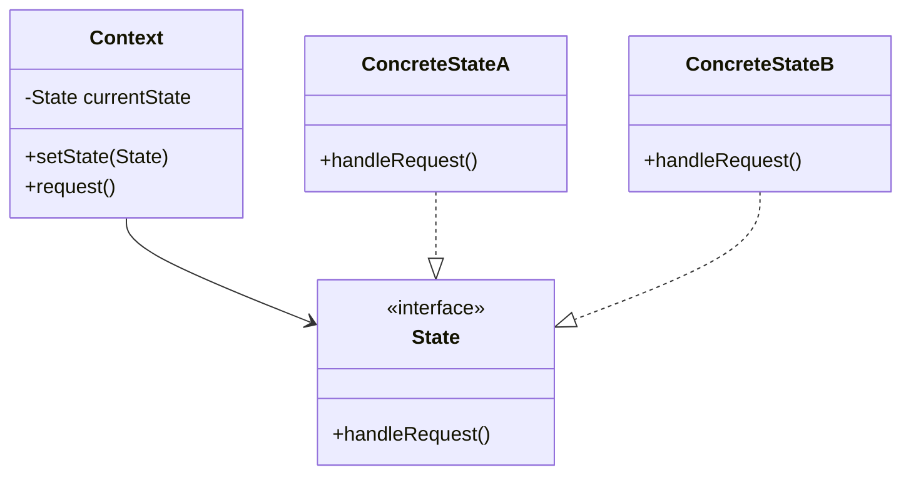

## 5.9.1 Implementing State in Java

In this section, we delve into the State pattern, a behavioral design pattern that allows an object to alter its behavior when its internal state changes. This pattern is particularly useful in scenarios where an object must change its behavior based on its state, without resorting to complex conditional logic. By encapsulating state-specific behavior within separate classes, the State pattern promotes cleaner, more maintainable code.

### Understanding the State Pattern

The State pattern is a design pattern that allows an object to change its behavior when its internal state changes. It is often used to simplify complex conditional logic by encapsulating state-specific behavior within separate state classes. This pattern is particularly useful when an object has multiple states, each with its own behavior, and the object needs to switch between these states dynamically.

#### Key Components of the State Pattern

1. **Context**: The object whose behavior changes with its state. It maintains a reference to an instance of a `State` subclass that defines the current state.
2. **State Interface**: An interface or abstract class that defines the behavior associated with a particular state.
3. **Concrete State Classes**: Classes that implement the `State` interface, encapsulating the behavior associated with a specific state.

### Implementing the State Pattern in Java

To implement the State pattern in Java, follow these steps:

1. **Define the State Interface**: Create an interface that declares the methods that all concrete state classes must implement.

2. **Create Concrete State Classes**: Implement the state interface in concrete classes, each representing a specific state and its behavior.

3. **Implement the Context Class**: Create a class that maintains an instance of a concrete state class and delegates state-specific behavior to the current state object.

4. **Manage State Transitions**: Implement logic in the context class to switch between different state objects as needed.

Let's explore each step in detail with code examples.

#### Step 1: Define the State Interface

The state interface defines the methods that all concrete state classes must implement. This interface represents the common behavior that all states share.

```java
// State.java
public interface State {
    void handleRequest();
}
```

#### Step 2: Create Concrete State Classes

Concrete state classes implement the state interface and encapsulate the behavior associated with a specific state. Each state class provides its own implementation of the methods defined in the state interface.

```java
// ConcreteStateA.java
public class ConcreteStateA implements State {
    @Override
    public void handleRequest() {
        System.out.println("Handling request in State A.");
    }
}

// ConcreteStateB.java
public class ConcreteStateB implements State {
    @Override
    public void handleRequest() {
        System.out.println("Handling request in State B.");
    }
}
```

#### Step 3: Implement the Context Class

The context class maintains a reference to an instance of a concrete state class and delegates state-specific behavior to the current state object. It also provides methods to change the current state.

```java
// Context.java
public class Context {
    private State currentState;

    public Context(State initialState) {
        this.currentState = initialState;
    }

    public void setState(State state) {
        this.currentState = state;
    }

    public void request() {
        currentState.handleRequest();
    }
}
```

#### Step 4: Manage State Transitions

The context class includes methods to change the current state. This allows the object to transition between different states dynamically.

```java
// Main.java
public class Main {
    public static void main(String[] args) {
        // Create initial state
        State initialState = new ConcreteStateA();
        
        // Create context with initial state
        Context context = new Context(initialState);
        
        // Handle request with initial state
        context.request();
        
        // Transition to a new state
        context.setState(new ConcreteStateB());
        
        // Handle request with new state
        context.request();
    }
}
```

### Best Practices for Managing State Transitions

1. **Encapsulate State Logic**: Keep state-specific logic within the concrete state classes. This ensures that the context class remains clean and focused on managing state transitions.

2. **Use Polymorphism**: Leverage polymorphism to delegate behavior to the current state object. This eliminates the need for complex conditional logic in the context class.

3. **Ensure State Consistency**: Implement checks to ensure that state transitions are valid and consistent. This prevents the context object from entering an invalid state.

4. **Minimize Dependencies**: Keep dependencies between state classes to a minimum. This promotes modularity and makes the system easier to maintain.

5. **Consider Thread Safety**: If the context object is accessed by multiple threads, ensure that state transitions are thread-safe. This may involve using synchronization or other concurrency mechanisms.

### Visualizing the State Pattern

To better understand the State pattern, let's visualize the relationships between the context, state interface, and concrete state classes using a class diagram.



**Diagram Description**: The class diagram illustrates the relationships between the `Context`, `State`, `ConcreteStateA`, and `ConcreteStateB` classes. The `Context` class maintains a reference to a `State` object and delegates behavior to the current state. The `ConcreteStateA` and `ConcreteStateB` classes implement the `State` interface, providing state-specific behavior.

### Try It Yourself

To gain a deeper understanding of the State pattern, try modifying the code examples provided. Here are a few suggestions:

- **Add a New State**: Create a new concrete state class and update the context to transition to this new state.
- **Implement Additional Methods**: Add more methods to the state interface and implement them in the concrete state classes.
- **Introduce State-Specific Data**: Add state-specific data to the concrete state classes and demonstrate how it affects behavior.

### Knowledge Check

To reinforce your understanding of the State pattern, consider the following questions:

- What are the key components of the State pattern?
- How does the State pattern promote cleaner code and reduce complexity?
- What are some best practices for managing state transitions in a multi-threaded environment?

### Embrace the Journey

Remember, mastering design patterns is a journey. As you continue to explore and implement patterns like the State pattern, you'll gain valuable insights into writing more maintainable and flexible code. Keep experimenting, stay curious, and enjoy the journey!

## Quiz Time!



### What is the primary purpose of the State pattern?

- [x] To allow an object to change its behavior when its internal state changes.
- [ ] To encapsulate algorithms in separate classes.
- [ ] To provide a simplified interface to a complex subsystem.
- [ ] To manage object creation mechanisms.

> **Explanation:** The State pattern allows an object to alter its behavior when its internal state changes, making it useful for managing state-specific behavior.

### Which component of the State pattern maintains a reference to the current state?

- [x] Context
- [ ] State Interface
- [ ] Concrete State Class
- [ ] Client

> **Explanation:** The Context class maintains a reference to the current state and delegates state-specific behavior to the state object.

### What is a key benefit of using the State pattern?

- [x] It reduces complex conditional logic by encapsulating state-specific behavior.
- [ ] It simplifies object creation by providing a common interface.
- [ ] It allows for the dynamic addition of new functionality.
- [ ] It provides a way to access elements of a collection sequentially.

> **Explanation:** The State pattern reduces complex conditional logic by encapsulating state-specific behavior within separate classes.

### How does the State pattern promote cleaner code?

- [x] By encapsulating state-specific behavior in separate classes.
- [ ] By using inheritance to share behavior across states.
- [ ] By providing a single entry point for request handling.
- [ ] By allowing multiple objects to share the same state.

> **Explanation:** The State pattern promotes cleaner code by encapsulating state-specific behavior in separate classes, reducing the need for complex conditional logic.

### What is a best practice for managing state transitions?

- [x] Use polymorphism to delegate behavior to the current state object.
- [ ] Implement state transitions using complex conditional logic.
- [ ] Share state-specific data across all state classes.
- [ ] Avoid encapsulating state-specific logic within state classes.

> **Explanation:** Using polymorphism to delegate behavior to the current state object is a best practice for managing state transitions.

### In a multi-threaded environment, what should be considered when implementing the State pattern?

- [x] Ensure that state transitions are thread-safe.
- [ ] Use inheritance to share state-specific behavior.
- [ ] Avoid encapsulating state-specific logic within state classes.
- [ ] Implement state transitions using complex conditional logic.

> **Explanation:** In a multi-threaded environment, it is important to ensure that state transitions are thread-safe to prevent race conditions.

### What is the role of the State interface in the State pattern?

- [x] To define the behavior associated with a particular state.
- [ ] To maintain a reference to the current state.
- [ ] To encapsulate state-specific data.
- [ ] To provide a simplified interface to a complex subsystem.

> **Explanation:** The State interface defines the behavior associated with a particular state, which is implemented by concrete state classes.

### How can you add a new state to an existing State pattern implementation?

- [x] Create a new concrete state class that implements the State interface.
- [ ] Modify the Context class to include the new state logic.
- [ ] Add new methods to the existing state classes.
- [ ] Change the State interface to accommodate the new state.

> **Explanation:** To add a new state, create a new concrete state class that implements the State interface, and update the Context class to transition to the new state.

### What is the relationship between the Context and State classes in the State pattern?

- [x] The Context class maintains a reference to a State object and delegates behavior to it.
- [ ] The State class maintains a reference to the Context object.
- [ ] The Context class inherits from the State class.
- [ ] The State class encapsulates the Context object.

> **Explanation:** The Context class maintains a reference to a State object and delegates behavior to it, allowing the object's behavior to change with its state.

### True or False: The State pattern is useful for managing complex conditional logic.

- [x] True
- [ ] False

> **Explanation:** True. The State pattern is useful for managing complex conditional logic by encapsulating state-specific behavior within separate classes.




