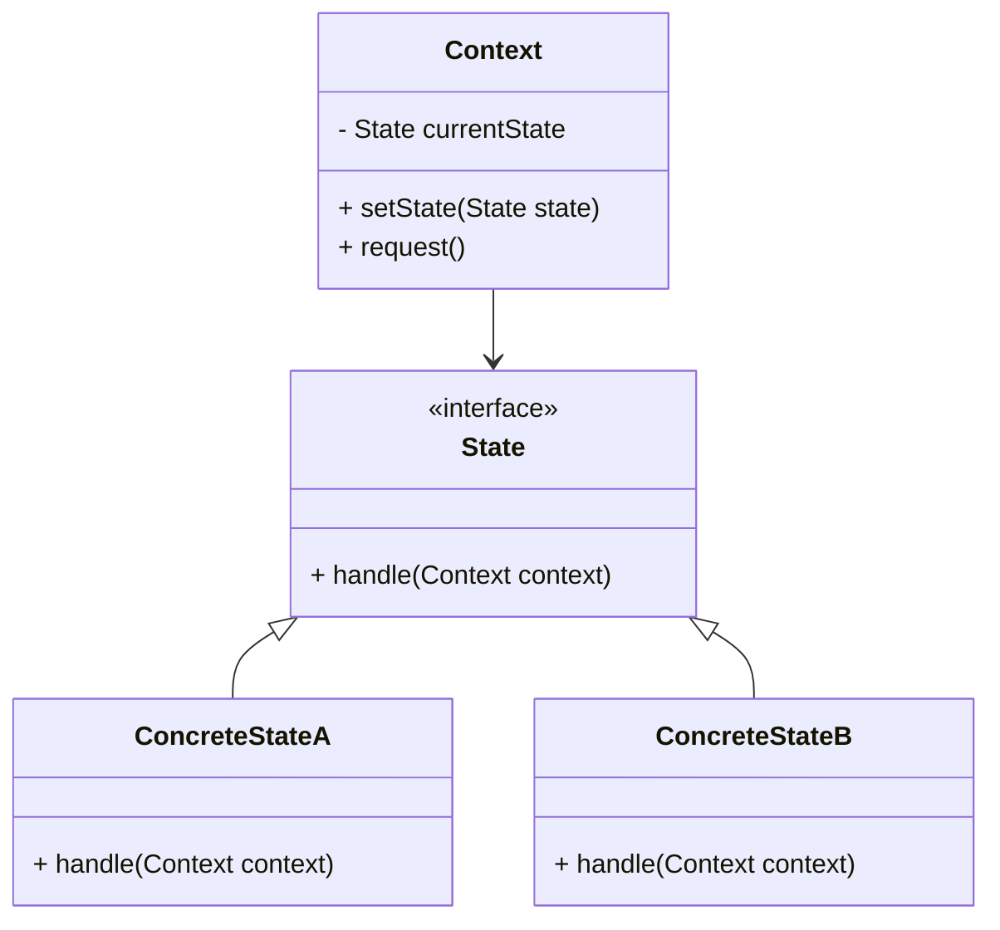
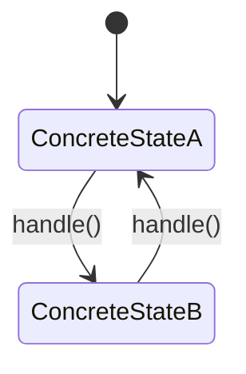

## 5.9.2 Context and State Classes

In the realm of software design, the State Pattern is a powerful tool that allows an object to change its behavior when its internal state changes. This pattern is particularly useful in scenarios where an object must exhibit different behaviors in different states, such as a vending machine, a traffic light system, or a media player. In this section, we will delve into the intricacies of the Context and State classes, which are the core components of the State Pattern.

### Understanding the Context Class

The Context class is a central component in the State Pattern. It maintains a reference to an instance of a State subclass that defines the current state of the Context. The primary responsibility of the Context class is to delegate state-specific behavior to the current State object. This delegation allows the Context to change its behavior dynamically as its state changes.

#### Responsibilities of the Context Class

1. **State Management**: The Context class is responsible for maintaining the current state of the object. It holds a reference to a State object that represents the current state.

2. **State Transition**: The Context class is responsible for managing state transitions. It decides when to transition from one state to another based on certain conditions or events.

3. **Delegation of Behavior**: The Context class delegates state-specific behavior to the current State object. This delegation allows the Context to change its behavior dynamically without modifying its code.

4. **Interaction with Clients**: The Context class provides an interface for clients to interact with. Clients interact with the Context without needing to know about the underlying states.

#### Code Example: Context Class

```java
public class Context {
    private State currentState;

    public Context(State initialState) {
        this.currentState = initialState;
    }

    public void setState(State state) {
        this.currentState = state;
    }

    public void request() {
        currentState.handle(this);
    }
}
```

In the above code, the `Context` class maintains a reference to a `State` object and delegates the `handle` method to the current state. The `setState` method allows the state to be changed dynamically.

### Exploring State Classes

State classes encapsulate the behavior associated with a particular state of the Context. Each State class implements a common interface that defines the behavior that can be performed in that state. This encapsulation allows each state to have its own implementation of the behavior, making it easy to add new states or modify existing ones without affecting other parts of the system.

#### Responsibilities of State Classes

1. **Encapsulation of Behavior**: Each State class encapsulates the behavior associated with a particular state. This encapsulation allows each state to have its own implementation of the behavior.

2. **State Transition Logic**: State classes can contain logic to determine when a transition to another state should occur. This logic can be based on conditions or events.

3. **Interaction with Context**: State classes interact with the Context to perform state-specific behavior. They can also request the Context to change its state.

#### Code Example: State Interface and Concrete States

```java
public interface State {
    void handle(Context context);
}

public class ConcreteStateA implements State {
    @Override
    public void handle(Context context) {
        System.out.println("State A handling request.");
        context.setState(new ConcreteStateB());
    }
}

public class ConcreteStateB implements State {
    @Override
    public void handle(Context context) {
        System.out.println("State B handling request.");
        context.setState(new ConcreteStateA());
    }
}
```

In this example, `ConcreteStateA` and `ConcreteStateB` are implementations of the `State` interface. Each state handles the request differently and transitions to the other state after handling the request.

### Interaction Between Context and State Classes

The interaction between the Context and State classes is crucial for the State Pattern to work effectively. The Context class delegates the behavior to the current State object, and the State object can request the Context to change its state. This interaction allows the system to change its behavior dynamically based on the current state.

#### Diagram: Context and State Interaction



In the diagram above, the `Context` class maintains a reference to a `State` object. The `ConcreteStateA` and `ConcreteStateB` classes implement the `State` interface and define the behavior for each state.

### Handling State Transitions

State transitions are a critical aspect of the State Pattern. They allow the system to change its behavior dynamically based on the current state. State transitions can be triggered by events, conditions, or actions performed by the Context or State classes.

#### Code Example: State Transition

In the previous code example, each state transitions to the other state after handling the request. This transition is achieved by calling the `setState` method on the Context.

```java
public class Main {
    public static void main(String[] args) {
        Context context = new Context(new ConcreteStateA());
        context.request(); // State A handling request.
        context.request(); // State B handling request.
        context.request(); // State A handling request.
    }
}
```

In this example, the `Main` class creates a `Context` with an initial state of `ConcreteStateA`. Each call to `request` results in a state transition, demonstrating the dynamic behavior of the State Pattern.

### Try It Yourself

To better understand the State Pattern, try modifying the code examples to add a new state or change the transition logic. For example, you could add a `ConcreteStateC` that transitions to `ConcreteStateA` after handling a request.

### Visualizing State Transitions

Let's visualize the state transitions using a state diagram. This diagram will help you understand how the system transitions between different states.



In this state diagram, the system starts in `ConcreteStateA` and transitions to `ConcreteStateB` after handling a request. It then transitions back to `ConcreteStateA` after handling another request.

### Knowledge Check

Before we move on, let's reinforce what we've learned with a few questions:

- What is the primary responsibility of the Context class in the State Pattern?
- How do State classes encapsulate behavior for each state?
- How are state transitions handled in the State Pattern?

### Embrace the Journey

Remember, understanding the State Pattern is just the beginning. As you continue to explore design patterns, you'll discover new ways to make your code more flexible, maintainable, and scalable. Keep experimenting, stay curious, and enjoy the journey!

### Summary

In this section, we've explored the relationship between the Context and State classes in the State Pattern. We've discussed the responsibilities of each class, provided code examples, and visualized the interactions and state transitions. By understanding these concepts, you can effectively implement the State Pattern in your Java applications.

## Quiz Time!



### What is the primary responsibility of the Context class in the State Pattern?

- [x] To maintain the current state and delegate behavior to the State object.
- [ ] To define the behavior for each state.
- [ ] To handle state transitions independently.
- [ ] To interact directly with clients.

> **Explanation:** The Context class maintains the current state and delegates behavior to the State object, allowing dynamic behavior changes.

### How do State classes encapsulate behavior for each state?

- [x] By implementing a common interface and defining state-specific behavior.
- [ ] By directly modifying the Context class.
- [ ] By storing state data in the Context class.
- [ ] By using static methods.

> **Explanation:** State classes implement a common interface and define behavior specific to each state, allowing for easy modification and addition of states.

### What triggers state transitions in the State Pattern?

- [x] Events, conditions, or actions performed by the Context or State classes.
- [ ] Direct client requests.
- [ ] Changes in the Context class's attributes.
- [ ] External configuration files.

> **Explanation:** State transitions are typically triggered by events, conditions, or actions within the Context or State classes.

### In the State Pattern, how does the Context class interact with clients?

- [x] By providing an interface that delegates behavior to the current State object.
- [ ] By exposing all State objects to the client.
- [ ] By directly implementing all possible behaviors.
- [ ] By using reflection to determine the current state.

> **Explanation:** The Context provides an interface for clients and delegates behavior to the current State object, hiding the complexity of state management.

### Which of the following is NOT a responsibility of the State class?

- [ ] Encapsulating behavior for a specific state.
- [ ] Determining when to transition to another state.
- [x] Maintaining a reference to the current state.
- [ ] Interacting with the Context class.

> **Explanation:** The Context class maintains the reference to the current state, while State classes encapsulate behavior and handle transitions.

### How does the State Pattern improve code flexibility?

- [x] By allowing behavior changes without modifying the Context class.
- [ ] By using inheritance to define all possible states.
- [ ] By centralizing all behavior in the Context class.
- [ ] By using global variables for state management.

> **Explanation:** The State Pattern allows behavior changes by delegating to State objects, enabling flexibility without modifying the Context class.

### What is the role of the `handle` method in the State interface?

- [x] To define the behavior for the current state and manage transitions.
- [ ] To initialize the Context class.
- [ ] To store state data in the Context class.
- [ ] To provide a default implementation for all states.

> **Explanation:** The `handle` method defines behavior for the current state and can manage transitions to other states.

### How can you add a new state to a system using the State Pattern?

- [x] By creating a new State class that implements the State interface.
- [ ] By modifying the Context class to include new behavior.
- [ ] By adding new methods to the existing State classes.
- [ ] By using reflection to dynamically load new states.

> **Explanation:** Adding a new state involves creating a new State class that implements the State interface, allowing for easy expansion.

### What is a key benefit of using the State Pattern?

- [x] It allows objects to change behavior dynamically based on their state.
- [ ] It reduces the need for multiple Context classes.
- [ ] It eliminates the need for state management.
- [ ] It simplifies client interaction by exposing all states.

> **Explanation:** The State Pattern enables objects to change behavior dynamically, making it ideal for systems with varying states.

### True or False: The State Pattern requires modifying the Context class to change behavior.

- [ ] True
- [x] False

> **Explanation:** The State Pattern allows behavior changes by modifying State classes, not the Context class, promoting flexibility and maintainability.




