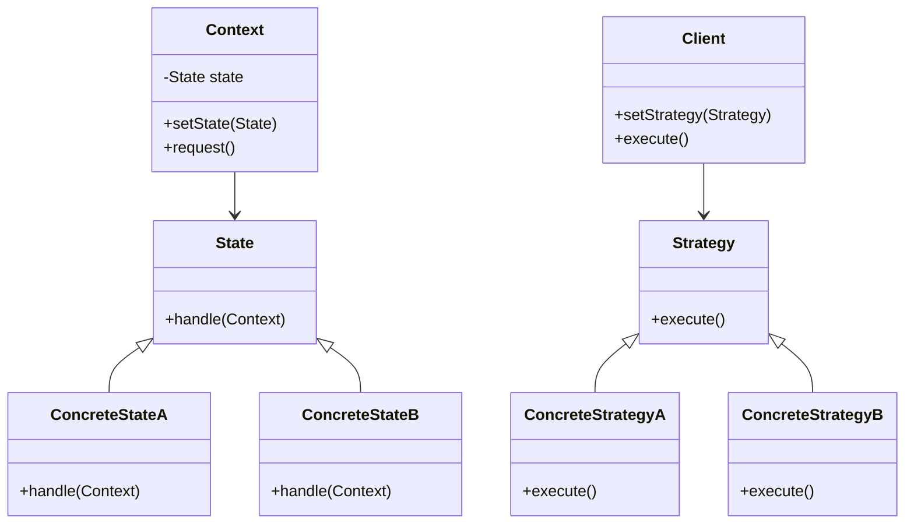

## 5.9.3 State vs. Strategy Pattern

In the realm of design patterns, the State and Strategy patterns often appear similar due to their structural resemblance. However, their intent and application differ significantly. Understanding these differences is crucial for software engineers when deciding which pattern to implement in a given context. This section delves into these two patterns, comparing their purposes, structures, and use cases, and providing guidance on selecting the appropriate pattern for your needs.

### Understanding the State Pattern

The State pattern is a behavioral design pattern that allows an object to change its behavior when its internal state changes. This pattern is particularly useful when an object must change its behavior at runtime depending on its state. The State pattern encapsulates state-specific behavior into separate classes, allowing the object to delegate behavior to the current state object.

#### Key Characteristics of the State Pattern

- **Encapsulation of State-Specific Behavior**: Each state is represented by a separate class, encapsulating the behavior associated with that state.
- **State Transitions**: The context object can change its state, leading to a change in behavior.
- **Simplified Context**: The context object delegates state-specific behavior to the current state object, reducing complexity.

#### Example of the State Pattern

Consider a simple example of a `TrafficLight` system. The traffic light can be in one of three states: Red, Green, or Yellow. Each state has specific behavior, such as how long the light stays on and what the next state will be.

```java
// State interface
interface TrafficLightState {
    void change(TrafficLightContext context);
}

// Concrete states
class RedLightState implements TrafficLightState {
    @Override
    public void change(TrafficLightContext context) {
        System.out.println("Changing from Red to Green.");
        context.setState(new GreenLightState());
    }
}

class GreenLightState implements TrafficLightState {
    @Override
    public void change(TrafficLightContext context) {
        System.out.println("Changing from Green to Yellow.");
        context.setState(new YellowLightState());
    }
}

class YellowLightState implements TrafficLightState {
    @Override
    public void change(TrafficLightContext context) {
        System.out.println("Changing from Yellow to Red.");
        context.setState(new RedLightState());
    }
}

// Context
class TrafficLightContext {
    private TrafficLightState state;

    public TrafficLightContext() {
        state = new RedLightState(); // Initial state
    }

    public void setState(TrafficLightState state) {
        this.state = state;
    }

    public void change() {
        state.change(this);
    }
}

// Usage
public class TrafficLightDemo {
    public static void main(String[] args) {
        TrafficLightContext context = new TrafficLightContext();
        context.change(); // Red to Green
        context.change(); // Green to Yellow
        context.change(); // Yellow to Red
    }
}
```

### Understanding the Strategy Pattern

The Strategy pattern is a behavioral design pattern that enables selecting an algorithm's behavior at runtime. It defines a family of algorithms, encapsulates each one, and makes them interchangeable. The Strategy pattern is particularly useful when you need to switch between different algorithms or behaviors at runtime.

#### Key Characteristics of the Strategy Pattern

- **Encapsulation of Algorithms**: Each algorithm is encapsulated in a separate class, allowing them to be interchangeable.
- **Strategy Selection**: The client can choose which strategy to use at runtime.
- **Simplified Client Code**: The client code is simplified by delegating algorithm-specific behavior to the strategy object.

#### Example of the Strategy Pattern

Consider a payment system where you can pay using different methods such as Credit Card, PayPal, or Bitcoin. Each payment method is a strategy that can be selected at runtime.

```java
// Strategy interface
interface PaymentStrategy {
    void pay(int amount);
}

// Concrete strategies
class CreditCardStrategy implements PaymentStrategy {
    private String cardNumber;

    public CreditCardStrategy(String cardNumber) {
        this.cardNumber = cardNumber;
    }

    @Override
    public void pay(int amount) {
        System.out.println("Paid " + amount + " using Credit Card.");
    }
}

class PayPalStrategy implements PaymentStrategy {
    private String email;

    public PayPalStrategy(String email) {
        this.email = email;
    }

    @Override
    public void pay(int amount) {
        System.out.println("Paid " + amount + " using PayPal.");
    }
}

class BitcoinStrategy implements PaymentStrategy {
    private String walletAddress;

    public BitcoinStrategy(String walletAddress) {
        this.walletAddress = walletAddress;
    }

    @Override
    public void pay(int amount) {
        System.out.println("Paid " + amount + " using Bitcoin.");
    }
}

// Context
class PaymentContext {
    private PaymentStrategy strategy;

    public void setStrategy(PaymentStrategy strategy) {
        this.strategy = strategy;
    }

    public void pay(int amount) {
        strategy.pay(amount);
    }
}

// Usage
public class PaymentDemo {
    public static void main(String[] args) {
        PaymentContext context = new PaymentContext();
        
        context.setStrategy(new CreditCardStrategy("1234-5678-9012-3456"));
        context.pay(100); // Pay using Credit Card
        
        context.setStrategy(new PayPalStrategy("user@example.com"));
        context.pay(200); // Pay using PayPal
        
        context.setStrategy(new BitcoinStrategy("1A2b3C4d5E6f7G8h9I0j"));
        context.pay(300); // Pay using Bitcoin
    }
}
```

### Comparing State and Strategy Patterns

While the State and Strategy patterns share structural similarities, their intent and application differ significantly. Let's explore these differences in detail.

#### Intent

- **State Pattern**: The primary intent of the State pattern is to allow an object to change its behavior when its internal state changes. It focuses on managing state transitions and encapsulating state-specific behavior.
- **Strategy Pattern**: The Strategy pattern's intent is to define a family of algorithms, encapsulate each one, and make them interchangeable. It focuses on selecting and executing an algorithm or behavior at runtime.

#### Structure

Both patterns involve encapsulating behavior in separate classes and delegating behavior to these classes. However, the context in which they are used differs:

- **State Pattern**: The context object manages state transitions and delegates behavior to the current state object. The state object can change the context's state, leading to a change in behavior.
- **Strategy Pattern**: The client selects a strategy at runtime, and the context object delegates behavior to the selected strategy. The strategy does not change the context's state.

#### Use Cases

- **State Pattern**: Use the State pattern when an object must change its behavior based on its state, and state transitions are an integral part of the system. Examples include state machines, workflow systems, and UI components with different modes.
- **Strategy Pattern**: Use the Strategy pattern when you need to select an algorithm or behavior at runtime, and the choice of algorithm can vary independently of the client. Examples include sorting algorithms, payment methods, and compression strategies.

#### Key Considerations

When deciding between the State and Strategy patterns, consider the following factors:

- **State Transitions**: If state transitions are a core part of the system, the State pattern is more appropriate.
- **Algorithm Selection**: If the focus is on selecting an algorithm or behavior at runtime, the Strategy pattern is more suitable.
- **Complexity**: Consider the complexity of managing state transitions versus selecting strategies. The State pattern can introduce additional complexity due to state transitions.
- **Flexibility**: The Strategy pattern provides more flexibility in selecting and changing algorithms at runtime.

### Visualizing the Differences

To further illustrate the differences between the State and Strategy patterns, let's use a diagram to visualize their structures and interactions.



**Diagram Description**: The diagram above shows the structure of the State and Strategy patterns. In the State pattern, the `Context` class holds a reference to a `State` object and delegates behavior to it. The `State` object can change the `Context`'s state, leading to a change in behavior. In the Strategy pattern, the `Client` class holds a reference to a `Strategy` object and delegates behavior to it. The `Client` can change the strategy at runtime.

### Try It Yourself

To deepen your understanding of the State and Strategy patterns, try modifying the examples provided:

- **State Pattern**: Add a new state to the `TrafficLight` system, such as a blinking state, and implement the behavior for this state.
- **Strategy Pattern**: Add a new payment method to the `Payment` system, such as a bank transfer, and implement the behavior for this method.

### References and Further Reading

For more information on the State and Strategy patterns, consider the following resources:

- [State Pattern - Refactoring Guru](https://refactoring.guru/design-patterns/state)
- [Strategy Pattern - Refactoring Guru](https://refactoring.guru/design-patterns/strategy)
- [Design Patterns: Elements of Reusable Object-Oriented Software](https://en.wikipedia.org/wiki/Design_Patterns) by Erich Gamma, Richard Helm, Ralph Johnson, John Vlissides

### Knowledge Check

To reinforce your understanding of the State and Strategy patterns, consider the following questions:

- What is the primary intent of the State pattern?
- How does the Strategy pattern differ from the State pattern in terms of structure?
- When would you choose the State pattern over the Strategy pattern?
- What are the key considerations when selecting between the State and Strategy patterns?

### Embrace the Journey

Remember, mastering design patterns is a journey. As you continue to explore and implement these patterns, you'll gain a deeper understanding of their nuances and applications. Keep experimenting, stay curious, and enjoy the journey!

## Quiz Time!



### What is the primary intent of the State pattern?

- [x] To allow an object to change its behavior when its internal state changes.
- [ ] To define a family of algorithms and make them interchangeable.
- [ ] To encapsulate state-specific behavior in separate classes.
- [ ] To manage state transitions within an object.

> **Explanation:** The State pattern's primary intent is to allow an object to change its behavior when its internal state changes.

### How does the Strategy pattern differ from the State pattern in terms of structure?

- [x] The Strategy pattern focuses on selecting an algorithm at runtime, while the State pattern focuses on managing state transitions.
- [ ] The Strategy pattern encapsulates state-specific behavior, while the State pattern encapsulates algorithms.
- [ ] The Strategy pattern involves state transitions, while the State pattern involves algorithm selection.
- [ ] The Strategy pattern and State pattern have identical structures.

> **Explanation:** The Strategy pattern focuses on selecting an algorithm at runtime, while the State pattern focuses on managing state transitions.

### When would you choose the State pattern over the Strategy pattern?

- [x] When state transitions are a core part of the system.
- [ ] When you need to select an algorithm at runtime.
- [ ] When the choice of algorithm can vary independently of the client.
- [ ] When you need to encapsulate algorithms in separate classes.

> **Explanation:** The State pattern is more appropriate when state transitions are a core part of the system.

### What are the key considerations when selecting between the State and Strategy patterns?

- [x] State transitions, algorithm selection, complexity, and flexibility.
- [ ] Algorithm selection, encapsulation, inheritance, and polymorphism.
- [ ] State transitions, encapsulation, inheritance, and polymorphism.
- [ ] Complexity, flexibility, encapsulation, and inheritance.

> **Explanation:** Key considerations include state transitions, algorithm selection, complexity, and flexibility.

### Which pattern provides more flexibility in selecting and changing algorithms at runtime?

- [x] Strategy Pattern
- [ ] State Pattern
- [ ] Both provide equal flexibility
- [ ] Neither provides flexibility

> **Explanation:** The Strategy pattern provides more flexibility in selecting and changing algorithms at runtime.

### In the State pattern, what role does the context object play?

- [x] It manages state transitions and delegates behavior to the current state object.
- [ ] It selects an algorithm at runtime and delegates behavior to the strategy object.
- [ ] It encapsulates state-specific behavior in separate classes.
- [ ] It defines a family of algorithms and makes them interchangeable.

> **Explanation:** In the State pattern, the context object manages state transitions and delegates behavior to the current state object.

### In the Strategy pattern, what role does the client play?

- [x] It selects a strategy at runtime and delegates behavior to the strategy object.
- [ ] It manages state transitions and delegates behavior to the current state object.
- [ ] It encapsulates state-specific behavior in separate classes.
- [ ] It defines a family of algorithms and makes them interchangeable.

> **Explanation:** In the Strategy pattern, the client selects a strategy at runtime and delegates behavior to the strategy object.

### What is a common use case for the State pattern?

- [x] State machines and workflow systems.
- [ ] Sorting algorithms and payment methods.
- [ ] Compression strategies and encryption algorithms.
- [ ] Data structures and collections.

> **Explanation:** Common use cases for the State pattern include state machines and workflow systems.

### What is a common use case for the Strategy pattern?

- [x] Sorting algorithms and payment methods.
- [ ] State machines and workflow systems.
- [ ] UI components with different modes.
- [ ] File systems and databases.

> **Explanation:** Common use cases for the Strategy pattern include sorting algorithms and payment methods.

### True or False: The State and Strategy patterns have identical structures and intents.

- [ ] True
- [x] False

> **Explanation:** False. While the State and Strategy patterns share structural similarities, their intents and applications differ significantly.


