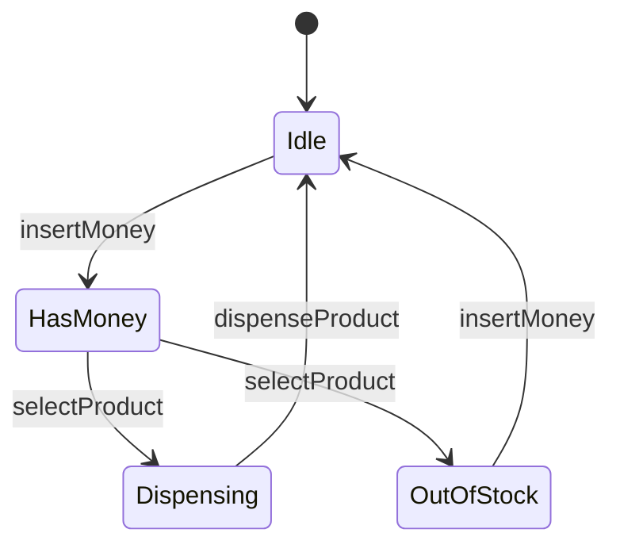
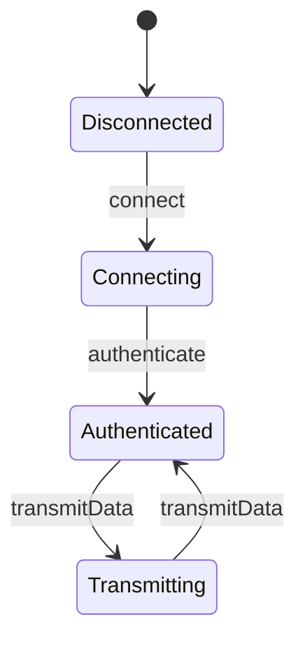

## 5.9.4 Use Cases and Examples

The State pattern is a powerful behavioral design pattern that allows an object to alter its behavior when its internal state changes. This pattern is particularly useful in scenarios where an object must change its behavior at runtime depending on its state. In this section, we will explore practical applications of the State pattern, focusing on real-world examples such as vending machines and protocol handlers. We'll delve into how these systems manage different operational states and provide comprehensive code snippets to illustrate these concepts.

### Understanding the State Pattern

Before diving into specific use cases, let's briefly recap the State pattern. The State pattern involves three main components:

1. **Context**: This is the class that maintains an instance of a ConcreteState subclass that defines the current state.
2. **State Interface**: This interface declares methods that all ConcreteState classes should implement.
3. **Concrete States**: These are classes that implement the State interface and define behavior specific to the state of the Context.

The State pattern allows the Context to delegate state-specific behavior to the current ConcreteState object. As a result, the Context can change its behavior by switching between different ConcreteState objects.

### Real-World Example: Vending Machine

A vending machine is an excellent example of the State pattern in action. Vending machines have multiple states, such as accepting money, dispensing products, and returning change. Each state dictates the machine's behavior in response to user inputs.

#### Vending Machine States

Let's define the states for a vending machine:

- **Idle State**: The machine waits for the user to insert money.
- **Has Money State**: The machine has received money and waits for the user to select a product.
- **Dispensing State**: The machine dispenses the selected product.
- **Out of Stock State**: The machine cannot dispense the product because it is out of stock.

#### Implementing the Vending Machine in Java

We'll implement a simple vending machine using the State pattern. Here's how we can define the states and the context:

```java
// State interface
interface VendingMachineState {
    void insertMoney();
    void selectProduct();
    void dispenseProduct();
}

// Context class
class VendingMachine {
    private VendingMachineState state;
    private int stock;

    public VendingMachine(int stock) {
        this.stock = stock;
        this.state = new IdleState(this);
    }

    public void setState(VendingMachineState state) {
        this.state = state;
    }

    public int getStock() {
        return stock;
    }

    public void reduceStock() {
        if (stock > 0) {
            stock--;
        }
    }

    public void insertMoney() {
        state.insertMoney();
    }

    public void selectProduct() {
        state.selectProduct();
    }

    public void dispenseProduct() {
        state.dispenseProduct();
    }
}

// Concrete States
class IdleState implements VendingMachineState {
    private VendingMachine machine;

    public IdleState(VendingMachine machine) {
        this.machine = machine;
    }

    @Override
    public void insertMoney() {
        System.out.println("Money inserted. Please select a product.");
        machine.setState(new HasMoneyState(machine));
    }

    @Override
    public void selectProduct() {
        System.out.println("Please insert money first.");
    }

    @Override
    public void dispenseProduct() {
        System.out.println("Please insert money and select a product first.");
    }
}

class HasMoneyState implements VendingMachineState {
    private VendingMachine machine;

    public HasMoneyState(VendingMachine machine) {
        this.machine = machine;
    }

    @Override
    public void insertMoney() {
        System.out.println("Money already inserted. Please select a product.");
    }

    @Override
    public void selectProduct() {
        if (machine.getStock() > 0) {
            System.out.println("Product selected. Dispensing product...");
            machine.setState(new DispensingState(machine));
            machine.dispenseProduct();
        } else {
            System.out.println("Product out of stock.");
            machine.setState(new OutOfStockState(machine));
        }
    }

    @Override
    public void dispenseProduct() {
        System.out.println("Please select a product first.");
    }
}

class DispensingState implements VendingMachineState {
    private VendingMachine machine;

    public DispensingState(VendingMachine machine) {
        this.machine = machine;
    }

    @Override
    public void insertMoney() {
        System.out.println("Please wait, dispensing product.");
    }

    @Override
    public void selectProduct() {
        System.out.println("Please wait, dispensing product.");
    }

    @Override
    public void dispenseProduct() {
        machine.reduceStock();
        System.out.println("Product dispensed. Thank you!");
        machine.setState(new IdleState(machine));
    }
}

class OutOfStockState implements VendingMachineState {
    private VendingMachine machine;

    public OutOfStockState(VendingMachine machine) {
        this.machine = machine;
    }

    @Override
    public void insertMoney() {
        System.out.println("Product out of stock. Please take your money back.");
    }

    @Override
    public void selectProduct() {
        System.out.println("Product out of stock.");
    }

    @Override
    public void dispenseProduct() {
        System.out.println("Product out of stock.");
    }
}
```

#### Try It Yourself

Try modifying the vending machine code to handle additional states, such as a maintenance mode or a low-stock warning. Experiment with different transitions between states to see how the machine's behavior changes.

### Real-World Example: Protocol Handlers

Protocol handlers are another practical application of the State pattern. In network communication, protocols often have multiple states, such as connecting, authenticating, and transmitting data. Each state requires different handling logic.

#### Protocol Handler States

Consider a simple communication protocol with the following states:

- **Disconnected State**: The handler is not connected to the network.
- **Connecting State**: The handler is attempting to establish a connection.
- **Authenticated State**: The handler has successfully authenticated and is ready to transmit data.
- **Transmitting State**: The handler is actively transmitting data.

#### Implementing the Protocol Handler in Java

We'll implement a protocol handler using the State pattern. Here's how we can define the states and the context:

```java
// State interface
interface ProtocolState {
    void connect();
    void authenticate();
    void transmitData();
}

// Context class
class ProtocolHandler {
    private ProtocolState state;

    public ProtocolHandler() {
        this.state = new DisconnectedState(this);
    }

    public void setState(ProtocolState state) {
        this.state = state;
    }

    public void connect() {
        state.connect();
    }

    public void authenticate() {
        state.authenticate();
    }

    public void transmitData() {
        state.transmitData();
    }
}

// Concrete States
class DisconnectedState implements ProtocolState {
    private ProtocolHandler handler;

    public DisconnectedState(ProtocolHandler handler) {
        this.handler = handler;
    }

    @Override
    public void connect() {
        System.out.println("Connecting to network...");
        handler.setState(new ConnectingState(handler));
    }

    @Override
    public void authenticate() {
        System.out.println("Cannot authenticate. Not connected.");
    }

    @Override
    public void transmitData() {
        System.out.println("Cannot transmit data. Not connected.");
    }
}

class ConnectingState implements ProtocolState {
    private ProtocolHandler handler;

    public ConnectingState(ProtocolHandler handler) {
        this.handler = handler;
    }

    @Override
    public void connect() {
        System.out.println("Already connecting...");
    }

    @Override
    public void authenticate() {
        System.out.println("Authenticating...");
        handler.setState(new AuthenticatedState(handler));
    }

    @Override
    public void transmitData() {
        System.out.println("Cannot transmit data. Not authenticated.");
    }
}

class AuthenticatedState implements ProtocolState {
    private ProtocolHandler handler;

    public AuthenticatedState(ProtocolHandler handler) {
        this.handler = handler;
    }

    @Override
    public void connect() {
        System.out.println("Already connected.");
    }

    @Override
    public void authenticate() {
        System.out.println("Already authenticated.");
    }

    @Override
    public void transmitData() {
        System.out.println("Transmitting data...");
        handler.setState(new TransmittingState(handler));
    }
}

class TransmittingState implements ProtocolState {
    private ProtocolHandler handler;

    public TransmittingState(ProtocolHandler handler) {
        this.handler = handler;
    }

    @Override
    public void connect() {
        System.out.println("Already connected.");
    }

    @Override
    public void authenticate() {
        System.out.println("Already authenticated.");
    }

    @Override
    public void transmitData() {
        System.out.println("Data transmission complete.");
        handler.setState(new AuthenticatedState(handler));
    }
}
```

#### Try It Yourself

Modify the protocol handler code to handle additional states, such as an error state or a disconnecting state. Experiment with different transitions between states to see how the handler's behavior changes.

### Visualizing the State Pattern

To better understand the transitions between states, let's visualize the state transitions for both the vending machine and the protocol handler using Mermaid.js diagrams.

#### Vending Machine State Diagram



#### Protocol Handler State Diagram



### Knowledge Check

Let's reinforce what we've learned with some questions and challenges:

1. **Question**: What are the main components of the State pattern?
2. **Challenge**: Implement a new state for the vending machine that handles maintenance mode.
3. **Question**: How does the State pattern improve code maintainability?
4. **Challenge**: Extend the protocol handler to include an error recovery state.

### Conclusion

The State pattern is a versatile design pattern that can be applied to a wide range of real-world scenarios. By encapsulating state-specific behavior in separate classes, the State pattern allows for cleaner, more maintainable code. Whether you're building a vending machine or a protocol handler, the State pattern can help you manage complex state transitions with ease.

Remember, this is just the beginning. As you progress, you'll find more opportunities to apply the State pattern and other design patterns to solve complex problems. Keep experimenting, stay curious, and enjoy the journey!

## Quiz Time!



### What is the primary benefit of using the State pattern?

- [x] It allows an object to change its behavior when its internal state changes.
- [ ] It reduces the number of classes needed in a program.
- [ ] It simplifies the user interface.
- [ ] It eliminates the need for conditional statements.

> **Explanation:** The State pattern allows an object to change its behavior when its internal state changes, making it easier to manage state-specific behavior.

### In the vending machine example, what state does the machine transition to after dispensing a product?

- [x] Idle State
- [ ] Has Money State
- [ ] Dispensing State
- [ ] Out of Stock State

> **Explanation:** After dispensing a product, the vending machine transitions back to the Idle State, ready for the next transaction.

### Which of the following is NOT a state in the protocol handler example?

- [ ] Disconnected State
- [ ] Connecting State
- [ ] Authenticated State
- [x] Maintenance State

> **Explanation:** The Maintenance State is not part of the protocol handler example. The states include Disconnected, Connecting, Authenticated, and Transmitting.

### How does the State pattern improve code maintainability?

- [x] By encapsulating state-specific behavior in separate classes.
- [ ] By reducing the number of lines of code.
- [ ] By eliminating the need for comments.
- [ ] By using fewer design patterns.

> **Explanation:** The State pattern improves maintainability by encapsulating state-specific behavior in separate classes, making it easier to manage and extend.

### What method is called to transition from the Idle State to the Has Money State in the vending machine example?

- [x] insertMoney()
- [ ] selectProduct()
- [ ] dispenseProduct()
- [ ] reduceStock()

> **Explanation:** The insertMoney() method is called to transition from the Idle State to the Has Money State.

### In the protocol handler example, what state does the handler transition to after transmitting data?

- [x] Authenticated State
- [ ] Disconnected State
- [ ] Connecting State
- [ ] Transmitting State

> **Explanation:** After transmitting data, the handler transitions back to the Authenticated State, ready for the next transmission.

### Which of the following is a key component of the State pattern?

- [x] Context
- [ ] Singleton
- [ ] Proxy
- [ ] Adapter

> **Explanation:** The Context is a key component of the State pattern, responsible for maintaining the current state and delegating behavior to it.

### What is the role of the ConcreteState class in the State pattern?

- [x] To define behavior specific to a particular state.
- [ ] To manage the overall state transitions.
- [ ] To provide a user interface.
- [ ] To store data persistently.

> **Explanation:** The ConcreteState class defines behavior specific to a particular state, allowing the Context to delegate state-specific behavior to it.

### How can the State pattern be visualized effectively?

- [x] Using state diagrams to show transitions.
- [ ] By writing extensive documentation.
- [ ] By creating flowcharts for each method.
- [ ] By using UML class diagrams exclusively.

> **Explanation:** State diagrams are effective for visualizing the transitions between different states in the State pattern.

### True or False: The State pattern can only be used in vending machines and protocol handlers.

- [ ] True
- [x] False

> **Explanation:** False. The State pattern is versatile and can be applied to many different scenarios beyond vending machines and protocol handlers.


