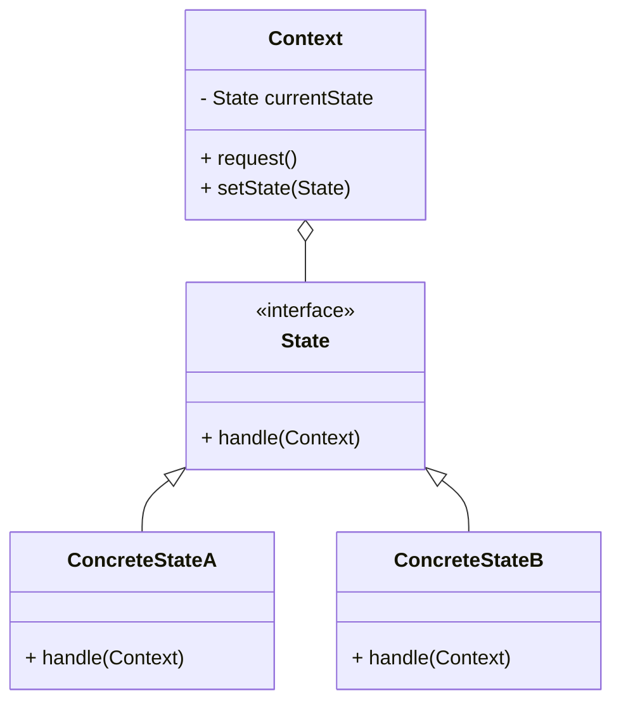
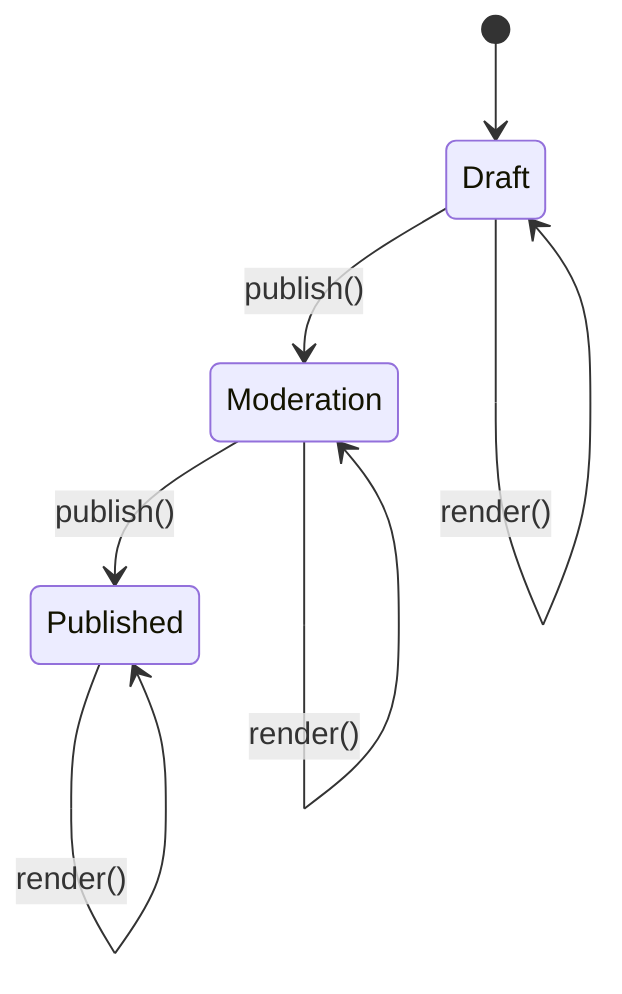

## 5.9 State Pattern

In the realm of software design, the State Pattern stands out as a powerful tool for managing an object's behavior when its internal state changes. This pattern is particularly useful in scenarios where an object must exhibit different behaviors based on its current state, effectively allowing the object to change its class dynamically. Let's delve into the intricacies of the State Pattern, exploring its intent, structure, benefits, and practical implementation in Java.

### Understanding the State Pattern

#### Intent of the State Pattern

The State Pattern is a behavioral design pattern that allows an object to change its behavior when its internal state changes. It encapsulates state-specific behavior into separate classes, enabling an object to alter its behavior dynamically by delegating state-specific requests to these classes. This pattern is particularly useful when an object has a finite number of states, each with distinct behavior.

#### Problem Solved by the State Pattern

Consider a scenario where an object has significant state-dependent behavior. Without the State Pattern, managing such behavior often leads to complex conditional logic scattered throughout the codebase. This complexity can result in code that is difficult to maintain, understand, and extend. The State Pattern addresses this issue by encapsulating state-specific behavior into separate classes, thus promoting cleaner, more maintainable code.

### Structure of the State Pattern

The State Pattern involves several key components:

1. **Context**: The context is the class that maintains a reference to the current state and delegates state-specific behavior to the current state object. It provides an interface for clients to interact with the object.

2. **State**: The state interface declares methods that all concrete states must implement. These methods define the behavior associated with a particular state.

3. **Concrete States**: These are classes that implement the state interface, encapsulating the behavior associated with a specific state of the context.

4. **State Transition**: The context is responsible for changing its state, typically by invoking a method on the current state object that results in a state transition.

#### UML Diagram of the State Pattern

To better understand the structure of the State Pattern, let's visualize it using a UML class diagram:



In this diagram, the `Context` class maintains a reference to a `State` object, which represents the current state. The `State` interface declares a `handle` method, which is implemented by `ConcreteStateA` and `ConcreteStateB`. These concrete states encapsulate the behavior associated with a specific state of the context.

### Implementing the State Pattern in Java

Let's explore how to implement the State Pattern in Java through a practical example. We'll create a simple state machine for a `Document` object that can be in one of three states: `Draft`, `Moderation`, and `Published`. Each state will define specific behavior for the document.

#### Step 1: Define the State Interface

First, we'll define the `State` interface, which declares the methods that all concrete states must implement:

```java
// State.java
public interface State {
    void publish(Document context);
    void render(Document context);
}
```

The `State` interface declares two methods: `publish` and `render`, which represent actions that can be performed on a document.

#### Step 2: Implement Concrete States

Next, we'll implement the concrete states: `DraftState`, `ModerationState`, and `PublishedState`. Each state will encapsulate the behavior specific to that state.

```java
// DraftState.java
public class DraftState implements State {
    @Override
    public void publish(Document context) {
        System.out.println("Document is now in Moderation.");
        context.setState(new ModerationState());
    }

    @Override
    public void render(Document context) {
        System.out.println("Rendering document in Draft state.");
    }
}

// ModerationState.java
public class ModerationState implements State {
    @Override
    public void publish(Document context) {
        System.out.println("Document is now Published.");
        context.setState(new PublishedState());
    }

    @Override
    public void render(Document context) {
        System.out.println("Rendering document in Moderation state.");
    }
}

// PublishedState.java
public class PublishedState implements State {
    @Override
    public void publish(Document context) {
        System.out.println("Document is already Published.");
    }

    @Override
    public void render(Document context) {
        System.out.println("Rendering document in Published state.");
    }
}
```

Each concrete state implements the `State` interface and provides specific behavior for the `publish` and `render` methods.

#### Step 3: Implement the Context Class

The `Document` class acts as the context, maintaining a reference to the current state and delegating state-specific behavior to the current state object.

```java
// Document.java
public class Document {
    private State currentState;

    public Document() {
        currentState = new DraftState();
    }

    public void setState(State state) {
        this.currentState = state;
    }

    public void publish() {
        currentState.publish(this);
    }

    public void render() {
        currentState.render(this);
    }
}
```

The `Document` class initializes with a `DraftState` and provides methods to change its state and perform actions based on the current state.

#### Step 4: Demonstrate the State Pattern

Let's demonstrate the State Pattern in action by creating a `Document` object and transitioning through its states:

```java
public class StatePatternDemo {
    public static void main(String[] args) {
        Document document = new Document();

        document.render();
        document.publish();

        document.render();
        document.publish();

        document.render();
        document.publish();
    }
}
```

**Output:**

```
Rendering document in Draft state.
Document is now in Moderation.
Rendering document in Moderation state.
Document is now Published.
Rendering document in Published state.
Document is already Published.
```

In this demonstration, we create a `Document` object and invoke the `render` and `publish` methods. The document transitions through the `Draft`, `Moderation`, and `Published` states, with each state exhibiting specific behavior.

### Benefits of the State Pattern

The State Pattern offers several benefits:

- **Cleaner Code**: By encapsulating state-specific behavior into separate classes, the State Pattern eliminates complex conditional logic, resulting in cleaner, more maintainable code.

- **Easier State Management**: The pattern simplifies state management by centralizing state transitions and behavior in state classes, making it easier to add or modify states.

- **Enhanced Flexibility**: The State Pattern promotes flexibility by allowing new states to be added without modifying existing code, adhering to the Open/Closed Principle.

- **Improved Readability**: By separating state-specific behavior into distinct classes, the pattern enhances code readability, making it easier to understand the behavior associated with each state.

### Try It Yourself

To deepen your understanding of the State Pattern, try modifying the code example to add a new state, such as `ArchivedState`, which represents an archived document. Implement the `ArchivedState` class, define its behavior, and update the `Document` class to transition to this new state.

### Visualizing State Transitions

To further enhance our understanding of the State Pattern, let's visualize the state transitions using a state diagram:



In this state diagram, we see the transitions between the `Draft`, `Moderation`, and `Published` states. The `publish` action triggers state transitions, while the `render` action maintains the current state.

### Knowledge Check

To reinforce your understanding of the State Pattern, consider the following questions:

1. What is the primary intent of the State Pattern?
2. How does the State Pattern promote cleaner code?
3. What are the key components of the State Pattern?
4. How does the State Pattern adhere to the Open/Closed Principle?
5. What are the benefits of encapsulating state-specific behavior into separate classes?

### Conclusion

The State Pattern is a powerful tool for managing state-dependent behavior in software design. By encapsulating state-specific behavior into separate classes, the pattern promotes cleaner, more maintainable code and simplifies state management. As you continue your journey in software development, consider leveraging the State Pattern to enhance the flexibility and readability of your code.

Remember, this is just the beginning. As you progress, you'll build more complex and interactive applications. Keep experimenting, stay curious, and enjoy the journey!

## Quiz Time!



### What is the primary intent of the State Pattern?

- [x] To allow an object to alter its behavior when its internal state changes.
- [ ] To encapsulate related algorithms into separate classes.
- [ ] To provide a simplified interface to a complex subsystem.
- [ ] To define a one-to-many dependency between objects.

> **Explanation:** The State Pattern allows an object to change its behavior dynamically based on its internal state, effectively altering its class.

### How does the State Pattern promote cleaner code?

- [x] By encapsulating state-specific behavior into separate classes.
- [ ] By reducing the number of classes in the system.
- [ ] By eliminating the need for interfaces.
- [ ] By using inheritance to share behavior.

> **Explanation:** The State Pattern encapsulates state-specific behavior into separate classes, eliminating complex conditional logic and resulting in cleaner code.

### What are the key components of the State Pattern?

- [x] Context, State, Concrete States
- [ ] Singleton, Factory, Prototype
- [ ] Adapter, Bridge, Composite
- [ ] Observer, Mediator, Memento

> **Explanation:** The key components of the State Pattern are Context, State, and Concrete States, which work together to manage state-dependent behavior.

### How does the State Pattern adhere to the Open/Closed Principle?

- [x] By allowing new states to be added without modifying existing code.
- [ ] By using inheritance to share behavior.
- [ ] By reducing the number of classes in the system.
- [ ] By encapsulating related algorithms into separate classes.

> **Explanation:** The State Pattern adheres to the Open/Closed Principle by allowing new states to be added without modifying existing code, promoting extensibility.

### What are the benefits of encapsulating state-specific behavior into separate classes?

- [x] Cleaner code, easier state management, enhanced flexibility
- [ ] Reduced number of classes, simplified interfaces
- [ ] Improved performance, reduced memory usage
- [ ] Increased complexity, harder to understand

> **Explanation:** Encapsulating state-specific behavior into separate classes results in cleaner code, easier state management, and enhanced flexibility.

### Which method is responsible for changing the state in the State Pattern?

- [x] The context's method that interacts with the state.
- [ ] The constructor of the state class.
- [ ] A static method in the state class.
- [ ] The main method of the application.

> **Explanation:** The context's method that interacts with the state is responsible for changing the state by invoking a method on the current state object.

### What is the role of the Context class in the State Pattern?

- [x] To maintain a reference to the current state and delegate behavior to it.
- [ ] To define the behavior associated with a particular state.
- [ ] To provide a simplified interface to a complex subsystem.
- [ ] To encapsulate related algorithms into separate classes.

> **Explanation:** The Context class maintains a reference to the current state and delegates behavior to it, managing state transitions.

### How does the State Pattern improve readability?

- [x] By separating state-specific behavior into distinct classes.
- [ ] By reducing the number of classes in the system.
- [ ] By using inheritance to share behavior.
- [ ] By eliminating the need for interfaces.

> **Explanation:** The State Pattern improves readability by separating state-specific behavior into distinct classes, making it easier to understand the behavior associated with each state.

### What is a common use case for the State Pattern?

- [x] Managing state-dependent behavior in objects.
- [ ] Encapsulating related algorithms into separate classes.
- [ ] Providing a simplified interface to a complex subsystem.
- [ ] Defining a one-to-many dependency between objects.

> **Explanation:** A common use case for the State Pattern is managing state-dependent behavior in objects, allowing them to change behavior dynamically.

### True or False: The State Pattern can be used to eliminate complex conditional logic in code.

- [x] True
- [ ] False

> **Explanation:** True. The State Pattern eliminates complex conditional logic by encapsulating state-specific behavior into separate classes.


