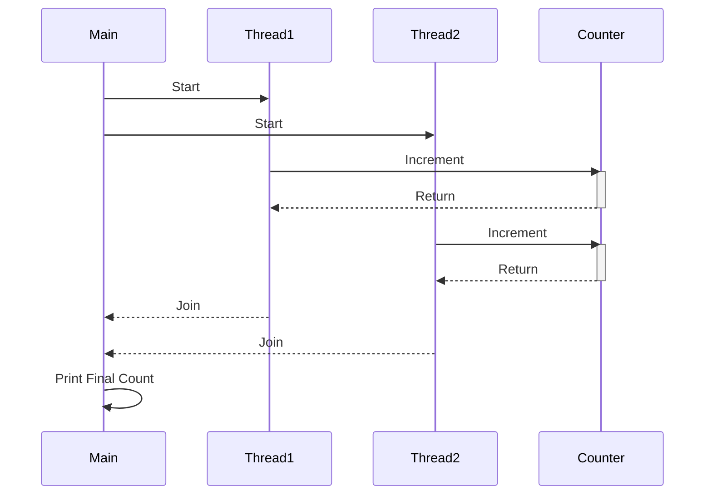

## 6.1 Introduction to Java Concurrency

In the realm of modern software development, concurrency plays a pivotal role in enhancing application performance and responsiveness. As systems grow more complex and user demands increase, the ability to execute multiple tasks simultaneously becomes crucial. Java, as a robust programming language, offers built-in support for concurrency, enabling developers to harness the power of multithreading and synchronization.

### The Importance of Concurrency in Modern Software Development

Concurrency allows programs to perform multiple operations simultaneously, which is essential in today's fast-paced digital environment. Whether it's handling numerous user requests on a web server, processing large datasets, or running complex simulations, concurrency improves efficiency and responsiveness. By enabling multitasking, applications can better utilize system resources, leading to faster execution and improved user experiences.

### Java's Built-in Support for Concurrency

Java provides a comprehensive set of tools for building concurrent applications. At the core of Java's concurrency model are threads, which are lightweight processes that can run concurrently within a program. Java threads are managed by the Java Virtual Machine (JVM) and can be created by implementing the `Runnable` interface or extending the `Thread` class.

#### Creating Threads in Java

Here is a simple example of creating and starting a thread in Java:

```java
// Implementing Runnable interface
class MyRunnable implements Runnable {
    @Override
    public void run() {
        System.out.println("Thread is running...");
    }
}

public class ThreadExample {
    public static void main(String[] args) {
        Thread thread = new Thread(new MyRunnable());
        thread.start(); // Start the thread
    }
}
```

In this example, the `MyRunnable` class implements the `Runnable` interface, and the `run` method contains the code that will be executed by the thread. The `Thread` class is then used to create a new thread, passing an instance of `MyRunnable` to its constructor.

#### Synchronization Mechanisms

Java also provides synchronization mechanisms to manage access to shared resources and prevent data inconsistencies. The `synchronized` keyword is used to ensure that only one thread can access a block of code or method at a time.

```java
class Counter {
    private int count = 0;

    public synchronized void increment() {
        count++;
    }

    public int getCount() {
        return count;
    }
}

public class SynchronizedExample {
    public static void main(String[] args) {
        Counter counter = new Counter();
        Runnable task = () -> {
            for (int i = 0; i < 1000; i++) {
                counter.increment();
            }
        };

        Thread thread1 = new Thread(task);
        Thread thread2 = new Thread(task);

        thread1.start();
        thread2.start();

        try {
            thread1.join();
            thread2.join();
        } catch (InterruptedException e) {
            e.printStackTrace();
        }

        System.out.println("Final count: " + counter.getCount());
    }
}
```

In this example, the `increment` method is synchronized, ensuring that only one thread can execute it at a time, preventing race conditions.

### Challenges in Concurrent Programming

Concurrent programming introduces several challenges that developers must address to create reliable applications.

#### Race Conditions

A race condition occurs when the outcome of a program depends on the sequence or timing of uncontrollable events, such as thread scheduling. This can lead to unpredictable behavior and data corruption.

#### Deadlocks

Deadlocks arise when two or more threads are blocked forever, each waiting for the other to release a resource. This situation can halt program execution and is often difficult to diagnose and resolve.

#### Resource Contention

Resource contention occurs when multiple threads compete for the same resource, leading to performance bottlenecks. Proper synchronization and resource management are essential to mitigate this issue.

### Java's Concurrency Utilities

To simplify concurrent programming, Java provides a rich set of concurrency utilities in the `java.util.concurrent` package. These utilities offer higher-level abstractions for managing threads and synchronization, reducing the complexity of concurrent code.

#### Executors

The `Executor` framework provides a mechanism for managing thread execution, allowing developers to decouple task submission from execution policy. It includes thread pools, which improve performance by reusing existing threads.

```java
import java.util.concurrent.ExecutorService;
import java.util.concurrent.Executors;

public class ExecutorExample {
    public static void main(String[] args) {
        ExecutorService executor = Executors.newFixedThreadPool(2);

        Runnable task = () -> {
            System.out.println("Executing task in: " + Thread.currentThread().getName());
        };

        executor.execute(task);
        executor.execute(task);

        executor.shutdown();
    }
}
```

In this example, a fixed thread pool is created with two threads, and tasks are submitted for execution. The `ExecutorService` manages the threads, improving resource utilization.

#### Locks

The `Lock` interface provides more flexible locking operations than the `synchronized` keyword. It includes features like try-locking and timed-locking, which offer greater control over thread synchronization.

```java
import java.util.concurrent.locks.Lock;
import java.util.concurrent.locks.ReentrantLock;

class SafeCounter {
    private int count = 0;
    private final Lock lock = new ReentrantLock();

    public void increment() {
        lock.lock();
        try {
            count++;
        } finally {
            lock.unlock();
        }
    }

    public int getCount() {
        return count;
    }
}
```

In this example, a `ReentrantLock` is used to protect the `increment` method, ensuring thread-safe access to the shared resource.

#### Concurrent Collections

Java provides thread-safe collections, such as `ConcurrentHashMap` and `CopyOnWriteArrayList`, which are designed for concurrent access and modification.

```java
import java.util.concurrent.ConcurrentHashMap;

public class ConcurrentCollectionExample {
    public static void main(String[] args) {
        ConcurrentHashMap<String, Integer> map = new ConcurrentHashMap<>();
        map.put("key1", 1);

        Runnable task = () -> {
            map.put("key2", 2);
            System.out.println("Map updated by: " + Thread.currentThread().getName());
        };

        Thread thread1 = new Thread(task);
        Thread thread2 = new Thread(task);

        thread1.start();
        thread2.start();
    }
}
```

In this example, a `ConcurrentHashMap` is used to ensure thread-safe updates to the map.

### Concurrency Patterns

Concurrency patterns provide proven solutions to common problems in concurrent programming. They help manage complexity and improve the robustness of applications by offering structured approaches to handling concurrency.

#### Key Concurrency Patterns

- **Thread Pool Pattern**: Manages a pool of reusable threads for executing tasks, improving resource utilization and performance.
- **Producer-Consumer Pattern**: Coordinates the production and consumption of resources between threads, ensuring efficient data processing.
- **Future and Promise Patterns**: Represent the result of an asynchronous computation, allowing for non-blocking operations and improved responsiveness.
- **Reactor Pattern**: Handles service requests by dispatching them synchronously to handlers, suitable for event-driven applications.

### Preparing for Upcoming Sections

In the following sections, we will delve deeper into these concurrency patterns, exploring their implementation and use cases. We will also discuss best practices for ensuring thread safety and performance in concurrent applications.

### Performance and Thread Safety

When developing concurrent applications, it's crucial to consider performance and thread safety. Efficient use of resources and proper synchronization are key to achieving optimal performance. Additionally, ensuring thread safety prevents data corruption and unpredictable behavior, leading to more reliable applications.

### Try It Yourself

To solidify your understanding of Java concurrency, try modifying the code examples provided in this section. Experiment with different thread pool sizes, synchronization mechanisms, and concurrent collections. Observe how these changes affect program behavior and performance.

### Visualizing Java's Concurrency Model

To better understand Java's concurrency model, let's visualize the interaction between threads and synchronization mechanisms using a sequence diagram.



This diagram illustrates the sequence of interactions between the main thread, two worker threads, and a shared counter object. Each thread increments the counter, demonstrating the need for synchronization to prevent race conditions.

### References and Links

For further reading on Java concurrency, consider the following resources:

- [Java Concurrency in Practice](https://www.amazon.com/Java-Concurrency-Practice-Brian-Goetz/dp/0321349601) by Brian Goetz
- [Java SE Documentation: Concurrency](https://docs.oracle.com/javase/tutorial/essential/concurrency/)
- [Concurrency Utilities in Java](https://docs.oracle.com/javase/8/docs/api/java/util/concurrent/package-summary.html)

### Knowledge Check

To reinforce your understanding of Java concurrency, consider the following questions:

1. What is the primary benefit of using concurrency in software development?
2. How does Java's `synchronized` keyword help prevent race conditions?
3. What are some common challenges associated with concurrent programming?
4. How does the `Executor` framework simplify thread management?
5. What is the difference between a `ReentrantLock` and the `synchronized` keyword?

### Embrace the Journey

As you continue your journey into Java concurrency, remember that mastering these concepts will enhance your ability to build efficient, responsive, and robust applications. Keep experimenting, stay curious, and enjoy the process of learning and applying concurrency patterns in your projects.

## Quiz Time!



### What is the primary benefit of using concurrency in software development?

- [x] Improved efficiency and responsiveness
- [ ] Simplified code structure
- [ ] Reduced memory usage
- [ ] Enhanced security

> **Explanation:** Concurrency allows programs to perform multiple operations simultaneously, improving efficiency and responsiveness.

### How does Java's `synchronized` keyword help prevent race conditions?

- [x] It ensures that only one thread can access a block of code or method at a time.
- [ ] It increases the speed of thread execution.
- [ ] It allows multiple threads to execute simultaneously.
- [ ] It automatically resolves deadlocks.

> **Explanation:** The `synchronized` keyword prevents race conditions by ensuring that only one thread can execute a synchronized block or method at a time.

### What is a common challenge associated with concurrent programming?

- [x] Race conditions
- [ ] Increased memory usage
- [ ] Simplified debugging
- [ ] Enhanced performance

> **Explanation:** Race conditions occur when the outcome of a program depends on the sequence or timing of uncontrollable events, leading to unpredictable behavior.

### How does the `Executor` framework simplify thread management?

- [x] By decoupling task submission from execution policy
- [ ] By increasing the number of available threads
- [ ] By automatically resolving deadlocks
- [ ] By reducing memory usage

> **Explanation:** The `Executor` framework simplifies thread management by allowing developers to manage thread execution through a higher-level abstraction.

### What is the difference between a `ReentrantLock` and the `synchronized` keyword?

- [x] `ReentrantLock` provides more flexible locking operations.
- [ ] `ReentrantLock` is faster than `synchronized`.
- [ ] `ReentrantLock` automatically resolves deadlocks.
- [ ] `ReentrantLock` is used for single-threaded applications.

> **Explanation:** `ReentrantLock` provides more flexible locking operations, such as try-locking and timed-locking, compared to the `synchronized` keyword.

### Which Java package provides concurrency utilities?

- [x] `java.util.concurrent`
- [ ] `java.util.concurrent.locks`
- [ ] `java.lang.concurrent`
- [ ] `java.io.concurrent`

> **Explanation:** The `java.util.concurrent` package provides a rich set of concurrency utilities for managing threads and synchronization.

### What is a deadlock in concurrent programming?

- [x] A situation where two or more threads are blocked forever, each waiting for the other to release a resource.
- [ ] A condition where threads execute in parallel without synchronization.
- [ ] A state where memory usage is maximized.
- [ ] A scenario where threads complete execution in sequence.

> **Explanation:** Deadlocks occur when two or more threads are blocked forever, each waiting for the other to release a resource.

### How can thread safety be ensured in concurrent applications?

- [x] By using synchronization mechanisms like `synchronized` and `Lock`.
- [ ] By increasing the number of threads.
- [ ] By reducing memory usage.
- [ ] By simplifying code structure.

> **Explanation:** Thread safety can be ensured by using synchronization mechanisms like `synchronized` and `Lock` to manage access to shared resources.

### What is the role of `ConcurrentHashMap` in Java concurrency?

- [x] It provides a thread-safe implementation of a hash map.
- [ ] It increases the speed of hash map operations.
- [ ] It reduces memory usage.
- [ ] It simplifies debugging.

> **Explanation:** `ConcurrentHashMap` provides a thread-safe implementation of a hash map, allowing concurrent access and modification.

### True or False: Concurrency patterns help manage complexity and improve the robustness of concurrent applications.

- [x] True
- [ ] False

> **Explanation:** Concurrency patterns provide structured approaches to handling concurrency, helping manage complexity and improve the robustness of applications.


