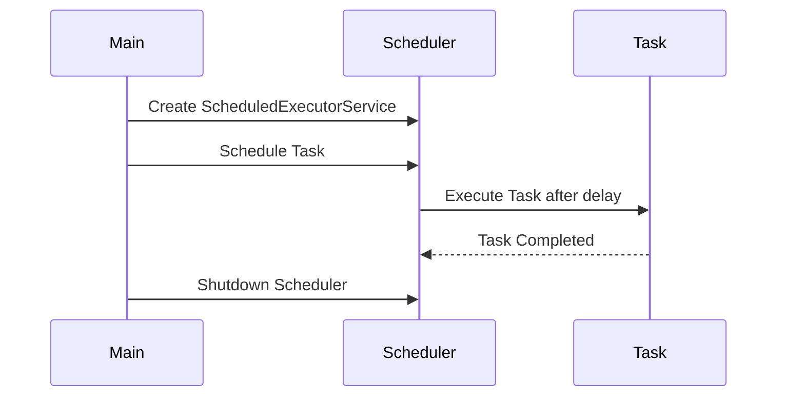

## 6.10.1 Implementing Scheduler in Java

In the realm of concurrent programming, scheduling tasks efficiently is crucial for maintaining application performance and responsiveness. Java provides robust tools for scheduling through the `ScheduledExecutorService` interface, part of the `java.util.concurrent` package. This section will guide you through implementing the Scheduler pattern in Java, leveraging `ScheduledExecutorService` to manage task execution with precision and reliability.

### Introduction to ScheduledExecutorService

The `ScheduledExecutorService` is an extension of the `ExecutorService` interface, designed specifically for scheduling tasks to run after a delay or periodically. It offers several methods that allow developers to schedule tasks with varying levels of complexity and timing requirements.

#### Key Methods of ScheduledExecutorService

- **`schedule(Runnable command, long delay, TimeUnit unit)`**: Schedules a task to execute after a specified delay.
- **`schedule(Callable<V> callable, long delay, TimeUnit unit)`**: Similar to `schedule(Runnable)`, but returns a result.
- **`scheduleAtFixedRate(Runnable command, long initialDelay, long period, TimeUnit unit)`**: Schedules a task to execute repeatedly at fixed intervals.
- **`scheduleWithFixedDelay(Runnable command, long initialDelay, long delay, TimeUnit unit)`**: Schedules a task to execute repeatedly with a fixed delay between the end of one execution and the start of the next.

### Implementing Task Scheduling

Let's explore how to implement task scheduling using `ScheduledExecutorService` with practical code examples.

#### Scheduling a Delayed Task

To schedule a task for delayed execution, we use the `schedule` method. Here's an example where we schedule a task to print a message after a 5-second delay:

```java
import java.util.concurrent.Executors;
import java.util.concurrent.ScheduledExecutorService;
import java.util.concurrent.TimeUnit;

public class DelayedTaskExample {
    public static void main(String[] args) {
        ScheduledExecutorService scheduler = Executors.newScheduledThreadPool(1);

        Runnable task = () -> System.out.println("Task executed after delay");

        scheduler.schedule(task, 5, TimeUnit.SECONDS);

        scheduler.shutdown();
    }
}
```

**Explanation:**

- We create a `ScheduledExecutorService` with a single-thread pool.
- A `Runnable` task is defined to print a message.
- The `schedule` method is used to execute the task after a 5-second delay.
- Finally, we shut down the scheduler to release resources.

#### Scheduling a Periodic Task

For tasks that need to run periodically, `scheduleAtFixedRate` and `scheduleWithFixedDelay` are used. Let's see how to schedule a task to run every 3 seconds:

```java
import java.util.concurrent.Executors;
import java.util.concurrent.ScheduledExecutorService;
import java.util.concurrent.TimeUnit;

public class PeriodicTaskExample {
    public static void main(String[] args) {
        ScheduledExecutorService scheduler = Executors.newScheduledThreadPool(1);

        Runnable task = () -> System.out.println("Periodic task executed");

        scheduler.scheduleAtFixedRate(task, 0, 3, TimeUnit.SECONDS);

        // To stop the scheduler after some time
        scheduler.schedule(() -> scheduler.shutdown(), 15, TimeUnit.SECONDS);
    }
}
```

**Explanation:**

- The task is scheduled to start immediately (`initialDelay = 0`) and repeat every 3 seconds.
- We also schedule a shutdown task to stop the scheduler after 15 seconds.

### Configuring Thread Pools for Scheduled Tasks

The choice of thread pool size is critical for performance and resource management. A thread pool that's too small can lead to task delays, while one that's too large may waste resources.

#### Best Practices for Thread Pool Configuration

- **Assess Task Characteristics**: Consider the nature of tasks (CPU-bound vs. I/O-bound) when configuring thread pools.
- **Monitor System Load**: Adjust thread pool size based on system performance metrics.
- **Use Cached Thread Pools for Short-Lived Tasks**: For tasks that execute quickly, a cached thread pool can be efficient.
- **Fixed Thread Pools for Predictable Load**: Use fixed-size thread pools when the number of concurrent tasks is predictable.

### Handling Exceptions and Task Completion

Robust error handling is essential for maintaining the stability of scheduled tasks. Let's discuss strategies to handle exceptions effectively.

#### Exception Handling in Scheduled Tasks

Scheduled tasks can throw exceptions, which need to be managed to prevent task failure from affecting the entire application.

- **Wrap Tasks with Try-Catch**: Ensure that each task handles its exceptions internally.
- **Use Future for Callable Tasks**: When using `Callable`, retrieve the result with `Future.get()`, which throws an `ExecutionException` if the task fails.

```java
import java.util.concurrent.*;

public class ExceptionHandlingExample {
    public static void main(String[] args) {
        ScheduledExecutorService scheduler = Executors.newScheduledThreadPool(1);

        Callable<String> task = () -> {
            if (Math.random() > 0.5) {
                throw new RuntimeException("Task failed");
            }
            return "Task completed successfully";
        };

        ScheduledFuture<String> future = scheduler.schedule(task, 2, TimeUnit.SECONDS);

        try {
            String result = future.get();
            System.out.println(result);
        } catch (InterruptedException | ExecutionException e) {
            System.err.println("Task execution failed: " + e.getMessage());
        } finally {
            scheduler.shutdown();
        }
    }
}
```

**Explanation:**

- A `Callable` task is scheduled, which may throw an exception.
- The result is retrieved using `Future.get()`, handling any exceptions that occur.

### Resource Management and Avoiding Scheduling Conflicts

Efficient resource management is vital to prevent conflicts and ensure smooth task execution.

#### Strategies for Resource Management

- **Limit Concurrent Tasks**: Use a bounded thread pool to control the number of concurrent tasks.
- **Prioritize Tasks**: Implement priority queues if certain tasks are more critical.
- **Monitor Resource Usage**: Use monitoring tools to track CPU, memory, and I/O usage.

#### Avoiding Scheduling Conflicts

- **Stagger Task Start Times**: Avoid starting multiple tasks simultaneously to reduce contention.
- **Use Locks Sparingly**: Minimize the use of locks to prevent deadlocks and contention.

### Visualizing Task Scheduling

To better understand the flow of task scheduling, let's visualize the process using a sequence diagram.



**Diagram Explanation:**

- The main application creates a `ScheduledExecutorService`.
- A task is scheduled and executed after a delay.
- Upon completion, the task notifies the scheduler, and the scheduler is eventually shut down.

### Try It Yourself

Experiment with the provided code examples by modifying task delays, periods, and thread pool sizes. Observe how these changes impact task execution and system performance. Consider implementing additional features such as task prioritization or dynamic thread pool adjustment based on load.

### Knowledge Check

- What is the difference between `scheduleAtFixedRate` and `scheduleWithFixedDelay`?
- How can you handle exceptions in scheduled tasks?
- What are the best practices for configuring thread pools for scheduled tasks?

### Summary

In this section, we've explored the implementation of the Scheduler pattern in Java using `ScheduledExecutorService`. By understanding how to schedule tasks for delayed and periodic execution, configure thread pools, and handle exceptions, you can design efficient and robust concurrent applications. Remember, mastering these concepts will empower you to build scalable and responsive systems.

## Quiz Time!



### What is the primary purpose of `ScheduledExecutorService` in Java?

- [x] To schedule tasks for delayed or periodic execution
- [ ] To manage database connections
- [ ] To handle file I/O operations
- [ ] To create graphical user interfaces

> **Explanation:** `ScheduledExecutorService` is designed to schedule tasks for execution after a delay or periodically.

### Which method would you use to schedule a task to run every 5 seconds?

- [ ] `schedule(Runnable command, long delay, TimeUnit unit)`
- [x] `scheduleAtFixedRate(Runnable command, long initialDelay, long period, TimeUnit unit)`
- [ ] `scheduleWithFixedDelay(Runnable command, long initialDelay, long delay, TimeUnit unit)`
- [ ] `execute(Runnable command)`

> **Explanation:** `scheduleAtFixedRate` is used to schedule a task to run at fixed intervals, such as every 5 seconds.

### How can you handle exceptions thrown by a `Callable` task in a scheduled executor?

- [ ] Ignore the exceptions
- [ ] Use a `try-catch` block within the task
- [x] Retrieve the result with `Future.get()` and handle `ExecutionException`
- [ ] Use a `finally` block

> **Explanation:** `Future.get()` is used to retrieve the result of a `Callable` task, and it throws an `ExecutionException` if the task fails.

### What is a key difference between `scheduleAtFixedRate` and `scheduleWithFixedDelay`?

- [x] `scheduleAtFixedRate` maintains a fixed rate, while `scheduleWithFixedDelay` maintains a fixed delay between executions
- [ ] `scheduleAtFixedRate` is for one-time execution, while `scheduleWithFixedDelay` is for periodic execution
- [ ] `scheduleAtFixedRate` is for `Callable` tasks, while `scheduleWithFixedDelay` is for `Runnable` tasks
- [ ] There is no difference

> **Explanation:** `scheduleAtFixedRate` schedules tasks at a fixed rate, while `scheduleWithFixedDelay` schedules tasks with a fixed delay between the end of one execution and the start of the next.

### What is the benefit of using a bounded thread pool?

- [x] It limits the number of concurrent tasks to prevent resource exhaustion
- [ ] It allows unlimited task execution
- [ ] It increases the speed of task execution
- [ ] It reduces the need for exception handling

> **Explanation:** A bounded thread pool limits the number of concurrent tasks, helping to manage resources effectively and prevent exhaustion.

### Which method is used to shut down a `ScheduledExecutorService`?

- [ ] `terminate()`
- [x] `shutdown()`
- [ ] `stop()`
- [ ] `close()`

> **Explanation:** `shutdown()` is used to initiate an orderly shutdown of the executor service, allowing previously submitted tasks to complete.

### What should you consider when configuring a thread pool for scheduled tasks?

- [x] Task characteristics (CPU-bound vs. I/O-bound)
- [x] System load and performance metrics
- [ ] The color of the user interface
- [ ] The brand of the computer

> **Explanation:** Configuring a thread pool requires considering task characteristics and system load to optimize performance.

### How can you avoid scheduling conflicts in a multi-threaded environment?

- [x] Stagger task start times
- [ ] Use only one thread for all tasks
- [ ] Ignore resource contention
- [ ] Schedule all tasks simultaneously

> **Explanation:** Staggering task start times helps reduce contention and avoid scheduling conflicts.

### What is the role of `TimeUnit` in scheduling tasks?

- [x] It specifies the time unit for delays and periods
- [ ] It determines the priority of tasks
- [ ] It manages memory allocation
- [ ] It handles exception logging

> **Explanation:** `TimeUnit` specifies the time unit (e.g., seconds, milliseconds) for delays and periods in scheduling tasks.

### True or False: `ScheduledExecutorService` can only schedule `Runnable` tasks.

- [ ] True
- [x] False

> **Explanation:** `ScheduledExecutorService` can schedule both `Runnable` and `Callable` tasks, allowing for tasks with or without return values.


