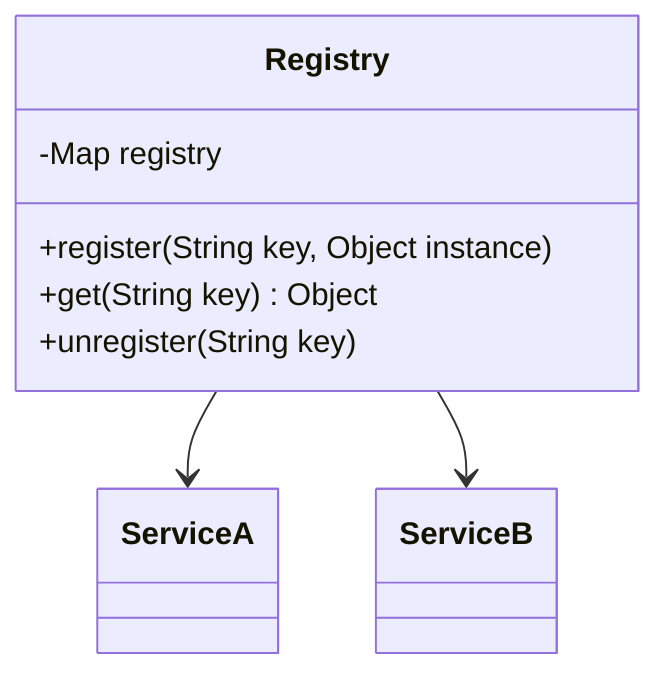

## 6.10.1 Implementing the Registry Pattern in Java

The Registry Pattern is a creational design pattern that provides a global point of access to a collection of objects or services. It is often used to manage instances that need to be shared across different parts of an application. This pattern is particularly useful in scenarios where multiple instances of a class need to be accessed globally, but unlike the [6.6 Singleton Pattern]( "Singleton Pattern"), it allows for multiple instances of the same class to be registered and accessed.

### Intent

- **Description**: The Registry Pattern aims to provide a centralized repository for objects, allowing them to be accessed globally without the need for multiple instantiations. It helps in managing the lifecycle and scope of objects efficiently.

### Also Known As

- **Alternate Names**: Service Locator, Object Registry

### Motivation

In large-scale applications, managing object creation and access can become complex. The Registry Pattern simplifies this by acting as a centralized store for objects, making it easier to manage dependencies and reduce coupling between components. This pattern is particularly beneficial in plugin architectures or systems where services need to be dynamically discovered and accessed.

### Applicability

- **Guidelines**: Use the Registry Pattern when you need a global access point for objects or services, especially when these objects need to be shared across different parts of an application. It is suitable for managing instances that are expensive to create or need to be reused.

### Structure



- **Caption**: The diagram illustrates the structure of the Registry Pattern, showing how the `Registry` class manages instances of `ServiceA` and `ServiceB`.

### Participants

- **Registry**: The central class that maintains a map of object instances, allowing them to be registered, retrieved, and unregistered.
- **Service**: Represents the objects or services that are registered within the registry.

### Collaborations

- **Interactions**: The `Registry` class interacts with various services by storing their instances and providing access to them through a unique key.

### Consequences

- **Analysis**: The Registry Pattern centralizes object management, reducing the need for multiple instantiations and promoting reuse. However, it can introduce a single point of failure and may lead to tight coupling if not managed properly.

### Implementation

#### Implementation Guidelines

1. **Define a Registry Class**: Create a class that maintains a map of object instances.
2. **Provide Methods for Registration and Access**: Implement methods to register, retrieve, and unregister objects.
3. **Ensure Thread Safety**: If the registry is accessed by multiple threads, ensure that it is thread-safe.
4. **Manage Object Lifecycle**: Decide how and when objects should be created and destroyed.

#### Sample Code Snippets

```java
import java.util.concurrent.ConcurrentHashMap;
import java.util.Map;

public class Registry {
    private static final Map<String, Object> registry = new ConcurrentHashMap<>();

    // Register an object with a unique key
    public static void register(String key, Object instance) {
        registry.put(key, instance);
    }

    // Retrieve an object by its key
    public static Object get(String key) {
        return registry.get(key);
    }

    // Unregister an object by its key
    public static void unregister(String key) {
        registry.remove(key);
    }
}

// Example services
class ServiceA {
    public void execute() {
        System.out.println("ServiceA is executing.");
    }
}

class ServiceB {
    public void execute() {
        System.out.println("ServiceB is executing.");
    }
}

// Usage example
public class RegistryPatternDemo {
    public static void main(String[] args) {
        // Register services
        Registry.register("serviceA", new ServiceA());
        Registry.register("serviceB", new ServiceB());

        // Retrieve and use services
        ServiceA serviceA = (ServiceA) Registry.get("serviceA");
        serviceA.execute();

        ServiceB serviceB = (ServiceB) Registry.get("serviceB");
        serviceB.execute();

        // Unregister services
        Registry.unregister("serviceA");
        Registry.unregister("serviceB");
    }
}
```

#### Explanation

- **Thread Safety**: The `ConcurrentHashMap` is used to ensure that the registry is thread-safe, allowing concurrent access without compromising data integrity.
- **Registration and Access**: The `register`, `get`, and `unregister` methods provide a simple API for managing object instances.
- **Usage Example**: The `RegistryPatternDemo` class demonstrates how to register, retrieve, and use services.

### Sample Use Cases

- **Plugin Systems**: In applications with a plugin architecture, the Registry Pattern can be used to manage and access plugins dynamically.
- **Service Discovery**: In microservices architectures, the pattern can facilitate service discovery and access.

### Related Patterns

- **[6.6 Singleton Pattern]( "Singleton Pattern")**: While the Singleton Pattern restricts the instantiation of a class to a single object, the Registry Pattern allows multiple instances to be managed.
- **Service Locator Pattern**: Similar to the Registry Pattern, it provides a way to decouple the service consumers from the service implementations.

### Known Uses

- **Java Naming and Directory Interface (JNDI)**: JNDI uses a registry-like mechanism to manage and access resources in Java EE applications.
- **Spring Framework**: The Spring IoC container uses a registry pattern to manage beans and their dependencies.

### Best Practices

- **Avoid Overuse**: While the Registry Pattern is powerful, overusing it can lead to tight coupling and make the system harder to maintain.
- **Ensure Proper Key Management**: Use meaningful and consistent keys to avoid conflicts and ensure clarity.
- **Consider Scope and Lifecycle**: Carefully manage the lifecycle of registered objects to avoid memory leaks.

### Common Pitfalls

- **Single Point of Failure**: The registry can become a single point of failure if not properly managed.
- **Performance Overhead**: Accessing the registry can introduce performance overhead, especially if it is heavily used.

### Exercises

1. **Extend the Registry**: Modify the registry to support lazy initialization of services.
2. **Implement a Scoped Registry**: Create a registry that supports different scopes, such as application-wide or session-specific.

### Summary

The Registry Pattern is a versatile design pattern that provides a centralized way to manage and access objects or services. By understanding its implementation and best practices, developers can effectively use this pattern to enhance the modularity and maintainability of their applications.

## Test Your Knowledge: Java Registry Pattern Quiz



### What is the primary purpose of the Registry Pattern?

- [x] To provide a global access point for instances or services.
- [ ] To ensure a class has only one instance.
- [ ] To encapsulate a group of individual factories.
- [ ] To separate the construction of a complex object from its representation.

> **Explanation:** The Registry Pattern is designed to provide a centralized repository for objects, allowing them to be accessed globally.

### How does the Registry Pattern differ from the Singleton Pattern?

- [x] The Registry Pattern allows multiple instances to be managed.
- [ ] The Registry Pattern restricts instantiation to a single object.
- [ ] The Registry Pattern is used for object creation.
- [ ] The Registry Pattern is a structural pattern.

> **Explanation:** Unlike the Singleton Pattern, which restricts a class to a single instance, the Registry Pattern allows multiple instances to be registered and accessed.

### Which Java class is used in the example to ensure thread safety?

- [x] ConcurrentHashMap
- [ ] HashMap
- [ ] Hashtable
- [ ] TreeMap

> **Explanation:** The `ConcurrentHashMap` is used to ensure that the registry is thread-safe, allowing concurrent access without compromising data integrity.

### What method is used to remove an object from the registry?

- [x] unregister
- [ ] remove
- [ ] delete
- [ ] clear

> **Explanation:** The `unregister` method is used to remove an object from the registry by its key.

### In which scenarios is the Registry Pattern particularly useful?

- [x] Plugin systems
- [x] Service discovery
- [ ] Data caching
- [ ] Logging

> **Explanation:** The Registry Pattern is useful in plugin systems and service discovery, where dynamic access to objects or services is required.

### What is a potential drawback of the Registry Pattern?

- [x] It can introduce a single point of failure.
- [ ] It restricts object creation.
- [ ] It increases code complexity.
- [ ] It reduces code readability.

> **Explanation:** The Registry Pattern can become a single point of failure if not properly managed, as it centralizes object management.

### How can the Registry Pattern be extended to support lazy initialization?

- [x] By implementing a factory method within the registry.
- [ ] By using a Singleton Pattern.
- [ ] By using a static block.
- [ ] By using a constructor.

> **Explanation:** Lazy initialization can be supported by implementing a factory method within the registry to create instances on demand.

### What is a best practice when using the Registry Pattern?

- [x] Ensure proper key management.
- [ ] Use it for all object creation.
- [ ] Avoid using it in large applications.
- [ ] Always use it with the Singleton Pattern.

> **Explanation:** Proper key management is crucial to avoid conflicts and ensure clarity when using the Registry Pattern.

### What is a common pitfall of the Registry Pattern?

- [x] Performance overhead
- [ ] Increased memory usage
- [ ] Reduced flexibility
- [ ] Increased coupling

> **Explanation:** Accessing the registry can introduce performance overhead, especially if it is heavily used.

### True or False: The Registry Pattern is a creational design pattern.

- [x] True
- [ ] False

> **Explanation:** The Registry Pattern is indeed a creational design pattern, as it deals with the creation and management of object instances.



By mastering the Registry Pattern, Java developers can enhance their ability to manage object instances effectively, leading to more robust and maintainable applications.
