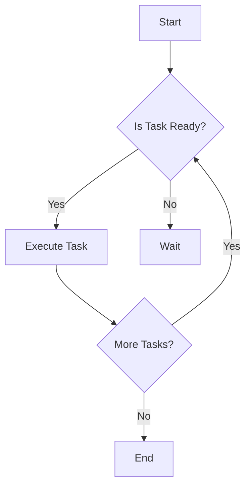

## 6.10.2 Task Prioritization and Timing

In the realm of concurrent programming, the Scheduler pattern plays a pivotal role in managing the execution of tasks. This section delves into the intricacies of task prioritization and timing, providing expert insights into how to effectively schedule tasks in Java applications. We'll explore strategies for assigning priorities, using delay and priority queues, and managing task execution at specific times or intervals. Additionally, we'll discuss the importance of accurate timing and best practices for handling dependencies between tasks.

### Understanding Task Prioritization

Task prioritization is crucial in systems where multiple tasks compete for limited resources. Prioritizing tasks ensures that critical operations are executed promptly, enhancing the system's responsiveness and efficiency.

#### Strategies for Assigning Priorities

1. **Static Prioritization**: Assign fixed priorities to tasks based on predefined criteria. This approach is simple but lacks flexibility.

2. **Dynamic Prioritization**: Adjust task priorities at runtime based on system state or task characteristics. This method is more adaptable but requires careful management.

3. **Deadline Scheduling**: Prioritize tasks based on their deadlines, ensuring time-sensitive tasks are completed on time.

4. **Fair Scheduling**: Ensure all tasks receive a fair share of resources, preventing starvation of lower-priority tasks.

5. **Weighted Prioritization**: Assign weights to tasks and calculate priorities based on these weights, allowing for more nuanced control.

#### Implementing Priority Queues

Java provides the `PriorityQueue` class, which can be used to manage tasks based on their priorities. Here's a simple example:

```java
import java.util.PriorityQueue;
import java.util.Comparator;

class Task implements Comparable<Task> {
    private String name;
    private int priority;

    public Task(String name, int priority) {
        this.name = name;
        this.priority = priority;
    }

    public int getPriority() {
        return priority;
    }

    @Override
    public int compareTo(Task other) {
        return Integer.compare(this.priority, other.priority);
    }

    @Override
    public String toString() {
        return "Task{name='" + name + "', priority=" + priority + '}';
    }
}

public class TaskScheduler {
    public static void main(String[] args) {
        PriorityQueue<Task> taskQueue = new PriorityQueue<>(Comparator.reverseOrder());

        taskQueue.add(new Task("Low Priority Task", 1));
        taskQueue.add(new Task("High Priority Task", 10));
        taskQueue.add(new Task("Medium Priority Task", 5));

        while (!taskQueue.isEmpty()) {
            System.out.println("Executing: " + taskQueue.poll());
        }
    }
}
```

**Key Points**:
- **PriorityQueue**: Automatically orders tasks based on their natural ordering or a provided comparator.
- **Comparator.reverseOrder()**: Ensures higher priority tasks are executed first.

### Managing Delayed Execution

Delayed execution allows tasks to be scheduled for future execution, which is essential for tasks that need to run at specific times or after certain intervals.

#### Using Delay Queues

The `DelayQueue` class in Java is designed for tasks that need to be executed after a delay. It is a specialized form of a priority queue where elements are ordered based on their delay time.

```java
import java.util.concurrent.DelayQueue;
import java.util.concurrent.Delayed;
import java.util.concurrent.TimeUnit;

class DelayedTask implements Delayed {
    private String name;
    private long startTime;

    public DelayedTask(String name, long delay) {
        this.name = name;
        this.startTime = System.currentTimeMillis() + delay;
    }

    @Override
    public long getDelay(TimeUnit unit) {
        long delay = startTime - System.currentTimeMillis();
        return unit.convert(delay, TimeUnit.MILLISECONDS);
    }

    @Override
    public int compareTo(Delayed other) {
        return Long.compare(this.getDelay(TimeUnit.MILLISECONDS), other.getDelay(TimeUnit.MILLISECONDS));
    }

    @Override
    public String toString() {
        return "DelayedTask{name='" + name + "'}";
    }
}

public class DelayedTaskScheduler {
    public static void main(String[] args) throws InterruptedException {
        DelayQueue<DelayedTask> delayQueue = new DelayQueue<>();

        delayQueue.add(new DelayedTask("Task 1", 5000)); // 5 seconds delay
        delayQueue.add(new DelayedTask("Task 2", 1000)); // 1 second delay
        delayQueue.add(new DelayedTask("Task 3", 3000)); // 3 seconds delay

        while (!delayQueue.isEmpty()) {
            DelayedTask task = delayQueue.take(); // Blocks until a task is ready
            System.out.println("Executing: " + task);
        }
    }
}
```

**Key Points**:
- **Delayed Interface**: Requires implementing `getDelay` and `compareTo` methods.
- **DelayQueue**: Blocks until the head task's delay has expired.

### Scheduling Tasks at Specific Times

Scheduling tasks to run at specific times is critical for applications requiring precise timing, such as cron jobs or time-based triggers.

#### Using `ScheduledExecutorService`

Java's `ScheduledExecutorService` provides methods to schedule tasks for one-time or periodic execution.

```java
import java.util.concurrent.Executors;
import java.util.concurrent.ScheduledExecutorService;
import java.util.concurrent.TimeUnit;

public class ScheduledTaskExample {
    public static void main(String[] args) {
        ScheduledExecutorService scheduler = Executors.newScheduledThreadPool(1);

        Runnable task = () -> System.out.println("Executing Task at " + System.currentTimeMillis());

        // Schedule task to run every 2 seconds with an initial delay of 1 second
        scheduler.scheduleAtFixedRate(task, 1, 2, TimeUnit.SECONDS);

        // Schedule task to run once after a 5-second delay
        scheduler.schedule(() -> System.out.println("One-time Task Executed"), 5, TimeUnit.SECONDS);
    }
}
```

**Key Points**:
- **scheduleAtFixedRate**: Executes tasks at fixed intervals.
- **schedule**: Schedules a one-time task after a delay.

#### Handling Time Zones and Clock Drift

Accurate timing is essential for reliable task scheduling. Consider the following:

1. **Time Zones**: Use `java.time` package to handle time zones and daylight saving changes.
2. **Clock Drift**: Regularly synchronize system clocks with a reliable time source to prevent drift.

```java
import java.time.ZonedDateTime;
import java.time.ZoneId;
import java.time.format.DateTimeFormatter;

public class TimeZoneExample {
    public static void main(String[] args) {
        ZonedDateTime now = ZonedDateTime.now(ZoneId.of("America/New_York"));
        System.out.println("Current Time in New York: " + now.format(DateTimeFormatter.RFC_1123_DATE_TIME));
    }
}
```

### Best Practices for Managing Task Dependencies

Managing dependencies between tasks is crucial to ensure correct execution order and prevent deadlocks or race conditions.

1. **Dependency Graphs**: Model task dependencies as graphs and use topological sorting to determine execution order.
2. **Task Chaining**: Use callbacks or futures to chain dependent tasks, ensuring one task completes before the next begins.
3. **Resource Locking**: Use locks or semaphores to manage access to shared resources, preventing concurrent modifications.

#### Example: Task Chaining with CompletableFuture

```java
import java.util.concurrent.CompletableFuture;

public class TaskChainingExample {
    public static void main(String[] args) {
        CompletableFuture<Void> future = CompletableFuture.runAsync(() -> {
            System.out.println("Task 1");
        }).thenRun(() -> {
            System.out.println("Task 2");
        }).thenRun(() -> {
            System.out.println("Task 3");
        });

        future.join(); // Wait for all tasks to complete
    }
}
```

**Key Points**:
- **CompletableFuture**: Allows chaining of asynchronous tasks.
- **thenRun**: Executes the next task after the previous one completes.

### Visualizing Task Scheduling

To better understand task scheduling, let's visualize a simple task scheduling process using a flowchart.



**Description**: This flowchart represents a basic task scheduling process where tasks are checked for readiness, executed if ready, and the process repeats until no more tasks remain.

### Try It Yourself

Experiment with the provided code examples by modifying task priorities, delays, and scheduling intervals. Observe how changes affect task execution order and timing. Consider implementing additional features such as task cancellation or rescheduling.

### Conclusion

Task prioritization and timing are fundamental aspects of the Scheduler pattern, enabling efficient and responsive task management in Java applications. By leveraging priority and delay queues, `ScheduledExecutorService`, and best practices for managing dependencies, you can build robust scheduling systems that meet the demands of modern software development.

Remember, this is just the beginning. As you progress, you'll build more complex and interactive scheduling systems. Keep experimenting, stay curious, and enjoy the journey!

---

## Quiz Time!



### What is the primary purpose of task prioritization in scheduling?

- [x] To ensure critical tasks are executed promptly
- [ ] To reduce the number of tasks
- [ ] To increase the complexity of scheduling
- [ ] To eliminate the need for scheduling

> **Explanation:** Task prioritization ensures that critical tasks are executed promptly, enhancing system responsiveness and efficiency.

### Which Java class is used for managing tasks based on their delay time?

- [ ] PriorityQueue
- [x] DelayQueue
- [ ] LinkedList
- [ ] ArrayList

> **Explanation:** The `DelayQueue` class is designed for tasks that need to be executed after a delay, ordering elements based on their delay time.

### What method in `ScheduledExecutorService` is used to schedule tasks at fixed intervals?

- [ ] schedule
- [x] scheduleAtFixedRate
- [ ] execute
- [ ] submit

> **Explanation:** The `scheduleAtFixedRate` method is used to execute tasks at fixed intervals, starting after an initial delay.

### What is a common issue that can affect accurate task timing?

- [x] Clock drift
- [ ] Task priority
- [ ] Task size
- [ ] Task name

> **Explanation:** Clock drift can affect accurate task timing, as it involves discrepancies between the system clock and a reliable time source.

### Which Java package is recommended for handling time zones?

- [ ] java.util
- [ ] java.lang
- [x] java.time
- [ ] java.io

> **Explanation:** The `java.time` package is recommended for handling time zones and daylight saving changes, providing robust date and time manipulation.

### What is the benefit of using `CompletableFuture` for task chaining?

- [x] It allows chaining of asynchronous tasks
- [ ] It increases task execution time
- [ ] It simplifies task cancellation
- [ ] It reduces the number of tasks

> **Explanation:** `CompletableFuture` allows chaining of asynchronous tasks, enabling one task to complete before the next begins.

### How can task dependencies be modeled in scheduling?

- [x] As graphs
- [ ] As arrays
- [ ] As strings
- [ ] As numbers

> **Explanation:** Task dependencies can be modeled as graphs, allowing for topological sorting to determine execution order.

### What is a key consideration when scheduling tasks at specific times?

- [x] Time zones
- [ ] Task size
- [ ] Task name
- [ ] Task color

> **Explanation:** Time zones are a key consideration when scheduling tasks at specific times, as they affect the timing and execution of tasks across different regions.

### Which method in `CompletableFuture` is used to execute the next task after the previous one completes?

- [ ] runAsync
- [ ] supplyAsync
- [x] thenRun
- [ ] complete

> **Explanation:** The `thenRun` method is used to execute the next task after the previous one completes, facilitating task chaining.

### True or False: Static prioritization allows for dynamic adjustment of task priorities at runtime.

- [ ] True
- [x] False

> **Explanation:** Static prioritization assigns fixed priorities to tasks based on predefined criteria and does not allow for dynamic adjustment at runtime.


