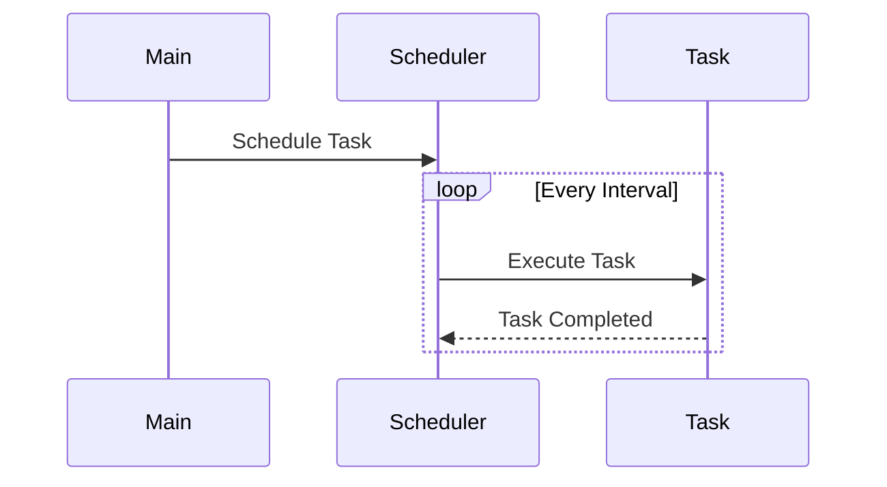

## 6.10.3 Use Cases and Examples

In the realm of software engineering, the Scheduler pattern plays a pivotal role in managing recurring tasks efficiently. This pattern is particularly useful for automating tasks that need to be executed at regular intervals, such as database backups, data synchronization, and report generation. In this section, we will delve into various use cases of the Scheduler pattern, illustrate its implementation with code examples, and discuss the challenges and solutions associated with it.

### Understanding the Scheduler Pattern

The Scheduler pattern is designed to manage the execution of tasks at specified intervals. It abstracts the complexity of timing and execution, allowing developers to focus on the tasks themselves rather than the intricacies of scheduling. This pattern is commonly implemented using Java's `ScheduledExecutorService`, which provides a robust framework for scheduling tasks.

#### Key Concepts

- **Task Scheduling**: The process of planning and executing tasks at predetermined times.
- **Recurring Tasks**: Tasks that need to be executed repeatedly at regular intervals.
- **Concurrency Management**: Handling multiple tasks simultaneously without interference.

### Practical Use Cases

Let's explore some practical applications of the Scheduler pattern in Java.

#### 1. Scheduling Regular Database Backups

Regular database backups are crucial for data integrity and disaster recovery. The Scheduler pattern can automate this process, ensuring that backups are performed consistently without manual intervention.

**Code Example:**

```java
import java.util.concurrent.Executors;
import java.util.concurrent.ScheduledExecutorService;
import java.util.concurrent.TimeUnit;

public class DatabaseBackupScheduler {

    private final ScheduledExecutorService scheduler = Executors.newScheduledThreadPool(1);

    public void scheduleBackup() {
        Runnable backupTask = () -> {
            // Code to perform database backup
            System.out.println("Database backup started at: " + System.currentTimeMillis());
            // Simulate backup process
            try {
                Thread.sleep(2000);
            } catch (InterruptedException e) {
                Thread.currentThread().interrupt();
            }
            System.out.println("Database backup completed at: " + System.currentTimeMillis());
        };

        // Schedule the task to run every 24 hours
        scheduler.scheduleAtFixedRate(backupTask, 0, 24, TimeUnit.HOURS);
    }

    public static void main(String[] args) {
        DatabaseBackupScheduler backupScheduler = new DatabaseBackupScheduler();
        backupScheduler.scheduleBackup();
    }
}
```

**Explanation:**

- **ScheduledExecutorService**: Utilized to manage the scheduling of tasks.
- **scheduleAtFixedRate**: Schedules the backup task to run every 24 hours.
- **Runnable**: Defines the task to be executed, in this case, a simulated database backup.

#### 2. Running Periodic Data Synchronization or Cleanup Tasks

Data synchronization and cleanup tasks are essential for maintaining data consistency and optimizing storage. The Scheduler pattern can automate these tasks, reducing the risk of human error and ensuring timely execution.

**Code Example:**

```java
import java.util.concurrent.Executors;
import java.util.concurrent.ScheduledExecutorService;
import java.util.concurrent.TimeUnit;

public class DataSyncScheduler {

    private final ScheduledExecutorService scheduler = Executors.newScheduledThreadPool(1);

    public void scheduleDataSync() {
        Runnable syncTask = () -> {
            // Code to perform data synchronization
            System.out.println("Data synchronization started at: " + System.currentTimeMillis());
            // Simulate synchronization process
            try {
                Thread.sleep(1000);
            } catch (InterruptedException e) {
                Thread.currentThread().interrupt();
            }
            System.out.println("Data synchronization completed at: " + System.currentTimeMillis());
        };

        // Schedule the task to run every 6 hours
        scheduler.scheduleAtFixedRate(syncTask, 0, 6, TimeUnit.HOURS);
    }

    public static void main(String[] args) {
        DataSyncScheduler syncScheduler = new DataSyncScheduler();
        syncScheduler.scheduleDataSync();
    }
}
```

**Explanation:**

- **scheduleAtFixedRate**: Schedules the synchronization task to run every 6 hours.
- **Runnable**: Defines the task to be executed, in this case, a simulated data synchronization.

#### 3. Automating Report Generation at Specified Intervals

Automated report generation is a common requirement in many applications, providing timely insights without manual effort. The Scheduler pattern can be used to generate reports at regular intervals, such as daily or weekly.

**Code Example:**

```java
import java.util.concurrent.Executors;
import java.util.concurrent.ScheduledExecutorService;
import java.util.concurrent.TimeUnit;

public class ReportGenerationScheduler {

    private final ScheduledExecutorService scheduler = Executors.newScheduledThreadPool(1);

    public void scheduleReportGeneration() {
        Runnable reportTask = () -> {
            // Code to generate report
            System.out.println("Report generation started at: " + System.currentTimeMillis());
            // Simulate report generation process
            try {
                Thread.sleep(1500);
            } catch (InterruptedException e) {
                Thread.currentThread().interrupt();
            }
            System.out.println("Report generation completed at: " + System.currentTimeMillis());
        };

        // Schedule the task to run every day at midnight
        scheduler.scheduleAtFixedRate(reportTask, 0, 1, TimeUnit.DAYS);
    }

    public static void main(String[] args) {
        ReportGenerationScheduler reportScheduler = new ReportGenerationScheduler();
        reportScheduler.scheduleReportGeneration();
    }
}
```

**Explanation:**

- **scheduleAtFixedRate**: Schedules the report generation task to run daily.
- **Runnable**: Defines the task to be executed, in this case, a simulated report generation.

### Challenges and Solutions

While the Scheduler pattern simplifies task management, it also presents certain challenges. Let's discuss some common issues and their solutions.

#### Handling Missed Executions

Missed executions can occur due to system downtime or unexpected errors. To handle this, consider implementing a retry mechanism or logging missed tasks for manual review.

**Solution:**

- **Retry Mechanism**: Implement logic to retry the task after a failure.
- **Logging**: Record missed executions for later analysis and manual intervention.

#### Managing Overlapping Tasks

Overlapping tasks can lead to resource contention and inconsistent results. To prevent this, ensure that tasks are designed to be idempotent or implement locking mechanisms to prevent concurrent execution.

**Solution:**

- **Idempotency**: Design tasks to produce the same result even if executed multiple times.
- **Locking Mechanisms**: Use synchronization or distributed locks to prevent overlapping executions.

### Visualizing the Scheduler Pattern

To better understand the Scheduler pattern, let's visualize the flow of task scheduling and execution using a sequence diagram.



**Description:**

- **Main**: Represents the main application that schedules tasks.
- **Scheduler**: Manages the timing and execution of tasks.
- **Task**: Represents the task being executed.

### Try It Yourself

To gain hands-on experience with the Scheduler pattern, try modifying the code examples provided:

- **Change the Interval**: Adjust the scheduling interval to see how it affects task execution.
- **Add Logging**: Implement logging to track task execution times and outcomes.
- **Simulate Failures**: Introduce intentional failures to test retry mechanisms and error handling.

### Encouragement and Final Thoughts

Remember, the Scheduler pattern is a powerful tool for managing recurring tasks efficiently. By automating routine processes, you can free up valuable time and resources for more critical tasks. Keep experimenting with different scheduling strategies and explore how the Scheduler pattern can enhance your applications.

## Quiz Time!



### What is the primary purpose of the Scheduler pattern?

- [x] To manage the execution of tasks at specified intervals
- [ ] To handle user authentication
- [ ] To optimize database queries
- [ ] To manage memory allocation

> **Explanation:** The Scheduler pattern is designed to manage the execution of tasks at specified intervals, automating recurring processes.

### Which Java class is commonly used to implement the Scheduler pattern?

- [x] ScheduledExecutorService
- [ ] ThreadPoolExecutor
- [ ] Timer
- [ ] FutureTask

> **Explanation:** The `ScheduledExecutorService` is commonly used to implement the Scheduler pattern in Java, providing a robust framework for scheduling tasks.

### What is a common challenge when using the Scheduler pattern?

- [x] Handling missed executions
- [ ] Managing user sessions
- [ ] Optimizing database queries
- [ ] Handling file uploads

> **Explanation:** A common challenge when using the Scheduler pattern is handling missed executions due to system downtime or errors.

### How can overlapping tasks be prevented in the Scheduler pattern?

- [x] By designing tasks to be idempotent
- [ ] By increasing the number of threads
- [ ] By reducing the task execution time
- [ ] By using a different scheduling algorithm

> **Explanation:** Overlapping tasks can be prevented by designing tasks to be idempotent, ensuring consistent results even if executed multiple times.

### What is one benefit of using the Scheduler pattern for report generation?

- [x] Automates the process, reducing manual effort
- [ ] Increases the complexity of the code
- [ ] Requires more resources
- [ ] Decreases application performance

> **Explanation:** The Scheduler pattern automates report generation, reducing manual effort and ensuring timely execution.

### Which method is used to schedule a task to run at fixed intervals?

- [x] scheduleAtFixedRate
- [ ] execute
- [ ] submit
- [ ] invokeAll

> **Explanation:** The `scheduleAtFixedRate` method is used to schedule a task to run at fixed intervals in the `ScheduledExecutorService`.

### What is a potential solution for handling missed executions?

- [x] Implementing a retry mechanism
- [ ] Increasing the number of threads
- [ ] Reducing the task execution time
- [ ] Using a different scheduling algorithm

> **Explanation:** Implementing a retry mechanism is a potential solution for handling missed executions, ensuring tasks are retried after a failure.

### What is the role of the `Runnable` interface in the Scheduler pattern?

- [x] To define the task to be executed
- [ ] To manage the scheduling of tasks
- [ ] To handle user input
- [ ] To optimize database queries

> **Explanation:** The `Runnable` interface is used to define the task to be executed in the Scheduler pattern.

### How can tasks be designed to prevent overlapping executions?

- [x] By implementing locking mechanisms
- [ ] By reducing the task execution time
- [ ] By using a different scheduling algorithm
- [ ] By increasing the number of threads

> **Explanation:** Tasks can be designed to prevent overlapping executions by implementing locking mechanisms, ensuring only one instance of a task runs at a time.

### The Scheduler pattern is useful for automating which type of tasks?

- [x] Recurring tasks
- [ ] User authentication tasks
- [ ] Database query optimization
- [ ] Memory management tasks

> **Explanation:** The Scheduler pattern is useful for automating recurring tasks, ensuring they are executed at specified intervals without manual intervention.


