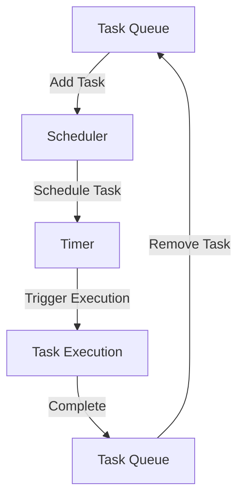

## 6.10 Scheduler Pattern

In the realm of concurrent programming, the Scheduler Pattern plays a pivotal role in managing task execution and resource allocation efficiently. This pattern is essential for executing tasks according to specified criteria, such as timing or priority, thereby optimizing the overall performance of applications. In this section, we will delve into the intricacies of the Scheduler Pattern, exploring its intent, components, and practical applications.

### Understanding the Scheduler Pattern

The Scheduler Pattern is a design pattern that focuses on the efficient management of task execution in concurrent environments. Its primary intent is to organize and manage the execution of tasks based on specific scheduling criteria, such as time intervals, deadlines, or priority levels. By doing so, it helps in optimizing the use of system resources and ensuring that tasks are executed in a timely and orderly manner.

#### Intent of the Scheduler Pattern

The Scheduler Pattern aims to:

- **Manage Task Execution**: By scheduling tasks based on predefined criteria, the pattern ensures that tasks are executed efficiently and in the correct order.
- **Optimize Resource Allocation**: By controlling when and how tasks are executed, the pattern helps in making optimal use of system resources, such as CPU and memory.
- **Enhance System Performance**: By preventing resource contention and ensuring timely task execution, the pattern contributes to improved overall system performance.

### The Problem Solved by the Scheduler Pattern

In concurrent programming, one of the significant challenges is managing the execution of multiple tasks that may have varying execution requirements. Tasks may need to be executed at specific times, repeated at regular intervals, or prioritized based on their importance. Without a structured approach to scheduling, tasks can end up competing for resources, leading to inefficiencies and potential system bottlenecks.

The Scheduler Pattern addresses these challenges by providing a framework for organizing and managing task execution. It ensures that tasks are executed according to their scheduling criteria, thereby preventing resource contention and optimizing system performance.

### Components of the Scheduler Pattern

The Scheduler Pattern is composed of several key components that work together to manage task execution effectively:

1. **Task Queues**: These are data structures that hold tasks waiting to be executed. Tasks are typically added to the queue based on their scheduling criteria, such as execution time or priority.

2. **Timers**: Timers are used to trigger the execution of tasks at specific times or intervals. They play a crucial role in ensuring that tasks are executed according to their scheduling criteria.

3. **Execution Policies**: These define the rules for executing tasks, such as the order of execution, handling of task dependencies, and resource allocation strategies.

4. **Schedulers**: The core component that manages the task queues, timers, and execution policies. It is responsible for coordinating the execution of tasks based on their scheduling criteria.

### Implementing the Scheduler Pattern in Java

Java provides robust support for implementing the Scheduler Pattern through its concurrency utilities. The `ScheduledExecutorService` is a key class in the `java.util.concurrent` package that facilitates the scheduling of tasks for execution at specific times or intervals.

#### Example: Using `ScheduledExecutorService`

Let's explore how to implement a simple task scheduler using Java's `ScheduledExecutorService`.

```java
import java.util.concurrent.Executors;
import java.util.concurrent.ScheduledExecutorService;
import java.util.concurrent.TimeUnit;

public class TaskScheduler {

    public static void main(String[] args) {
        // Create a ScheduledExecutorService with a pool of 1 thread
        ScheduledExecutorService scheduler = Executors.newScheduledThreadPool(1);

        // Schedule a task to run after a 5-second delay
        scheduler.schedule(() -> {
            System.out.println("Task executed after 5 seconds");
        }, 5, TimeUnit.SECONDS);

        // Schedule a task to run repeatedly every 10 seconds
        scheduler.scheduleAtFixedRate(() -> {
            System.out.println("Repeating task executed");
        }, 0, 10, TimeUnit.SECONDS);

        // Schedule a task to run repeatedly with a fixed delay of 15 seconds
        scheduler.scheduleWithFixedDelay(() -> {
            System.out.println("Fixed delay task executed");
        }, 0, 15, TimeUnit.SECONDS);

        // Shutdown the scheduler after some time
        scheduler.schedule(() -> {
            scheduler.shutdown();
            System.out.println("Scheduler shutdown");
        }, 60, TimeUnit.SECONDS);
    }
}
```

**Explanation:**

- **ScheduledExecutorService**: This class provides methods to schedule tasks for execution at specific times or intervals.
- **schedule**: Schedules a one-time task to run after a specified delay.
- **scheduleAtFixedRate**: Schedules a task to run repeatedly at fixed intervals.
- **scheduleWithFixedDelay**: Schedules a task to run repeatedly with a fixed delay between the end of one execution and the start of the next.

### Use Cases of the Scheduler Pattern

The Scheduler Pattern is widely used in various applications where task execution needs to be managed efficiently. Some common use cases include:

- **Cron Jobs**: Automating repetitive tasks, such as data backups or report generation, at specific times or intervals.
- **Automated Tasks**: Scheduling tasks like sending emails, updating databases, or processing data at regular intervals.
- **Real-Time Systems**: Managing the execution of tasks in real-time applications, such as monitoring systems or financial trading platforms.

### Visualizing the Scheduler Pattern

To better understand the Scheduler Pattern, let's visualize its components and interactions using a Mermaid.js diagram.



**Diagram Description:**

- **Task Queue**: Holds tasks waiting to be executed.
- **Scheduler**: Manages the scheduling of tasks based on their criteria.
- **Timer**: Triggers the execution of tasks at specific times or intervals.
- **Task Execution**: Represents the execution of a scheduled task.

### Advanced Concepts in Scheduler Pattern

The Scheduler Pattern can be extended to include more advanced concepts, such as:

- **Priority Scheduling**: Assigning priorities to tasks and scheduling them based on their importance.
- **Dynamic Scheduling**: Adjusting the scheduling criteria of tasks based on runtime conditions or feedback.
- **Resource-Aware Scheduling**: Considering resource availability and constraints when scheduling tasks.

#### Priority Scheduling Example

In priority scheduling, tasks are assigned priorities, and the scheduler executes tasks based on their priority levels. Higher-priority tasks are executed before lower-priority ones.

```java
import java.util.concurrent.PriorityBlockingQueue;
import java.util.concurrent.ThreadPoolExecutor;
import java.util.concurrent.TimeUnit;

public class PriorityTaskScheduler {

    public static void main(String[] args) {
        // Create a PriorityBlockingQueue for tasks
        PriorityBlockingQueue<Runnable> taskQueue = new PriorityBlockingQueue<>();

        // Create a ThreadPoolExecutor with the priority queue
        ThreadPoolExecutor executor = new ThreadPoolExecutor(
                1, 1, 0L, TimeUnit.MILLISECONDS, taskQueue);

        // Submit tasks with different priorities
        executor.execute(new PriorityTask(1, "Low priority task"));
        executor.execute(new PriorityTask(10, "High priority task"));
        executor.execute(new PriorityTask(5, "Medium priority task"));

        // Shutdown the executor
        executor.shutdown();
    }
}

class PriorityTask implements Runnable, Comparable<PriorityTask> {
    private final int priority;
    private final String taskName;

    public PriorityTask(int priority, String taskName) {
        this.priority = priority;
        this.taskName = taskName;
    }

    @Override
    public void run() {
        System.out.println("Executing: " + taskName);
    }

    @Override
    public int compareTo(PriorityTask other) {
        return Integer.compare(other.priority, this.priority);
    }
}
```

**Explanation:**

- **PriorityBlockingQueue**: A thread-safe queue that orders tasks based on their priority.
- **ThreadPoolExecutor**: Executes tasks from the priority queue, ensuring higher-priority tasks are executed first.
- **PriorityTask**: A task with a priority level, implementing `Comparable` to define the ordering.

### Try It Yourself

Experiment with the provided code examples by modifying the scheduling criteria, such as changing the delay or interval times. Try implementing additional features, such as priority scheduling or dynamic scheduling, to see how they affect task execution.

### Knowledge Check

- **What is the primary intent of the Scheduler Pattern?**
- **How does the `ScheduledExecutorService` facilitate task scheduling in Java?**
- **What are the key components of the Scheduler Pattern?**
- **How can priority scheduling be implemented using Java concurrency utilities?**

### Summary

The Scheduler Pattern is a powerful tool for managing task execution and resource allocation in concurrent programming. By organizing tasks based on specific scheduling criteria, it helps in optimizing system performance and ensuring efficient resource utilization. Through Java's concurrency utilities, such as `ScheduledExecutorService`, developers can implement robust scheduling solutions for various applications, from cron jobs to real-time systems.

Remember, this is just the beginning. As you progress, you'll build more complex and interactive scheduling systems. Keep experimenting, stay curious, and enjoy the journey!

## Quiz Time!



### What is the primary intent of the Scheduler Pattern?

- [x] To manage task execution and resource allocation efficiently.
- [ ] To provide a graphical user interface for task management.
- [ ] To simplify database interactions.
- [ ] To enhance security in concurrent applications.

> **Explanation:** The primary intent of the Scheduler Pattern is to manage task execution and resource allocation efficiently by scheduling tasks according to specified criteria.

### Which Java class is commonly used to implement the Scheduler Pattern?

- [ ] Thread
- [x] ScheduledExecutorService
- [ ] TimerTask
- [ ] Semaphore

> **Explanation:** The `ScheduledExecutorService` class in Java is commonly used to implement the Scheduler Pattern, providing methods for scheduling tasks at specific times or intervals.

### What is a key component of the Scheduler Pattern?

- [ ] Database connections
- [x] Task Queues
- [ ] User interfaces
- [ ] Network protocols

> **Explanation:** Task Queues are a key component of the Scheduler Pattern, holding tasks waiting to be executed based on their scheduling criteria.

### How does the `scheduleAtFixedRate` method differ from `scheduleWithFixedDelay`?

- [x] `scheduleAtFixedRate` schedules tasks at fixed intervals, while `scheduleWithFixedDelay` schedules tasks with a fixed delay between executions.
- [ ] Both methods schedule tasks at fixed intervals.
- [ ] `scheduleWithFixedDelay` is used for one-time tasks.
- [ ] `scheduleAtFixedRate` is used for priority scheduling.

> **Explanation:** `scheduleAtFixedRate` schedules tasks at fixed intervals, whereas `scheduleWithFixedDelay` schedules tasks with a fixed delay between the end of one execution and the start of the next.

### What does priority scheduling involve?

- [x] Assigning priorities to tasks and executing them based on their importance.
- [ ] Scheduling tasks based on their memory usage.
- [ ] Executing tasks in alphabetical order.
- [ ] Scheduling tasks randomly.

> **Explanation:** Priority scheduling involves assigning priorities to tasks and executing them based on their importance, ensuring higher-priority tasks are executed before lower-priority ones.

### What is the role of a Timer in the Scheduler Pattern?

- [ ] To manage database transactions.
- [x] To trigger the execution of tasks at specific times or intervals.
- [ ] To handle user input events.
- [ ] To encrypt data.

> **Explanation:** In the Scheduler Pattern, a Timer is used to trigger the execution of tasks at specific times or intervals, ensuring tasks are executed according to their scheduling criteria.

### What is an example of a use case for the Scheduler Pattern?

- [ ] User authentication
- [x] Cron Jobs
- [ ] File compression
- [ ] Image rendering

> **Explanation:** Cron Jobs are a common use case for the Scheduler Pattern, automating repetitive tasks at specific times or intervals.

### How can dynamic scheduling be achieved?

- [ ] By hardcoding task execution times.
- [ ] By using static scheduling criteria.
- [x] By adjusting scheduling criteria based on runtime conditions.
- [ ] By executing tasks in parallel.

> **Explanation:** Dynamic scheduling can be achieved by adjusting scheduling criteria based on runtime conditions or feedback, allowing for more flexible task management.

### True or False: The Scheduler Pattern can only be used for real-time systems.

- [ ] True
- [x] False

> **Explanation:** False. The Scheduler Pattern can be used in various applications, not just real-time systems, to manage task execution efficiently.

### What is a benefit of using the Scheduler Pattern?

- [x] Optimizing resource allocation and enhancing system performance.
- [ ] Simplifying user interface design.
- [ ] Reducing code redundancy.
- [ ] Improving network security.

> **Explanation:** A benefit of using the Scheduler Pattern is optimizing resource allocation and enhancing system performance by managing task execution efficiently.


