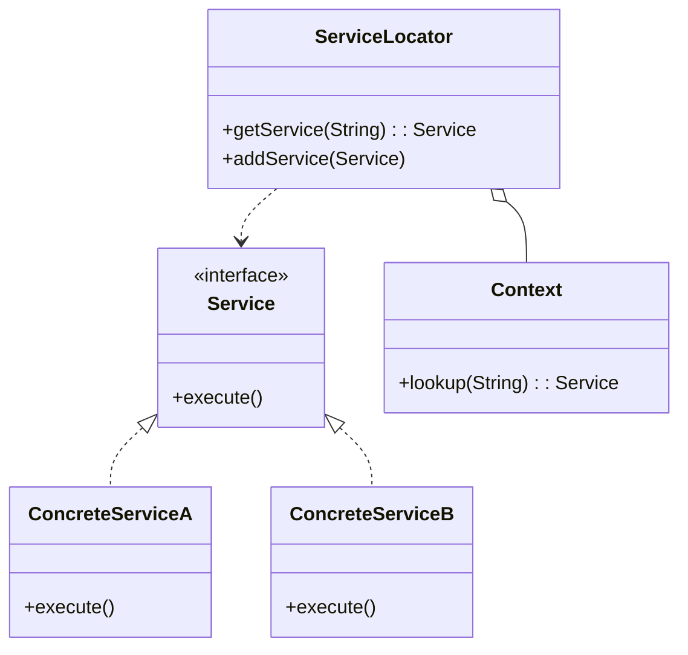

## 6.11.1 Implementing Service Locator in Java

The Service Locator pattern is a design pattern used in software development to provide a central registry for service objects. This pattern is particularly useful in applications where services are used extensively, and it helps reduce the dependency of clients on specific service implementations. In this section, we will explore the intent of the Service Locator pattern, its structure, and how to implement it in Java.

### Intent

The primary intent of the Service Locator pattern is to encapsulate the processes involved in obtaining a service object. It acts as a central point for service registration and lookup, allowing clients to access services without needing to know the details of their instantiation or configuration. This pattern is beneficial in decoupling the client from the concrete implementations of services, promoting flexibility and maintainability.

### Structure

The Service Locator pattern typically involves the following components:

- **Service**: An interface or abstract class that defines the service's operations.
- **Concrete Service**: A class that implements the `Service` interface.
- **Service Locator**: A class that provides methods to register and retrieve services.
- **Context**: A class responsible for creating and managing service instances.

Below is a class diagram illustrating the components of the Service Locator pattern:



*Diagram: The structure of the Service Locator pattern, showing the relationships between the Service, Concrete Service, Service Locator, and Context.*

### Implementation in Java

To implement the Service Locator pattern in Java, follow these steps:

#### Step 1: Define the Service Interface

Begin by defining a `Service` interface that declares the operations that all services must implement.

```java
public interface Service {
    String getName();
    void execute();
}
```

#### Step 2: Create Concrete Service Classes

Implement the `Service` interface in concrete service classes. Each class represents a specific service.

```java
public class ConcreteServiceA implements Service {
    @Override
    public String getName() {
        return "ServiceA";
    }

    @Override
    public void execute() {
        System.out.println("Executing Service A");
    }
}

public class ConcreteServiceB implements Service {
    @Override
    public String getName() {
        return "ServiceB";
    }

    @Override
    public void execute() {
        System.out.println("Executing Service B");
    }
}
```

#### Step 3: Implement the Context Class

The `Context` class is responsible for creating and managing service instances. It simulates the initial context for service lookup.

```java
public class Context {
    public Service lookup(String serviceName) {
        if (serviceName.equalsIgnoreCase("ServiceA")) {
            return new ConcreteServiceA();
        } else if (serviceName.equalsIgnoreCase("ServiceB")) {
            return new ConcreteServiceB();
        }
        return null;
    }
}
```

#### Step 4: Develop the Service Locator Class

The `ServiceLocator` class provides methods to register and retrieve services. It maintains a cache of service instances to improve performance by avoiding repeated lookups.

```java
import java.util.HashMap;
import java.util.Map;

public class ServiceLocator {
    private static Map<String, Service> cache = new HashMap<>();
    private static Context context = new Context();

    public static Service getService(String serviceName) {
        Service service = cache.get(serviceName);

        if (service != null) {
            System.out.println("Returning cached " + serviceName + " object");
            return service;
        }

        service = context.lookup(serviceName);
        if (service != null) {
            cache.put(serviceName, service);
        }
        return service;
    }
}
```

#### Step 5: Demonstrate the Service Locator Pattern

Create a client class to demonstrate how the Service Locator pattern can be used to obtain and execute services.

```java
public class ServiceLocatorDemo {
    public static void main(String[] args) {
        Service service1 = ServiceLocator.getService("ServiceA");
        service1.execute();

        Service service2 = ServiceLocator.getService("ServiceB");
        service2.execute();

        // Retrieve the cached service
        Service service3 = ServiceLocator.getService("ServiceA");
        service3.execute();
    }
}
```

### Reducing Client Dependency

The Service Locator pattern reduces the client's dependency on specific implementations by providing a central point for service lookup. Clients interact with the `ServiceLocator` rather than directly instantiating service objects. This decoupling allows for easier maintenance and flexibility, as changes to service implementations do not affect client code.

### Practical Applications

The Service Locator pattern is particularly useful in large enterprise applications where services are numerous and frequently accessed. It is commonly used in conjunction with dependency injection frameworks to manage service lifecycles and dependencies.

### Historical Context and Evolution

The Service Locator pattern emerged as a solution to manage service dependencies in complex applications. Over time, it has evolved to incorporate caching mechanisms and integration with modern dependency injection frameworks. While it remains a valuable pattern, developers must be cautious of potential drawbacks, such as hidden dependencies and difficulties in testing.

### Common Pitfalls and Best Practices

- **Avoid Overuse**: Over-reliance on the Service Locator pattern can lead to hidden dependencies and reduced code clarity. Use it judiciously and consider alternatives like dependency injection.
- **Ensure Thread Safety**: When implementing caching in a multi-threaded environment, ensure that the cache is thread-safe.
- **Maintain Clear Documentation**: Document the services registered with the Service Locator to avoid confusion and facilitate maintenance.

### Exercises and Practice Problems

1. **Modify the Context Class**: Extend the `Context` class to support additional services. Implement a new service and demonstrate its registration and retrieval.
2. **Implement Thread Safety**: Refactor the `ServiceLocator` class to ensure thread safety when accessing the cache.
3. **Integrate with Dependency Injection**: Explore how the Service Locator pattern can be integrated with a dependency injection framework like Spring.

### Key Takeaways

- The Service Locator pattern provides a centralized mechanism for service registration and lookup, reducing client dependencies on specific implementations.
- It is beneficial in large applications with numerous services, promoting flexibility and maintainability.
- Developers should be mindful of potential drawbacks, such as hidden dependencies and testing challenges.

### Related Patterns

- **[6.6 Singleton Pattern]( "Singleton Pattern")**: Often used in conjunction with the Service Locator to ensure a single instance of the locator.
- **Dependency Injection**: An alternative to the Service Locator pattern, focusing on injecting dependencies directly into clients.

### Known Uses

- **Java EE**: The Service Locator pattern is commonly used in Java EE applications to manage service lookups.
- **Spring Framework**: While Spring primarily uses dependency injection, it also supports service lookup mechanisms.

## Test Your Knowledge: Service Locator Pattern in Java Quiz



### What is the primary purpose of the Service Locator pattern?

- [x] To provide a central point for service registration and lookup.
- [ ] To create a single instance of a class.
- [ ] To manage object creation.
- [ ] To encapsulate complex algorithms.

> **Explanation:** The Service Locator pattern is designed to provide a central point for service registration and lookup, reducing client dependencies on specific implementations.

### Which component is responsible for creating and managing service instances in the Service Locator pattern?

- [ ] Service
- [ ] Service Locator
- [x] Context
- [ ] Client

> **Explanation:** The Context class is responsible for creating and managing service instances in the Service Locator pattern.

### How does the Service Locator pattern reduce client dependency?

- [x] By providing a central point for service lookup, decoupling clients from specific implementations.
- [ ] By enforcing a strict interface for all services.
- [ ] By caching service instances.
- [ ] By using reflection to instantiate services.

> **Explanation:** The Service Locator pattern reduces client dependency by providing a central point for service lookup, allowing clients to interact with services without knowing their specific implementations.

### What is a potential drawback of the Service Locator pattern?

- [x] Hidden dependencies can make testing difficult.
- [ ] It requires extensive use of reflection.
- [ ] It increases the complexity of service interfaces.
- [ ] It mandates the use of a specific framework.

> **Explanation:** A potential drawback of the Service Locator pattern is that hidden dependencies can make testing difficult, as clients are not aware of the specific services they depend on.

### In the provided Java implementation, what is the role of the `ServiceLocator` class?

- [x] To cache and retrieve service instances.
- [ ] To define the service interface.
- [ ] To execute service operations.
- [ ] To manage service lifecycles.

> **Explanation:** The `ServiceLocator` class is responsible for caching and retrieving service instances, reducing the need for repeated lookups.

### How can the Service Locator pattern be integrated with dependency injection frameworks?

- [x] By using the Service Locator to manage service lifecycles and dependencies.
- [ ] By replacing the Service Locator with dependency injection.
- [ ] By using reflection to inject dependencies.
- [ ] By creating a new service interface.

> **Explanation:** The Service Locator pattern can be integrated with dependency injection frameworks by using it to manage service lifecycles and dependencies.

### What is a common use case for the Service Locator pattern?

- [x] Large enterprise applications with numerous services.
- [ ] Small applications with few dependencies.
- [ ] Applications that require real-time data processing.
- [ ] Applications that use machine learning algorithms.

> **Explanation:** The Service Locator pattern is commonly used in large enterprise applications with numerous services, where it helps manage service dependencies.

### Which design pattern is often used in conjunction with the Service Locator?

- [x] Singleton Pattern
- [ ] Factory Pattern
- [ ] Observer Pattern
- [ ] Strategy Pattern

> **Explanation:** The Singleton Pattern is often used in conjunction with the Service Locator to ensure a single instance of the locator.

### What is a best practice when using the Service Locator pattern?

- [x] Document the services registered with the Service Locator.
- [ ] Use reflection to instantiate services.
- [ ] Avoid caching service instances.
- [ ] Use it extensively in all applications.

> **Explanation:** A best practice when using the Service Locator pattern is to document the services registered with it, to avoid confusion and facilitate maintenance.

### True or False: The Service Locator pattern is a type of Creational Pattern.

- [x] True
- [ ] False

> **Explanation:** True. The Service Locator pattern is considered a type of Creational Pattern as it deals with the creation and management of service instances.


