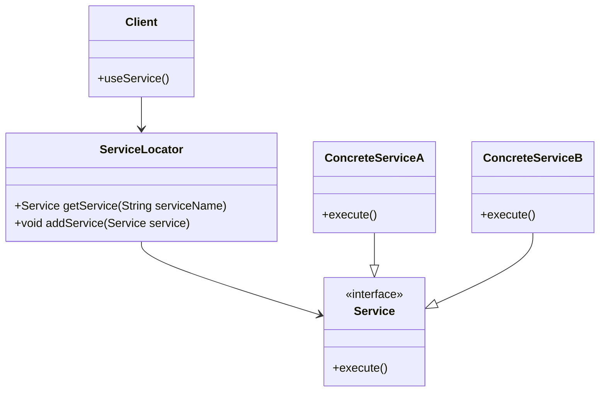

## 6.11.2 Managing Dependencies in Large Applications

In the realm of software development, managing dependencies effectively is crucial, especially in large applications where complexity can quickly spiral out of control. The Service Locator pattern emerges as a powerful tool in this context, offering a centralized approach to dependency management that enhances modularity and decoupling. This section delves into the intricacies of managing dependencies in large Java applications using the Service Locator pattern, providing insights, practical examples, and best practices.

### Challenges of Dependency Management in Large Codebases

As applications grow in size and complexity, managing dependencies becomes increasingly challenging. Here are some common issues faced in large codebases:

1. **Tight Coupling**: Direct dependencies between classes can lead to a tightly coupled system, making it difficult to modify or replace components without affecting others.

2. **Scalability Issues**: As the number of dependencies increases, the application becomes harder to scale and maintain.

3. **Complex Configuration**: Managing configurations for numerous dependencies can become cumbersome, especially when dealing with different environments (development, testing, production).

4. **Testing Difficulties**: Tight coupling and complex configurations can make unit testing challenging, as it becomes difficult to isolate components.

5. **Code Duplication**: Without a centralized approach, similar dependency resolution logic may be duplicated across the application, leading to maintenance overhead.

### The Service Locator Pattern: Centralizing Dependency Resolution

The Service Locator pattern addresses these challenges by providing a centralized registry for managing dependencies. It acts as a container that holds references to services and provides them to clients upon request. This pattern decouples the client from the concrete implementations of services, allowing for greater flexibility and modularity.

#### Key Concepts of the Service Locator Pattern

- **Service Registry**: A central repository that holds references to service instances. It is responsible for locating and providing services to clients.

- **Service Interface**: Defines the contract that services must adhere to. Clients interact with services through these interfaces, ensuring decoupling from concrete implementations.

- **Service Implementation**: The actual implementation of the service interface. These implementations are registered with the Service Locator.

- **Client**: The component that requires a service. It requests the service from the Service Locator rather than directly instantiating it.

#### Structure of the Service Locator Pattern



*Diagram: The structure of the Service Locator pattern, illustrating the relationships between the Service Locator, services, and clients.*

### Implementing the Service Locator Pattern in Java

Let's explore a Java implementation of the Service Locator pattern, demonstrating how to organize services and interfaces effectively.

#### Step 1: Define the Service Interface

First, define a common interface for all services. This ensures that clients interact with services through a consistent API.

```java
public interface Service {
    void execute();
}
```

#### Step 2: Implement Concrete Services

Create concrete implementations of the service interface. These classes provide the actual functionality.

```java
public class ConcreteServiceA implements Service {
    @Override
    public void execute() {
        System.out.println("Executing ConcreteServiceA");
    }
}

public class ConcreteServiceB implements Service {
    @Override
    public void execute() {
        System.out.println("Executing ConcreteServiceB");
    }
}
```

#### Step 3: Implement the Service Locator

The Service Locator manages service instances and provides them to clients.

```java
import java.util.HashMap;
import java.util.Map;

public class ServiceLocator {
    private static Map<String, Service> services = new HashMap<>();

    public static Service getService(String serviceName) {
        return services.get(serviceName);
    }

    public static void addService(String serviceName, Service service) {
        services.put(serviceName, service);
    }
}
```

#### Step 4: Use the Service Locator in Clients

Clients request services from the Service Locator, promoting decoupling from concrete implementations.

```java
public class Client {
    public void useService(String serviceName) {
        Service service = ServiceLocator.getService(serviceName);
        if (service != null) {
            service.execute();
        } else {
            System.out.println("Service not found: " + serviceName);
        }
    }
}
```

#### Step 5: Register Services

Register service instances with the Service Locator during application initialization.

```java
public class Application {
    public static void main(String[] args) {
        ServiceLocator.addService("ServiceA", new ConcreteServiceA());
        ServiceLocator.addService("ServiceB", new ConcreteServiceB());

        Client client = new Client();
        client.useService("ServiceA");
        client.useService("ServiceB");
    }
}
```

### Benefits of the Service Locator Pattern

The Service Locator pattern offers several advantages in managing dependencies in large applications:

1. **Modularity**: By decoupling clients from concrete implementations, the pattern promotes modularity, allowing components to be developed and tested independently.

2. **Flexibility**: Services can be easily replaced or extended without affecting clients, enhancing the flexibility of the application.

3. **Centralized Configuration**: The Service Locator centralizes service configuration, simplifying management and reducing duplication.

4. **Improved Testability**: The decoupling of clients and services facilitates unit testing, as services can be easily mocked or stubbed.

5. **Reduced Coupling**: Clients interact with services through interfaces, reducing direct dependencies and promoting a more loosely coupled architecture.

### Real-World Scenarios and Best Practices

In real-world applications, the Service Locator pattern is particularly useful in scenarios where:

- **Dynamic Service Resolution**: Applications that require dynamic service resolution based on runtime conditions can benefit from the flexibility of the Service Locator.

- **Complex Dependency Graphs**: In systems with complex dependency graphs, the pattern simplifies dependency management by centralizing service resolution.

- **Microservices Architecture**: In a microservices architecture, the Service Locator can manage service discovery and communication between services.

#### Best Practices

- **Use Dependency Injection**: Combine the Service Locator with dependency injection frameworks (e.g., Spring) to enhance flexibility and manage complex dependencies.

- **Avoid Overuse**: While the Service Locator is powerful, overuse can lead to a "service locator anti-pattern," where the locator becomes a dumping ground for all services. Use it judiciously.

- **Ensure Thread Safety**: In multi-threaded applications, ensure that the Service Locator is thread-safe to prevent concurrency issues.

- **Document Services**: Maintain clear documentation of available services and their interfaces to facilitate maintenance and onboarding.

### Conclusion

The Service Locator pattern is a valuable tool for managing dependencies in large Java applications. By centralizing dependency resolution, it enhances modularity, flexibility, and testability, addressing common challenges in large codebases. When used judiciously and in combination with other patterns and frameworks, it can significantly improve the architecture and maintainability of complex systems.

### Related Patterns

- **[6.6 Singleton Pattern]( "Singleton Pattern")**: Often used in conjunction with the Service Locator to ensure a single instance of the locator.

- **[6.7 Factory Pattern]( "Factory Pattern")**: Can be used to create service instances dynamically.

- **[6.8 Dependency Injection]( "Dependency Injection")**: A complementary pattern that provides an alternative approach to managing dependencies.

### Further Reading

- Oracle Java Documentation: [Java Documentation](https://docs.oracle.com/en/java/)
- Microsoft Cloud Design Patterns: [Cloud Design Patterns](https://learn.microsoft.com/en-us/azure/architecture/patterns/)

---

## Test Your Knowledge: Managing Dependencies with Service Locator Pattern



### What is the primary role of the Service Locator in managing dependencies?

- [x] Centralizing service resolution
- [ ] Creating service instances
- [ ] Managing service lifecycle
- [ ] Monitoring service performance

> **Explanation:** The Service Locator centralizes service resolution, acting as a registry for managing dependencies.

### Which of the following is a benefit of using the Service Locator pattern?

- [x] Improved modularity
- [ ] Increased coupling
- [ ] Reduced flexibility
- [ ] Complex configuration

> **Explanation:** The Service Locator pattern improves modularity by decoupling clients from concrete implementations.

### How does the Service Locator pattern enhance testability?

- [x] By decoupling clients from services
- [ ] By providing detailed logs
- [ ] By enforcing strict type checking
- [ ] By reducing code duplication

> **Explanation:** Decoupling clients from services allows for easier mocking and stubbing, enhancing testability.

### What is a potential drawback of overusing the Service Locator pattern?

- [x] It can become a dumping ground for all services.
- [ ] It increases code readability.
- [ ] It simplifies service configuration.
- [ ] It enhances performance.

> **Explanation:** Overuse can lead to a "service locator anti-pattern," where the locator becomes cluttered.

### In which scenario is the Service Locator pattern particularly useful?

- [x] Dynamic service resolution
- [ ] Static service configuration
- [ ] Simple applications
- [ ] Single-threaded environments

> **Explanation:** The pattern is useful for dynamic service resolution based on runtime conditions.

### What should be ensured in a multi-threaded application using the Service Locator?

- [x] Thread safety
- [ ] High memory usage
- [ ] Complex algorithms
- [ ] Single-threaded execution

> **Explanation:** Ensuring thread safety prevents concurrency issues in multi-threaded applications.

### Which pattern is often used with the Service Locator to ensure a single instance?

- [x] Singleton Pattern
- [ ] Factory Pattern
- [ ] Observer Pattern
- [ ] Strategy Pattern

> **Explanation:** The Singleton Pattern is used to ensure a single instance of the Service Locator.

### What is a key component of the Service Locator pattern?

- [x] Service Registry
- [ ] Service Monitor
- [ ] Service Logger
- [ ] Service Optimizer

> **Explanation:** The Service Registry holds references to service instances.

### How does the Service Locator pattern reduce coupling?

- [x] By using service interfaces
- [ ] By enforcing strict dependencies
- [ ] By increasing service instances
- [ ] By reducing service interfaces

> **Explanation:** Clients interact with services through interfaces, reducing direct dependencies.

### True or False: The Service Locator pattern is only applicable in microservices architectures.

- [ ] True
- [x] False

> **Explanation:** While useful in microservices, the pattern is applicable in various architectures.



---

By understanding and applying the Service Locator pattern, developers can effectively manage dependencies in large Java applications, enhancing the overall architecture and maintainability of their systems.
