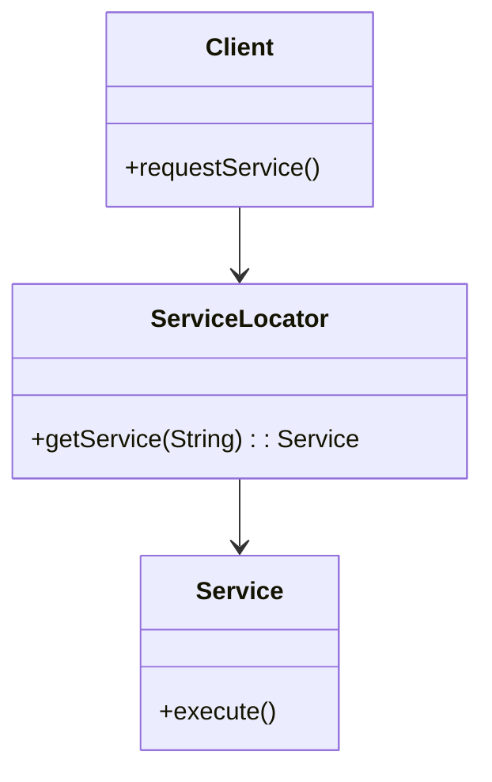

## 6.11.3 Performance Considerations

The Service Locator pattern is a design pattern used to encapsulate the processes involved in obtaining a service. It provides a centralized registry for services, allowing clients to request services without needing to know the details of their instantiation or configuration. While this pattern offers significant flexibility and decoupling, it also introduces performance considerations that must be carefully managed to ensure efficient application operation.

### Understanding the Service Locator Pattern

Before delving into performance considerations, it's essential to understand the basic structure and purpose of the Service Locator pattern. This pattern is often used in scenarios where applications need to dynamically locate and use services. It acts as an intermediary that abstracts the complexity of service creation and configuration.



**Diagram Explanation**: The diagram illustrates the interaction between the Client, ServiceLocator, and Service. The Client requests a service from the ServiceLocator, which then retrieves and returns the appropriate Service instance.

### Potential Overhead Due to Service Lookups

One of the primary performance concerns with the Service Locator pattern is the overhead associated with service lookups. Each time a client requests a service, the Service Locator must perform a lookup operation, which can be costly in terms of time and resources, especially if the lookup involves complex logic or network calls.

#### Strategies to Mitigate Lookup Overhead

1. **Caching Service Instances**: Implement caching mechanisms within the Service Locator to store and reuse service instances. This reduces the need for repeated lookups and can significantly improve performance.

    ```java
    public class ServiceLocator {
        private static Map<String, Service> cache = new HashMap<>();

        public static Service getService(String serviceName) {
            Service service = cache.get(serviceName);
            if (service == null) {
                service = createService(serviceName);
                cache.put(serviceName, service);
            }
            return service;
        }

        private static Service createService(String serviceName) {
            // Logic to create and configure the service
            return new ConcreteService();
        }
    }
    ```

    **Explanation**: The above code demonstrates a simple caching mechanism within the Service Locator. Services are stored in a `HashMap`, and only created if they are not already present in the cache.

2. **Efficient Data Structures**: Use efficient data structures for storing and retrieving services. HashMaps are commonly used due to their average constant-time complexity for get and put operations.

3. **Indexing and Pre-fetching**: For scenarios where service requests are predictable, consider indexing services or pre-fetching them during application startup to minimize lookup times.

### Eager vs. Lazy Initialization of Services

Initialization strategy plays a crucial role in the performance of applications using the Service Locator pattern. The choice between eager and lazy initialization can impact both startup time and runtime performance.

#### Eager Initialization

Eager initialization involves creating and configuring all services at application startup. This approach can lead to longer startup times but ensures that services are readily available when requested, reducing latency during service requests.

- **Advantages**:
  - Immediate availability of services.
  - Potentially reduced latency during service requests.

- **Disadvantages**:
  - Increased startup time.
  - Higher memory usage if many services are initialized but not used.

#### Lazy Initialization

Lazy initialization defers the creation of services until they are explicitly requested. This can lead to faster startup times and reduced memory usage, as only the necessary services are initialized.

- **Advantages**:
  - Faster application startup.
  - Lower memory footprint.

- **Disadvantages**:
  - Potential latency during the first request for a service.
  - Complexity in handling concurrent requests for the same service.

```java
public class LazyServiceLocator {
    private static Map<String, Supplier<Service>> serviceSuppliers = new HashMap<>();
    private static Map<String, Service> cache = new HashMap<>();

    static {
        serviceSuppliers.put("ConcreteService", ConcreteService::new);
    }

    public static Service getService(String serviceName) {
        return cache.computeIfAbsent(serviceName, name -> serviceSuppliers.get(name).get());
    }
}
```

**Explanation**: The `LazyServiceLocator` uses Java's `Supplier` interface to defer service creation until it is needed. The `computeIfAbsent` method ensures that the service is only created once and cached for future requests.

### Balancing Flexibility and Performance

The Service Locator pattern offers significant flexibility by decoupling service creation from service usage. However, this flexibility can come at the cost of performance if not managed correctly.

#### Trade-offs and Best Practices

1. **Flexibility vs. Performance**: Strive to balance the flexibility offered by the Service Locator pattern with the need for performance. Consider the specific requirements of your application and choose strategies that align with those needs.

2. **Profiling and Optimization**: Regularly profile your application to identify performance bottlenecks related to service lookups and initialization. Use profiling tools to gain insights into where optimizations can be made.

3. **Concurrency Considerations**: In multi-threaded applications, ensure that the Service Locator is thread-safe. Use synchronization or concurrent data structures to manage access to shared resources.

4. **Scalability**: Consider the scalability of your Service Locator implementation. As the number of services grows, ensure that the lookup and caching mechanisms can handle increased load without degrading performance.

5. **Monitoring and Logging**: Implement monitoring and logging to track service usage patterns. This data can help in optimizing service initialization strategies and identifying underutilized services.

### Conclusion

The Service Locator pattern is a powerful tool for managing service dependencies in Java applications. By understanding and addressing the performance considerations associated with this pattern, developers can create applications that are both flexible and efficient. Through strategies such as caching, efficient initialization, and careful balancing of trade-offs, the Service Locator pattern can be effectively integrated into modern Java applications.

### Key Takeaways

- **Service Lookups**: Minimize overhead through caching and efficient data structures.
- **Initialization Strategies**: Choose between eager and lazy initialization based on application needs.
- **Performance vs. Flexibility**: Balance the flexibility of the Service Locator pattern with performance considerations.
- **Optimization**: Regularly profile and optimize your application to address performance bottlenecks.

### Exercises

1. Implement a Service Locator with both eager and lazy initialization strategies. Compare their performance in a sample application.
2. Modify the provided caching example to use a different data structure, such as a `ConcurrentHashMap`, and evaluate its impact on performance.
3. Create a monitoring system to log service requests and analyze the data to optimize service initialization strategies.

## Test Your Knowledge: Service Locator Pattern Performance Quiz



### What is a primary concern when using the Service Locator pattern?

- [x] Overhead due to service lookups
- [ ] Lack of flexibility
- [ ] Difficulty in implementation
- [ ] Incompatibility with Java

> **Explanation:** The Service Locator pattern can introduce overhead due to service lookups, which can impact performance.

### Which strategy can help reduce service lookup overhead?

- [x] Caching service instances
- [ ] Using complex algorithms
- [ ] Increasing network calls
- [ ] Avoiding service reuse

> **Explanation:** Caching service instances can significantly reduce the overhead associated with repeated service lookups.

### What is an advantage of eager initialization?

- [x] Immediate availability of services
- [ ] Reduced startup time
- [ ] Lower memory usage
- [ ] Simplicity in implementation

> **Explanation:** Eager initialization ensures that services are immediately available, reducing latency during service requests.

### What is a disadvantage of lazy initialization?

- [x] Potential latency during the first request
- [ ] Increased startup time
- [ ] Higher memory usage
- [ ] Complexity in service creation

> **Explanation:** Lazy initialization can introduce latency during the first request for a service, as it is created on-demand.

### How can concurrency be managed in a Service Locator?

- [x] Using synchronization or concurrent data structures
- [ ] Avoiding multi-threading
- [ ] Using single-threaded services
- [ ] Ignoring thread safety

> **Explanation:** Synchronization or concurrent data structures can help manage concurrency in a Service Locator, ensuring thread safety.

### What is a benefit of using a `ConcurrentHashMap` in a Service Locator?

- [x] Improved thread safety
- [ ] Reduced memory usage
- [ ] Faster service creation
- [ ] Simplicity in implementation

> **Explanation:** A `ConcurrentHashMap` provides improved thread safety, making it suitable for concurrent access in a Service Locator.

### Which initialization strategy can lead to faster application startup?

- [x] Lazy initialization
- [ ] Eager initialization
- [ ] Pre-initialization
- [ ] On-demand initialization

> **Explanation:** Lazy initialization defers service creation until needed, leading to faster application startup.

### What is a trade-off of using the Service Locator pattern?

- [x] Balancing flexibility with performance
- [ ] Increased complexity in service usage
- [ ] Reduced code reusability
- [ ] Limited scalability

> **Explanation:** The Service Locator pattern requires balancing the flexibility it offers with potential performance impacts.

### How can service usage patterns be optimized?

- [x] Implement monitoring and logging
- [ ] Avoid service caching
- [ ] Increase service complexity
- [ ] Use static service instances

> **Explanation:** Monitoring and logging can provide insights into service usage patterns, helping to optimize initialization strategies.

### True or False: The Service Locator pattern is incompatible with modern Java features.

- [ ] True
- [x] False

> **Explanation:** The Service Locator pattern can be effectively integrated with modern Java features, such as Lambdas and Streams.


