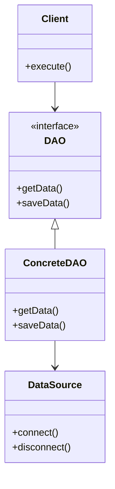

## 6.12.1 Implementing DAO for Database Interaction

The Data Access Object (DAO) pattern is a structural pattern that provides an abstract interface to some type of database or other persistence mechanism. By mapping application calls to the persistence layer, the DAO pattern provides specific data operations without exposing details of the database. This pattern is particularly useful in Java for managing database operations, as it separates the data access logic from the business logic, thereby promoting a cleaner architecture and easier maintenance.

### Intent

- **Purpose**: The DAO pattern aims to abstract and encapsulate all access to the data source, providing a clean separation between the business logic and data access logic. This separation enhances maintainability, scalability, and testability of the application.

### Motivation

In complex applications, direct interaction with the database can lead to tightly coupled code, making it difficult to maintain and test. The DAO pattern addresses this issue by providing a layer of abstraction over the data source. This allows developers to change the underlying data source without affecting the business logic.

### Applicability

Use the DAO pattern when:

- You need to separate data access logic from business logic.
- You want to provide a uniform API for accessing data from different sources.
- You aim to improve the testability of your application by mocking data access during testing.

### Structure



**Diagram Explanation**: The diagram illustrates the relationship between the client, DAO interface, concrete DAO implementation, and the data source. The client interacts with the DAO interface, which is implemented by the concrete DAO class. The concrete DAO class handles the actual data source operations.

### Participants

- **Client**: The component that uses the DAO to perform data operations.
- **DAO Interface**: Defines the standard operations to be performed on a model object(s).
- **Concrete DAO**: Implements the DAO interface and provides the actual data source interaction.
- **Data Source**: The actual database or persistence mechanism.

### Collaborations

- The **Client** interacts with the **DAO Interface** to perform data operations.
- The **Concrete DAO** implements the **DAO Interface** and interacts with the **Data Source** to perform the actual database operations.

### Consequences

- **Benefits**:
  - **Separation of Concerns**: Isolates data access logic from business logic.
  - **Maintainability**: Simplifies code maintenance by centralizing data access logic.
  - **Testability**: Facilitates unit testing by allowing data access to be mocked.
  - **Flexibility**: Allows changes to the data source without affecting business logic.

- **Drawbacks**:
  - **Complexity**: Introduces additional layers, which can complicate the architecture.
  - **Performance**: May introduce slight overhead due to abstraction.

### Implementation

#### Step-by-Step Guide

1. **Define the DAO Interface**: Create an interface that declares the methods for data operations.

    ```java
    public interface UserDAO {
        User getUserById(int id);
        List<User> getAllUsers();
        void saveUser(User user);
        void deleteUser(int id);
    }
    ```

2. **Implement the DAO Interface**: Create a concrete class that implements the DAO interface using JDBC for database operations.

    ```java
    import java.sql.*;
    import java.util.ArrayList;
    import java.util.List;

    public class UserDAOImpl implements UserDAO {
        private static final String URL = "jdbc:mysql://localhost:3306/mydatabase";
        private static final String USER = "username";
        private static final String PASSWORD = "password";

        @Override
        public User getUserById(int id) {
            User user = null;
            try (Connection connection = DriverManager.getConnection(URL, USER, PASSWORD);
                 PreparedStatement statement = connection.prepareStatement("SELECT * FROM users WHERE id = ?")) {
                statement.setInt(1, id);
                ResultSet resultSet = statement.executeQuery();
                if (resultSet.next()) {
                    user = new User(resultSet.getInt("id"), resultSet.getString("name"), resultSet.getString("email"));
                }
            } catch (SQLException e) {
                e.printStackTrace();
            }
            return user;
        }

        @Override
        public List<User> getAllUsers() {
            List<User> users = new ArrayList<>();
            try (Connection connection = DriverManager.getConnection(URL, USER, PASSWORD);
                 Statement statement = connection.createStatement()) {
                ResultSet resultSet = statement.executeQuery("SELECT * FROM users");
                while (resultSet.next()) {
                    users.add(new User(resultSet.getInt("id"), resultSet.getString("name"), resultSet.getString("email")));
                }
            } catch (SQLException e) {
                e.printStackTrace();
            }
            return users;
        }

        @Override
        public void saveUser(User user) {
            try (Connection connection = DriverManager.getConnection(URL, USER, PASSWORD);
                 PreparedStatement statement = connection.prepareStatement("INSERT INTO users (name, email) VALUES (?, ?)")) {
                statement.setString(1, user.getName());
                statement.setString(2, user.getEmail());
                statement.executeUpdate();
            } catch (SQLException e) {
                e.printStackTrace();
            }
        }

        @Override
        public void deleteUser(int id) {
            try (Connection connection = DriverManager.getConnection(URL, USER, PASSWORD);
                 PreparedStatement statement = connection.prepareStatement("DELETE FROM users WHERE id = ?")) {
                statement.setInt(1, id);
                statement.executeUpdate();
            } catch (SQLException e) {
                e.printStackTrace();
            }
        }
    }
    ```

3. **Create the Model Class**: Define the model class that represents the data structure.

    ```java
    public class User {
        private int id;
        private String name;
        private String email;

        public User(int id, String name, String email) {
            this.id = id;
            this.name = name;
            this.email = email;
        }

        // Getters and setters
    }
    ```

4. **Use the DAO in Business Logic**: Integrate the DAO into the business logic layer.

    ```java
    public class UserService {
        private UserDAO userDAO = new UserDAOImpl();

        public User getUserById(int id) {
            return userDAO.getUserById(id);
        }

        public List<User> getAllUsers() {
            return userDAO.getAllUsers();
        }

        public void saveUser(User user) {
            userDAO.saveUser(user);
        }

        public void deleteUser(int id) {
            userDAO.deleteUser(id);
        }
    }
    ```

#### Explanation

- **DAO Interface**: Defines the contract for data operations, ensuring consistency across different implementations.
- **Concrete DAO**: Implements the DAO interface using JDBC, handling database connections and SQL operations.
- **Model Class**: Represents the data structure, encapsulating the data fields and providing access methods.
- **Business Logic**: Utilizes the DAO to perform data operations, maintaining separation from data access logic.

#### Sample Use Cases

- **Enterprise Applications**: Use DAOs to manage complex data operations in large-scale systems.
- **Microservices**: Implement DAOs in microservices to handle data persistence independently.
- **Testing**: Mock DAOs in unit tests to isolate business logic from data access.

### Related Patterns

- **Repository Pattern**: Similar to DAO but often used in Domain-Driven Design to manage collections of objects.
- **Active Record Pattern**: Combines data access and business logic in a single class, contrasting with DAO's separation.

### Known Uses

- **Spring Framework**: Utilizes DAOs extensively for data access abstraction.
- **Hibernate**: Often used in conjunction with DAOs to manage ORM-based data operations.

### Expert Tips and Best Practices

- **Use Connection Pools**: Optimize database connections by using connection pools to manage resources efficiently.
- **Handle Exceptions Gracefully**: Implement robust exception handling to manage SQL exceptions and ensure application stability.
- **Leverage Java 8 Features**: Use Streams and Lambdas to simplify data processing within DAOs.
- **Consider ORM Tools**: Evaluate the use of ORM tools like Hibernate for complex data operations, while still maintaining DAO abstraction.

### Common Pitfalls

- **Over-Complexity**: Avoid over-engineering DAOs with unnecessary complexity.
- **Tight Coupling**: Ensure DAOs remain decoupled from business logic to maintain flexibility.

### Exercises

1. **Implement a ProductDAO**: Create a DAO for managing product data, including methods for CRUD operations.
2. **Mock DAO for Testing**: Write unit tests for the UserService class, mocking the UserDAO to isolate business logic.
3. **Refactor with Java 8**: Refactor the UserDAOImpl class to use Java 8 Streams and Lambdas for data processing.

### Summary

The DAO pattern is a powerful tool for managing data access in Java applications. By separating data access logic from business logic, DAOs enhance maintainability, testability, and flexibility. Implementing DAOs using JDBC provides a robust foundation for database interaction, while modern Java features and best practices can further optimize the pattern's effectiveness.

## Test Your Knowledge: DAO Pattern in Java Quiz



### What is the primary purpose of the DAO pattern?

- [x] To separate data access logic from business logic.
- [ ] To combine data access and business logic.
- [ ] To improve database performance.
- [ ] To simplify user interface design.

> **Explanation:** The DAO pattern aims to separate data access logic from business logic, promoting a cleaner architecture.

### Which component in the DAO pattern interacts directly with the data source?

- [ ] Client
- [ ] DAO Interface
- [x] Concrete DAO
- [ ] Business Logic

> **Explanation:** The Concrete DAO implements the DAO interface and interacts directly with the data source.

### What is a key benefit of using the DAO pattern?

- [x] Improved maintainability
- [ ] Increased complexity
- [ ] Reduced flexibility
- [ ] Combined logic layers

> **Explanation:** The DAO pattern improves maintainability by isolating data access logic from business logic.

### How does the DAO pattern enhance testability?

- [x] By allowing data access to be mocked during testing.
- [ ] By combining data access and business logic.
- [ ] By reducing the number of classes.
- [ ] By simplifying SQL queries.

> **Explanation:** The DAO pattern enhances testability by allowing data access to be mocked, isolating business logic during testing.

### Which Java feature can be leveraged to simplify data processing in DAOs?

- [x] Streams and Lambdas
- [ ] Annotations
- [ ] Reflection
- [ ] Serialization

> **Explanation:** Java 8 Streams and Lambdas can simplify data processing within DAOs.

### What is a common pitfall when implementing DAOs?

- [x] Over-complexity
- [ ] Under-testing
- [ ] Insufficient documentation
- [ ] Lack of comments

> **Explanation:** Over-complexity can occur if DAOs are over-engineered with unnecessary complexity.

### What is the role of the DAO Interface?

- [x] To define the standard operations for data access.
- [ ] To implement data access logic.
- [ ] To connect to the database.
- [ ] To manage user sessions.

> **Explanation:** The DAO Interface defines the standard operations for data access, ensuring consistency across implementations.

### Which pattern is similar to DAO but often used in Domain-Driven Design?

- [ ] Singleton Pattern
- [x] Repository Pattern
- [ ] Observer Pattern
- [ ] Factory Pattern

> **Explanation:** The Repository Pattern is similar to DAO but often used in Domain-Driven Design to manage collections of objects.

### How can DAOs be optimized for resource management?

- [x] By using connection pools
- [ ] By reducing the number of classes
- [ ] By combining logic layers
- [ ] By simplifying SQL queries

> **Explanation:** Connection pools can optimize resource management by efficiently managing database connections.

### True or False: The DAO pattern combines data access and business logic in a single class.

- [ ] True
- [x] False

> **Explanation:** False. The DAO pattern separates data access logic from business logic, promoting a cleaner architecture.



By mastering the DAO pattern, Java developers can create applications that are not only robust and efficient but also easier to maintain and test. This pattern is a cornerstone of modern software architecture, providing a structured approach to data management.
