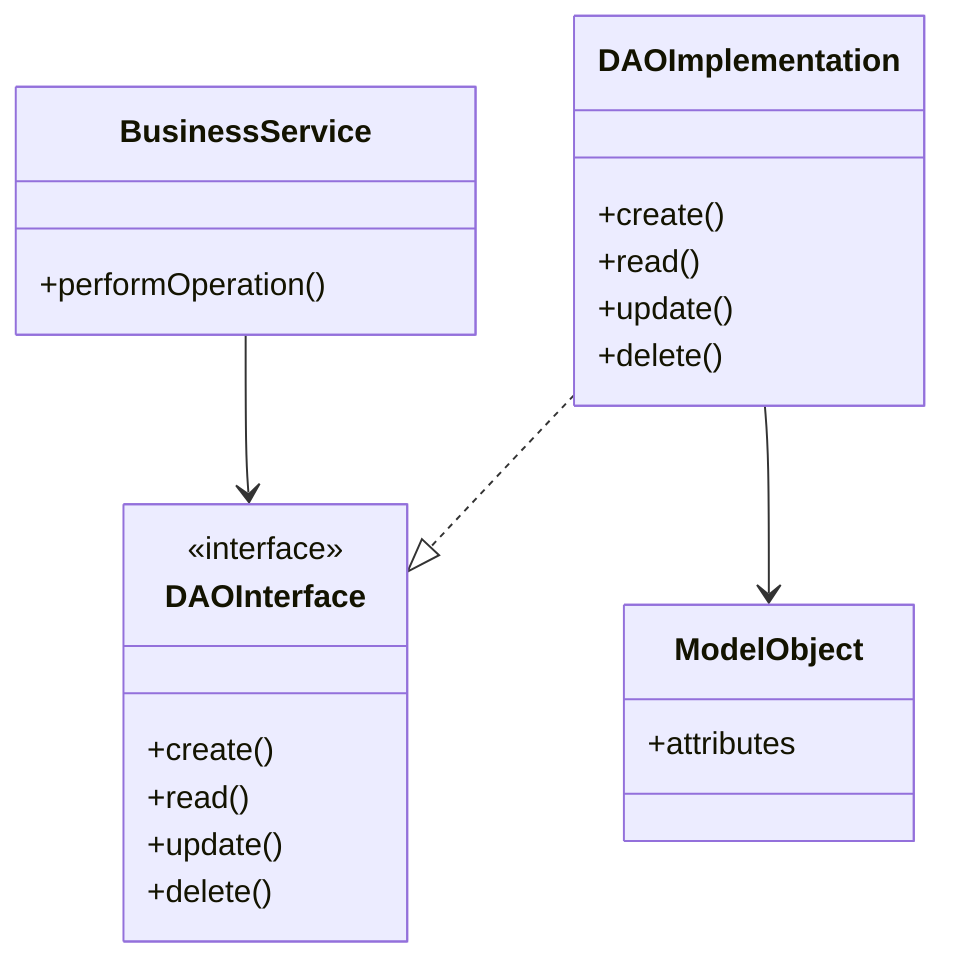

## 6.12.2 Separation of Business Logic and Data Access

In modern software development, the separation of business logic from data access is a fundamental principle that enhances the maintainability, scalability, and testability of applications. This separation is crucial in complex systems where business rules and data management are subject to frequent changes. The Data Access Object (DAO) pattern is a design pattern that provides a systematic approach to achieving this separation of concerns.

### Understanding the DAO Pattern

The DAO pattern is a structural pattern that abstracts and encapsulates all access to the data source. The DAO manages the connection with the data source to obtain and store data. It separates the data access logic from the business logic, allowing the latter to focus solely on business rules and processes.

#### Intent

- **Description**: The DAO pattern aims to provide a clear separation between the business logic and data access logic. It abstracts the underlying data access implementation, enabling the business logic to interact with the data source through a well-defined interface.

#### Motivation

In traditional applications, business logic and data access code are often intertwined, leading to tightly coupled systems that are difficult to maintain and extend. By using the DAO pattern, developers can isolate the data access layer, making it easier to modify or replace without affecting the business logic. This separation also facilitates testing, as the business logic can be tested independently of the data access layer.

#### Applicability

- **Guidelines**: Use the DAO pattern when you need to:
  - Separate business logic from data access logic.
  - Support multiple data sources or change data sources without affecting business logic.
  - Enhance testability by mocking data access in unit tests.
  - Improve code organization and maintainability.

### Structure of the DAO Pattern

The DAO pattern typically involves the following components:

- **DAO Interface**: Defines the standard operations to be performed on a model object(s).
- **DAO Implementation**: Implements the DAO interface and contains the actual data access logic.
- **Model Object**: Represents the data structure that the DAO will manage.
- **Business Service**: Contains the business logic and interacts with the DAO to perform data operations.

#### Diagram



*Caption*: The diagram illustrates the structure of the DAO pattern, showing the interaction between the business service, DAO interface, DAO implementation, and model object.

### Participants

- **DAO Interface**: Declares the operations for accessing and managing data.
- **DAO Implementation**: Provides the concrete implementation of the data access methods.
- **Model Object**: Represents the data entities that the DAO manages.
- **Business Service**: Contains the business logic and utilizes the DAO to interact with the data source.

### Collaborations

The business service interacts with the DAO interface to perform data operations. The DAO implementation handles the actual data access logic, ensuring that the business service remains agnostic to the data source details.

### Consequences

- **Benefits**:
  - **Separation of Concerns**: Clearly separates business logic from data access logic.
  - **Maintainability**: Simplifies maintenance by isolating changes to the data access layer.
  - **Testability**: Facilitates unit testing by allowing data access to be mocked.
  - **Flexibility**: Supports multiple data sources and easy switching between them.

- **Drawbacks**:
  - **Complexity**: Introduces additional layers, which may increase complexity in simple applications.
  - **Overhead**: May add overhead in terms of development time and resources.

### Implementation

#### Implementation Guidelines

1. **Define the DAO Interface**: Start by defining an interface that declares the data access methods.
2. **Implement the DAO**: Create a class that implements the DAO interface and contains the actual data access logic.
3. **Create Model Objects**: Define the data entities that the DAO will manage.
4. **Develop Business Services**: Implement the business logic in services that interact with the DAO interface.

#### Sample Code Snippets

```java
// DAO Interface
public interface UserDAO {
    void createUser(User user);
    User getUserById(int id);
    void updateUser(User user);
    void deleteUser(int id);
}

// DAO Implementation
public class UserDAOImpl implements UserDAO {
    // Simulated database
    private Map<Integer, User> database = new HashMap<>();

    @Override
    public void createUser(User user) {
        database.put(user.getId(), user);
    }

    @Override
    public User getUserById(int id) {
        return database.get(id);
    }

    @Override
    public void updateUser(User user) {
        database.put(user.getId(), user);
    }

    @Override
    public void deleteUser(int id) {
        database.remove(id);
    }
}

// Model Object
public class User {
    private int id;
    private String name;

    // Getters and setters
}

// Business Service
public class UserService {
    private UserDAO userDAO;

    public UserService(UserDAO userDAO) {
        this.userDAO = userDAO;
    }

    public void registerUser(User user) {
        userDAO.createUser(user);
    }

    public User findUser(int id) {
        return userDAO.getUserById(id);
    }

    // Other business methods
}
```

*Explanation*: The code example demonstrates the implementation of the DAO pattern. The `UserDAO` interface defines the data access methods, while `UserDAOImpl` provides the concrete implementation. The `User` class represents the model object, and `UserService` contains the business logic.

### Sample Use Cases

- **E-commerce Applications**: Use DAOs to manage product, order, and customer data separately from business logic like pricing and promotions.
- **Banking Systems**: Implement DAOs to handle account and transaction data, while business services manage operations like transfers and balance checks.
- **Healthcare Systems**: Separate patient data management from business logic related to appointments and billing.

### Best Practices for Designing Clean Interfaces

1. **Keep Interfaces Simple**: Define only the necessary methods to perform data operations.
2. **Use Descriptive Method Names**: Ensure method names clearly indicate their purpose and operation.
3. **Favor Composition Over Inheritance**: Use composition to extend DAO functionality rather than inheritance.
4. **Ensure Consistency**: Maintain consistent method signatures and naming conventions across DAOs.
5. **Document Interfaces**: Provide clear documentation for each method, detailing its purpose and expected behavior.

### Related Patterns

- **Repository Pattern**: Similar to the DAO pattern but often used in Domain-Driven Design (DDD) to manage collections of objects.
- **Service Layer Pattern**: Provides a layer of abstraction over business logic, often interacting with DAOs.

### Known Uses

- **Spring Framework**: Utilizes DAOs extensively for data access in its JDBC and ORM modules.
- **Hibernate**: Encourages the use of DAOs for managing entity persistence.

### Conclusion

The separation of business logic and data access is a critical aspect of software architecture that enhances the maintainability and scalability of applications. By employing the DAO pattern, developers can achieve a clean separation of concerns, leading to more organized and testable code. As systems grow in complexity, adhering to these principles becomes increasingly important to ensure the long-term success and adaptability of software solutions.

---

## Test Your Knowledge: Java DAO Pattern and Separation of Concerns Quiz



### What is the primary purpose of the DAO pattern?

- [x] To separate business logic from data access logic.
- [ ] To enhance user interface design.
- [ ] To improve network communication.
- [ ] To manage application configuration.

> **Explanation:** The DAO pattern is designed to separate business logic from data access logic, allowing for better maintainability and flexibility.

### Which component in the DAO pattern defines the data access methods?

- [x] DAO Interface
- [ ] Business Service
- [ ] Model Object
- [ ] DAO Implementation

> **Explanation:** The DAO Interface declares the data access methods that the DAO Implementation will define.

### How does the DAO pattern improve testability?

- [x] By allowing data access to be mocked in unit tests.
- [ ] By simplifying user interface testing.
- [ ] By reducing the number of test cases needed.
- [ ] By eliminating the need for integration tests.

> **Explanation:** The DAO pattern improves testability by enabling the data access layer to be mocked, allowing business logic to be tested independently.

### What is a potential drawback of using the DAO pattern?

- [x] It may introduce additional complexity.
- [ ] It reduces code readability.
- [ ] It limits the use of design patterns.
- [ ] It increases coupling between components.

> **Explanation:** The DAO pattern can introduce additional complexity due to the extra layers it adds, especially in simple applications.

### In which scenario is the DAO pattern most applicable?

- [x] When you need to separate business logic from data access logic.
- [ ] When you need to enhance graphical user interfaces.
- [ ] When you need to optimize network protocols.
- [ ] When you need to manage application state.

> **Explanation:** The DAO pattern is most applicable when there is a need to separate business logic from data access logic to improve maintainability and flexibility.

### What is the role of the Business Service in the DAO pattern?

- [x] To contain business logic and interact with the DAO.
- [ ] To define data access methods.
- [ ] To implement data access logic.
- [ ] To represent data entities.

> **Explanation:** The Business Service contains the business logic and interacts with the DAO to perform data operations.

### Which pattern is often used in conjunction with the DAO pattern?

- [x] Service Layer Pattern
- [ ] Singleton Pattern
- [ ] Observer Pattern
- [ ] Factory Pattern

> **Explanation:** The Service Layer Pattern is often used with the DAO pattern to provide a layer of abstraction over business logic.

### How does the DAO pattern enhance flexibility?

- [x] By supporting multiple data sources and easy switching between them.
- [ ] By simplifying user interface design.
- [ ] By reducing the number of classes needed.
- [ ] By eliminating the need for configuration files.

> **Explanation:** The DAO pattern enhances flexibility by allowing the application to support multiple data sources and switch between them easily.

### What is a key benefit of separating business logic from data access?

- [x] Improved maintainability
- [ ] Faster execution speed
- [ ] Reduced memory usage
- [ ] Enhanced graphical capabilities

> **Explanation:** Separating business logic from data access improves maintainability by isolating changes to the data access layer.

### True or False: The DAO pattern is only applicable to relational databases.

- [x] False
- [ ] True

> **Explanation:** The DAO pattern is not limited to relational databases; it can be applied to any data source, including NoSQL databases and file systems.



---
