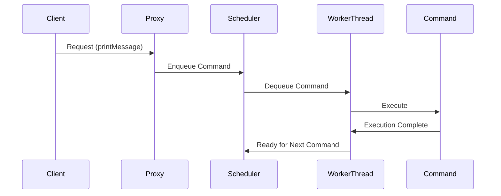

## 6.2.1 Implementing Active Object in Java

The Active Object pattern is a concurrency design pattern that decouples method execution from method invocation to enhance concurrency and simplify synchronized access to shared resources. This pattern is particularly useful in scenarios where you need to perform long-running tasks asynchronously without blocking the calling thread. In this section, we'll explore how to implement the Active Object pattern in Java, focusing on encapsulating method requests as command objects, managing a queue of pending requests, and processing these requests asynchronously using worker threads.

### Understanding the Active Object Pattern

Before diving into the implementation, let's understand the core components of the Active Object pattern:

1. **Command Objects**: Encapsulate the details of a request. Each command object represents a method call with its parameters.
2. **Scheduler**: Manages a queue of pending requests and dispatches them to worker threads for execution.
3. **Worker Threads**: Process the requests asynchronously, allowing the client to continue its execution without waiting for the task to complete.
4. **Proxy**: Provides a synchronous interface to the client while handling the execution asynchronously.
5. **Result Handling**: Mechanism to retrieve the result of the asynchronous operation once it completes.

### Implementing Command Objects

The first step in implementing the Active Object pattern is to encapsulate method requests as command objects. These objects should implement a common interface, allowing them to be handled uniformly by the scheduler and worker threads.

```java
// Command interface representing a request
public interface Command {
    void execute();
}

// A concrete command implementing the Command interface
public class PrintCommand implements Command {
    private final String message;

    public PrintCommand(String message) {
        this.message = message;
    }

    @Override
    public void execute() {
        System.out.println("Executing command: " + message);
    }
}
```

In this example, `Command` is an interface with a single method `execute()`. `PrintCommand` is a concrete implementation that prints a message to the console.

### Implementing the Scheduler

The scheduler is responsible for managing a queue of pending requests and dispatching them to worker threads. We can use a `BlockingQueue` to store the commands, ensuring thread-safe access.

```java
import java.util.concurrent.BlockingQueue;
import java.util.concurrent.LinkedBlockingQueue;

public class Scheduler {
    private final BlockingQueue<Command> commandQueue = new LinkedBlockingQueue<>();
    private final Thread workerThread;

    public Scheduler() {
        workerThread = new Thread(this::processCommands);
        workerThread.start();
    }

    public void enqueueCommand(Command command) {
        try {
            commandQueue.put(command);
        } catch (InterruptedException e) {
            Thread.currentThread().interrupt();
            System.err.println("Failed to enqueue command: " + e.getMessage());
        }
    }

    private void processCommands() {
        while (true) {
            try {
                Command command = commandQueue.take();
                command.execute();
            } catch (InterruptedException e) {
                Thread.currentThread().interrupt();
                System.err.println("Worker thread interrupted: " + e.getMessage());
                break;
            }
        }
    }
}
```

The `Scheduler` class contains a `BlockingQueue` to hold `Command` objects. The `enqueueCommand` method adds commands to the queue, while the `processCommands` method runs in a separate thread, continuously taking and executing commands from the queue.

### Setting Up Worker Threads

Worker threads are responsible for processing the commands asynchronously. In our example, the `Scheduler` class uses a single worker thread, but you can extend this to use a thread pool for handling multiple requests concurrently.

```java
import java.util.concurrent.ExecutorService;
import java.util.concurrent.Executors;

public class ThreadPoolScheduler {
    private final BlockingQueue<Command> commandQueue = new LinkedBlockingQueue<>();
    private final ExecutorService executorService = Executors.newFixedThreadPool(4);

    public ThreadPoolScheduler() {
        for (int i = 0; i < 4; i++) {
            executorService.submit(this::processCommands);
        }
    }

    public void enqueueCommand(Command command) {
        try {
            commandQueue.put(command);
        } catch (InterruptedException e) {
            Thread.currentThread().interrupt();
            System.err.println("Failed to enqueue command: " + e.getMessage());
        }
    }

    private void processCommands() {
        while (true) {
            try {
                Command command = commandQueue.take();
                command.execute();
            } catch (InterruptedException e) {
                Thread.currentThread().interrupt();
                System.err.println("Worker thread interrupted: " + e.getMessage());
                break;
            }
        }
    }
}
```

Here, we use an `ExecutorService` to manage a pool of worker threads, allowing multiple commands to be processed concurrently.

### Implementing the Proxy

The proxy provides a synchronous interface to the client while handling the execution asynchronously. It acts as a placeholder for the active object and forwards requests to the scheduler.

```java
public class ActiveObjectProxy {
    private final Scheduler scheduler = new ThreadPoolScheduler();

    public void printMessage(String message) {
        Command command = new PrintCommand(message);
        scheduler.enqueueCommand(command);
    }
}
```

The `ActiveObjectProxy` class provides a method `printMessage`, which creates a `PrintCommand` and enqueues it for execution.

### Handling Concurrency Issues

When implementing the Active Object pattern, it's crucial to handle concurrency issues such as synchronization and shared resource access. Here are some best practices:

- **Synchronization**: Use thread-safe data structures like `BlockingQueue` to manage shared resources.
- **Thread Management**: Use a thread pool to manage worker threads efficiently. This approach allows you to control the number of concurrent threads and reuse threads for multiple tasks.
- **Task Prioritization**: If certain tasks have higher priority, consider using a priority queue to manage the command queue.

### Error Handling and Task Completion

Error handling is essential in any concurrent system. Ensure that exceptions in worker threads do not crash the application. Instead, handle them gracefully and log errors for debugging.

```java
private void processCommands() {
    while (true) {
        try {
            Command command = commandQueue.take();
            command.execute();
        } catch (InterruptedException e) {
            Thread.currentThread().interrupt();
            System.err.println("Worker thread interrupted: " + e.getMessage());
            break;
        } catch (Exception e) {
            System.err.println("Error executing command: " + e.getMessage());
        }
    }
}
```

In this example, we catch and log exceptions during command execution, ensuring that the worker thread continues processing subsequent commands.

### Visualizing the Active Object Pattern

To better understand the flow of the Active Object pattern, let's visualize the interaction between components using a sequence diagram.



This diagram illustrates how a client request is handled by the proxy, enqueued by the scheduler, and processed by a worker thread.

### Try It Yourself

Now that we've covered the implementation details, let's encourage you to experiment with the Active Object pattern:

- **Modify the Command**: Create additional command classes that perform different tasks, such as file I/O or network operations.
- **Adjust the Thread Pool Size**: Experiment with different thread pool sizes to observe the impact on performance.
- **Implement Task Prioritization**: Use a priority queue to manage commands with varying priorities.

### Conclusion

The Active Object pattern is a powerful tool for managing concurrency in Java applications. By decoupling method execution from invocation, it allows for efficient asynchronous processing of tasks. Remember to handle concurrency issues carefully, manage threads effectively, and implement robust error handling to ensure the reliability of your application.

## Quiz Time!



### What is the primary purpose of the Active Object pattern?

- [x] To decouple method execution from invocation for asynchronous processing.
- [ ] To provide a synchronous interface for remote method invocation.
- [ ] To manage memory allocation in concurrent applications.
- [ ] To simplify the implementation of complex algorithms.

> **Explanation:** The Active Object pattern is designed to decouple method execution from invocation, allowing for asynchronous processing of tasks.

### Which component of the Active Object pattern encapsulates method requests?

- [x] Command Objects
- [ ] Scheduler
- [ ] Proxy
- [ ] Worker Threads

> **Explanation:** Command objects encapsulate the details of a request, representing method calls with their parameters.

### What Java class is commonly used to manage a queue of pending requests in the Active Object pattern?

- [x] BlockingQueue
- [ ] ArrayList
- [ ] HashMap
- [ ] LinkedList

> **Explanation:** A `BlockingQueue` is commonly used to manage a queue of pending requests, ensuring thread-safe access.

### How does the proxy in the Active Object pattern provide a synchronous interface to clients?

- [x] By acting as a placeholder and forwarding requests to the scheduler.
- [ ] By executing commands directly within the client thread.
- [ ] By blocking client threads until execution completes.
- [ ] By managing a pool of worker threads.

> **Explanation:** The proxy acts as a placeholder, providing a synchronous interface while forwarding requests to the scheduler for asynchronous execution.

### What is a best practice for handling concurrency issues in the Active Object pattern?

- [x] Use thread-safe data structures like BlockingQueue.
- [ ] Use a single thread for all operations.
- [ ] Avoid using synchronization mechanisms.
- [ ] Execute all commands in the main thread.

> **Explanation:** Using thread-safe data structures like `BlockingQueue` helps manage shared resources and handle concurrency issues effectively.

### What is the role of worker threads in the Active Object pattern?

- [x] To process commands asynchronously.
- [ ] To manage client requests directly.
- [ ] To provide a synchronous interface to clients.
- [ ] To handle network communication.

> **Explanation:** Worker threads process commands asynchronously, allowing the client to continue its execution without waiting for the task to complete.

### How can you prioritize tasks in the Active Object pattern?

- [x] Use a priority queue to manage the command queue.
- [ ] Increase the number of worker threads.
- [ ] Execute high-priority tasks in the main thread.
- [ ] Use a separate scheduler for high-priority tasks.

> **Explanation:** Using a priority queue allows you to manage the command queue based on task priorities.

### What should you do if an exception occurs during command execution in a worker thread?

- [x] Catch and log the exception, then continue processing subsequent commands.
- [ ] Terminate the worker thread immediately.
- [ ] Ignore the exception and proceed.
- [ ] Restart the entire application.

> **Explanation:** Catching and logging exceptions ensures that the worker thread continues processing subsequent commands without crashing the application.

### What is a key benefit of using a thread pool in the Active Object pattern?

- [x] Efficient management of worker threads and control over concurrency.
- [ ] Simplified implementation of command objects.
- [ ] Direct execution of commands in the client thread.
- [ ] Elimination of the need for a scheduler.

> **Explanation:** A thread pool efficiently manages worker threads, allowing for control over concurrency and reuse of threads for multiple tasks.

### True or False: The Active Object pattern is useful for scenarios where you need to perform long-running tasks asynchronously without blocking the calling thread.

- [x] True
- [ ] False

> **Explanation:** True. The Active Object pattern is designed to handle long-running tasks asynchronously, allowing the calling thread to continue execution without blocking.


