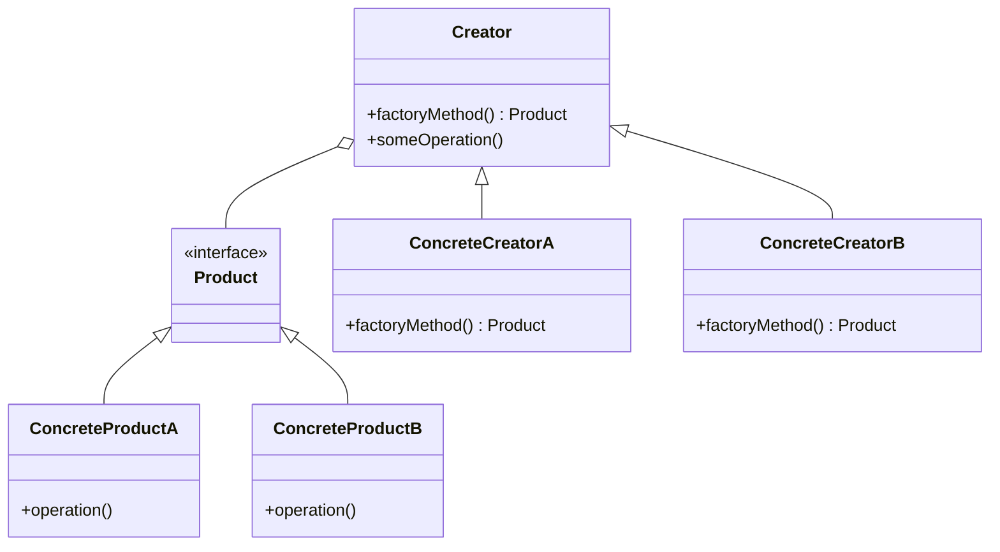

## 6.2.1 Implementing Factory Method in Java

The Factory Method pattern is a cornerstone of creational design patterns in object-oriented programming. It provides a way to delegate the instantiation of objects to subclasses, promoting loose coupling and enhancing scalability. This section delves into the Factory Method pattern, its intent, motivation, and practical implementation in Java.

### Intent

The Factory Method pattern defines an interface for creating an object but allows subclasses to alter the type of objects that will be created. This pattern is particularly useful when a class cannot anticipate the class of objects it must create or when a class wants its subclasses to specify the objects it creates.

### Motivation

In software development, there are scenarios where the exact class of an object cannot be determined until runtime. The Factory Method pattern addresses this by allowing subclasses to decide which class to instantiate. This approach provides flexibility and encapsulation, enabling developers to introduce new types of products without modifying existing code.

Consider a scenario where a software application needs to support multiple types of document formats. Instead of hardcoding the creation of each document type, the Factory Method pattern allows the application to delegate the creation process to subclasses, which can decide the specific document type to instantiate.

### Structure

The Factory Method pattern involves several key participants:

- **Product**: Defines the interface of objects the factory method creates.
- **ConcreteProduct**: Implements the Product interface.
- **Creator**: Declares the factory method, which returns an object of type Product. It may also define a default implementation of the factory method.
- **ConcreteCreator**: Overrides the factory method to return an instance of a ConcreteProduct.

#### Class Diagram

The following diagram illustrates the structure of the Factory Method pattern:



**Caption**: The class diagram of the Factory Method pattern, showing the relationship between the Creator, ConcreteCreator, Product, and ConcreteProduct classes.

### Participants

- **Product**: The interface or abstract class that defines the operations that all concrete products must implement.
- **ConcreteProduct**: A class that implements the Product interface.
- **Creator**: An abstract class or interface that declares the factory method, which returns an object of type Product.
- **ConcreteCreator**: A subclass of Creator that implements the factory method to return an instance of a ConcreteProduct.

### Collaborations

- The Creator class relies on its subclasses to implement the factory method and return an instance of a ConcreteProduct.
- The client interacts with the Creator class to create products, without needing to know the specific class of the product.

### Consequences

The Factory Method pattern offers several benefits:

- **Flexibility**: Allows the code to be more flexible and reusable by decoupling the client code from the specific classes of products.
- **Scalability**: New product types can be introduced without altering existing code, adhering to the Open/Closed Principle.
- **Encapsulation**: Encapsulates the instantiation logic, reducing the complexity of client code.

However, it also has potential drawbacks:

- **Complexity**: The pattern can introduce additional complexity due to the need for subclassing.
- **Overhead**: May result in a proliferation of classes, especially in systems with many product types.

### Implementation

To implement the Factory Method pattern in Java, follow these steps:

1. **Define the Product Interface**: Create an interface or abstract class that defines the operations that all concrete products must implement.

2. **Create ConcreteProduct Classes**: Implement the Product interface in concrete classes.

3. **Define the Creator Class**: Create an abstract class or interface that declares the factory method.

4. **Implement ConcreteCreator Classes**: Subclass the Creator class and implement the factory method to return an instance of a ConcreteProduct.

#### Sample Code Snippets

Let's implement a simple example of the Factory Method pattern in Java, where we create different types of documents.

```java
// Step 1: Define the Product interface
interface Document {
    void open();
    void close();
}

// Step 2: Create ConcreteProduct classes
class WordDocument implements Document {
    @Override
    public void open() {
        System.out.println("Opening Word document...");
    }

    @Override
    public void close() {
        System.out.println("Closing Word document...");
    }
}

class PdfDocument implements Document {
    @Override
    public void open() {
        System.out.println("Opening PDF document...");
    }

    @Override
    public void close() {
        System.out.println("Closing PDF document...");
    }
}

// Step 3: Define the Creator class
abstract class DocumentCreator {
    public abstract Document createDocument();

    public void someOperation() {
        Document doc = createDocument();
        doc.open();
        // Perform operations on the document
        doc.close();
    }
}

// Step 4: Implement ConcreteCreator classes
class WordDocumentCreator extends DocumentCreator {
    @Override
    public Document createDocument() {
        return new WordDocument();
    }
}

class PdfDocumentCreator extends DocumentCreator {
    @Override
    public Document createDocument() {
        return new PdfDocument();
    }
}

// Client code
public class FactoryMethodDemo {
    public static void main(String[] args) {
        DocumentCreator creator = new WordDocumentCreator();
        creator.someOperation();

        creator = new PdfDocumentCreator();
        creator.someOperation();
    }
}
```

**Explanation**: In this example, the `Document` interface defines the operations for document objects. The `WordDocument` and `PdfDocument` classes implement this interface. The `DocumentCreator` class declares the factory method `createDocument()`, which is overridden by `WordDocumentCreator` and `PdfDocumentCreator` to return instances of `WordDocument` and `PdfDocument`, respectively. The client code uses the `DocumentCreator` class to create and manipulate document objects without knowing their specific classes.

### Sample Use Cases

The Factory Method pattern is widely used in software development. Some real-world scenarios include:

- **GUI Frameworks**: Creating different types of UI components, such as buttons and windows, without specifying their concrete classes.
- **Logging Libraries**: Generating different types of loggers (e.g., file logger, console logger) based on configuration.
- **Data Access Layers**: Creating different types of database connections or queries based on the database type.

### Related Patterns

- **[6.6 Singleton Pattern]( "Singleton Pattern")**: Ensures a class has only one instance and provides a global point of access to it. Often used in conjunction with Factory Method to manage the lifecycle of created objects.
- **Abstract Factory Pattern**: Provides an interface for creating families of related or dependent objects without specifying their concrete classes. It can be seen as a higher-level abstraction over the Factory Method pattern.

### Known Uses

The Factory Method pattern is prevalent in many Java libraries and frameworks:

- **Java Collections Framework**: The `Collection` interface uses factory methods to create instances of collections.
- **Spring Framework**: The `BeanFactory` interface uses factory methods to create and manage beans.

### Best Practices

- **Use Factory Method when a class cannot anticipate the class of objects it must create**.
- **Encapsulate object creation logic to promote loose coupling**.
- **Consider using Factory Method in conjunction with other design patterns** to enhance flexibility and scalability.

### Exercises

1. Modify the example code to add a new document type, such as `ExcelDocument`. Implement the necessary classes and methods to support this new type.
2. Refactor the client code to use a configuration file to determine which `DocumentCreator` subclass to instantiate.
3. Experiment with Java 8 features, such as lambdas and streams, to enhance the implementation of the Factory Method pattern.

### Summary

The Factory Method pattern is a powerful tool for managing object creation in Java applications. By delegating the instantiation process to subclasses, it promotes flexibility, scalability, and encapsulation. Understanding and implementing this pattern can significantly enhance the design and architecture of software systems.

## Test Your Knowledge: Factory Method Pattern in Java Quiz



### What is the primary intent of the Factory Method pattern?

- [x] To define an interface for creating an object, but allow subclasses to alter the type of objects created.
- [ ] To create a single instance of a class.
- [ ] To provide a way to access elements sequentially.
- [ ] To define a family of algorithms.

> **Explanation:** The Factory Method pattern is intended to define an interface for creating an object, allowing subclasses to determine the specific type of object created.

### Which class in the Factory Method pattern is responsible for declaring the factory method?

- [x] Creator
- [ ] ConcreteProduct
- [ ] Product
- [ ] ConcreteCreator

> **Explanation:** The Creator class declares the factory method, which is overridden by ConcreteCreator subclasses to return specific product instances.

### In the Factory Method pattern, what role does the ConcreteProduct class play?

- [x] It implements the Product interface.
- [ ] It declares the factory method.
- [ ] It creates instances of the Creator class.
- [ ] It provides an interface for creating objects.

> **Explanation:** The ConcreteProduct class implements the Product interface, providing specific implementations of the product.

### How does the Factory Method pattern promote scalability?

- [x] By allowing new product types to be introduced without altering existing code.
- [ ] By reducing the number of classes in the system.
- [ ] By ensuring a single instance of a class.
- [ ] By providing a global point of access to objects.

> **Explanation:** The Factory Method pattern promotes scalability by enabling new product types to be added without modifying existing code, adhering to the Open/Closed Principle.

### Which of the following is a potential drawback of the Factory Method pattern?

- [x] It can introduce additional complexity due to subclassing.
- [ ] It limits the number of product types that can be created.
- [ ] It requires all products to be of the same type.
- [ ] It prevents the use of interfaces.

> **Explanation:** The Factory Method pattern can introduce complexity due to the need for subclassing and managing multiple classes.

### What is a common use case for the Factory Method pattern?

- [x] Creating different types of UI components in a GUI framework.
- [ ] Ensuring a class has only one instance.
- [ ] Providing a way to access elements sequentially.
- [ ] Defining a family of algorithms.

> **Explanation:** A common use case for the Factory Method pattern is creating different types of UI components in a GUI framework, allowing for flexibility in component creation.

### How does the Factory Method pattern relate to the Abstract Factory pattern?

- [x] The Abstract Factory pattern is a higher-level abstraction over the Factory Method pattern.
- [ ] The Factory Method pattern is a higher-level abstraction over the Abstract Factory pattern.
- [ ] They are unrelated patterns.
- [ ] They both ensure a single instance of a class.

> **Explanation:** The Abstract Factory pattern is a higher-level abstraction over the Factory Method pattern, providing an interface for creating families of related objects.

### Which Java framework commonly uses the Factory Method pattern?

- [x] Spring Framework
- [ ] Hibernate
- [ ] JUnit
- [ ] Log4j

> **Explanation:** The Spring Framework commonly uses the Factory Method pattern, particularly in its BeanFactory interface for creating and managing beans.

### What is the role of the Product interface in the Factory Method pattern?

- [x] It defines the operations that all concrete products must implement.
- [ ] It declares the factory method.
- [ ] It creates instances of the Creator class.
- [ ] It provides a global point of access to objects.

> **Explanation:** The Product interface defines the operations that all concrete products must implement, serving as a contract for product classes.

### True or False: The Factory Method pattern can be used to create a single instance of a class.

- [ ] True
- [x] False

> **Explanation:** False. The Factory Method pattern is not intended to create a single instance of a class; it is used to define an interface for creating objects, allowing subclasses to determine the specific type of object created.



By mastering the Factory Method pattern, Java developers can enhance their ability to design flexible, scalable, and maintainable software systems. This pattern is a fundamental tool in the arsenal of any experienced software architect or developer, enabling them to tackle complex design challenges with confidence.
