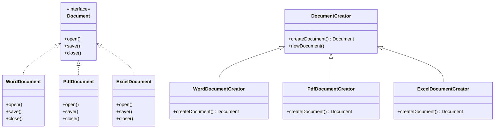

## 6.2.2 Product and Creator Hierarchies

In the realm of software design, the Factory Method pattern stands out as a pivotal creational pattern that provides a way to delegate the instantiation of objects to subclasses. This section delves into the intricate relationships between product and creator hierarchies, emphasizing how these hierarchies facilitate the addition of new products without altering existing creator code. This exploration is crucial for experienced Java developers and software architects aiming to design robust, maintainable, and scalable applications.

### Understanding Product and Creator Hierarchies

#### Product Hierarchies

In the Factory Method pattern, the **product hierarchy** refers to the set of classes that represent the objects being created. These classes typically implement a common interface or inherit from a common abstract class. This hierarchy allows for polymorphic behavior, enabling the client code to interact with different product types through a unified interface.

#### Creator Hierarchies

The **creator hierarchy** consists of classes responsible for defining the factory method, which is used to create product objects. These classes often contain the logic to determine which specific product subclass to instantiate. The creator hierarchy can be abstract, with concrete subclasses implementing the factory method to produce specific product instances.

### Relationship Between Product and Creator Hierarchies

The relationship between product and creator hierarchies is symbiotic. The creator hierarchy relies on the product hierarchy to define the types of objects it can create. Conversely, the product hierarchy depends on the creator hierarchy to instantiate its objects. This relationship is typically characterized by the following:

- **Decoupling**: The creator hierarchy is decoupled from the concrete product classes it instantiates. This decoupling is achieved through the use of interfaces or abstract classes, allowing the creator to work with any product that adheres to the expected interface.
- **Extensibility**: New product types can be added to the product hierarchy without modifying existing creator code. This is possible because the creator interacts with products through a common interface, allowing for seamless integration of new products.

### Implementing Product and Creator Hierarchies in Java

To illustrate the implementation of product and creator hierarchies in Java, consider the following example involving a simple document creation system. In this system, different types of documents (e.g., Word, PDF) are created using a factory method.

#### Step 1: Define the Product Interface

First, define a common interface for all product types:

```java
// Product interface
public interface Document {
    void open();
    void save();
    void close();
}
```

#### Step 2: Implement Concrete Products

Next, implement concrete product classes that adhere to the `Document` interface:

```java
// Concrete product: WordDocument
public class WordDocument implements Document {
    @Override
    public void open() {
        System.out.println("Opening Word document...");
    }

    @Override
    public void save() {
        System.out.println("Saving Word document...");
    }

    @Override
    public void close() {
        System.out.println("Closing Word document...");
    }
}

// Concrete product: PdfDocument
public class PdfDocument implements Document {
    @Override
    public void open() {
        System.out.println("Opening PDF document...");
    }

    @Override
    public void save() {
        System.out.println("Saving PDF document...");
    }

    @Override
    public void close() {
        System.out.println("Closing PDF document...");
    }
}
```

#### Step 3: Define the Creator Class

Define an abstract creator class that declares the factory method:

```java
// Creator class
public abstract class DocumentCreator {
    public abstract Document createDocument();

    public void newDocument() {
        Document doc = createDocument();
        doc.open();
        doc.save();
        doc.close();
    }
}
```

#### Step 4: Implement Concrete Creators

Implement concrete creator classes that override the factory method to create specific product instances:

```java
// Concrete creator: WordDocumentCreator
public class WordDocumentCreator extends DocumentCreator {
    @Override
    public Document createDocument() {
        return new WordDocument();
    }
}

// Concrete creator: PdfDocumentCreator
public class PdfDocumentCreator extends DocumentCreator {
    @Override
    public Document createDocument() {
        return new PdfDocument();
    }
}
```

### Extending Product and Creator Hierarchies

One of the key advantages of the Factory Method pattern is its support for extending product and creator hierarchies. To add a new document type, such as an Excel document, follow these steps:

1. **Create a New Product Class**: Implement a new product class that adheres to the `Document` interface.

```java
// Concrete product: ExcelDocument
public class ExcelDocument implements Document {
    @Override
    public void open() {
        System.out.println("Opening Excel document...");
    }

    @Override
    public void save() {
        System.out.println("Saving Excel document...");
    }

    @Override
    public void close() {
        System.out.println("Closing Excel document...");
    }
}
```

2. **Create a New Creator Class**: Implement a new creator class that overrides the factory method to create the new product instance.

```java
// Concrete creator: ExcelDocumentCreator
public class ExcelDocumentCreator extends DocumentCreator {
    @Override
    public Document createDocument() {
        return new ExcelDocument();
    }
}
```

### Practical Applications and Real-World Scenarios

The Factory Method pattern is widely used in software development, particularly in scenarios where a system needs to be open for extension but closed for modification. Some practical applications include:

- **GUI Frameworks**: In graphical user interface frameworks, the Factory Method pattern is often used to create different types of UI components (e.g., buttons, text fields) based on the platform or theme.
- **Logging Libraries**: Logging libraries may use the Factory Method pattern to create different types of loggers (e.g., file logger, console logger) based on configuration settings.
- **Data Access Layers**: In data access layers, the Factory Method pattern can be used to create different types of database connections (e.g., MySQL, PostgreSQL) based on the application's configuration.

### Historical Context and Evolution

The Factory Method pattern has its roots in the early days of object-oriented programming, where it was introduced as a way to encapsulate object creation logic. Over time, the pattern has evolved to accommodate modern programming paradigms, such as dependency injection and inversion of control. Today, it remains a fundamental pattern in software design, providing a flexible and extensible approach to object creation.

### Visualizing Product and Creator Hierarchies

To better understand the structure of product and creator hierarchies, consider the following class diagram:



**Caption**: This diagram illustrates the relationships between product and creator hierarchies in the Factory Method pattern. The `Document` interface defines the contract for all product types, while the `DocumentCreator` class defines the factory method for creating documents.

### Key Takeaways

- **Decoupling**: The Factory Method pattern decouples the creator from the concrete product classes, promoting flexibility and maintainability.
- **Extensibility**: New product types can be added without modifying existing creator code, adhering to the open/closed principle.
- **Polymorphism**: The use of interfaces or abstract classes allows for polymorphic behavior, enabling the client code to interact with different product types through a unified interface.

### Encouraging Experimentation

To deepen your understanding of product and creator hierarchies, consider experimenting with the following:

- **Add a New Document Type**: Implement a new document type, such as a PowerPoint document, and create a corresponding creator class.
- **Modify the Creator Logic**: Experiment with different logic in the creator classes to determine which product type to instantiate based on runtime conditions.
- **Integrate Modern Java Features**: Explore how modern Java features, such as lambda expressions and streams, can be integrated into the Factory Method pattern.

### Common Pitfalls and How to Avoid Them

- **Overcomplicating the Hierarchy**: Avoid creating overly complex product and creator hierarchies that are difficult to maintain. Keep the design simple and focused on the specific requirements of your application.
- **Ignoring the Open/Closed Principle**: Ensure that your design adheres to the open/closed principle by allowing for the addition of new product types without modifying existing code.
- **Neglecting Performance Considerations**: Be mindful of the performance implications of your design, particularly if the factory method involves complex logic or resource-intensive operations.

### Exercises and Practice Problems

1. **Implement a New Product Type**: Create a new product type and corresponding creator class for a different domain, such as a vehicle manufacturing system.
2. **Refactor an Existing System**: Identify an existing system in your codebase that could benefit from the Factory Method pattern and refactor it to use product and creator hierarchies.
3. **Design a Plugin System**: Design a plugin system using the Factory Method pattern, allowing for the dynamic addition of new plugins without modifying the core application code.

### Reflection

Consider how the Factory Method pattern can be applied to your current projects. Reflect on the following questions:

- How can product and creator hierarchies improve the flexibility and maintainability of your code?
- What challenges might you encounter when implementing these hierarchies, and how can you overcome them?
- How can you leverage modern Java features to enhance the design of your product and creator hierarchies?

By mastering the relationships between product and creator hierarchies in the Factory Method pattern, you can design software systems that are both flexible and robust, capable of adapting to changing requirements and accommodating new features with ease.

## Test Your Knowledge: Java Factory Method Pattern Quiz



### What is the primary benefit of using product and creator hierarchies in the Factory Method pattern?

- [x] They allow for the addition of new products without modifying existing creator code.
- [ ] They simplify the code by reducing the number of classes.
- [ ] They eliminate the need for interfaces.
- [ ] They improve the performance of the application.

> **Explanation:** Product and creator hierarchies allow for the addition of new products without modifying existing creator code, adhering to the open/closed principle.

### In the Factory Method pattern, what does the creator hierarchy consist of?

- [x] Classes responsible for defining the factory method.
- [ ] Classes that implement the product interface.
- [ ] Interfaces that define the product contract.
- [ ] Concrete product classes.

> **Explanation:** The creator hierarchy consists of classes responsible for defining the factory method, which is used to create product objects.

### How does the Factory Method pattern promote decoupling?

- [x] By using interfaces or abstract classes to interact with products.
- [ ] By eliminating the need for concrete product classes.
- [ ] By reducing the number of classes in the hierarchy.
- [ ] By using static methods for object creation.

> **Explanation:** The Factory Method pattern promotes decoupling by using interfaces or abstract classes to interact with products, allowing the creator to work with any product that adheres to the expected interface.

### What is a common pitfall when implementing product and creator hierarchies?

- [x] Overcomplicating the hierarchy.
- [ ] Using too few classes.
- [ ] Ignoring the use of interfaces.
- [ ] Relying on static methods.

> **Explanation:** A common pitfall is overcomplicating the hierarchy, which can make the design difficult to maintain.

### Which of the following is a real-world application of the Factory Method pattern?

- [x] GUI frameworks for creating UI components.
- [ ] Sorting algorithms for data processing.
- [ ] Encryption libraries for data security.
- [ ] Network protocols for communication.

> **Explanation:** GUI frameworks often use the Factory Method pattern to create different types of UI components based on the platform or theme.

### How can modern Java features be integrated into the Factory Method pattern?

- [x] By using lambda expressions and streams.
- [ ] By eliminating the use of interfaces.
- [ ] By relying solely on static methods.
- [ ] By reducing the number of classes.

> **Explanation:** Modern Java features, such as lambda expressions and streams, can be integrated into the Factory Method pattern to enhance its design.

### What is the role of the product interface in the Factory Method pattern?

- [x] To define a common contract for all product types.
- [ ] To implement the factory method.
- [ ] To create concrete product instances.
- [ ] To eliminate the need for creator classes.

> **Explanation:** The product interface defines a common contract for all product types, allowing for polymorphic behavior.

### How does the Factory Method pattern adhere to the open/closed principle?

- [x] By allowing new product types to be added without modifying existing code.
- [ ] By using static methods for object creation.
- [ ] By reducing the number of classes in the hierarchy.
- [ ] By eliminating the use of interfaces.

> **Explanation:** The Factory Method pattern adheres to the open/closed principle by allowing new product types to be added without modifying existing code.

### What is the purpose of the factory method in the creator class?

- [x] To create product objects.
- [ ] To define the product interface.
- [ ] To implement concrete product classes.
- [ ] To eliminate the need for product hierarchies.

> **Explanation:** The factory method in the creator class is responsible for creating product objects.

### True or False: The Factory Method pattern eliminates the need for concrete product classes.

- [ ] True
- [x] False

> **Explanation:** False. The Factory Method pattern does not eliminate the need for concrete product classes; it provides a way to instantiate them through a factory method.



By understanding and applying the principles of product and creator hierarchies in the Factory Method pattern, you can enhance the flexibility and maintainability of your software designs, ensuring they are well-equipped to handle future changes and extensions.
