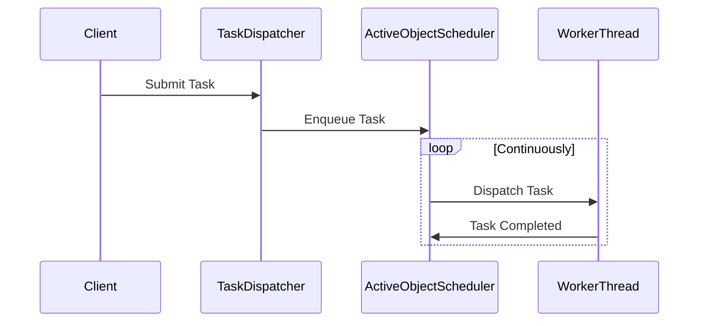

## 6.2.2 Scheduling and Execution

In this section, we delve into the intricacies of scheduling and execution within the Active Object pattern. This pattern is pivotal in decoupling method execution from invocation, thereby enhancing concurrency in Java applications. We'll explore various scheduling strategies, implementation of the Activation List or Scheduler, task dispatching, load balancing, and synchronization mechanisms. Additionally, we'll discuss handling task cancellation, completion callbacks, and leveraging Java concurrency utilities like `BlockingQueue`, `ExecutorService`, and `Future`.

### Understanding Scheduling Strategies

Scheduling is a critical component of the Active Object pattern, determining how tasks are managed and executed. Different scheduling strategies can be employed depending on the application's requirements:

1. **First-In-First-Out (FIFO) Queues**: 
   - **Explanation**: Tasks are processed in the order they arrive. This is the simplest form of scheduling and is suitable for tasks of equal priority.
   - **Implementation**: Use a `LinkedBlockingQueue` to maintain task order.

2. **Priority Queues**:
   - **Explanation**: Tasks are processed based on priority levels. Higher priority tasks are executed before lower priority ones.
   - **Implementation**: Utilize a `PriorityBlockingQueue` to manage tasks with varying priorities.

3. **Timed Scheduling**:
   - **Explanation**: Tasks are scheduled to execute at specific times or after certain intervals. This is useful for periodic tasks.
   - **Implementation**: Use `ScheduledExecutorService` for timed task execution.

### Implementing the Activation List or Scheduler

The Activation List or Scheduler is a core component in the Active Object pattern, responsible for managing task execution. It maintains a queue of tasks and dispatches them to worker threads for execution.

#### Code Example: Basic Scheduler Implementation

```java
import java.util.concurrent.*;

public class ActiveObjectScheduler {
    private final BlockingQueue<Runnable> taskQueue;
    private final ExecutorService executorService;

    public ActiveObjectScheduler(int poolSize) {
        this.taskQueue = new LinkedBlockingQueue<>();
        this.executorService = Executors.newFixedThreadPool(poolSize);
    }

    public void enqueueTask(Runnable task) {
        try {
            taskQueue.put(task);
        } catch (InterruptedException e) {
            Thread.currentThread().interrupt();
        }
    }

    public void start() {
        while (!Thread.currentThread().isInterrupted()) {
            try {
                Runnable task = taskQueue.take();
                executorService.submit(task);
            } catch (InterruptedException e) {
                Thread.currentThread().interrupt();
            }
        }
    }

    public void shutdown() {
        executorService.shutdown();
    }
}
```

**Explanation**:
- **BlockingQueue**: Used to store tasks in a FIFO manner.
- **ExecutorService**: Manages a pool of worker threads to execute tasks.
- **EnqueueTask**: Adds tasks to the queue.
- **Start**: Continuously fetches and executes tasks from the queue.
- **Shutdown**: Gracefully shuts down the executor service.

### Dispatching Tasks to Worker Threads

Task dispatching involves assigning tasks from the queue to available worker threads for execution. This process must be efficient to ensure optimal resource utilization and minimal latency.

#### Code Example: Task Dispatching

```java
public class TaskDispatcher {
    private final ActiveObjectScheduler scheduler;

    public TaskDispatcher(ActiveObjectScheduler scheduler) {
        this.scheduler = scheduler;
    }

    public void dispatch(Runnable task) {
        scheduler.enqueueTask(task);
    }
}
```

**Explanation**:
- **TaskDispatcher**: Acts as a mediator to submit tasks to the scheduler.
- **Dispatch**: Enqueues tasks for execution.

### Balancing Load and Minimizing Thread Contention

Effective load balancing and minimizing thread contention are crucial for maintaining high performance in concurrent systems. Consider the following strategies:

1. **Dynamic Thread Pool Sizing**:
   - Adjust the number of threads in the pool based on the current load. Use `ThreadPoolExecutor` with a dynamic pool size.

2. **Task Batching**:
   - Group smaller tasks into batches to reduce overhead and improve throughput.

3. **Work Stealing**:
   - Implement work-stealing algorithms where idle threads can "steal" tasks from busy threads' queues.

### Synchronization Mechanisms for Thread Safety

Ensuring thread safety during scheduling and execution is paramount. Java provides several synchronization mechanisms to achieve this:

1. **Locks**:
   - Use `ReentrantLock` for explicit locking and unlocking of critical sections.

2. **Atomic Variables**:
   - Use `AtomicInteger`, `AtomicBoolean`, etc., for lock-free thread-safe operations.

3. **Concurrent Collections**:
   - Use collections like `ConcurrentHashMap` and `ConcurrentLinkedQueue` for thread-safe data structures.

### Handling Task Cancellation and Completion Callbacks

Task cancellation and completion callbacks are essential for managing long-running or potentially blocking tasks.

#### Code Example: Task Cancellation and Callbacks

```java
public class CancellableTask implements Runnable {
    private final Future<?> future;

    public CancellableTask(Future<?> future) {
        this.future = future;
    }

    @Override
    public void run() {
        if (!future.isCancelled()) {
            // Perform task
        }
    }

    public void cancel() {
        future.cancel(true);
    }
}

public class TaskCompletionCallback {
    public void onComplete() {
        System.out.println("Task completed successfully.");
    }

    public void onFailure(Throwable t) {
        System.err.println("Task failed: " + t.getMessage());
    }
}
```

**Explanation**:
- **CancellableTask**: Wraps a `Future` to allow task cancellation.
- **TaskCompletionCallback**: Provides methods to handle task completion and failure.

### Leveraging Java Concurrency Utilities

Java provides a rich set of concurrency utilities to facilitate scheduling and execution in the Active Object pattern:

1. **BlockingQueue**:
   - Use for thread-safe task queuing.

2. **ExecutorService**:
   - Use for managing thread pools and task execution.

3. **Future**:
   - Use for handling asynchronous task results and cancellations.

4. **ScheduledExecutorService**:
   - Use for scheduling tasks with fixed delays or periodic execution.

### Try It Yourself

To solidify your understanding, try modifying the provided code examples:

1. **Implement a Priority Queue**: Modify the `ActiveObjectScheduler` to use a `PriorityBlockingQueue` and assign priorities to tasks.
2. **Add Timed Scheduling**: Extend the scheduler to support timed task execution using `ScheduledExecutorService`.
3. **Implement Task Batching**: Group tasks into batches before dispatching them to worker threads.

### Visualizing Scheduling and Execution

Let's visualize the scheduling and execution process in the Active Object pattern using a sequence diagram:



**Diagram Explanation**:
- **Client** submits tasks to the **TaskDispatcher**.
- **TaskDispatcher** enqueues tasks in the **ActiveObjectScheduler**.
- **ActiveObjectScheduler** dispatches tasks to **WorkerThread** for execution.
- **WorkerThread** notifies **ActiveObjectScheduler** upon task completion.

### Key Takeaways

- **Scheduling Strategies**: Choose the appropriate strategy (FIFO, priority, timed) based on application needs.
- **Activation List/Scheduler**: Central component managing task execution.
- **Task Dispatching**: Efficiently assign tasks to worker threads.
- **Load Balancing**: Use dynamic thread pools and task batching to optimize performance.
- **Synchronization**: Ensure thread safety with locks, atomic variables, and concurrent collections.
- **Task Management**: Handle cancellations and completion callbacks effectively.
- **Java Concurrency Utilities**: Leverage `BlockingQueue`, `ExecutorService`, `Future`, and `ScheduledExecutorService`.

### Embrace the Journey

Remember, mastering concurrency patterns like the Active Object pattern is a journey. As you progress, you'll build more robust and scalable applications. Keep experimenting, stay curious, and enjoy the journey!

## Quiz Time!



### What is the primary role of the Activation List or Scheduler in the Active Object pattern?

- [x] To manage task execution by maintaining a queue of tasks and dispatching them to worker threads.
- [ ] To directly execute tasks without queuing.
- [ ] To prioritize tasks based on their complexity.
- [ ] To handle network communication.

> **Explanation:** The Activation List or Scheduler is responsible for managing task execution by maintaining a queue of tasks and dispatching them to worker threads.

### Which Java utility is best suited for implementing a FIFO queue in the Active Object pattern?

- [x] LinkedBlockingQueue
- [ ] PriorityBlockingQueue
- [ ] ConcurrentHashMap
- [ ] ArrayList

> **Explanation:** `LinkedBlockingQueue` is used to implement a FIFO queue, ensuring tasks are processed in the order they arrive.

### How can you implement priority-based task scheduling in Java?

- [ ] Using LinkedBlockingQueue
- [x] Using PriorityBlockingQueue
- [ ] Using ConcurrentLinkedQueue
- [ ] Using ArrayBlockingQueue

> **Explanation:** `PriorityBlockingQueue` allows tasks to be scheduled based on priority levels.

### What is a key benefit of using `ExecutorService` in the Active Object pattern?

- [x] It manages a pool of worker threads for executing tasks efficiently.
- [ ] It provides direct network communication capabilities.
- [ ] It simplifies database transactions.
- [ ] It automatically prioritizes tasks.

> **Explanation:** `ExecutorService` manages a pool of worker threads, allowing tasks to be executed efficiently.

### Which synchronization mechanism is suitable for lock-free thread-safe operations?

- [ ] ReentrantLock
- [x] Atomic Variables
- [ ] Synchronized Blocks
- [ ] Semaphore

> **Explanation:** Atomic variables like `AtomicInteger` provide lock-free thread-safe operations.

### What is the purpose of a `Future` in Java concurrency?

- [x] To handle asynchronous task results and cancellations.
- [ ] To directly execute tasks.
- [ ] To manage database connections.
- [ ] To prioritize tasks based on execution time.

> **Explanation:** `Future` is used to handle asynchronous task results and manage cancellations.

### How can you implement timed scheduling in Java?

- [ ] Using LinkedBlockingQueue
- [x] Using ScheduledExecutorService
- [ ] Using PriorityBlockingQueue
- [ ] Using ConcurrentHashMap

> **Explanation:** `ScheduledExecutorService` is used for scheduling tasks with fixed delays or periodic execution.

### What is a common strategy for balancing load in concurrent systems?

- [ ] Using a single-threaded executor
- [x] Dynamic Thread Pool Sizing
- [ ] Prioritizing all tasks equally
- [ ] Using only one worker thread

> **Explanation:** Dynamic thread pool sizing adjusts the number of threads based on the current load, balancing the system's performance.

### Which Java utility is used for thread-safe task queuing?

- [x] BlockingQueue
- [ ] ArrayList
- [ ] HashMap
- [ ] Vector

> **Explanation:** `BlockingQueue` is used for thread-safe task queuing, ensuring tasks are managed safely in concurrent environments.

### True or False: The Active Object pattern decouples method execution from invocation to enhance concurrency.

- [x] True
- [ ] False

> **Explanation:** True. The Active Object pattern decouples method execution from invocation, enhancing concurrency by allowing tasks to be managed and executed independently.


