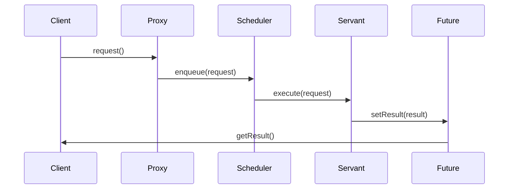

## 6.2.3 Use Cases and Examples

The Active Object pattern is a powerful design pattern that decouples method execution from method invocation to enhance concurrency and responsiveness in applications. By using this pattern, we can manage asynchronous operations more effectively, which is particularly beneficial in GUI applications, real-time systems, and network applications. In this section, we will explore practical scenarios where the Active Object pattern is applied, providing code snippets and diagrams to illustrate its implementation in real-world contexts.

### GUI Applications

In GUI applications, responsiveness is crucial. Users expect immediate feedback from the interface, and any delay can lead to a poor user experience. The Active Object pattern helps by offloading long-running tasks to separate threads, allowing the main UI thread to remain responsive.

#### Example: Asynchronous Image Processing

Consider a photo editing application where users can apply filters to images. Applying a filter can be a computationally intensive task that should not block the UI. By using the Active Object pattern, we can execute the filter application asynchronously.

```java
public class ImageProcessor {
    private final ExecutorService executor = Executors.newSingleThreadExecutor();

    public Future<Image> applyFilterAsync(Image image, Filter filter) {
        return executor.submit(() -> {
            // Simulate long-running filter application
            Thread.sleep(2000);
            return filter.apply(image);
        });
    }
}
```

In this example, `applyFilterAsync` submits the filter application task to an executor, returning a `Future<Image>` that can be used to retrieve the processed image once the task is complete. This approach keeps the UI responsive, as the filter application runs in a separate thread.

#### Benefits

- **Improved Responsiveness**: The UI remains responsive while the filter is being applied.
- **Decoupled Execution**: The method invocation is decoupled from execution, allowing for better concurrency management.

### Real-Time Systems

Real-time systems require predictable response times and often involve handling multiple concurrent tasks. The Active Object pattern can help manage these tasks efficiently by separating task invocation from execution.

#### Example: Real-Time Sensor Data Processing

Imagine a real-time monitoring system that collects data from multiple sensors. Each sensor's data must be processed in real-time without blocking the collection of data from other sensors.

```java
public class SensorDataProcessor {
    private final ExecutorService executor = Executors.newFixedThreadPool(10);

    public Future<Void> processSensorDataAsync(SensorData data) {
        return executor.submit(() -> {
            // Process the sensor data
            process(data);
            return null;
        });
    }

    private void process(SensorData data) {
        // Simulate data processing
        System.out.println("Processing data from sensor: " + data.getId());
    }
}
```

In this example, `processSensorDataAsync` submits data processing tasks to a fixed thread pool, ensuring that multiple sensor data can be processed concurrently without blocking each other.

#### Benefits

- **Predictable Response Times**: Tasks are executed in parallel, ensuring timely processing.
- **Scalability**: The system can handle more sensors by increasing the thread pool size.

### Network Applications

Network applications often need to handle multiple simultaneous requests, which can be efficiently managed using the Active Object pattern.

#### Example: Asynchronous HTTP Request Handling

Consider a web server that handles HTTP requests. Each request should be processed without blocking the server from handling other requests.

```java
public class HttpRequestHandler {
    private final ExecutorService executor = Executors.newCachedThreadPool();

    public Future<HttpResponse> handleRequestAsync(HttpRequest request) {
        return executor.submit(() -> {
            // Simulate request processing
            Thread.sleep(1000);
            return new HttpResponse("Processed request: " + request.getUrl());
        });
    }
}
```

Here, `handleRequestAsync` processes HTTP requests asynchronously, allowing the server to handle multiple requests concurrently.

#### Benefits

- **Concurrency Management**: Requests are processed in parallel, improving throughput.
- **Resource Efficiency**: The cached thread pool adjusts the number of threads according to the workload.

### Visualizing the Active Object Pattern

To better understand the Active Object pattern, let's visualize its components and interactions using a sequence diagram.



#### Diagram Description

- **Client**: Initiates the request.
- **Proxy**: Acts as an interface for the client to interact with the active object.
- **Scheduler**: Manages the execution of requests.
- **Servant**: Performs the actual task.
- **Future**: Holds the result of the task for the client to retrieve.

### Encouraging Use of the Active Object Pattern

The Active Object pattern is a versatile tool for managing concurrency in applications. By decoupling method invocation from execution, it simplifies thread handling and improves application responsiveness. Consider using this pattern when developing applications that require efficient concurrency management, such as GUI applications, real-time systems, and network applications.

### Try It Yourself

Experiment with the code examples provided by modifying the thread pool sizes or adding additional tasks to see how the Active Object pattern handles concurrency. Consider implementing a simple chat application where messages are processed asynchronously to maintain responsiveness.

### Knowledge Check

- **Question**: Why is the Active Object pattern beneficial in GUI applications?
- **Question**: How does the Active Object pattern improve concurrency management in real-time systems?
- **Question**: What role does the `Future` object play in the Active Object pattern?

### Summary

In this section, we explored the Active Object pattern and its application in various scenarios. We discussed how it enhances performance and responsiveness in GUI applications, real-time systems, and network applications. By decoupling method invocation from execution, the Active Object pattern simplifies concurrency management and improves application scalability.

## Quiz Time!



### Why is the Active Object pattern beneficial in GUI applications?

- [x] It keeps the UI responsive by offloading tasks to separate threads.
- [ ] It simplifies the user interface design.
- [ ] It reduces the need for user input validation.
- [ ] It enhances the graphical rendering capabilities.

> **Explanation:** The Active Object pattern is beneficial in GUI applications because it keeps the UI responsive by offloading long-running tasks to separate threads, allowing the main UI thread to remain responsive.

### How does the Active Object pattern improve concurrency management in real-time systems?

- [x] By separating task invocation from execution, allowing parallel processing.
- [ ] By reducing the number of tasks that can be processed.
- [ ] By increasing the complexity of task scheduling.
- [ ] By limiting the number of concurrent tasks.

> **Explanation:** The Active Object pattern improves concurrency management in real-time systems by separating task invocation from execution, allowing tasks to be processed in parallel, which ensures timely processing and scalability.

### What role does the `Future` object play in the Active Object pattern?

- [x] It holds the result of an asynchronous task for later retrieval.
- [ ] It schedules tasks for execution.
- [ ] It manages the thread pool.
- [ ] It logs the execution of tasks.

> **Explanation:** In the Active Object pattern, the `Future` object holds the result of an asynchronous task, allowing the client to retrieve the result once the task is complete.

### In a network application, how does the Active Object pattern handle multiple simultaneous requests?

- [x] By processing requests asynchronously in parallel.
- [ ] By queuing requests for sequential processing.
- [ ] By rejecting additional requests.
- [ ] By limiting the number of requests processed.

> **Explanation:** The Active Object pattern handles multiple simultaneous requests in a network application by processing them asynchronously in parallel, improving throughput and resource efficiency.

### What is a key benefit of using the Active Object pattern in real-time systems?

- [x] Predictable response times due to parallel task execution.
- [ ] Simplified user interface design.
- [ ] Reduced need for data validation.
- [ ] Enhanced graphical rendering.

> **Explanation:** A key benefit of using the Active Object pattern in real-time systems is achieving predictable response times due to parallel task execution, ensuring timely processing.

### Which component in the Active Object pattern acts as an interface for the client?

- [x] Proxy
- [ ] Scheduler
- [ ] Servant
- [ ] Future

> **Explanation:** In the Active Object pattern, the Proxy acts as an interface for the client to interact with the active object, managing request submission.

### How does the Active Object pattern enhance resource efficiency in network applications?

- [x] By using a cached thread pool that adjusts according to workload.
- [ ] By limiting the number of concurrent requests.
- [ ] By reducing the number of threads used.
- [ ] By increasing the complexity of task scheduling.

> **Explanation:** The Active Object pattern enhances resource efficiency in network applications by using a cached thread pool that adjusts the number of threads according to the workload, optimizing resource usage.

### What is the role of the Scheduler in the Active Object pattern?

- [x] It manages the execution of requests.
- [ ] It holds the result of tasks.
- [ ] It acts as an interface for the client.
- [ ] It performs the actual task.

> **Explanation:** In the Active Object pattern, the Scheduler manages the execution of requests, ensuring tasks are processed efficiently.

### How does the Active Object pattern decouple method invocation from execution?

- [x] By using separate threads for task execution.
- [ ] By using a single thread for all tasks.
- [ ] By reducing the number of tasks.
- [ ] By increasing the complexity of task scheduling.

> **Explanation:** The Active Object pattern decouples method invocation from execution by using separate threads for task execution, allowing tasks to be processed asynchronously.

### True or False: The Active Object pattern is only useful in GUI applications.

- [ ] True
- [x] False

> **Explanation:** False. The Active Object pattern is useful in various applications, including GUI applications, real-time systems, and network applications, where concurrency and responsiveness are important.


