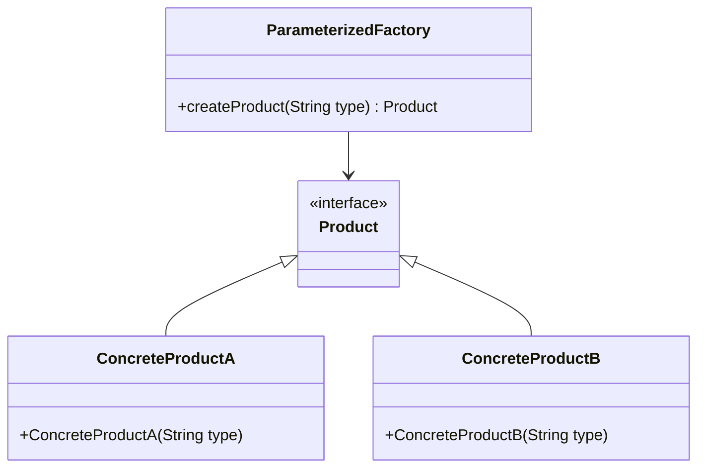

## 6.2.3 Parameterized Factories

In the realm of software design, the Factory Method pattern stands as a cornerstone for creating objects without specifying the exact class of object that will be created. This pattern provides a way to encapsulate the instantiation logic, promoting loose coupling and enhancing flexibility. However, as applications grow in complexity, the need arises to create objects based on varying parameters, leading us to the concept of **Parameterized Factories**.

### Intent

**Parameterized Factories** aim to extend the traditional Factory Method pattern by allowing parameters to influence the creation process. This approach provides a more dynamic and flexible way of instantiating objects, accommodating a wider range of scenarios and requirements.

### Motivation

Consider a scenario where a software application needs to create different types of user interfaces based on the user's locale and preferences. A simple Factory Method might require multiple subclasses to handle each variation, leading to a proliferation of classes and increased maintenance overhead. By parameterizing the factory method, we can streamline this process, reducing the need for subclassing and enhancing the system's adaptability.

### Applicability

Parameterized Factories are particularly useful in situations where:

- The creation logic is complex and depends on multiple factors.
- The system needs to support a wide range of product variations.
- Subclassing would lead to an unwieldy number of classes.
- Flexibility and configurability are paramount.

### Structure

The structure of a Parameterized Factory involves a factory interface or abstract class with a method that accepts parameters. These parameters guide the instantiation process, determining the specific type of object to create.



**Caption**: The diagram illustrates a Parameterized Factory structure where the factory method `createProduct` takes a parameter to determine which `Product` subclass to instantiate.

### Participants

- **Product**: The interface or abstract class for objects the factory method creates.
- **ConcreteProduct**: Concrete implementations of the `Product` interface.
- **ParameterizedFactory**: The factory class that includes a method accepting parameters to create `Product` instances.

### Collaborations

The factory method in the `ParameterizedFactory` class uses the provided parameters to decide which `ConcreteProduct` to instantiate. This decision-making process can involve conditional logic, configuration data, or external inputs.

### Consequences

**Benefits**:
- **Flexibility**: Easily accommodate new product types without altering existing code.
- **Reduced Subclassing**: Minimize the number of subclasses needed, simplifying the class hierarchy.
- **Dynamic Behavior**: Adjust object creation dynamically based on runtime parameters.

**Drawbacks**:
- **Complexity**: Parameterization can introduce complexity, making the factory harder to understand and maintain.
- **Performance**: Additional logic for parameter handling may impact performance.

### Implementation

To implement a Parameterized Factory, follow these steps:

1. **Define the Product Interface**: Create an interface or abstract class for the products the factory will create.

2. **Implement Concrete Products**: Develop concrete classes that implement the product interface.

3. **Create the Parameterized Factory**: Implement a factory class with a method that accepts parameters and returns a product instance.

4. **Incorporate Decision Logic**: Use the parameters to determine which concrete product to instantiate.

#### Sample Code Snippets

```java
// Define the Product interface
interface Product {
    void use();
}

// Implement Concrete Products
class ConcreteProductA implements Product {
    private String type;

    public ConcreteProductA(String type) {
        this.type = type;
    }

    @Override
    public void use() {
        System.out.println("Using ConcreteProductA of type: " + type);
    }
}

class ConcreteProductB implements Product {
    private String type;

    public ConcreteProductB(String type) {
        this.type = type;
    }

    @Override
    public void use() {
        System.out.println("Using ConcreteProductB of type: " + type);
    }
}

// Create the Parameterized Factory
class ParameterizedFactory {
    public Product createProduct(String type) {
        switch (type) {
            case "A":
                return new ConcreteProductA(type);
            case "B":
                return new ConcreteProductB(type);
            default:
                throw new IllegalArgumentException("Unknown product type: " + type);
        }
    }
}

// Client code
public class Client {
    public static void main(String[] args) {
        ParameterizedFactory factory = new ParameterizedFactory();
        Product productA = factory.createProduct("A");
        productA.use();

        Product productB = factory.createProduct("B");
        productB.use();
    }
}
```

**Explanation**: In this example, the `ParameterizedFactory` class uses a parameter to determine which `ConcreteProduct` to instantiate. The `createProduct` method accepts a `String` parameter that guides the creation process.

### Sample Use Cases

- **UI Component Creation**: Dynamically create UI components based on user preferences or device characteristics.
- **Data Processing Pipelines**: Instantiate different processing modules based on data type or source.
- **Game Development**: Generate game objects or characters based on player choices or game state.

### Related Patterns

- **[6.6 Singleton Pattern]( "Singleton Pattern")**: Often used in conjunction with factories to ensure a single instance of a factory.
- **Abstract Factory**: Provides an interface for creating families of related or dependent objects without specifying their concrete classes.

### Known Uses

- **Spring Framework**: Uses parameterized factories for bean creation, allowing for flexible and configurable object instantiation.
- **JavaFX**: Utilizes factories for creating UI components based on application state and user interactions.

### Trade-offs Between Parameterization and Subclassing

When deciding between parameterization and subclassing, consider the following:

- **Parameterization** offers greater flexibility and reduces the number of classes, but can increase complexity and require more sophisticated error handling.
- **Subclassing** provides clearer separation of concerns and can simplify the factory logic, but may lead to a bloated class hierarchy and reduced flexibility.

### Expert Tips and Best Practices

- **Use Enums for Parameters**: When possible, use enums instead of strings for parameters to improve type safety and reduce errors.
- **Validate Parameters**: Implement robust validation logic to handle invalid or unexpected parameters gracefully.
- **Consider Performance**: Be mindful of the performance implications of complex parameter handling logic, especially in high-load scenarios.

### Exercises

1. **Modify the Example**: Extend the provided example to include a new product type, `ConcreteProductC`, and update the factory method accordingly.
2. **Experiment with Enums**: Refactor the example to use an enum for the product type parameter instead of a string.
3. **Explore Error Handling**: Implement error handling in the factory method to manage invalid parameters more effectively.

### Conclusion

Parameterized Factories offer a powerful way to enhance the flexibility and adaptability of the Factory Method pattern. By allowing parameters to guide the object creation process, developers can create more dynamic and responsive applications. However, this flexibility comes with trade-offs in complexity and performance, requiring careful consideration and implementation.

---

## Test Your Knowledge: Parameterized Factories in Java Design Patterns



### What is the primary advantage of using Parameterized Factories?

- [x] They provide flexibility by allowing dynamic object creation based on parameters.
- [ ] They simplify the class hierarchy by eliminating the need for interfaces.
- [ ] They improve performance by reducing the number of classes.
- [ ] They enforce strict type safety by using generics.

> **Explanation:** Parameterized Factories allow for dynamic object creation based on parameters, providing flexibility in how objects are instantiated.

### Which of the following is a potential drawback of Parameterized Factories?

- [x] Increased complexity in the factory logic.
- [ ] Reduced flexibility in object creation.
- [ ] Increased number of subclasses.
- [ ] Decreased performance due to subclassing.

> **Explanation:** Parameterized Factories can introduce complexity in the factory logic due to the need to handle various parameters and conditions.

### In the provided code example, what determines the type of product created?

- [x] The string parameter passed to the `createProduct` method.
- [ ] The number of parameters passed to the factory.
- [ ] The type of the factory class.
- [ ] The return type of the factory method.

> **Explanation:** The string parameter passed to the `createProduct` method determines which concrete product is instantiated.

### How can enums improve the implementation of Parameterized Factories?

- [x] By providing type safety and reducing errors in parameter handling.
- [ ] By simplifying the factory logic to a single line.
- [ ] By eliminating the need for concrete product classes.
- [ ] By automatically generating factory methods.

> **Explanation:** Enums provide type safety and reduce errors by limiting the possible values for parameters, making the code more robust.

### What is a common use case for Parameterized Factories?

- [x] Creating UI components based on user preferences.
- [ ] Managing database connections.
- [ ] Implementing singleton objects.
- [ ] Handling file I/O operations.

> **Explanation:** Parameterized Factories are commonly used to create UI components dynamically based on user preferences or device characteristics.

### Which design pattern is often used alongside Parameterized Factories?

- [x] Singleton Pattern
- [ ] Observer Pattern
- [ ] Strategy Pattern
- [ ] Decorator Pattern

> **Explanation:** The Singleton Pattern is often used alongside factories to ensure a single instance of a factory is used throughout an application.

### What is a benefit of using parameterization over subclassing?

- [x] Reduced number of classes in the hierarchy.
- [ ] Increased clarity in the factory logic.
- [ ] Improved performance due to fewer method calls.
- [ ] Enhanced security through encapsulation.

> **Explanation:** Parameterization reduces the number of classes needed, simplifying the class hierarchy and making the system easier to maintain.

### How does the Parameterized Factory pattern relate to the Abstract Factory pattern?

- [x] Both provide interfaces for creating families of related objects.
- [ ] Parameterized Factory is a simpler form of the Abstract Factory.
- [ ] Abstract Factory requires subclassing, while Parameterized Factory does not.
- [ ] They are unrelated patterns with different purposes.

> **Explanation:** Both patterns provide interfaces for creating families of related objects, but Parameterized Factories focus on parameter-driven creation.

### What should be considered when implementing a Parameterized Factory?

- [x] Performance implications of complex parameter handling.
- [ ] The number of subclasses required.
- [ ] The use of generics for type safety.
- [ ] The need for a singleton instance.

> **Explanation:** When implementing a Parameterized Factory, consider the performance implications of handling complex parameters, especially in high-load scenarios.

### True or False: Parameterized Factories eliminate the need for concrete product classes.

- [ ] True
- [x] False

> **Explanation:** Parameterized Factories do not eliminate the need for concrete product classes; they simply provide a flexible way to instantiate them based on parameters.


