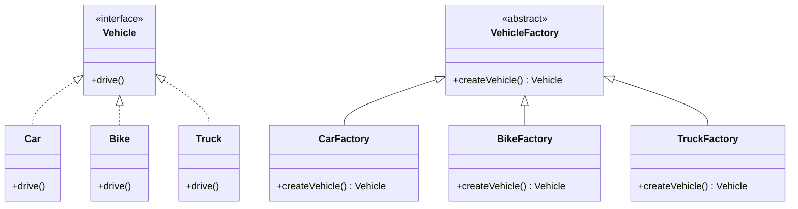

## 6.2.4 Extending Factories

In the realm of software design, the ability to extend and adapt systems without modifying existing code is paramount. This principle is encapsulated in the Open/Closed Principle, one of the five SOLID principles of object-oriented design. This section delves into the strategies for extending factories in Java, specifically focusing on the Factory Method Pattern, to support additional products or creation logic while adhering to this principle.

### Understanding the Open/Closed Principle

The **Open/Closed Principle** states that software entities (classes, modules, functions, etc.) should be open for extension but closed for modification. This means that the behavior of a module can be extended without altering its source code, thus minimizing the risk of introducing errors into existing functionality.

#### Historical Context

The Open/Closed Principle was first introduced by Bertrand Meyer in 1988. It has since become a cornerstone of object-oriented design, promoting the development of flexible and maintainable software systems. By adhering to this principle, developers can create systems that are resilient to change, a critical requirement in today's fast-paced software development environment.

### Extending Factories in Java

The Factory Method Pattern is a creational design pattern that provides an interface for creating objects in a superclass but allows subclasses to alter the type of objects that will be created. This pattern is particularly useful when a class cannot anticipate the class of objects it must create.

#### Extending Factory Classes

To extend factory classes without altering existing code, developers can create new factory subclasses. This approach allows for the introduction of new product types or creation logic while preserving the integrity of the existing system.

##### Example: Extending a Factory for a New Product

Consider a scenario where a software system uses a factory to create different types of vehicles. Initially, the system supports cars and bikes. However, there is a requirement to add support for trucks. By extending the existing factory, this new requirement can be met without modifying the existing code.

```java
// Base Product Interface
interface Vehicle {
    void drive();
}

// Concrete Products
class Car implements Vehicle {
    @Override
    public void drive() {
        System.out.println("Driving a car.");
    }
}

class Bike implements Vehicle {
    @Override
    public void drive() {
        System.out.println("Riding a bike.");
    }
}

// New Concrete Product
class Truck implements Vehicle {
    @Override
    public void drive() {
        System.out.println("Driving a truck.");
    }
}

// Base Factory
abstract class VehicleFactory {
    public abstract Vehicle createVehicle();
}

// Concrete Factories
class CarFactory extends VehicleFactory {
    @Override
    public Vehicle createVehicle() {
        return new Car();
    }
}

class BikeFactory extends VehicleFactory {
    @Override
    public Vehicle createVehicle() {
        return new Bike();
    }
}

// New Concrete Factory
class TruckFactory extends VehicleFactory {
    @Override
    public Vehicle createVehicle() {
        return new Truck();
    }
}

// Client Code
public class FactoryMethodDemo {
    public static void main(String[] args) {
        VehicleFactory carFactory = new CarFactory();
        Vehicle car = carFactory.createVehicle();
        car.drive();

        VehicleFactory bikeFactory = new BikeFactory();
        Vehicle bike = bikeFactory.createVehicle();
        bike.drive();

        // Using the new TruckFactory
        VehicleFactory truckFactory = new TruckFactory();
        Vehicle truck = truckFactory.createVehicle();
        truck.drive();
    }
}
```

In this example, the `TruckFactory` class extends the `VehicleFactory` class to support the creation of `Truck` objects. This extension adheres to the Open/Closed Principle, as the existing `CarFactory` and `BikeFactory` classes remain unchanged.

### Practical Applications and Real-World Scenarios

Extending factories is a common requirement in software systems that need to accommodate new product types or variations. For instance, in an e-commerce platform, a payment processing system might need to support new payment methods. By extending the factory responsible for creating payment processors, new methods can be integrated seamlessly.

#### Real-World Example: Payment Processing System

Consider a payment processing system that initially supports credit card and PayPal payments. To add support for cryptocurrency payments, a new factory subclass can be created.

```java
// Base Product Interface
interface PaymentProcessor {
    void processPayment(double amount);
}

// Concrete Products
class CreditCardProcessor implements PaymentProcessor {
    @Override
    public void processPayment(double amount) {
        System.out.println("Processing credit card payment of $" + amount);
    }
}

class PayPalProcessor implements PaymentProcessor {
    @Override
    public void processPayment(double amount) {
        System.out.println("Processing PayPal payment of $" + amount);
    }
}

// New Concrete Product
class CryptoProcessor implements PaymentProcessor {
    @Override
    public void processPayment(double amount) {
        System.out.println("Processing cryptocurrency payment of $" + amount);
    }
}

// Base Factory
abstract class PaymentProcessorFactory {
    public abstract PaymentProcessor createProcessor();
}

// Concrete Factories
class CreditCardProcessorFactory extends PaymentProcessorFactory {
    @Override
    public PaymentProcessor createProcessor() {
        return new CreditCardProcessor();
    }
}

class PayPalProcessorFactory extends PaymentProcessorFactory {
    @Override
    public PaymentProcessor createProcessor() {
        return new PayPalProcessor();
    }
}

// New Concrete Factory
class CryptoProcessorFactory extends PaymentProcessorFactory {
    @Override
    public PaymentProcessor createProcessor() {
        return new CryptoProcessor();
    }
}

// Client Code
public class PaymentProcessingDemo {
    public static void main(String[] args) {
        PaymentProcessorFactory creditCardFactory = new CreditCardProcessorFactory();
        PaymentProcessor creditCardProcessor = creditCardFactory.createProcessor();
        creditCardProcessor.processPayment(100.0);

        PaymentProcessorFactory payPalFactory = new PayPalProcessorFactory();
        PaymentProcessor payPalProcessor = payPalFactory.createProcessor();
        payPalProcessor.processPayment(200.0);

        // Using the new CryptoProcessorFactory
        PaymentProcessorFactory cryptoFactory = new CryptoProcessorFactory();
        PaymentProcessor cryptoProcessor = cryptoFactory.createProcessor();
        cryptoProcessor.processPayment(300.0);
    }
}
```

### Visualizing Factory Extensions

To better understand the structure and relationships in the Factory Method Pattern, consider the following class diagram:



**Diagram Explanation**: This diagram illustrates the relationships between the `Vehicle` interface, its concrete implementations (`Car`, `Bike`, `Truck`), and the factory classes (`VehicleFactory`, `CarFactory`, `BikeFactory`, `TruckFactory`). The diagram highlights how new product types and factories can be added without modifying existing code.

### Best Practices for Extending Factories

1. **Adhere to the Open/Closed Principle**: Ensure that new functionality is added through extension rather than modification of existing code.
2. **Use Interfaces and Abstract Classes**: Define common interfaces or abstract classes for products and factories to facilitate extension.
3. **Encapsulate Creation Logic**: Keep the creation logic within factory classes to maintain separation of concerns.
4. **Leverage Polymorphism**: Use polymorphism to allow new product types to be used interchangeably with existing ones.
5. **Document Extensions**: Clearly document any extensions to the factory to aid future developers in understanding the system's architecture.

### Common Pitfalls and How to Avoid Them

- **Modifying Existing Code**: Avoid altering existing factory classes when adding new product types. Instead, create new subclasses.
- **Tight Coupling**: Ensure that factory classes are not tightly coupled to specific product implementations. Use interfaces to decouple dependencies.
- **Overcomplicating the Design**: Keep the factory design simple and focused. Avoid unnecessary complexity that can hinder maintainability.

### Exercises and Practice Problems

1. **Exercise 1**: Extend the vehicle factory example to include a new product type, such as a `Bus`. Implement the necessary factory and product classes.
2. **Exercise 2**: Modify the payment processing system to support a new payment method, such as `BankTransfer`. Create the appropriate factory and processor classes.
3. **Exercise 3**: Refactor an existing system that violates the Open/Closed Principle by modifying factory classes. Implement a solution that adheres to the principle.

### Key Takeaways

- Extending factories in Java allows for the addition of new product types and creation logic without modifying existing code.
- Adhering to the Open/Closed Principle is crucial for creating flexible and maintainable software systems.
- By using interfaces, abstract classes, and polymorphism, developers can create robust factory extensions that integrate seamlessly with existing systems.

### Reflection

Consider how the principles and techniques discussed in this section can be applied to your own projects. Reflect on the importance of designing systems that are resilient to change and how extending factories can contribute to this goal.

## Test Your Knowledge: Extending Factories in Java Design Patterns



### What is the primary benefit of adhering to the Open/Closed Principle when extending factories?

- [x] It allows for new functionality to be added without modifying existing code.
- [ ] It improves the performance of the application.
- [ ] It reduces the number of classes in the system.
- [ ] It simplifies the user interface.

> **Explanation:** The Open/Closed Principle allows for new functionality to be added through extension rather than modification, minimizing the risk of introducing errors into existing code.

### Which of the following is a key practice when extending factory classes?

- [x] Use interfaces and abstract classes to define common behavior.
- [ ] Modify existing factory classes to add new product types.
- [ ] Avoid using polymorphism in factory design.
- [ ] Hard-code product creation logic in client code.

> **Explanation:** Using interfaces and abstract classes helps define common behavior and facilitates extension without modifying existing code.

### In the vehicle factory example, what is the role of the `VehicleFactory` class?

- [x] It serves as an abstract base class for creating vehicle objects.
- [ ] It directly creates instances of `Car` and `Bike`.
- [ ] It contains the main method for running the application.
- [ ] It stores vehicle objects in a list.

> **Explanation:** The `VehicleFactory` class is an abstract base class that defines the method for creating vehicle objects, allowing subclasses to provide specific implementations.

### How can new product types be integrated into an existing factory system?

- [x] By creating new factory subclasses for each new product type.
- [ ] By modifying existing factory classes to include new product types.
- [ ] By using a switch statement in the client code.
- [ ] By directly instantiating new product types in the main method.

> **Explanation:** New product types can be integrated by creating new factory subclasses, adhering to the Open/Closed Principle.

### Which of the following is a common pitfall when extending factories?

- [x] Tight coupling between factory classes and specific product implementations.
- [ ] Using interfaces to define common behavior.
- [ ] Creating new factory subclasses for new product types.
- [ ] Documenting extensions to the factory.

> **Explanation:** Tight coupling can hinder flexibility and maintainability, so it's important to decouple dependencies using interfaces.

### What is the purpose of the `createVehicle` method in the `VehicleFactory` class?

- [x] To define a method for creating vehicle objects that subclasses must implement.
- [ ] To store vehicle objects in a database.
- [ ] To print vehicle details to the console.
- [ ] To manage the lifecycle of vehicle objects.

> **Explanation:** The `createVehicle` method is an abstract method that subclasses must implement to provide specific vehicle creation logic.

### How does the Factory Method Pattern support the Open/Closed Principle?

- [x] By allowing new product types to be added through subclassing without modifying existing code.
- [ ] By reducing the number of classes in the system.
- [ ] By improving the performance of the application.
- [ ] By simplifying the user interface.

> **Explanation:** The Factory Method Pattern supports the Open/Closed Principle by enabling new product types to be added through subclassing, preserving existing code.

### What is a benefit of using polymorphism in factory design?

- [x] It allows different product types to be used interchangeably.
- [ ] It reduces the number of classes in the system.
- [ ] It simplifies the user interface.
- [ ] It improves the performance of the application.

> **Explanation:** Polymorphism allows different product types to be used interchangeably, enhancing flexibility and extensibility.

### In the payment processing example, what is the role of the `PaymentProcessorFactory` class?

- [x] It serves as an abstract base class for creating payment processor objects.
- [ ] It directly processes payments for all methods.
- [ ] It contains the main method for running the application.
- [ ] It stores payment processor objects in a list.

> **Explanation:** The `PaymentProcessorFactory` class is an abstract base class that defines the method for creating payment processor objects, allowing subclasses to provide specific implementations.

### True or False: The Factory Method Pattern requires modifying existing factory classes to add new product types.

- [ ] True
- [x] False

> **Explanation:** The Factory Method Pattern allows new product types to be added through subclassing, adhering to the Open/Closed Principle and avoiding modifications to existing factory classes.



By mastering the techniques of extending factories in Java, developers can create flexible, scalable, and maintainable software systems that are well-equipped to handle evolving requirements.
