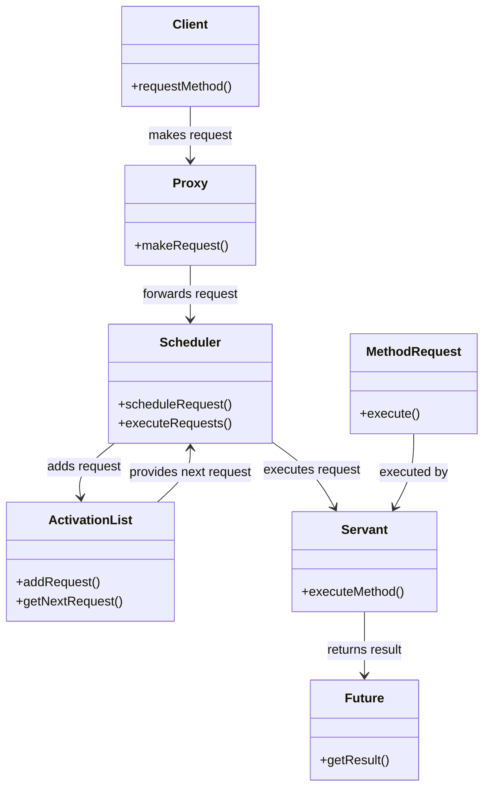

## 6.2 Active Object Pattern

Concurrency is a critical aspect of modern software development, especially when dealing with real-time systems, GUI applications, and other scenarios where multiple tasks need to be executed simultaneously. The Active Object Pattern is a design pattern that addresses the challenges of concurrency by decoupling method execution from method invocation. This pattern simplifies thread management and enhances concurrency by allowing method calls to be executed asynchronously.

### Understanding the Active Object Pattern

The Active Object Pattern is designed to manage concurrency by separating the concerns of method invocation and execution. It allows for asynchronous method execution, which means that a method call returns immediately, and the actual execution of the method occurs at a later time. This decoupling is achieved through a combination of several components, each playing a specific role in the pattern.

#### Intent of the Active Object Pattern

The primary intent of the Active Object Pattern is to enhance concurrency by:

- Decoupling method execution from method invocation.
- Simplifying thread management and synchronization.
- Coordinating multiple method calls in a concurrent environment.
- Providing a mechanism for asynchronous execution of methods.

#### Problem Solved by the Active Object Pattern

In a multi-threaded environment, managing concurrency can be challenging due to the complexity of synchronizing access to shared resources. The Active Object Pattern addresses these challenges by:

- Allowing multiple method calls to be made without blocking the caller.
- Managing the execution of these calls asynchronously, thus improving system responsiveness.
- Simplifying the synchronization of shared resources by encapsulating method requests.

### Structure of the Active Object Pattern

The Active Object Pattern consists of several key components, each with a specific role:

1. **Proxy**: Provides an interface for clients to make method calls. It encapsulates method requests and forwards them to the Scheduler.

2. **Scheduler**: Manages the execution of method requests. It maintains an Activation List of pending requests and schedules them for execution.

3. **Activation List**: A queue that holds method requests until they are executed by the Scheduler.

4. **Servant**: The actual object that performs the method execution. It contains the implementation of the methods that are invoked asynchronously.

5. **Future**: Represents the result of an asynchronous method call. It allows the caller to retrieve the result once the execution is complete.

6. **Method Request**: Encapsulates a method call, including the method to be executed and its parameters.

Below is a UML diagram illustrating the structure of the Active Object Pattern:

### How the Active Object Pattern Works

1. **Client Interaction**: The client interacts with the Proxy to make a method call. The Proxy creates a Method Request object encapsulating the method call and its parameters.

2. **Scheduling Requests**: The Proxy forwards the Method Request to the Scheduler, which adds it to the Activation List.

3. **Executing Requests**: The Scheduler continuously monitors the Activation List and retrieves the next Method Request for execution. It delegates the execution to the Servant.

4. **Handling Results**: Once the Servant completes the method execution, the result is stored in a Future object. The client can retrieve the result from the Future once it is available.

### Promoting Thread Safety and Simplifying Synchronization

The Active Object Pattern promotes thread safety by ensuring that method requests are executed in a controlled manner. The Scheduler manages the execution of requests, ensuring that only one request is executed at a time. This eliminates the need for explicit synchronization in the client code, simplifying the overall design.

By encapsulating method requests and managing their execution asynchronously, the Active Object Pattern provides a robust mechanism for handling concurrency. It allows developers to focus on the logic of their applications without worrying about the complexities of thread management and synchronization.

### Scenarios Where the Active Object Pattern is Beneficial

The Active Object Pattern is particularly useful in scenarios where:

- **Real-Time Systems**: In real-time systems, responsiveness is critical. The Active Object Pattern allows for non-blocking method calls, ensuring that the system remains responsive even under heavy load.

- **GUI Applications**: In GUI applications, long-running operations can block the user interface, leading to a poor user experience. The Active Object Pattern allows these operations to be executed asynchronously, keeping the UI responsive.

- **Distributed Systems**: In distributed systems, network latency can cause delays in method execution. The Active Object Pattern allows method calls to be made without waiting for the execution to complete, improving system efficiency.

### Preparing for Implementation

In the following subsections, we will delve into the implementation details of the Active Object Pattern in Java. We will explore how to create each component of the pattern, provide code examples, and discuss considerations for implementing the pattern effectively.

Remember, this is just the beginning. As you progress, you'll build more complex and interactive systems using the Active Object Pattern. Keep experimenting, stay curious, and enjoy the journey!

## Quiz Time!



### What is the primary intent of the Active Object Pattern?

- [x] To decouple method execution from method invocation
- [ ] To couple method execution with method invocation
- [ ] To simplify method invocation
- [ ] To make method execution synchronous

> **Explanation:** The primary intent of the Active Object Pattern is to decouple method execution from method invocation, allowing for asynchronous execution.

### Which component of the Active Object Pattern encapsulates a method call?

- [ ] Proxy
- [ ] Scheduler
- [x] Method Request
- [ ] Servant

> **Explanation:** The Method Request component encapsulates a method call, including the method to be executed and its parameters.

### What role does the Scheduler play in the Active Object Pattern?

- [x] It manages the execution of method requests
- [ ] It provides an interface for clients
- [ ] It performs the actual method execution
- [ ] It represents the result of an asynchronous method call

> **Explanation:** The Scheduler manages the execution of method requests by maintaining an Activation List and scheduling requests for execution.

### In which scenarios is the Active Object Pattern particularly useful?

- [x] Real-time systems and GUI applications
- [ ] Single-threaded applications
- [ ] Batch processing systems
- [ ] Static websites

> **Explanation:** The Active Object Pattern is particularly useful in real-time systems and GUI applications where responsiveness is critical.

### How does the Active Object Pattern promote thread safety?

- [x] By ensuring that method requests are executed in a controlled manner
- [ ] By allowing multiple requests to be executed simultaneously
- [ ] By eliminating the need for synchronization
- [ ] By using a single thread for all executions

> **Explanation:** The Active Object Pattern promotes thread safety by ensuring that method requests are executed in a controlled manner, typically one at a time.

### Which component of the Active Object Pattern provides the result of an asynchronous method call?

- [ ] Proxy
- [ ] Scheduler
- [ ] Servant
- [x] Future

> **Explanation:** The Future component represents the result of an asynchronous method call, allowing the caller to retrieve the result once it is available.

### What is the role of the Servant in the Active Object Pattern?

- [ ] To manage the execution of method requests
- [ ] To encapsulate method calls
- [x] To perform the actual method execution
- [ ] To provide an interface for clients

> **Explanation:** The Servant is the actual object that performs the method execution in the Active Object Pattern.

### What is the Activation List used for in the Active Object Pattern?

- [x] To hold method requests until they are executed
- [ ] To provide an interface for clients
- [ ] To perform the actual method execution
- [ ] To represent the result of an asynchronous method call

> **Explanation:** The Activation List is a queue that holds method requests until they are executed by the Scheduler.

### How does the Active Object Pattern simplify synchronization?

- [x] By encapsulating method requests and managing their execution asynchronously
- [ ] By allowing multiple requests to be executed simultaneously
- [ ] By eliminating the need for synchronization
- [ ] By using a single thread for all executions

> **Explanation:** The Active Object Pattern simplifies synchronization by encapsulating method requests and managing their execution asynchronously, reducing the need for explicit synchronization in client code.

### True or False: The Active Object Pattern is useful in single-threaded applications.

- [ ] True
- [x] False

> **Explanation:** The Active Object Pattern is designed for multi-threaded environments where concurrency and asynchronous execution are required. It is not typically used in single-threaded applications.


