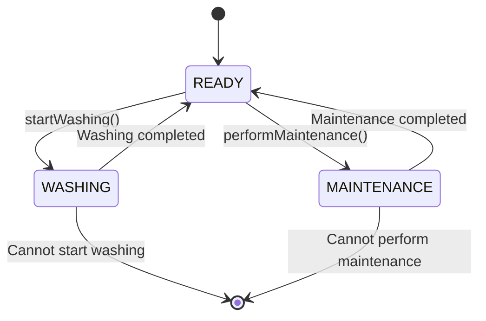

## 6.3.1 Implementing Balking in Java

In the realm of concurrent programming, managing access to shared resources is crucial to ensure data consistency and avoid race conditions. The Balking pattern is a concurrency design pattern that provides a mechanism to prevent an operation from being executed if the system is not in an appropriate state. This pattern is particularly useful in scenarios where the cost of executing an operation is high, or the operation is only meaningful under certain conditions.

### Understanding the Balking Pattern

The Balking pattern is essentially a guard clause that checks the state of an object before proceeding with an operation. If the object is not in the desired state, the operation is "balked," meaning it is not executed. This pattern is commonly used in scenarios where operations are time-sensitive or resource-intensive, and executing them in an inappropriate state could lead to errors or inefficiencies.

#### Key Concepts of the Balking Pattern

- **State Checking**: Before performing an operation, the current state of the object is checked to determine if the operation should proceed.
- **Thread Safety**: Ensuring that state checks and subsequent operations are performed atomically to prevent race conditions.
- **Balking**: If the object is not in the correct state, the operation is aborted or delayed.
- **Performance Considerations**: Minimizing the overhead of state checks to maintain system performance.

### Designing Methods with State Checks

To implement the Balking pattern, we start by designing methods that incorporate state checks. These methods should:

1. **Check the State**: Before proceeding with any operation, check if the object is in the correct state.
2. **Synchronized Access**: Use synchronized methods or blocks to ensure that state checks and operations are thread-safe.
3. **Handle Balking**: Decide how to handle situations where the operation is balked, such as returning immediately or notifying the caller.

#### Example: Implementing a Balking Pattern in Java

Let's consider a scenario where we have a `WashingMachine` class that should only start washing if it is in the `READY` state. If it is already washing or in maintenance, the start operation should be balked.

```java
public class WashingMachine {
    private enum State { READY, WASHING, MAINTENANCE }
    private State currentState;

    public WashingMachine() {
        this.currentState = State.READY;
    }

    public synchronized void startWashing() {
        if (currentState != State.READY) {
            System.out.println("Cannot start washing. Current state: " + currentState);
            return; // Balk the operation
        }
        currentState = State.WASHING;
        System.out.println("Washing started.");
        // Simulate washing process
        try {
            Thread.sleep(2000); // Simulate time taken to wash
        } catch (InterruptedException e) {
            Thread.currentThread().interrupt();
        } finally {
            currentState = State.READY;
            System.out.println("Washing completed.");
        }
    }

    public synchronized void performMaintenance() {
        if (currentState != State.READY) {
            System.out.println("Cannot perform maintenance. Current state: " + currentState);
            return; // Balk the operation
        }
        currentState = State.MAINTENANCE;
        System.out.println("Maintenance started.");
        // Simulate maintenance process
        try {
            Thread.sleep(3000); // Simulate time taken for maintenance
        } catch (InterruptedException e) {
            Thread.currentThread().interrupt();
        } finally {
            currentState = State.READY;
            System.out.println("Maintenance completed.");
        }
    }
}
```

### Ensuring Thread Safety with Synchronized Methods

In the example above, the `startWashing` and `performMaintenance` methods are synchronized to ensure that state checks and state transitions are atomic operations. This prevents race conditions where multiple threads might attempt to change the state simultaneously.

### Handling Balked Operations

When an operation is balked, it is important to decide how to handle it. In our example, we simply print a message and return from the method. However, in more complex systems, you might want to:

- **Notify the Caller**: Raise an exception or return a status code to inform the caller that the operation was not executed.
- **Queue the Operation**: Add the operation to a queue to be retried later when the state is appropriate.
- **Log the Event**: Record the balked operation for auditing or debugging purposes.

### Performance Considerations

While implementing the Balking pattern, it is important to minimize the performance overhead of state checks. Here are some best practices:

- **Use Volatile Variables**: For simple state flags, using a `volatile` variable can reduce synchronization overhead.
- **Minimize Critical Sections**: Keep synchronized blocks as short as possible to reduce contention.
- **Avoid Busy Waiting**: If an operation is frequently balked, consider using wait/notify mechanisms to avoid busy waiting.

### Best Practices for Consistency and Avoiding Race Conditions

To maintain consistency and avoid race conditions when implementing the Balking pattern, consider the following best practices:

- **Atomic State Transitions**: Ensure that state transitions are atomic and protected by synchronization.
- **Consistent State Checks**: Perform state checks consistently across all methods that modify the state.
- **Use Read-Write Locks**: In scenarios with high read concurrency, consider using read-write locks to optimize performance.

### Visualizing the Balking Pattern

To better understand the flow of the Balking pattern, let's visualize the state transitions and balking logic using a state diagram.



In this diagram, we see the transitions between the `READY`, `WASHING`, and `MAINTENANCE` states. The balking logic is represented by transitions to the terminal state when an operation cannot be performed.

### Try It Yourself

To gain a deeper understanding of the Balking pattern, try modifying the code example:

- **Add a New State**: Introduce a new state, such as `PAUSED`, and implement logic to handle it.
- **Implement a Queue**: Modify the code to queue balked operations and retry them when the state is appropriate.
- **Enhance Logging**: Add detailed logging to track state transitions and balked operations.

### Conclusion

The Balking pattern is a powerful tool for managing concurrency in Java applications. By checking the state of an object before proceeding with an operation, we can prevent unnecessary or harmful actions and maintain system stability. By following best practices for synchronization and state management, we can implement the Balking pattern effectively and efficiently.

## Quiz Time!



### What is the primary purpose of the Balking pattern?

- [x] To prevent operations from executing when an object is in an inappropriate state.
- [ ] To manage resource allocation in concurrent systems.
- [ ] To optimize memory usage in Java applications.
- [ ] To enhance the performance of multithreaded programs.

> **Explanation:** The Balking pattern is used to prevent operations from executing when an object is not in the correct state for the operation.

### Which Java keyword is used to ensure that methods are thread-safe in the Balking pattern?

- [ ] volatile
- [x] synchronized
- [ ] transient
- [ ] static

> **Explanation:** The `synchronized` keyword is used to ensure that methods are thread-safe by allowing only one thread to execute a method at a time.

### In the provided code example, what happens when `startWashing()` is called while the machine is in the `WASHING` state?

- [ ] The machine starts washing again.
- [x] The operation is balked, and a message is printed.
- [ ] An exception is thrown.
- [ ] The machine transitions to the `MAINTENANCE` state.

> **Explanation:** If `startWashing()` is called while the machine is in the `WASHING` state, the operation is balked, and a message is printed indicating that washing cannot start.

### What is a potential way to handle balked operations in a complex system?

- [ ] Ignore the operation and proceed with the next task.
- [x] Notify the caller or queue the operation for later.
- [ ] Immediately terminate the program.
- [ ] Change the object's state to allow the operation.

> **Explanation:** In complex systems, balked operations can be handled by notifying the caller or queuing the operation to be retried later.

### Which of the following is a best practice for minimizing performance overhead in the Balking pattern?

- [x] Minimize the length of synchronized blocks.
- [ ] Use busy waiting to handle balked operations.
- [ ] Perform state checks outside of synchronized blocks.
- [ ] Use a single lock for all operations.

> **Explanation:** Minimizing the length of synchronized blocks helps reduce contention and performance overhead.

### What does the `volatile` keyword do in Java?

- [x] Ensures visibility of changes to variables across threads.
- [ ] Prevents a variable from being serialized.
- [ ] Makes a variable immutable.
- [ ] Allows a variable to be accessed by multiple threads simultaneously.

> **Explanation:** The `volatile` keyword ensures that changes to a variable are visible across threads, which can be useful for simple state flags.

### How can race conditions be avoided when implementing the Balking pattern?

- [ ] By using busy waiting.
- [x] By ensuring atomic state transitions with synchronized methods.
- [ ] By increasing the number of threads.
- [ ] By using static variables.

> **Explanation:** Race conditions can be avoided by ensuring that state transitions are atomic and protected by synchronized methods.

### What is the role of the `try-catch` block in the provided code example?

- [ ] To handle null pointer exceptions.
- [x] To handle interruptions during the sleep period.
- [ ] To catch illegal state exceptions.
- [ ] To manage input/output operations.

> **Explanation:** The `try-catch` block is used to handle interruptions during the sleep period, which simulates the washing process.

### Which pattern is primarily used to manage concurrency by checking conditions before executing actions?

- [x] Balking Pattern
- [ ] Singleton Pattern
- [ ] Factory Pattern
- [ ] Observer Pattern

> **Explanation:** The Balking pattern is used to manage concurrency by checking conditions before executing actions.

### True or False: The Balking pattern is only applicable in single-threaded applications.

- [ ] True
- [x] False

> **Explanation:** The Balking pattern is applicable in multithreaded applications to prevent operations from executing when an object is in an inappropriate state.


