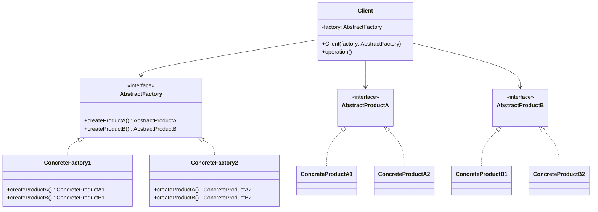

## 6.3.1 Implementing Abstract Factory in Java

The Abstract Factory pattern is a creational design pattern that provides an interface for creating families of related or dependent objects without specifying their concrete classes. This pattern is particularly useful when a system needs to be independent of how its objects are created, composed, and represented. It promotes consistency among products and enhances scalability and flexibility in software design.

### Intent and Motivation

#### Intent

The primary intent of the Abstract Factory pattern is to encapsulate a group of individual factories with a common theme. It allows the client to create objects without being concerned about the specific classes that implement them. This pattern is especially beneficial when the system needs to support multiple families of products.

#### Motivation

Consider a scenario where you are developing a cross-platform UI library. Different operating systems have distinct UI components, such as buttons and checkboxes. Using the Abstract Factory pattern, you can create an interface for a factory that produces these components, allowing the client to create UI elements for any supported operating system without knowing the specifics of the underlying implementation.

### Participants

The Abstract Factory pattern involves several key participants:

- **AbstractFactory**: Declares an interface for operations that create abstract product objects.
- **ConcreteFactory**: Implements the operations to create concrete product objects.
- **AbstractProduct**: Declares an interface for a type of product object.
- **ConcreteProduct**: Defines a product object to be created by the corresponding concrete factory and implements the AbstractProduct interface.
- **Client**: Uses only interfaces declared by AbstractFactory and AbstractProduct classes.

### Structure

The following UML diagram illustrates the structure of the Abstract Factory pattern:



**Diagram Explanation**: The diagram shows how the `Client` interacts with the `AbstractFactory` to create `AbstractProduct` objects. The `ConcreteFactory` classes implement the `AbstractFactory` interface to produce `ConcreteProduct` instances.

### Implementation

#### Implementation Guidelines

1. **Define Interfaces**: Start by defining interfaces for the abstract factory and the abstract products.
2. **Create Concrete Classes**: Implement concrete classes for each product and factory.
3. **Implement the Client**: Develop the client code to use the abstract factory interface for creating product objects.

#### Sample Code Snippets

Let's implement a simple example where we create UI components for different operating systems.

```java
// Abstract Factory
interface UIFactory {
    Button createButton();
    Checkbox createCheckbox();
}

// Concrete Factory for Windows
class WindowsUIFactory implements UIFactory {
    public Button createButton() {
        return new WindowsButton();
    }
    public Checkbox createCheckbox() {
        return new WindowsCheckbox();
    }
}

// Concrete Factory for macOS
class MacOSUIFactory implements UIFactory {
    public Button createButton() {
        return new MacOSButton();
    }
    public Checkbox createCheckbox() {
        return new MacOSCheckbox();
    }
}

// Abstract Product A
interface Button {
    void paint();
}

// Abstract Product B
interface Checkbox {
    void paint();
}

// Concrete Product A1
class WindowsButton implements Button {
    public void paint() {
        System.out.println("Rendering a button in Windows style.");
    }
}

// Concrete Product A2
class MacOSButton implements Button {
    public void paint() {
        System.out.println("Rendering a button in macOS style.");
    }
}

// Concrete Product B1
class WindowsCheckbox implements Checkbox {
    public void paint() {
        System.out.println("Rendering a checkbox in Windows style.");
    }
}

// Concrete Product B2
class MacOSCheckbox implements Checkbox {
    public void paint() {
        System.out.println("Rendering a checkbox in macOS style.");
    }
}

// Client
class Application {
    private Button button;
    private Checkbox checkbox;

    public Application(UIFactory factory) {
        button = factory.createButton();
        checkbox = factory.createCheckbox();
    }

    public void paint() {
        button.paint();
        checkbox.paint();
    }
}

// Usage
public class Main {
    public static void main(String[] args) {
        UIFactory factory = new WindowsUIFactory();
        Application app = new Application(factory);
        app.paint();

        factory = new MacOSUIFactory();
        app = new Application(factory);
        app.paint();
    }
}
```

**Explanation**: In this example, the `UIFactory` interface defines methods for creating `Button` and `Checkbox` objects. The `WindowsUIFactory` and `MacOSUIFactory` classes implement this interface to produce Windows and macOS styled components, respectively. The `Application` class acts as the client, using the factory to create and render UI components.

### Benefits of Abstract Factory

- **Decoupling**: The client code is decoupled from the concrete classes of the products, allowing for flexibility and scalability.
- **Consistency**: Ensures that products created by a factory are compatible with each other.
- **Scalability**: New product families can be added without altering existing code.

### Comparison with Factory Method Pattern

While both the Abstract Factory and Factory Method patterns deal with object creation, they serve different purposes:

- **Abstract Factory**: Focuses on creating families of related objects. It involves multiple factory methods, each responsible for creating a specific product.
- **Factory Method**: Focuses on creating a single product. It defines an interface for creating an object, but lets subclasses alter the type of objects that will be created.

### Sample Use Cases

- **Cross-Platform UI Libraries**: As demonstrated, the Abstract Factory pattern is ideal for creating UI components that need to be consistent across different platforms.
- **Database Connection Libraries**: Creating connections for different databases (e.g., MySQL, PostgreSQL) using a common interface.

### Best Practices and Common Pitfalls

- **Best Practices**:
  - Use the Abstract Factory pattern when you need to create families of related objects.
  - Ensure that all products created by a factory are compatible with each other.

- **Common Pitfalls**:
  - Overuse of the pattern can lead to unnecessary complexity.
  - Ensure that the pattern is not used when a simple factory or builder pattern would suffice.

### Related Patterns

- **[6.6 Singleton Pattern]( "Singleton Pattern")**: Often used in conjunction with Abstract Factory to ensure that a factory is a single instance.
- **Builder Pattern**: Similar in that it constructs complex objects, but focuses on step-by-step construction.

### Known Uses

- **Java AWT**: The Abstract Window Toolkit uses the Abstract Factory pattern to create platform-specific window components.
- **Spring Framework**: Uses Abstract Factory to configure beans and manage their lifecycle.

### Conclusion

The Abstract Factory pattern is a powerful tool in the arsenal of a Java developer, providing a robust framework for creating families of related objects. By decoupling the client from the concrete implementations, it enhances flexibility and scalability, making it an essential pattern for complex systems requiring consistency and adaptability.

## Test Your Knowledge: Abstract Factory Pattern in Java Quiz



### What is the primary intent of the Abstract Factory pattern?

- [x] To provide an interface for creating families of related objects without specifying their concrete classes.
- [ ] To create a single object using a factory method.
- [ ] To define a one-to-one relationship between objects.
- [ ] To manage the lifecycle of a single object.

> **Explanation:** The Abstract Factory pattern is designed to create families of related objects without specifying their concrete classes, promoting consistency and decoupling.

### Which participant in the Abstract Factory pattern declares an interface for creating abstract product objects?

- [x] AbstractFactory
- [ ] ConcreteFactory
- [ ] AbstractProduct
- [ ] Client

> **Explanation:** The AbstractFactory participant declares an interface for creating abstract product objects, which ConcreteFactories implement.

### How does the Abstract Factory pattern enhance scalability?

- [x] By allowing new product families to be added without altering existing code.
- [ ] By reducing the number of classes in the system.
- [ ] By using a single factory method for all products.
- [ ] By eliminating the need for interfaces.

> **Explanation:** The Abstract Factory pattern enhances scalability by allowing new product families to be added without altering existing code, thanks to its decoupled architecture.

### What is a common use case for the Abstract Factory pattern?

- [x] Creating cross-platform UI components.
- [ ] Managing database transactions.
- [ ] Implementing a logging framework.
- [ ] Optimizing memory usage.

> **Explanation:** The Abstract Factory pattern is commonly used for creating cross-platform UI components, ensuring consistency across different operating systems.

### How does the Abstract Factory pattern differ from the Factory Method pattern?

- [x] Abstract Factory creates families of related objects, while Factory Method focuses on a single product.
- [ ] Factory Method creates families of related objects, while Abstract Factory focuses on a single product.
- [ ] Both patterns focus on creating a single product.
- [ ] Both patterns create families of unrelated objects.

> **Explanation:** The Abstract Factory pattern creates families of related objects, while the Factory Method pattern focuses on creating a single product.

### Which of the following is a benefit of using the Abstract Factory pattern?

- [x] Decoupling client code from concrete classes.
- [ ] Reducing the number of interfaces in the system.
- [ ] Simplifying the creation of unrelated objects.
- [ ] Eliminating the need for abstract classes.

> **Explanation:** One of the main benefits of the Abstract Factory pattern is decoupling client code from concrete classes, enhancing flexibility and maintainability.

### What is a potential drawback of overusing the Abstract Factory pattern?

- [x] It can lead to unnecessary complexity.
- [ ] It simplifies the codebase too much.
- [ ] It reduces the number of classes.
- [ ] It eliminates the need for design patterns.

> **Explanation:** Overusing the Abstract Factory pattern can lead to unnecessary complexity, as it introduces additional layers of abstraction.

### In the provided Java example, what does the `Application` class represent?

- [x] Client
- [ ] AbstractFactory
- [ ] ConcreteProduct
- [ ] AbstractProduct

> **Explanation:** In the provided Java example, the `Application` class represents the Client, which uses the factory to create and render UI components.

### Which Java framework is known to use the Abstract Factory pattern?

- [x] Spring Framework
- [ ] Hibernate
- [ ] Apache Commons
- [ ] JUnit

> **Explanation:** The Spring Framework is known to use the Abstract Factory pattern to configure beans and manage their lifecycle.

### True or False: The Abstract Factory pattern can be used to create unrelated objects.

- [ ] True
- [x] False

> **Explanation:** False. The Abstract Factory pattern is specifically designed to create families of related objects, ensuring consistency and compatibility.



By understanding and implementing the Abstract Factory pattern, Java developers can create scalable, maintainable, and flexible applications that are easy to extend and adapt to new requirements.
