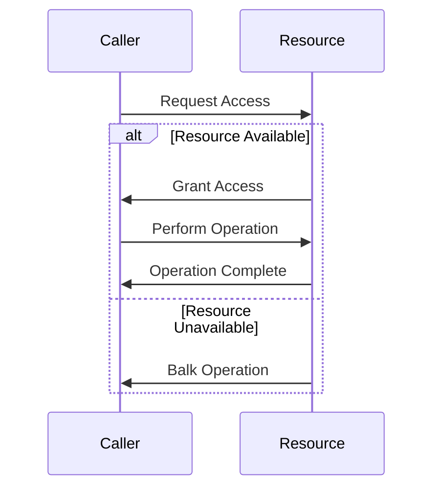

## 6.3.2 Managing Resource Availability

In the realm of concurrent programming, managing resource availability is crucial to maintaining system stability and efficiency. The Balking Pattern is a design pattern that helps manage scarce resources by preventing contention and ensuring that operations are only executed when the necessary resources are available. This section delves into the intricacies of the Balking Pattern, providing insights into its implementation and practical applications in Java.

### Understanding the Balking Pattern

The Balking Pattern is a concurrency pattern that is used to avoid executing an operation if the system is not in an appropriate state to handle it. This pattern is particularly useful in scenarios where resources are temporarily unavailable, such as files, network sockets, or shared devices. By employing the Balking Pattern, developers can prevent unnecessary contention and ensure that operations are only attempted when the required resources are ready.

#### Key Concepts

- **Balking**: The act of refusing to perform an operation if the system is not in the correct state.
- **State Check**: A mechanism to determine whether the system is ready to perform the operation.
- **Feedback Mechanism**: Informing the caller about the inability to process the request due to resource unavailability.

### Implementing the Balking Pattern in Java

To implement the Balking Pattern in Java, we need to establish a mechanism to check the availability of resources and decide whether to proceed with the operation. This involves:

1. **State Management**: Maintaining a state that indicates whether the resource is available.
2. **Condition Checking**: Implementing a condition check to determine if the operation can proceed.
3. **Balking Logic**: Defining the logic to balk the operation if the resource is unavailable.

Let's consider an example where we manage access to a shared file resource.

```java
public class FileResource {
    private boolean isAvailable = true;

    public synchronized void accessFile() {
        if (!isAvailable) {
            System.out.println("Resource is busy, balking operation.");
            return;
        }
        // Mark the resource as unavailable
        isAvailable = false;

        try {
            // Simulate file access
            System.out.println("Accessing file...");
            Thread.sleep(1000); // Simulate time-consuming operation
        } catch (InterruptedException e) {
            Thread.currentThread().interrupt();
        } finally {
            // Mark the resource as available again
            isAvailable = true;
        }
    }
}
```

In this example, the `accessFile` method checks if the file resource is available before proceeding. If the resource is busy, the operation is balked, and a message is printed to inform the caller.

### Resources That May Become Temporarily Unavailable

Various resources in a system can become temporarily unavailable, necessitating the use of the Balking Pattern. Some common examples include:

- **Files**: File locks or busy file handles can prevent access.
- **Network Sockets**: Network congestion or server unavailability can cause sockets to be temporarily inaccessible.
- **Shared Devices**: Printers or other shared hardware may be busy with other tasks.
- **Database Connections**: Connection pools may reach their limit, causing temporary unavailability.

### Implementing Retry Mechanisms or Alternative Actions

When an operation is balked, it's often beneficial to implement retry mechanisms or alternative actions to handle the situation gracefully. This can involve:

- **Retry Logic**: Attempting the operation again after a delay.
- **Alternative Actions**: Performing a different operation if the primary one is unavailable.

#### Example: Implementing Retry Logic

```java
public class FileResourceWithRetry {
    private boolean isAvailable = true;

    public synchronized void accessFileWithRetry(int maxRetries) {
        int attempts = 0;
        while (attempts < maxRetries) {
            if (!isAvailable) {
                System.out.println("Resource is busy, retrying...");
                attempts++;
                try {
                    Thread.sleep(500); // Wait before retrying
                } catch (InterruptedException e) {
                    Thread.currentThread().interrupt();
                }
                continue;
            }
            // Mark the resource as unavailable
            isAvailable = false;

            try {
                // Simulate file access
                System.out.println("Accessing file...");
                Thread.sleep(1000); // Simulate time-consuming operation
                break; // Exit loop if successful
            } catch (InterruptedException e) {
                Thread.currentThread().interrupt();
            } finally {
                // Mark the resource as available again
                isAvailable = true;
            }
        }
        if (attempts == maxRetries) {
            System.out.println("Failed to access resource after retries.");
        }
    }
}
```

In this example, the `accessFileWithRetry` method attempts to access the file resource multiple times before giving up. This approach can help mitigate temporary unavailability by allowing the system to recover and retry the operation.

### Providing Feedback to Callers

It's essential to provide feedback to callers about the inability to process requests due to resource unavailability. This can be achieved through:

- **Return Values**: Returning a status code or boolean indicating success or failure.
- **Exceptions**: Throwing exceptions to signal that the operation was balked.
- **Logging**: Recording balked operations for system diagnostics.

#### Example: Using Return Values

```java
public class FileResourceWithFeedback {
    private boolean isAvailable = true;

    public synchronized boolean accessFile() {
        if (!isAvailable) {
            System.out.println("Resource is busy, operation balked.");
            return false;
        }
        // Mark the resource as unavailable
        isAvailable = false;

        try {
            // Simulate file access
            System.out.println("Accessing file...");
            Thread.sleep(1000); // Simulate time-consuming operation
            return true;
        } catch (InterruptedException e) {
            Thread.currentThread().interrupt();
            return false;
        } finally {
            // Mark the resource as available again
            isAvailable = true;
        }
    }
}
```

In this example, the `accessFile` method returns a boolean value to indicate whether the operation was successful. This provides clear feedback to the caller about the outcome.

### Logging and Monitoring Balked Operations

Logging and monitoring balked operations are crucial for system diagnostics and performance analysis. By keeping track of balked operations, developers can identify patterns and potential bottlenecks in the system.

#### Example: Logging Balked Operations

```java
import java.util.logging.Logger;

public class FileResourceWithLogging {
    private static final Logger logger = Logger.getLogger(FileResourceWithLogging.class.getName());
    private boolean isAvailable = true;

    public synchronized void accessFile() {
        if (!isAvailable) {
            logger.warning("Resource is busy, operation balked.");
            return;
        }
        // Mark the resource as unavailable
        isAvailable = false;

        try {
            // Simulate file access
            System.out.println("Accessing file...");
            Thread.sleep(1000); // Simulate time-consuming operation
        } catch (InterruptedException e) {
            Thread.currentThread().interrupt();
        } finally {
            // Mark the resource as available again
            isAvailable = true;
        }
    }
}
```

In this example, the `Logger` is used to record a warning message whenever an operation is balked. This information can be invaluable for diagnosing issues and optimizing resource management.

### Designing Systems to Gracefully Handle Resource Unavailability

Designing systems that gracefully handle resource unavailability is essential for maintaining stability and user satisfaction. Here are some strategies to consider:

- **Graceful Degradation**: Allow the system to continue functioning at a reduced capacity when resources are unavailable.
- **User Notifications**: Inform users about delays or unavailability, providing estimated recovery times if possible.
- **Load Balancing**: Distribute load across multiple resources to prevent bottlenecks.
- **Circuit Breakers**: Temporarily halt operations to prevent system overload and allow recovery.

### Visualizing Resource Management with the Balking Pattern

To better understand how the Balking Pattern manages resource availability, let's visualize the process using a sequence diagram.



This diagram illustrates the decision-making process in the Balking Pattern. When a caller requests access to a resource, the system checks its availability. If the resource is available, the operation proceeds; otherwise, the operation is balked, and the caller is informed.

### Try It Yourself

To gain a deeper understanding of the Balking Pattern, try modifying the code examples provided:

- **Experiment with Different Resources**: Implement the Balking Pattern for network sockets or database connections.
- **Adjust Retry Logic**: Change the retry intervals and maximum attempts to observe their impact on system performance.
- **Enhance Feedback Mechanisms**: Implement exception handling or more detailed logging to improve diagnostics.

### Conclusion

The Balking Pattern is a powerful tool for managing resource availability in concurrent systems. By preventing operations when resources are unavailable, it helps maintain system stability and efficiency. Implementing retry mechanisms, providing feedback, and logging balked operations are essential components of a robust resource management strategy. As you continue to explore concurrency patterns, remember to design systems that gracefully handle resource unavailability, ensuring a seamless user experience.

## Quiz Time!



### What is the primary purpose of the Balking Pattern?

- [x] To prevent operations when resources are unavailable
- [ ] To ensure operations are always executed
- [ ] To prioritize resource allocation
- [ ] To manage memory usage

> **Explanation:** The Balking Pattern is used to prevent operations when resources are unavailable, ensuring system stability.

### Which of the following is NOT a resource that may become temporarily unavailable?

- [ ] Files
- [ ] Network Sockets
- [x] Constants
- [ ] Shared Devices

> **Explanation:** Constants are not resources that become unavailable; they are fixed values in a program.

### How can feedback be provided to callers when an operation is balked?

- [x] Return values
- [x] Exceptions
- [ ] Ignoring the request
- [x] Logging

> **Explanation:** Feedback can be provided through return values, exceptions, and logging to inform callers about balked operations.

### What is a common strategy to handle balked operations?

- [ ] Ignoring them
- [x] Implementing retry logic
- [ ] Increasing resource allocation
- [ ] Decreasing system load

> **Explanation:** Implementing retry logic is a common strategy to handle balked operations by attempting them again later.

### What role does logging play in managing resource availability?

- [x] It helps diagnose issues
- [ ] It prevents resource unavailability
- [ ] It increases system load
- [ ] It replaces retry logic

> **Explanation:** Logging helps diagnose issues by recording balked operations for analysis and optimization.

### What is the purpose of a sequence diagram in the context of the Balking Pattern?

- [x] To visualize the decision-making process
- [ ] To show code execution
- [ ] To illustrate memory usage
- [ ] To depict user interactions

> **Explanation:** A sequence diagram visualizes the decision-making process in the Balking Pattern, showing how operations are handled.

### Which of the following is a strategy for designing systems to handle resource unavailability?

- [x] Graceful degradation
- [ ] Ignoring user requests
- [ ] Increasing resource usage
- [ ] Reducing feedback mechanisms

> **Explanation:** Graceful degradation allows systems to continue functioning at reduced capacity when resources are unavailable.

### What is the benefit of using retry mechanisms in the Balking Pattern?

- [x] It allows the system to recover and retry operations
- [ ] It prevents all balked operations
- [ ] It increases system complexity
- [ ] It eliminates the need for logging

> **Explanation:** Retry mechanisms allow the system to recover and retry operations, improving the chances of success.

### How can user notifications help in managing resource availability?

- [x] By informing users about delays or unavailability
- [ ] By hiding system issues
- [ ] By increasing system load
- [ ] By reducing resource usage

> **Explanation:** User notifications inform users about delays or unavailability, improving user experience and managing expectations.

### True or False: The Balking Pattern ensures that operations are always executed regardless of resource availability.

- [ ] True
- [x] False

> **Explanation:** False. The Balking Pattern ensures that operations are only executed when resources are available, preventing unnecessary contention.


