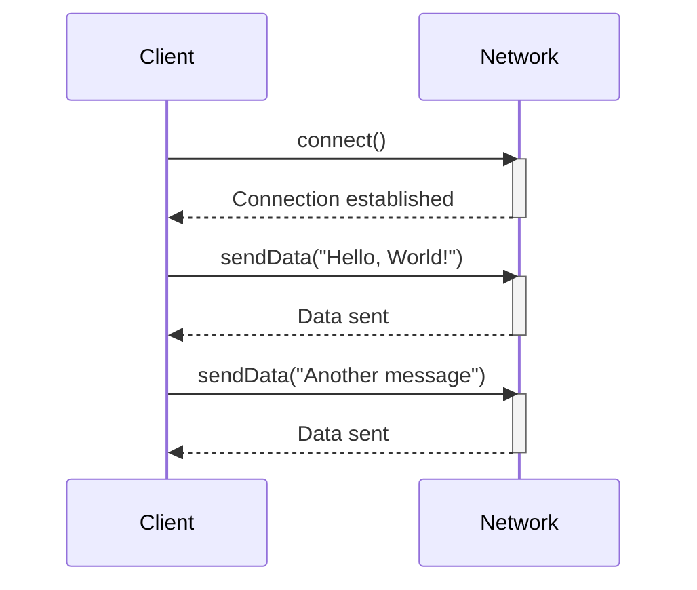

## 6.3.3 Use Cases and Examples

The Balking Pattern is a concurrency design pattern that is particularly useful when you want to ensure that certain operations are only executed under specific conditions. This pattern is ideal for scenarios where an operation should not proceed if the system is not in the correct state, thereby avoiding unnecessary processing and potential errors. In this section, we will explore practical use cases of the Balking Pattern, including resource initialization, network connections, and printing jobs, and demonstrate how this pattern can enhance efficiency and system responsiveness.

### Resource Initialization

One common application of the Balking Pattern is in resource initialization. Often, resources such as database connections or configuration files need to be initialized only once. Subsequent attempts to initialize these resources should be ignored to prevent redundant operations and potential errors.

#### Example: Singleton Resource Initialization

Consider a scenario where we have a class responsible for initializing a configuration file. We want to ensure that the file is loaded only once, and any subsequent attempts to load it are ignored. Here's how we can implement this using the Balking Pattern:

```java
public class ConfigurationLoader {
    private boolean initialized = false;
    private final Object lock = new Object();

    public void initialize() {
        synchronized (lock) {
            if (initialized) {
                return; // Balking: already initialized
            }
            // Simulate resource initialization
            System.out.println("Loading configuration...");
            initialized = true;
        }
    }
}
```

In this example, the `initialize` method checks if the configuration has already been loaded. If it has, the method returns immediately, effectively balking at any further initialization attempts.

### Network Connections

Another area where the Balking Pattern is beneficial is in managing network connections. For instance, a network client should only attempt to send data if it is connected. If the client is not connected, the operation should be aborted to avoid unnecessary errors and resource usage.

#### Example: Network Client

Let's implement a simple network client that uses the Balking Pattern to ensure data is sent only when connected:

```java
public class NetworkClient {
    private boolean connected = false;
    private final Object lock = new Object();

    public void connect() {
        synchronized (lock) {
            if (connected) {
                return; // Balking: already connected
            }
            // Simulate network connection
            System.out.println("Connecting to network...");
            connected = true;
        }
    }

    public void sendData(String data) {
        synchronized (lock) {
            if (!connected) {
                System.out.println("Cannot send data. Not connected.");
                return; // Balking: not connected
            }
            // Simulate sending data
            System.out.println("Sending data: " + data);
        }
    }
}
```

In this example, the `sendData` method checks if the client is connected before attempting to send data. If the client is not connected, the method balks and prints a message instead of proceeding with the operation.

### Printing Jobs

The Balking Pattern is also useful in scenarios involving printing jobs, where a job should proceed only if the printer is ready. This prevents errors and ensures that resources are used efficiently.

#### Example: Printing Job

Here's an implementation of a printing job that uses the Balking Pattern to check the printer's readiness:

```java
public class Printer {
    private boolean ready = false;
    private final Object lock = new Object();

    public void setReady(boolean ready) {
        synchronized (lock) {
            this.ready = ready;
        }
    }

    public void printJob(String document) {
        synchronized (lock) {
            if (!ready) {
                System.out.println("Printer not ready. Cannot print.");
                return; // Balking: printer not ready
            }
            // Simulate printing job
            System.out.println("Printing document: " + document);
        }
    }
}
```

In this example, the `printJob` method checks if the printer is ready before proceeding with the print operation. If the printer is not ready, the method balks and informs the user.

### Benefits of the Balking Pattern

The Balking Pattern offers several benefits in the scenarios discussed:

- **Reduced Unnecessary Processing**: By checking the state before proceeding, the pattern prevents redundant operations, saving computational resources.
- **Improved System Responsiveness**: Operations that cannot proceed are aborted early, allowing the system to remain responsive and efficient.
- **Error Prevention**: By ensuring operations only occur in the correct state, the pattern helps prevent errors that could arise from inappropriate operations.

### Visualizing the Balking Pattern

To better understand the Balking Pattern, let's visualize its workflow using a sequence diagram. This diagram illustrates how the pattern operates in the context of a network client attempting to send data.



### Try It Yourself

To gain a deeper understanding of the Balking Pattern, try modifying the examples provided:

1. **Resource Initialization**: Add a method to reset the initialization state and test how the `ConfigurationLoader` behaves when re-initialization is attempted.
2. **Network Client**: Implement a disconnect method and observe how the client handles data sending attempts after disconnection.
3. **Printing Job**: Introduce a delay in setting the printer's readiness and see how the `Printer` class manages print job requests during this period.

### Knowledge Check

- **Why is the Balking Pattern useful in resource initialization?**
- **How does the Balking Pattern improve system responsiveness?**
- **What are the potential consequences of not using the Balking Pattern in a network client?**

### Conclusion

The Balking Pattern is a powerful tool for managing operations that should only occur under specific conditions. By ensuring that operations are only executed when the system is in the correct state, the pattern enhances efficiency, prevents errors, and improves system responsiveness. As you continue to develop complex Java applications, consider incorporating the Balking Pattern in scenarios where conditional operations are necessary.

## Quiz Time!



### What is the primary purpose of the Balking Pattern?

- [x] To ensure operations only occur under specific conditions
- [ ] To allow multiple threads to access shared resources
- [ ] To enhance the performance of concurrent operations
- [ ] To simplify complex algorithms

> **Explanation:** The Balking Pattern is used to ensure that operations only occur when the system is in the correct state, preventing unnecessary processing and errors.

### In the context of resource initialization, what does the Balking Pattern prevent?

- [x] Redundant initialization
- [ ] Resource deallocation
- [ ] Data corruption
- [ ] Memory leaks

> **Explanation:** The Balking Pattern prevents redundant initialization by ensuring that resources are initialized only once.

### How does the Balking Pattern improve system responsiveness?

- [x] By aborting operations early if conditions are not met
- [ ] By allowing multiple operations to run concurrently
- [ ] By optimizing resource allocation
- [ ] By reducing memory usage

> **Explanation:** The Balking Pattern improves system responsiveness by aborting operations early if the necessary conditions are not met, allowing the system to remain efficient.

### What is a potential consequence of not using the Balking Pattern in a network client?

- [x] Attempting to send data when not connected
- [ ] Excessive memory usage
- [ ] Increased network latency
- [ ] Data loss during transmission

> **Explanation:** Without the Balking Pattern, a network client might attempt to send data when not connected, leading to errors and resource wastage.

### Which of the following is a benefit of using the Balking Pattern?

- [x] Reduced unnecessary processing
- [ ] Increased code complexity
- [x] Improved error prevention
- [ ] Enhanced algorithm efficiency

> **Explanation:** The Balking Pattern reduces unnecessary processing and improves error prevention by ensuring operations only occur under the right conditions.

### In the provided network client example, what condition is checked before sending data?

- [x] Whether the client is connected
- [ ] Whether the data is valid
- [ ] Whether the server is available
- [ ] Whether the network is secure

> **Explanation:** The network client checks if it is connected before attempting to send data, using the Balking Pattern to abort if not connected.

### How does the Balking Pattern prevent errors in printing jobs?

- [x] By checking if the printer is ready before printing
- [ ] By validating the document format
- [x] By aborting the print job if conditions are not met
- [ ] By optimizing the print queue

> **Explanation:** The Balking Pattern prevents errors by checking if the printer is ready before proceeding with the print job, aborting if not ready.

### What is the role of the `synchronized` block in the Balking Pattern examples?

- [x] To ensure thread safety when checking conditions
- [ ] To optimize resource allocation
- [ ] To enhance algorithm efficiency
- [ ] To simplify code structure

> **Explanation:** The `synchronized` block ensures thread safety when checking conditions, preventing race conditions in concurrent environments.

### Which Java keyword is used to create a critical section in the Balking Pattern examples?

- [x] synchronized
- [ ] volatile
- [ ] transient
- [ ] static

> **Explanation:** The `synchronized` keyword is used to create a critical section, ensuring that only one thread can execute the block at a time.

### True or False: The Balking Pattern can be used to manage operations that should only occur when a system is in a specific state.

- [x] True
- [ ] False

> **Explanation:** True. The Balking Pattern is designed to manage operations that should only occur under specific conditions, ensuring system stability and efficiency.



Remember, the journey of mastering design patterns is ongoing. Keep experimenting, stay curious, and enjoy the process of building robust and efficient Java applications!
