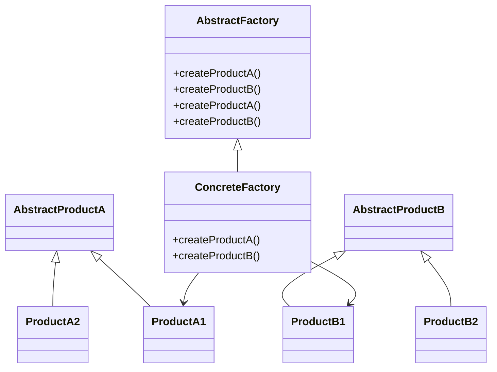
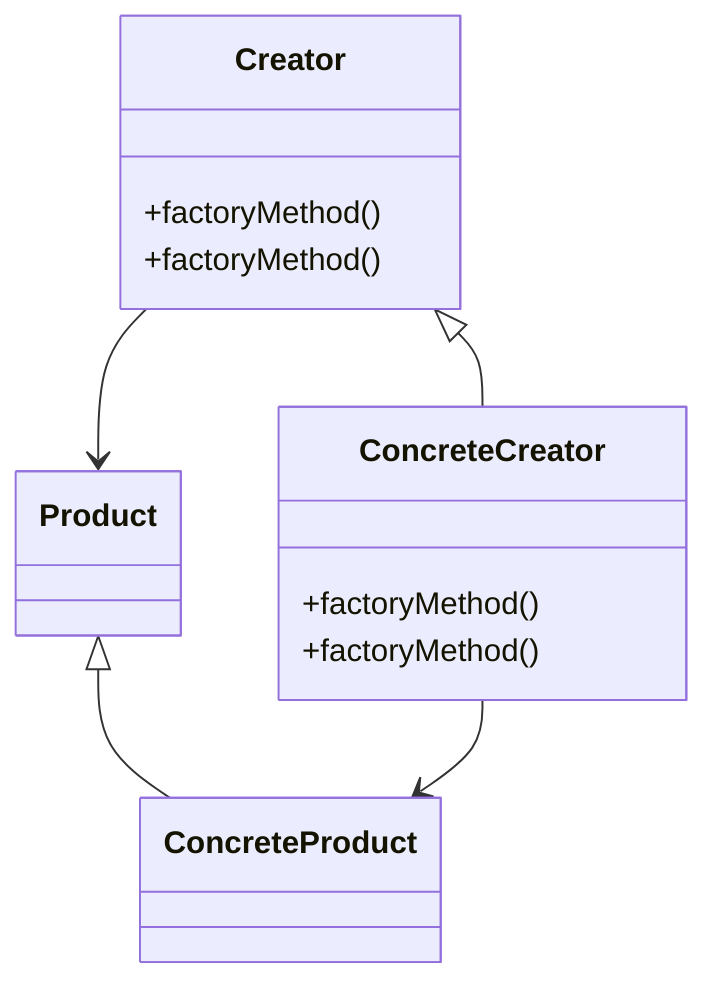

## 6.3.4 Abstract Factory vs. Factory Method

In the realm of software design, understanding the nuances between different design patterns is crucial for creating robust and maintainable applications. Two such patterns, the **Abstract Factory** and the **Factory Method**, are often discussed together due to their similarities and overlapping use cases. This section delves into these patterns, highlighting their characteristics, differences, and appropriate use cases.

### Understanding the Patterns

#### Abstract Factory Pattern

- **Category**: Creational Pattern

##### Intent

- **Description**: The Abstract Factory pattern provides an interface for creating families of related or dependent objects without specifying their concrete classes.

##### Also Known As

- **Alternate Names**: Kit

##### Motivation

- **Explanation**: The Abstract Factory pattern is essential when a system needs to be independent of how its objects are created, composed, and represented. It is particularly useful when the system needs to support multiple families of products.

##### Applicability

- **Guidelines**: Use the Abstract Factory pattern when:
  - A system should be independent of how its products are created.
  - A system should be configured with one of multiple families of products.
  - A family of related product objects is designed to be used together, and you need to enforce this constraint.

##### Structure



- **Caption**: The structure of the Abstract Factory pattern showing the relationships between factories and products.

##### Participants

- **AbstractFactory**: Declares an interface for operations that create abstract product objects.
- **ConcreteFactory**: Implements the operations to create concrete product objects.
- **AbstractProduct**: Declares an interface for a type of product object.
- **Product**: Defines a product object to be created by the corresponding concrete factory.

##### Collaborations

- **Interactions**: Concrete factories create concrete products, and clients use the abstract interfaces to interact with the products.

##### Consequences

- **Analysis**: 
  - **Benefits**: Promotes consistency among products, isolates concrete classes, and makes exchanging product families easy.
  - **Drawbacks**: Adding new products requires extending the abstract factory and all concrete factories.

##### Implementation

- **Implementation Guidelines**: Define interfaces for product creation and implement these interfaces in concrete factories.

- **Sample Code Snippets**:

    ```java
    // Abstract Factory
    interface GUIFactory {
        Button createButton();
        Checkbox createCheckbox();
    }

    // Concrete Factory
    class WinFactory implements GUIFactory {
        public Button createButton() {
            return new WinButton();
        }
        public Checkbox createCheckbox() {
            return new WinCheckbox();
        }
    }

    // Abstract Product
    interface Button {
        void paint();
    }

    // Concrete Product
    class WinButton implements Button {
        public void paint() {
            System.out.println("Rendering a button in a Windows style.");
        }
    }

    // Client Code
    class Application {
        private Button button;
        private Checkbox checkbox;

        public Application(GUIFactory factory) {
            button = factory.createButton();
            checkbox = factory.createCheckbox();
        }

        public void paint() {
            button.paint();
            checkbox.paint();
        }
    }
    ```

- **Explanation**: The code demonstrates an Abstract Factory pattern where `GUIFactory` is the abstract factory, and `WinFactory` is a concrete factory that creates Windows-style GUI components.

##### Sample Use Cases

- **Real-world Scenarios**: GUI libraries where different look-and-feel themes are supported, such as Windows, MacOS, and Linux.

##### Related Patterns

- **Connections**: Often used with the [6.6 Singleton Pattern]( "Singleton Pattern") to ensure a single instance of a factory.

#### Factory Method Pattern

- **Category**: Creational Pattern

##### Intent

- **Description**: The Factory Method pattern defines an interface for creating an object but lets subclasses alter the type of objects that will be created.

##### Also Known As

- **Alternate Names**: Virtual Constructor

##### Motivation

- **Explanation**: The Factory Method pattern is used when a class cannot anticipate the class of objects it must create. It allows a class to defer instantiation to subclasses.

##### Applicability

- **Guidelines**: Use the Factory Method pattern when:
  - A class wants its subclasses to specify the objects it creates.
  - A class delegates responsibility to one of several helper subclasses, and you want to localize the knowledge of which helper subclass is the delegate.

##### Structure



- **Caption**: The structure of the Factory Method pattern showing the relationship between creators and products.

##### Participants

- **Creator**: Declares the factory method, which returns an object of type Product.
- **ConcreteCreator**: Overrides the factory method to return an instance of a ConcreteProduct.
- **Product**: Defines the interface of objects the factory method creates.
- **ConcreteProduct**: Implements the Product interface.

##### Collaborations

- **Interactions**: Concrete creators instantiate concrete products, and clients use the product interface.

##### Consequences

- **Analysis**: 
  - **Benefits**: Provides hooks for subclasses, connects parallel class hierarchies.
  - **Drawbacks**: Requires subclassing, which can complicate the class hierarchy.

##### Implementation

- **Implementation Guidelines**: Define a factory method in the creator class and override it in concrete creator classes.

- **Sample Code Snippets**:

    ```java
    // Creator
    abstract class Dialog {
        public void render() {
            Button okButton = createButton();
            okButton.render();
        }
        protected abstract Button createButton();
    }

    // Concrete Creator
    class WindowsDialog extends Dialog {
        protected Button createButton() {
            return new WindowsButton();
        }
    }

    // Product
    interface Button {
        void render();
    }

    // Concrete Product
    class WindowsButton implements Button {
        public void render() {
            System.out.println("Rendering a button in a Windows style.");
        }
    }

    // Client Code
    class Application {
        public static void main(String[] args) {
            Dialog dialog = new WindowsDialog();
            dialog.render();
        }
    }
    ```

- **Explanation**: The code illustrates a Factory Method pattern where `Dialog` is the creator, and `WindowsDialog` is a concrete creator that creates Windows-style buttons.

##### Sample Use Cases

- **Real-world Scenarios**: Document editors where different document types (e.g., Word, PDF) are supported.

##### Related Patterns

- **Connections**: Often used with the [6.6 Singleton Pattern]( "Singleton Pattern") to control the instantiation of the factory.

### Comparing Abstract Factory and Factory Method

#### Similarities

- **Creational Intent**: Both patterns are creational, focusing on object creation without specifying the exact class of object that will be created.
- **Decoupling**: They decouple the instantiation process from the client code, promoting loose coupling and enhancing flexibility.

#### Differences

- **Scope**: 
  - **Abstract Factory**: Deals with families of related products.
  - **Factory Method**: Focuses on a single product.
- **Complexity**: 
  - **Abstract Factory**: More complex due to the involvement of multiple products and factories.
  - **Factory Method**: Simpler, involving a single method for object creation.
- **Flexibility**: 
  - **Abstract Factory**: Provides more flexibility in terms of product families.
  - **Factory Method**: Offers flexibility in the specific product created.

#### Scenarios for Use

- **Abstract Factory**: Use when you need to create families of related objects and enforce constraints on their usage together.
- **Factory Method**: Use when you need to delegate the instantiation process to subclasses and when the class of the object to be created is determined at runtime.

#### Factory Method within Abstract Factory

The Factory Method can be a component within the Abstract Factory pattern. In this scenario, the Abstract Factory uses Factory Methods to create its products. This combination allows for greater flexibility and scalability, as the Factory Method can be overridden to create different product variants.

### Practical Examples

#### Example 1: GUI Toolkit

- **Abstract Factory**: A GUI toolkit that supports multiple themes (e.g., Windows, MacOS) would use an Abstract Factory to create theme-specific components like buttons and checkboxes.
- **Factory Method**: Within each theme, a Factory Method could be used to create specific components, allowing for variations within the theme.

#### Example 2: Document Editor

- **Abstract Factory**: A document editor supporting different document types (e.g., Word, PDF) could use an Abstract Factory to create document-specific components like headers and footers.
- **Factory Method**: Within each document type, a Factory Method could be used to create specific elements like paragraphs or tables.

### Conclusion

Understanding when to use the Abstract Factory and Factory Method patterns is crucial for designing flexible and maintainable software systems. By recognizing the strengths and limitations of each pattern, developers can make informed decisions that enhance the architecture and scalability of their applications.

### Key Takeaways

- **Abstract Factory**: Best for creating families of related objects.
- **Factory Method**: Ideal for delegating object creation to subclasses.
- **Combination**: Use Factory Method within Abstract Factory for greater flexibility.

### Encouragement for Exploration

Consider how these patterns can be applied to your current projects. Reflect on the design challenges you face and experiment with implementing these patterns to see how they can improve your software architecture.

---

## Test Your Knowledge: Abstract Factory vs. Factory Method Quiz



### Which pattern is best suited for creating families of related objects?

- [x] Abstract Factory
- [ ] Factory Method
- [ ] Singleton
- [ ] Builder

> **Explanation:** The Abstract Factory pattern is designed to create families of related or dependent objects.

### What is a key difference between Abstract Factory and Factory Method?

- [x] Abstract Factory deals with families of products, while Factory Method focuses on a single product.
- [ ] Factory Method is more complex than Abstract Factory.
- [ ] Abstract Factory is used for singleton objects.
- [ ] Factory Method is used for creating unrelated objects.

> **Explanation:** Abstract Factory is used for creating families of related products, whereas Factory Method focuses on creating a single product.

### In which scenario would you use the Factory Method pattern?

- [x] When a class wants its subclasses to specify the objects it creates.
- [ ] When you need to create a family of related objects.
- [ ] When you need to enforce constraints on product usage.
- [ ] When you need to create a single instance of a class.

> **Explanation:** The Factory Method pattern is used when a class wants its subclasses to specify the objects it creates.

### How does the Abstract Factory pattern promote consistency among products?

- [x] By enforcing the use of related product families.
- [ ] By using a single product creation method.
- [ ] By allowing any product to be created at runtime.
- [ ] By using a singleton factory.

> **Explanation:** The Abstract Factory pattern promotes consistency by enforcing the use of related product families.

### Can the Factory Method be used within the Abstract Factory pattern?

- [x] Yes
- [ ] No

> **Explanation:** The Factory Method can be used within the Abstract Factory pattern to create specific product variants.

### What is a common drawback of the Factory Method pattern?

- [x] Requires subclassing, which can complicate the class hierarchy.
- [ ] It is too simple for complex applications.
- [ ] It cannot be used with other patterns.
- [ ] It does not support product families.

> **Explanation:** The Factory Method pattern requires subclassing, which can complicate the class hierarchy.

### Which pattern is more complex, Abstract Factory or Factory Method?

- [x] Abstract Factory
- [ ] Factory Method
- [ ] Both are equally complex
- [ ] Neither is complex

> **Explanation:** The Abstract Factory pattern is more complex due to the involvement of multiple products and factories.

### What is the primary benefit of using the Abstract Factory pattern?

- [x] It promotes consistency among products.
- [ ] It simplifies the class hierarchy.
- [ ] It allows for runtime product creation.
- [ ] It is easier to implement than Factory Method.

> **Explanation:** The Abstract Factory pattern promotes consistency among products by enforcing the use of related product families.

### Which pattern allows for greater flexibility in terms of product families?

- [x] Abstract Factory
- [ ] Factory Method
- [ ] Singleton
- [ ] Prototype

> **Explanation:** The Abstract Factory pattern provides more flexibility in terms of product families.

### True or False: The Factory Method pattern can be used to create unrelated objects.

- [ ] True
- [x] False

> **Explanation:** The Factory Method pattern is used to create related objects, typically within a single product hierarchy.



---

By understanding and applying these patterns, developers can enhance the flexibility and maintainability of their software systems, leading to more robust and scalable applications.
