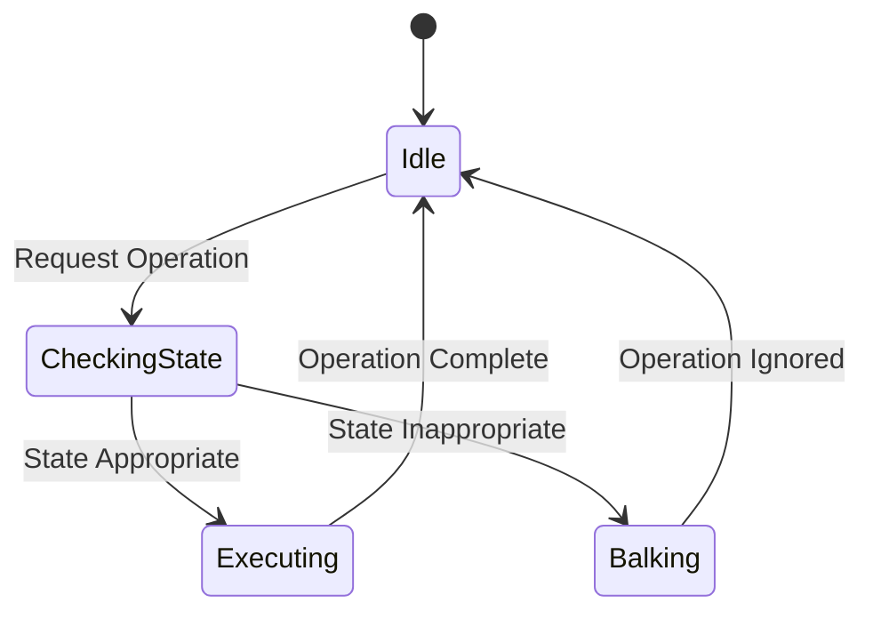

## 6.3 Balking Pattern

In the realm of concurrent programming, the Balking Pattern emerges as a strategic approach to prevent operations from executing when an object is in an inappropriate state. This pattern is particularly useful in scenarios where operations should only proceed if the system is in a specific state, thereby avoiding unnecessary processing and potential errors.

### Understanding the Balking Pattern

The Balking Pattern is a concurrency design pattern that ensures an operation is only executed when an object is in a suitable state. If the object is not in the desired state, the operation is simply ignored or "balked." This approach is especially useful in systems where certain operations are only valid under specific conditions, such as resource initialization, network connections, or when dealing with finite state machines.

#### Intent of the Balking Pattern

The primary intent of the Balking Pattern is to prevent the execution of operations that cannot be handled at the moment due to the current state of an object. By doing so, it avoids unnecessary processing and ensures that the system remains in a consistent state. This pattern is particularly beneficial in scenarios where operations are time-sensitive or resource-intensive, and executing them in an inappropriate state could lead to inefficiencies or errors.

### Problem Solved by the Balking Pattern

In concurrent systems, operations may be requested at any time, regardless of the current state of the system. This can lead to situations where operations are attempted when they cannot be completed successfully, resulting in wasted resources and potential errors. The Balking Pattern addresses this issue by providing a mechanism to check the state of an object before proceeding with an operation. If the object is not in the appropriate state, the operation is simply ignored, preventing unnecessary processing and maintaining system consistency.

#### Scenarios for Using the Balking Pattern

The Balking Pattern is particularly useful in scenarios where operations should only proceed if the system is in a specific state. Some common scenarios include:

- **Resource Initialization**: Ensuring that resources are only initialized once and subsequent initialization requests are ignored if the resource is already initialized.
- **Network Connections**: Preventing connection attempts if the network is unavailable or if a connection is already established.
- **Finite State Machines**: Ensuring that state transitions only occur when the system is in the correct state for the transition.

### How the Balking Pattern Works

The Balking Pattern works by checking the state of an object before executing an operation. If the object is in the appropriate state, the operation proceeds as normal. If the object is not in the appropriate state, the operation is ignored or "balked." This approach ensures that operations are only executed when they can be completed successfully, avoiding unnecessary processing and potential errors.

#### Implementation Overview

Implementing the Balking Pattern involves the following steps:

1. **Define the State**: Identify the states in which the object can be and determine which states are appropriate for the operation.
2. **Check the State**: Before executing the operation, check the current state of the object.
3. **Execute or Balk**: If the object is in the appropriate state, execute the operation. If not, ignore the operation.

### Example: Resource Initialization

Consider a scenario where a resource needs to be initialized before it can be used. The Balking Pattern can be used to ensure that the resource is only initialized once, and subsequent initialization requests are ignored if the resource is already initialized.

```java
public class Resource {
    private boolean initialized = false;

    public synchronized void initialize() {
        if (initialized) {
            return; // Balk if already initialized
        }
        // Perform initialization
        initialized = true;
        System.out.println("Resource initialized.");
    }
}
```

In this example, the `initialize` method checks if the resource is already initialized. If it is, the method returns immediately, effectively balking the operation. If the resource is not initialized, the method proceeds with the initialization process.

### Example: Network Connections

In network programming, it is common to encounter situations where a connection should only be established if the network is available and no connection is currently active. The Balking Pattern can be used to manage these conditions effectively.

```java
public class NetworkConnection {
    private boolean connected = false;

    public synchronized void connect() {
        if (connected) {
            return; // Balk if already connected
        }
        // Attempt to connect
        connected = true;
        System.out.println("Connected to the network.");
    }

    public synchronized void disconnect() {
        if (!connected) {
            return; // Balk if not connected
        }
        // Disconnect
        connected = false;
        System.out.println("Disconnected from the network.");
    }
}
```

In this example, the `connect` method checks if a connection is already established. If it is, the method returns immediately, balking the connection attempt. Similarly, the `disconnect` method checks if a connection is active before proceeding with the disconnection process.

### Visualizing the Balking Pattern

To better understand the flow of the Balking Pattern, consider the following state diagram:



In this diagram, the system starts in an Idle state. When an operation is requested, the system transitions to the CheckingState, where it evaluates the current state of the object. If the state is appropriate, the system proceeds to the Executing state and completes the operation. If the state is inappropriate, the system transitions to the Balking state, where the operation is ignored, and then returns to the Idle state.

### Considerations for Implementing the Balking Pattern

When implementing the Balking Pattern, it is important to consider the following:

- **Thread Safety**: Ensure that state checks and operations are performed atomically to prevent race conditions. This often involves using synchronization mechanisms such as locks or synchronized blocks.
- **State Management**: Clearly define the states in which the object can be and ensure that state transitions are handled consistently.
- **Performance**: Consider the performance implications of state checks and ensure that they do not introduce significant overhead.

### Benefits of the Balking Pattern

The Balking Pattern offers several benefits in concurrent programming:

- **Efficiency**: By preventing unnecessary operations, the Balking Pattern reduces resource consumption and improves system efficiency.
- **Consistency**: Ensures that operations are only executed when the system is in a valid state, maintaining consistency and preventing errors.
- **Simplicity**: Provides a straightforward mechanism for managing state-dependent operations, simplifying the design of concurrent systems.

### Try It Yourself

To gain a deeper understanding of the Balking Pattern, try modifying the examples provided:

- **Resource Initialization**: Add additional states to the `Resource` class, such as "initializing" or "failed," and update the `initialize` method to handle these states appropriately.
- **Network Connections**: Implement a retry mechanism in the `NetworkConnection` class that attempts to reconnect if the initial connection attempt fails.

### Knowledge Check

Before moving on, consider the following questions to reinforce your understanding of the Balking Pattern:

- What is the primary intent of the Balking Pattern?
- In what scenarios is the Balking Pattern particularly useful?
- How does the Balking Pattern ensure that operations are only executed when the system is in a valid state?

### Conclusion

The Balking Pattern is a valuable tool in the arsenal of concurrency design patterns, providing a mechanism to prevent operations from executing when an object is in an inappropriate state. By ensuring that operations are only executed when they can be completed successfully, the Balking Pattern improves system efficiency, consistency, and simplicity. As you continue to explore concurrency patterns, consider how the Balking Pattern can be applied to your own projects to enhance their robustness and reliability.

## Quiz Time!



### What is the primary intent of the Balking Pattern?

- [x] To prevent the execution of operations when an object is in an inappropriate state.
- [ ] To execute operations in parallel to improve performance.
- [ ] To ensure that all operations are executed regardless of the object's state.
- [ ] To manage resource allocation in a multi-threaded environment.

> **Explanation:** The primary intent of the Balking Pattern is to prevent operations from executing when an object is in an inappropriate state, thereby avoiding unnecessary processing and potential errors.

### In which scenario is the Balking Pattern particularly useful?

- [x] Resource initialization
- [ ] Sorting algorithms
- [ ] Data serialization
- [ ] User interface design

> **Explanation:** The Balking Pattern is particularly useful in scenarios like resource initialization, where operations should only proceed if the system is in a specific state.

### How does the Balking Pattern ensure operations are only executed when the system is in a valid state?

- [x] By checking the state of an object before executing an operation.
- [ ] By executing all operations in a separate thread.
- [ ] By using a queue to manage operations.
- [ ] By logging all operations for later review.

> **Explanation:** The Balking Pattern works by checking the state of an object before executing an operation. If the object is not in the appropriate state, the operation is ignored.

### What is a potential benefit of using the Balking Pattern?

- [x] Improved system efficiency by avoiding unnecessary operations.
- [ ] Increased complexity in system design.
- [ ] Guaranteed execution of all operations.
- [ ] Enhanced user interface responsiveness.

> **Explanation:** The Balking Pattern improves system efficiency by preventing unnecessary operations, reducing resource consumption, and maintaining consistency.

### What should be considered when implementing the Balking Pattern?

- [x] Thread safety and state management
- [ ] User interface design
- [ ] Data serialization
- [ ] Network latency

> **Explanation:** When implementing the Balking Pattern, it is important to consider thread safety and state management to ensure that state checks and operations are performed atomically.

### Which of the following is NOT a benefit of the Balking Pattern?

- [ ] Efficiency
- [ ] Consistency
- [ ] Simplicity
- [x] Guaranteed execution of all operations

> **Explanation:** The Balking Pattern does not guarantee the execution of all operations; instead, it ensures that operations are only executed when the system is in a valid state.

### What is the first step in implementing the Balking Pattern?

- [x] Define the states in which the object can be.
- [ ] Execute the operation immediately.
- [ ] Log the operation for later review.
- [ ] Create a separate thread for each operation.

> **Explanation:** The first step in implementing the Balking Pattern is to define the states in which the object can be and determine which states are appropriate for the operation.

### How can the Balking Pattern improve system consistency?

- [x] By ensuring operations are only executed when the system is in a valid state.
- [ ] By executing all operations in parallel.
- [ ] By using a centralized logging system.
- [ ] By delegating operations to a separate process.

> **Explanation:** The Balking Pattern improves system consistency by ensuring that operations are only executed when the system is in a valid state, preventing errors and maintaining consistency.

### What is a common use case for the Balking Pattern?

- [x] Network connections
- [ ] Image processing
- [ ] Data encryption
- [ ] User authentication

> **Explanation:** A common use case for the Balking Pattern is managing network connections, where connection attempts should only proceed if the network is available and no connection is currently active.

### True or False: The Balking Pattern guarantees that all operations will be executed.

- [ ] True
- [x] False

> **Explanation:** False. The Balking Pattern does not guarantee that all operations will be executed; instead, it ensures that operations are only executed when the system is in a valid state.


