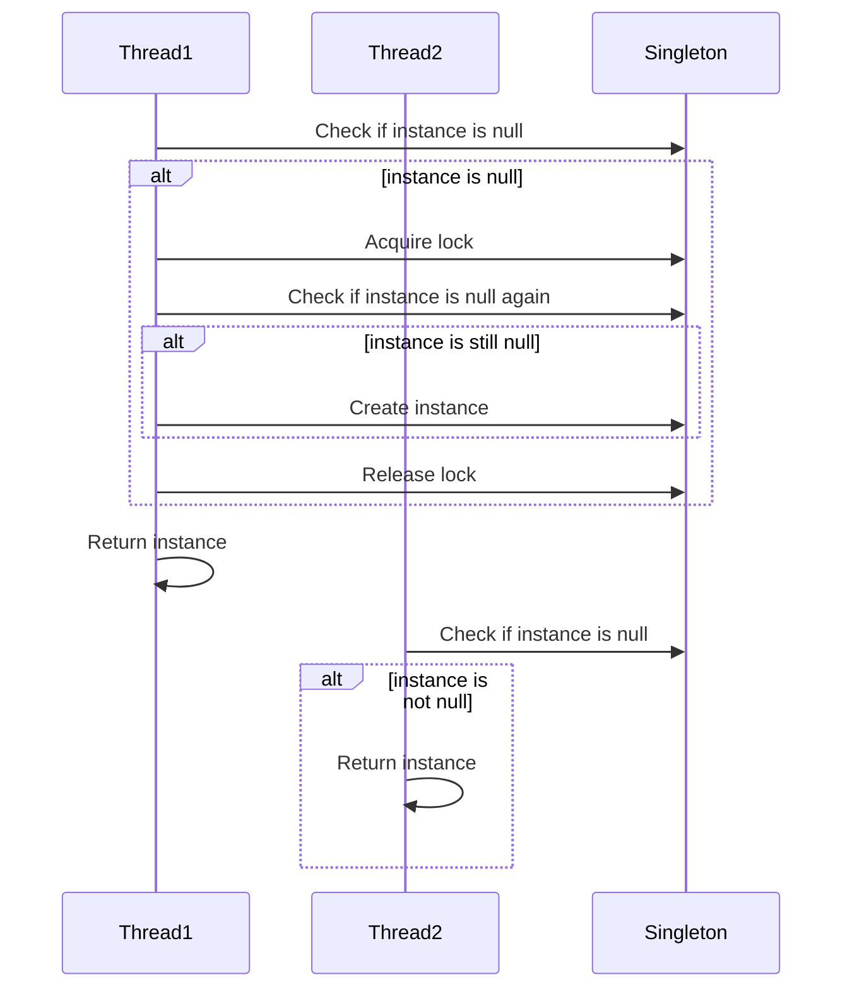

## 6.4.1 Implementing Double-Checked Locking in Java

In the realm of concurrent programming, ensuring thread safety while maintaining performance is a critical challenge. One pattern that addresses this issue is the Double-Checked Locking (DCL) pattern. This pattern is particularly useful for implementing lazy initialization in a thread-safe manner. In this section, we will delve into the intricacies of implementing Double-Checked Locking in Java, focusing on the correct usage of the `volatile` keyword, common pitfalls, and the importance of testing in multi-threaded environments.

### Understanding Double-Checked Locking

Double-Checked Locking is a design pattern used to reduce the overhead of acquiring a lock by first testing the locking criterion (the "double-check") without actually acquiring the lock. Only if the check indicates that locking is required does the actual lock proceed.

#### Why Use Double-Checked Locking?

The primary motivation for using Double-Checked Locking is to improve performance by minimizing synchronization overhead. This is particularly important in scenarios where the initialization of a resource is costly, but once initialized, the resource can be accessed with minimal locking.

### Implementing Double-Checked Locking in Java

To implement Double-Checked Locking in Java, we must ensure that the instance variable is declared with the `volatile` keyword. This ensures that changes to the instance variable are visible to all threads, preventing issues related to instruction reordering and visibility.

#### The `volatile` Keyword

The `volatile` keyword in Java is used to indicate that a variable's value will be modified by different threads. Declaring a variable as `volatile` ensures that its value is always read from the main memory and not from a thread's local cache. This is crucial for the Double-Checked Locking pattern because it prevents instruction reordering and ensures visibility across threads.

#### Code Example: Lazy Initialization of a Singleton

Let's look at a code example that demonstrates the correct implementation of Double-Checked Locking for lazy initialization of a singleton instance:

```java
public class Singleton {
    // Volatile keyword ensures visibility and prevents instruction reordering
    private static volatile Singleton instance;

    // Private constructor to prevent instantiation
    private Singleton() {}

    public static Singleton getInstance() {
        if (instance == null) { // First check (no locking)
            synchronized (Singleton.class) {
                if (instance == null) { // Second check (with locking)
                    instance = new Singleton();
                }
            }
        }
        return instance;
    }
}
```

In this example, the `getInstance()` method first checks if the `instance` is `null` without acquiring a lock. If it is `null`, it synchronizes on the `Singleton.class` and checks again. If the `instance` is still `null`, it initializes the `instance`.

### Why `volatile` is Necessary

Without the `volatile` keyword, the Java Memory Model (JMM) allows for certain optimizations, such as instruction reordering, which can lead to a situation where a partially constructed object is visible to other threads. The `volatile` keyword prevents these optimizations, ensuring that the `instance` is fully constructed before it is visible to other threads.

#### Java Memory Model Changes

Prior to Java 5, the Double-Checked Locking pattern was not considered safe due to the possibility of instruction reordering. However, with the introduction of the new Java Memory Model in Java 5, the `volatile` keyword was enhanced to prevent such reordering, making the pattern viable.

### Common Pitfalls and Mistakes

When implementing Double-Checked Locking, developers often encounter several pitfalls:

1. **Omitting the `volatile` Keyword**: Without `volatile`, the pattern is not thread-safe due to potential instruction reordering.
2. **Improper Synchronization**: Failing to synchronize the block where the instance is initialized can lead to multiple instances being created.
3. **Complex Initialization Logic**: If the initialization logic is complex, it may be better to use other patterns or approaches.

### Testing and Validation

Testing in a multi-threaded environment is crucial to ensure the correctness of the Double-Checked Locking pattern. Here are some strategies:

- **Stress Testing**: Simulate high concurrency to ensure that the singleton instance is initialized correctly.
- **Code Review**: Have peers review the implementation to catch potential issues.
- **Static Analysis Tools**: Use tools to detect concurrency issues.

### Visualizing Double-Checked Locking

To better understand the flow of Double-Checked Locking, let's visualize the process using a sequence diagram:



This diagram illustrates how two threads interact with the singleton instance using Double-Checked Locking. Thread1 acquires the lock and initializes the instance, while Thread2 simply returns the already initialized instance.

### Try It Yourself

To deepen your understanding, try modifying the code example:

- **Remove the `volatile` keyword** and observe the behavior under high concurrency.
- **Add logging** to track when the instance is created and accessed.
- **Experiment with different synchronization mechanisms**, such as using a `ReentrantLock`.

### References and Further Reading

For more information on Java concurrency and the Double-Checked Locking pattern, consider the following resources:

- [Java Concurrency in Practice](https://www.oreilly.com/library/view/java-concurrency-in/0321349601/)
- [Java Memory Model](https://docs.oracle.com/javase/specs/jls/se17/html/jls-17.html)
- [Effective Java by Joshua Bloch](https://www.oreilly.com/library/view/effective-java-3rd/9780134686097/)

### Knowledge Check

Before we move on, let's reinforce what we've learned:

- Why is the `volatile` keyword necessary in Double-Checked Locking?
- What are the potential pitfalls of implementing Double-Checked Locking?
- How does the Java Memory Model affect the safety of this pattern?

### Embrace the Journey

Remember, mastering concurrency patterns like Double-Checked Locking is a journey. As you continue to explore and experiment, you'll gain a deeper understanding of Java's concurrency model and how to write efficient, thread-safe code. Keep experimenting, stay curious, and enjoy the journey!

## Quiz Time!



### Why is the `volatile` keyword necessary in Double-Checked Locking?

- [x] To prevent instruction reordering and ensure visibility across threads.
- [ ] To make the code run faster.
- [ ] To allow multiple threads to modify the instance simultaneously.
- [ ] To enable the use of synchronized blocks.

> **Explanation:** The `volatile` keyword prevents instruction reordering and ensures that changes to the instance variable are visible to all threads.

### What is the primary purpose of Double-Checked Locking?

- [x] To minimize synchronization overhead while ensuring thread-safe lazy initialization.
- [ ] To allow multiple instances of a class.
- [ ] To eliminate the need for locks entirely.
- [ ] To make the code more complex.

> **Explanation:** Double-Checked Locking is used to reduce synchronization overhead by checking the locking criterion before acquiring a lock.

### What happens if the `volatile` keyword is omitted in Double-Checked Locking?

- [x] The pattern may not be thread-safe due to potential instruction reordering.
- [ ] The code will not compile.
- [ ] The instance will be initialized multiple times.
- [ ] The pattern will work as intended.

> **Explanation:** Without `volatile`, instruction reordering can occur, leading to a partially constructed object being visible to other threads.

### How does the Java Memory Model introduced in Java 5 affect Double-Checked Locking?

- [x] It makes the pattern viable by preventing instruction reordering with `volatile`.
- [ ] It eliminates the need for synchronization.
- [ ] It allows multiple threads to access the instance simultaneously.
- [ ] It makes the pattern obsolete.

> **Explanation:** The Java Memory Model in Java 5 enhanced the `volatile` keyword to prevent instruction reordering, making Double-Checked Locking viable.

### What is a common pitfall when implementing Double-Checked Locking?

- [x] Omitting the `volatile` keyword.
- [ ] Using too many synchronized blocks.
- [x] Improper synchronization.
- [ ] Using a private constructor.

> **Explanation:** Omitting `volatile` and improper synchronization are common pitfalls that can lead to thread safety issues.

### What is the role of the `synchronized` block in Double-Checked Locking?

- [x] To ensure that only one thread can initialize the instance at a time.
- [ ] To make the code run faster.
- [ ] To allow multiple threads to modify the instance simultaneously.
- [ ] To prevent the instance from being created.

> **Explanation:** The `synchronized` block ensures that only one thread can initialize the instance, preventing multiple instances.

### How can you test the correctness of Double-Checked Locking in a multi-threaded environment?

- [x] By performing stress testing with high concurrency.
- [ ] By removing all locks and observing the behavior.
- [x] By using static analysis tools.
- [ ] By running the code in a single-threaded environment.

> **Explanation:** Stress testing and static analysis tools can help ensure the correctness of Double-Checked Locking in multi-threaded environments.

### What is the benefit of using Double-Checked Locking for singleton initialization?

- [x] It minimizes synchronization overhead while ensuring thread safety.
- [ ] It allows multiple instances to be created.
- [ ] It eliminates the need for locks entirely.
- [ ] It makes the code more complex.

> **Explanation:** Double-Checked Locking minimizes synchronization overhead by checking the locking criterion before acquiring a lock.

### How does the `volatile` keyword affect the visibility of a variable?

- [x] It ensures that the variable's value is always read from the main memory.
- [ ] It allows the variable to be modified by multiple threads simultaneously.
- [ ] It makes the variable immutable.
- [ ] It prevents the variable from being accessed by other threads.

> **Explanation:** The `volatile` keyword ensures that a variable's value is always read from the main memory, ensuring visibility across threads.

### True or False: Double-Checked Locking is only safe in Java 5 and later due to changes in the Java Memory Model.

- [x] True
- [ ] False

> **Explanation:** True. The Java Memory Model changes in Java 5 made Double-Checked Locking safe by enhancing the `volatile` keyword to prevent instruction reordering.


