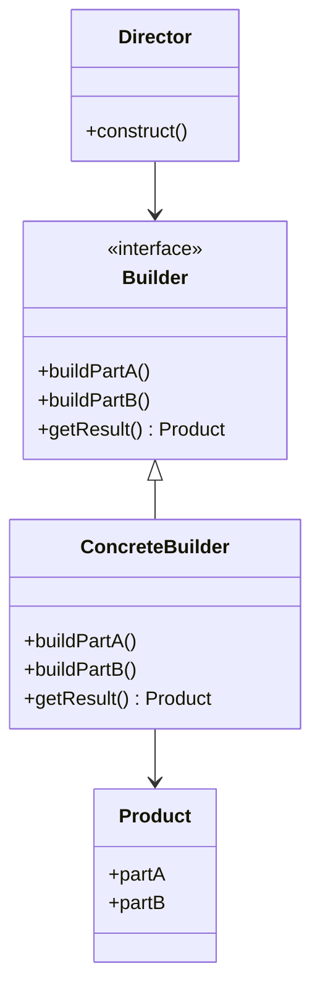

## 6.4.1 Implementing Builder in Java

### Introduction

The Builder pattern is a creational design pattern that provides a flexible solution to constructing complex objects. It separates the construction of an object from its representation, allowing the same construction process to create different representations. This pattern is particularly useful when dealing with objects that require numerous parameters, some of which may be optional.

### Intent and Benefits

The primary intent of the Builder pattern is to simplify the creation of complex objects by providing a clear and concise construction process. This pattern is beneficial in scenarios where:

- **Complex Construction**: Objects require multiple steps or configurations to be initialized correctly.
- **Multiple Representations**: Different configurations of the same object are needed.
- **Improved Readability**: The pattern enhances code readability by clearly defining the construction process.
- **Maintainability**: It isolates the construction logic, making it easier to manage and modify.

### Roles in the Builder Pattern

The Builder pattern involves several key components:

- **Builder**: An interface or abstract class defining the steps to construct the product.
- **ConcreteBuilder**: A class that implements the Builder interface and provides specific implementations for the construction steps.
- **Director**: An optional component that orchestrates the construction process using the Builder interface.
- **Product**: The complex object that is being constructed.

### UML Diagram

Below is a UML diagram illustrating the structure of the Builder pattern:



*Diagram Explanation*: The `Director` uses the `Builder` interface to construct a `Product`. The `ConcreteBuilder` implements the `Builder` interface, providing specific implementations for building parts of the `Product`.

### Java Implementation

Let's explore how to implement the Builder pattern in Java with a practical example. Consider a scenario where we need to construct a `House` object with various optional features.

#### Step 1: Define the Product

```java
public class House {
    private String foundation;
    private String structure;
    private String roof;
    private boolean hasGarage;
    private boolean hasSwimmingPool;
    private boolean hasGarden;

    // Private constructor to enforce object creation through Builder
    private House(HouseBuilder builder) {
        this.foundation = builder.foundation;
        this.structure = builder.structure;
        this.roof = builder.roof;
        this.hasGarage = builder.hasGarage;
        this.hasSwimmingPool = builder.hasSwimmingPool;
        this.hasGarden = builder.hasGarden;
    }

    // Getters for all fields
    public String getFoundation() { return foundation; }
    public String getStructure() { return structure; }
    public String getRoof() { return roof; }
    public boolean hasGarage() { return hasGarage; }
    public boolean hasSwimmingPool() { return hasSwimmingPool; }
    public boolean hasGarden() { return hasGarden; }

    @Override
    public String toString() {
        return "House [foundation=" + foundation + ", structure=" + structure + ", roof=" + roof +
               ", hasGarage=" + hasGarage + ", hasSwimmingPool=" + hasSwimmingPool + ", hasGarden=" + hasGarden + "]";
    }
}
```

#### Step 2: Create the Builder

```java
public static class HouseBuilder {
    private String foundation;
    private String structure;
    private String roof;
    private boolean hasGarage;
    private boolean hasSwimmingPool;
    private boolean hasGarden;

    public HouseBuilder setFoundation(String foundation) {
        this.foundation = foundation;
        return this;
    }

    public HouseBuilder setStructure(String structure) {
        this.structure = structure;
        return this;
    }

    public HouseBuilder setRoof(String roof) {
        this.roof = roof;
        return this;
    }

    public HouseBuilder setGarage(boolean hasGarage) {
        this.hasGarage = hasGarage;
        return this;
    }

    public HouseBuilder setSwimmingPool(boolean hasSwimmingPool) {
        this.hasSwimmingPool = hasSwimmingPool;
        return this;
    }

    public HouseBuilder setGarden(boolean hasGarden) {
        this.hasGarden = hasGarden;
        return this;
    }

    public House build() {
        return new House(this);
    }
}
```

#### Step 3: Use the Builder to Construct the Product

```java
public class BuilderPatternDemo {
    public static void main(String[] args) {
        House house = new House.HouseBuilder()
                .setFoundation("Concrete")
                .setStructure("Wood")
                .setRoof("Tiles")
                .setGarage(true)
                .setSwimmingPool(false)
                .setGarden(true)
                .build();

        System.out.println(house);
    }
}
```

### Explanation of the Code

- **Product Class (`House`)**: The `House` class is the complex object that we want to construct. It has a private constructor to enforce object creation through the `HouseBuilder`.
- **Builder Class (`HouseBuilder`)**: This class provides methods to set each attribute of the `House`. Each method returns the `HouseBuilder` instance, allowing for method chaining.
- **Construction Process**: The `build()` method in `HouseBuilder` returns a new `House` instance, constructed with the specified attributes.

### Advantages of the Builder Pattern

- **Readability**: The pattern improves code readability by clearly defining the construction process.
- **Flexibility**: It allows for flexible object construction with optional parameters.
- **Immutability**: By using a private constructor and only allowing object creation through the Builder, immutability can be achieved.

### Achieving Immutability

The Builder pattern can help achieve immutability by ensuring that the constructed object is fully initialized before it is returned. This is done by:

- Using a private constructor in the `Product` class.
- Only exposing the `Builder` for object creation.
- Avoiding setters in the `Product` class to prevent modification after construction.

### Practical Applications

The Builder pattern is widely used in scenarios where objects have numerous optional parameters or require a complex construction process. Examples include:

- **UI Components**: Constructing complex UI components with various configurations.
- **Database Connections**: Configuring database connections with multiple optional settings.
- **Network Requests**: Building network requests with optional headers and parameters.

### Related Patterns

- **[6.6 Singleton Pattern]( "Singleton Pattern")**: While the Singleton pattern ensures a class has only one instance, the Builder pattern focuses on constructing complex instances.
- **Factory Method**: The Factory Method pattern provides an interface for creating objects, but the Builder pattern is more suited for complex object construction.

### Known Uses

The Builder pattern is commonly used in Java libraries and frameworks, such as:

- **Java's `StringBuilder`**: Used for constructing strings efficiently.
- **Google's `Guava`**: Provides builders for various data structures.
- **Apache's `HttpClient`**: Uses builders for constructing HTTP requests.

### Conclusion

The Builder pattern is a powerful tool for constructing complex objects in Java. By separating the construction process from the representation, it enhances code readability, flexibility, and maintainability. By understanding and implementing this pattern, developers can create robust and efficient applications.

## Test Your Knowledge: Builder Pattern in Java Quiz



### What is the primary intent of the Builder pattern?

- [x] To separate the construction of a complex object from its representation.
- [ ] To ensure a class has only one instance.
- [ ] To provide a way to access the elements of an aggregate object sequentially.
- [ ] To define a family of algorithms, encapsulate each one, and make them interchangeable.

> **Explanation:** The Builder pattern's primary intent is to separate the construction of a complex object from its representation, allowing for different representations.

### Which component in the Builder pattern is responsible for orchestrating the construction process?

- [ ] Product
- [ ] ConcreteBuilder
- [x] Director
- [ ] Builder

> **Explanation:** The Director is responsible for orchestrating the construction process using the Builder interface.

### How does the Builder pattern improve code readability?

- [x] By clearly defining the construction process and allowing method chaining.
- [ ] By ensuring only one instance of a class is created.
- [ ] By providing a way to access elements of an aggregate object.
- [ ] By encapsulating algorithms and making them interchangeable.

> **Explanation:** The Builder pattern improves readability by clearly defining the construction process and allowing method chaining for setting attributes.

### What is a key benefit of using the Builder pattern for objects with many optional parameters?

- [x] It allows for flexible object construction with optional parameters.
- [ ] It ensures thread safety.
- [ ] It provides a way to access elements sequentially.
- [ ] It encapsulates algorithms.

> **Explanation:** The Builder pattern allows for flexible object construction with optional parameters, making it ideal for objects with many optional attributes.

### How can immutability be achieved using the Builder pattern?

- [x] By using a private constructor and only allowing object creation through the Builder.
- [ ] By ensuring only one instance of a class is created.
- [ ] By providing a way to access elements of an aggregate object.
- [ ] By encapsulating algorithms and making them interchangeable.

> **Explanation:** Immutability can be achieved by using a private constructor and only allowing object creation through the Builder, preventing modification after construction.

### What is the role of the ConcreteBuilder in the Builder pattern?

- [x] To provide specific implementations for the construction steps.
- [ ] To orchestrate the construction process.
- [ ] To define the steps to construct the product.
- [ ] To represent the complex object being constructed.

> **Explanation:** The ConcreteBuilder provides specific implementations for the construction steps defined by the Builder interface.

### Which Java class is a known use of the Builder pattern?

- [x] StringBuilder
- [ ] ArrayList
- [ ] HashMap
- [ ] Singleton

> **Explanation:** Java's `StringBuilder` is a known use of the Builder pattern, used for constructing strings efficiently.

### In the UML diagram, which component is optional in the Builder pattern?

- [ ] Product
- [ ] ConcreteBuilder
- [x] Director
- [ ] Builder

> **Explanation:** The Director is an optional component in the Builder pattern, used to orchestrate the construction process.

### What is the main difference between the Builder and Factory Method patterns?

- [x] The Builder pattern is more suited for complex object construction, while the Factory Method provides an interface for creating objects.
- [ ] The Builder pattern ensures a class has only one instance, while the Factory Method provides an interface for creating objects.
- [ ] The Builder pattern provides a way to access elements of an aggregate object, while the Factory Method encapsulates algorithms.
- [ ] The Builder pattern defines a family of algorithms, while the Factory Method allows for different representations.

> **Explanation:** The Builder pattern is more suited for complex object construction, while the Factory Method provides an interface for creating objects.

### True or False: The Builder pattern can be used to construct immutable objects.

- [x] True
- [ ] False

> **Explanation:** True. The Builder pattern can be used to construct immutable objects by using a private constructor and only allowing object creation through the Builder.


