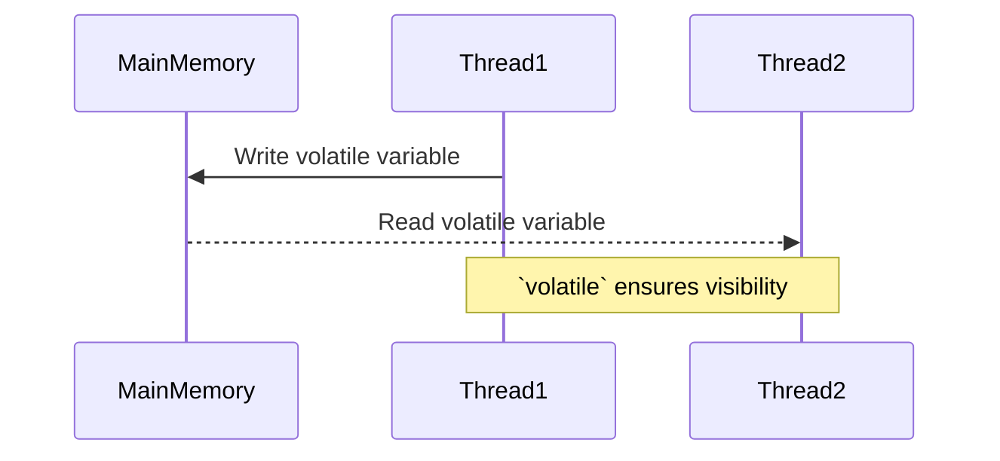

## 6.4.2 `volatile` Keyword Usage

In the realm of Java concurrency, the `volatile` keyword plays a crucial role in ensuring the visibility and ordering of variable updates across threads. This section delves into the intricacies of `volatile`, its appropriate usage scenarios, and its limitations, particularly in the context of the Double-Checked Locking pattern. 

### Understanding `volatile` in Java

The `volatile` keyword in Java is used to mark a variable as being stored in the main memory. More importantly, it guarantees that any read or write to a `volatile` variable is visible to all threads. This ensures that changes made by one thread to a `volatile` variable are immediately reflected in other threads.

#### Key Properties of `volatile`

1. **Visibility**: When a variable is declared as `volatile`, it ensures that any write to the variable is immediately visible to other threads. This is because the Java Memory Model (JMM) ensures that all reads and writes to `volatile` variables are done directly from the main memory.

2. **Ordering**: The `volatile` keyword prevents instruction reordering by the compiler or processor. This means that any read or write of a `volatile` variable establishes a happens-before relationship, ensuring that changes are visible to other threads in the order they were made.

### When to Use `volatile`

The `volatile` keyword is particularly useful in scenarios where you have a variable that is shared between multiple threads and is being read and written by them. Here are some common scenarios:

1. **Flags and State Indicators**: When you have a boolean flag or a state indicator that is checked by multiple threads, marking it as `volatile` ensures that changes are immediately visible to all threads.

2. **Double-Checked Locking**: In the Double-Checked Locking pattern, `volatile` is used to ensure that the instance being checked is visible to all threads after it has been initialized.

3. **Singleton Pattern**: When implementing a Singleton pattern, `volatile` can be used to ensure that the singleton instance is safely published to all threads.

#### Example: Double-Checked Locking Pattern

The Double-Checked Locking pattern is a design pattern used to reduce the overhead of acquiring a lock by first checking the locking criterion without actually acquiring the lock. Here's how `volatile` is used in this pattern:

```java
public class Singleton {
    private static volatile Singleton instance;

    private Singleton() {
        // Private constructor to prevent instantiation
    }

    public static Singleton getInstance() {
        if (instance == null) { // First check (no locking)
            synchronized (Singleton.class) {
                if (instance == null) { // Second check (with locking)
                    instance = new Singleton();
                }
            }
        }
        return instance;
    }
}
```

In this example, the `instance` variable is declared as `volatile` to ensure that once the instance is initialized, it is visible to all threads.

### Limitations of `volatile`

While `volatile` is a powerful tool for ensuring visibility and ordering, it has its limitations:

1. **No Atomicity**: `volatile` does not provide atomicity for compound actions. For example, incrementing a `volatile` integer is not atomic because it involves multiple operations (read, modify, write).

2. **No Locking**: `volatile` does not provide mutual exclusion. If you need to ensure that only one thread can execute a block of code at a time, you need to use synchronization mechanisms like `synchronized` blocks or locks.

3. **Limited Use Cases**: `volatile` is only suitable for variables that are read and written independently. If you need to perform compound actions or maintain complex invariants, you should use locks.

### `volatile` vs. Synchronization

The primary difference between `volatile` and synchronization mechanisms is that `volatile` only ensures visibility and ordering, while synchronization provides both visibility and atomicity. Here are some key differences:

- **Visibility**: Both `volatile` and synchronization ensure visibility of changes to variables across threads.
- **Atomicity**: Synchronization provides atomicity, while `volatile` does not.
- **Performance**: `volatile` is generally faster than synchronization because it does not involve locking.

### Best Practices for Using `volatile`

1. **Use for Simple Flags**: Use `volatile` for simple flags or state indicators that are read and written independently.
2. **Avoid for Compound Actions**: Do not use `volatile` for compound actions or operations that require atomicity.
3. **Combine with Synchronization**: In cases like Double-Checked Locking, combine `volatile` with synchronization to ensure both visibility and atomicity.

### Try It Yourself

To better understand the use of `volatile`, try modifying the following code example. Experiment with removing the `volatile` keyword and observe the behavior:

```java
public class VolatileExample {
    private static volatile boolean flag = false;

    public static void main(String[] args) {
        Thread writer = new Thread(() -> {
            try {
                Thread.sleep(1000);
                flag = true;
                System.out.println("Flag set to true");
            } catch (InterruptedException e) {
                Thread.currentThread().interrupt();
            }
        });

        Thread reader = new Thread(() -> {
            while (!flag) {
                // Busy-wait
            }
            System.out.println("Flag detected as true");
        });

        writer.start();
        reader.start();
    }
}
```

### Visualizing `volatile` in Java

Let's visualize how `volatile` ensures visibility and ordering in a multi-threaded environment:



In this diagram, Thread1 writes to a `volatile` variable, and the change is immediately visible to Thread2.

### Further Reading

For more information on the `volatile` keyword and Java concurrency, consider the following resources:

- [Java Concurrency in Practice](https://www.oreilly.com/library/view/java-concurrency-in/0321349601/)
- [Java Memory Model](https://docs.oracle.com/javase/specs/jls/se8/html/jls-17.html)

### Knowledge Check

Before we wrap up, let's reinforce what we've learned with a few questions:

- What does the `volatile` keyword guarantee in Java?
- Can `volatile` be used to ensure atomicity?
- How does `volatile` differ from synchronization?

### Summary

In this section, we've explored the `volatile` keyword in Java, its role in ensuring visibility and ordering, and its limitations. We've also seen how `volatile` is used in the Double-Checked Locking pattern and compared it with synchronization mechanisms. Remember, `volatile` is a powerful tool for specific scenarios, but it should be used judiciously to prevent concurrency issues.

## Quiz Time!



### What does the `volatile` keyword guarantee in Java?

- [x] Visibility and ordering of variable updates across threads
- [ ] Atomicity of operations
- [ ] Mutual exclusion
- [ ] Performance optimization

> **Explanation:** The `volatile` keyword guarantees visibility and ordering, ensuring that changes to a variable are immediately visible to all threads.

### In which scenario is `volatile` most appropriately used?

- [x] Flags and state indicators
- [ ] Complex data structures
- [ ] Atomic operations
- [ ] File I/O operations

> **Explanation:** `volatile` is most appropriate for flags and state indicators that are read and written independently by multiple threads.

### What is a limitation of the `volatile` keyword?

- [x] It does not provide atomicity for compound actions.
- [ ] It prevents visibility of changes.
- [ ] It requires locking mechanisms.
- [ ] It is slower than synchronization.

> **Explanation:** `volatile` does not provide atomicity, which means it cannot be used for compound actions that require multiple steps.

### How does `volatile` differ from synchronization?

- [x] `volatile` ensures visibility and ordering, while synchronization provides atomicity.
- [ ] `volatile` is slower than synchronization.
- [ ] `volatile` provides mutual exclusion.
- [ ] `volatile` is used for complex data structures.

> **Explanation:** `volatile` ensures visibility and ordering, but does not provide atomicity, which is a key feature of synchronization.

### Why is `volatile` used in the Double-Checked Locking pattern?

- [x] To ensure that the instance is visible to all threads after initialization
- [ ] To provide atomicity for instance creation
- [ ] To lock the instance during creation
- [ ] To optimize performance

> **Explanation:** In the Double-Checked Locking pattern, `volatile` is used to ensure that the instance is visible to all threads once it is initialized.

### Can `volatile` be used for compound actions?

- [ ] Yes, it ensures atomicity for compound actions.
- [x] No, it does not provide atomicity.
- [ ] Yes, it locks the variable for compound actions.
- [ ] No, it is only for single-threaded applications.

> **Explanation:** `volatile` does not provide atomicity, so it cannot be used for compound actions that require multiple steps.

### What is the primary benefit of using `volatile` over synchronization?

- [x] `volatile` is generally faster because it does not involve locking.
- [ ] `volatile` provides atomicity for operations.
- [ ] `volatile` ensures mutual exclusion.
- [ ] `volatile` is used for complex data structures.

> **Explanation:** `volatile` is generally faster than synchronization because it does not involve locking mechanisms.

### What happens when a `volatile` variable is updated by a thread?

- [x] The update is immediately visible to all other threads.
- [ ] The update is delayed until the thread releases the lock.
- [ ] The update is only visible to the current thread.
- [ ] The update is stored in a local cache.

> **Explanation:** When a `volatile` variable is updated, the change is immediately visible to all other threads due to the guarantees provided by the Java Memory Model.

### Is `volatile` suitable for maintaining complex invariants?

- [ ] Yes, it ensures atomicity and visibility.
- [x] No, it only ensures visibility and ordering.
- [ ] Yes, it locks the variable for complex operations.
- [ ] No, it is only for single-threaded applications.

> **Explanation:** `volatile` is not suitable for maintaining complex invariants because it only ensures visibility and ordering, not atomicity.

### `volatile` provides mutual exclusion for threads.

- [ ] True
- [x] False

> **Explanation:** `volatile` does not provide mutual exclusion; it only ensures visibility and ordering of variable updates across threads.



Remember, this is just the beginning. As you progress, you'll build more complex and interactive multi-threaded applications. Keep experimenting, stay curious, and enjoy the journey!
