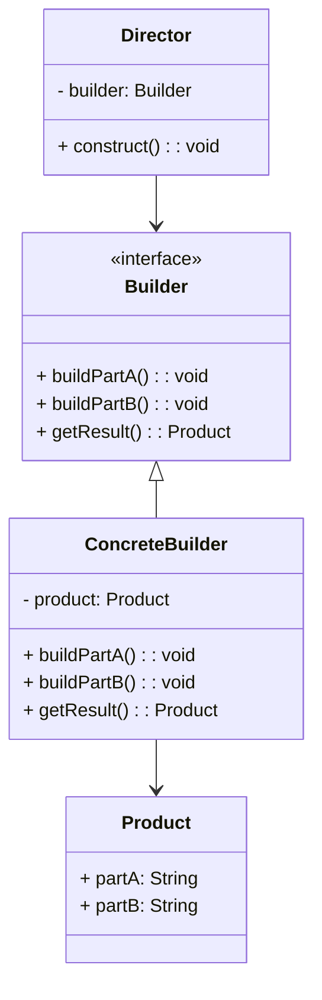

## 6.4.3 Director and Builder Roles

The Builder Pattern is a creational design pattern that provides a flexible solution to constructing complex objects. It separates the construction of a complex object from its representation, allowing the same construction process to create different representations. Within this pattern, the roles of the **Director** and **Builder** are pivotal in orchestrating and executing the construction process. This section delves into the responsibilities and interactions of these roles, providing insights into their practical applications and benefits.

### Understanding the Director Role

#### Responsibility of the Director

The **Director** is responsible for defining the order of construction steps. It orchestrates the building process by interacting with the Builder interface to construct a product. The Director does not know the specifics of the product being built; instead, it relies on the Builder to handle the details of the construction.

- **Orchestration**: The Director ensures that the construction process follows a specific sequence. It invokes the necessary methods on the Builder to create a product.
- **Decoupling**: By separating the construction process from the product's representation, the Director allows for flexibility and reuse of the construction logic.

#### Example of Director in Action

Consider a scenario where we need to construct a complex `House` object. The Director will manage the sequence of steps required to build the house, such as laying the foundation, constructing walls, and adding a roof.

```java
// Director class
public class ConstructionDirector {
    private HouseBuilder houseBuilder;

    public ConstructionDirector(HouseBuilder houseBuilder) {
        this.houseBuilder = houseBuilder;
    }

    public void constructHouse() {
        houseBuilder.buildFoundation();
        houseBuilder.buildWalls();
        houseBuilder.buildRoof();
    }
}
```

In this example, the `ConstructionDirector` orchestrates the building process by calling methods on the `HouseBuilder` interface. The Director does not need to know the details of how each step is implemented, allowing for different types of houses to be built using the same construction process.

### Exploring the Builder Role

#### Responsibility of the Builder

The **Builder** defines the steps required to construct the product. It provides an interface for creating parts of the product, allowing for different implementations to produce various representations of the product.

- **Step Definition**: The Builder specifies the construction steps, ensuring that each part of the product is created correctly.
- **Product Assembly**: The Builder assembles the final product, encapsulating the construction logic and details.

#### Example of Builder Implementation

Continuing with the `House` example, let's define a `HouseBuilder` interface and a concrete implementation for a `WoodenHouseBuilder`.

```java
// Builder interface
public interface HouseBuilder {
    void buildFoundation();
    void buildWalls();
    void buildRoof();
    House getHouse();
}

// Concrete Builder
public class WoodenHouseBuilder implements HouseBuilder {
    private House house;

    public WoodenHouseBuilder() {
        this.house = new House();
    }

    @Override
    public void buildFoundation() {
        house.setFoundation("Wooden Foundation");
        System.out.println("Wooden foundation built.");
    }

    @Override
    public void buildWalls() {
        house.setWalls("Wooden Walls");
        System.out.println("Wooden walls built.");
    }

    @Override
    public void buildRoof() {
        house.setRoof("Wooden Roof");
        System.out.println("Wooden roof built.");
    }

    @Override
    public House getHouse() {
        return this.house;
    }
}
```

In this implementation, the `WoodenHouseBuilder` provides the details for constructing a wooden house. Each method in the Builder interface is responsible for a specific part of the house, and the `getHouse()` method returns the final product.

### Director and Builder Collaboration

The collaboration between the Director and Builder is crucial for constructing complex objects. The Director manages the sequence of construction steps, while the Builder handles the specifics of each step. This separation of concerns allows for flexibility and scalability in the construction process.

#### Real-World Scenario: Building a Car

Consider a real-world scenario where we need to build different types of cars. The Director can manage the sequence of steps required to build a car, while different Builders can provide the specifics for various car models.

```java
// Product class
public class Car {
    private String engine;
    private String body;
    private String wheels;

    // Getters and setters
}

// Builder interface
public interface CarBuilder {
    void buildEngine();
    void buildBody();
    void buildWheels();
    Car getCar();
}

// Concrete Builder for a Sports Car
public class SportsCarBuilder implements CarBuilder {
    private Car car;

    public SportsCarBuilder() {
        this.car = new Car();
    }

    @Override
    public void buildEngine() {
        car.setEngine("V8 Engine");
        System.out.println("V8 engine built.");
    }

    @Override
    public void buildBody() {
        car.setBody("Sports Body");
        System.out.println("Sports body built.");
    }

    @Override
    public void buildWheels() {
        car.setWheels("Sports Wheels");
        System.out.println("Sports wheels built.");
    }

    @Override
    public Car getCar() {
        return this.car;
    }
}

// Director class
public class CarDirector {
    private CarBuilder carBuilder;

    public CarDirector(CarBuilder carBuilder) {
        this.carBuilder = carBuilder;
    }

    public void constructCar() {
        carBuilder.buildEngine();
        carBuilder.buildBody();
        carBuilder.buildWheels();
    }
}
```

In this scenario, the `CarDirector` manages the construction process, while the `SportsCarBuilder` provides the details for building a sports car. This approach allows for easy substitution of different Builders to create various car models.

### Optional Director Role

In some cases, the Director role may be optional or integrated into the client code. This approach is suitable when the construction process is straightforward, and the client can manage the sequence of steps directly.

#### Example: Simplified Construction

```java
public class Client {
    public static void main(String[] args) {
        HouseBuilder builder = new WoodenHouseBuilder();
        builder.buildFoundation();
        builder.buildWalls();
        builder.buildRoof();
        House house = builder.getHouse();
        System.out.println("House built: " + house);
    }
}
```

In this example, the client code directly manages the construction process, eliminating the need for a separate Director class. This approach is suitable for simple construction processes where the sequence of steps is not complex.

### Flexibility and Decoupling

The Builder Pattern, with its separation of Director and Builder roles, provides significant flexibility and decoupling in the construction process. By decoupling the construction logic from the product's representation, the pattern allows for:

- **Reusability**: The same construction process can be reused with different Builders to create various product representations.
- **Scalability**: New Builders can be added to support additional product types without modifying existing code.
- **Maintainability**: Changes to the construction process or product representation can be made independently, reducing the risk of introducing errors.

### Visualizing the Builder Pattern

To better understand the structure and interactions within the Builder Pattern, consider the following class diagram:



**Diagram Explanation**: This diagram illustrates the relationship between the Director, Builder, and Product classes. The Director interacts with the Builder interface to construct the Product, while the ConcreteBuilder provides the implementation details for building the Product.

### Conclusion

The Director and Builder roles in the Builder Pattern play a crucial role in constructing complex objects. By separating the construction process from the product's representation, the pattern provides flexibility, reusability, and maintainability. Understanding these roles and their interactions is essential for effectively applying the Builder Pattern in real-world scenarios.

### Key Takeaways

- The Director orchestrates the construction process, managing the sequence of steps.
- The Builder defines the steps required to construct the product, handling the details of each step.
- The separation of concerns between the Director and Builder allows for flexibility and decoupling.
- In some cases, the Director role may be optional or integrated into the client code.
- The Builder Pattern is suitable for constructing complex objects with varying representations.

### Encouragement for Further Exploration

Consider how the Builder Pattern can be applied to your projects. Reflect on scenarios where the separation of construction logic and product representation can enhance flexibility and maintainability. Experiment with different Builders to create various product representations, and explore the benefits of decoupling the construction process.

## Test Your Knowledge: Director and Builder Roles in Java Design Patterns



### What is the primary responsibility of the Director in the Builder Pattern?

- [x] Orchestrating the construction process
- [ ] Defining the product's representation
- [ ] Implementing the construction steps
- [ ] Managing the product lifecycle

> **Explanation:** The Director is responsible for orchestrating the construction process by managing the sequence of steps required to build the product.

### How does the Builder Pattern enhance flexibility in object construction?

- [x] By decoupling construction logic from product representation
- [ ] By integrating the Director into the client code
- [ ] By using a single Builder for all products
- [ ] By eliminating the need for a Director

> **Explanation:** The Builder Pattern enhances flexibility by decoupling the construction logic from the product's representation, allowing for different Builders to create various product representations.

### In what scenario might the Director role be optional?

- [x] When the construction process is straightforward
- [ ] When the product is complex
- [ ] When multiple Builders are used
- [ ] When the product representation varies

> **Explanation:** The Director role may be optional when the construction process is straightforward, allowing the client code to manage the sequence of steps directly.

### What is the benefit of using different Builders in the Builder Pattern?

- [x] Creating various product representations
- [ ] Reducing code complexity
- [ ] Simplifying the construction process
- [ ] Eliminating the need for a Director

> **Explanation:** Using different Builders allows for the creation of various product representations, providing flexibility and reusability in the construction process.

### Which component in the Builder Pattern is responsible for defining the construction steps?

- [x] Builder
- [ ] Director
- [ ] Client
- [ ] Product

> **Explanation:** The Builder is responsible for defining the construction steps, providing the details for creating each part of the product.

### How does the Builder Pattern improve maintainability?

- [x] By allowing changes to construction logic and product representation independently
- [ ] By integrating the Director into the client code
- [ ] By using a single Builder for all products
- [ ] By eliminating the need for a Director

> **Explanation:** The Builder Pattern improves maintainability by allowing changes to the construction logic and product representation independently, reducing the risk of introducing errors.

### What is the role of the ConcreteBuilder in the Builder Pattern?

- [x] Providing implementation details for building the product
- [ ] Orchestrating the construction process
- [ ] Managing the product lifecycle
- [ ] Defining the product's representation

> **Explanation:** The ConcreteBuilder provides the implementation details for building the product, handling the specifics of each construction step.

### How does the Director interact with the Builder in the Builder Pattern?

- [x] By invoking methods on the Builder to construct the product
- [ ] By defining the product's representation
- [ ] By implementing the construction steps
- [ ] By managing the product lifecycle

> **Explanation:** The Director interacts with the Builder by invoking methods on the Builder to construct the product, managing the sequence of construction steps.

### What is the benefit of decoupling the construction process from the product's representation?

- [x] Flexibility and reusability
- [ ] Simplifying the construction process
- [ ] Reducing code complexity
- [ ] Eliminating the need for a Director

> **Explanation:** Decoupling the construction process from the product's representation provides flexibility and reusability, allowing for different Builders to create various product representations.

### True or False: The Builder Pattern is suitable for constructing simple objects.

- [ ] True
- [x] False

> **Explanation:** The Builder Pattern is suitable for constructing complex objects with varying representations, rather than simple objects.



By understanding the roles of Director and Builder in the Builder Pattern, developers can effectively construct complex objects with flexibility and maintainability. This knowledge empowers software architects to design robust and scalable systems, leveraging the benefits of the Builder Pattern in real-world applications.
