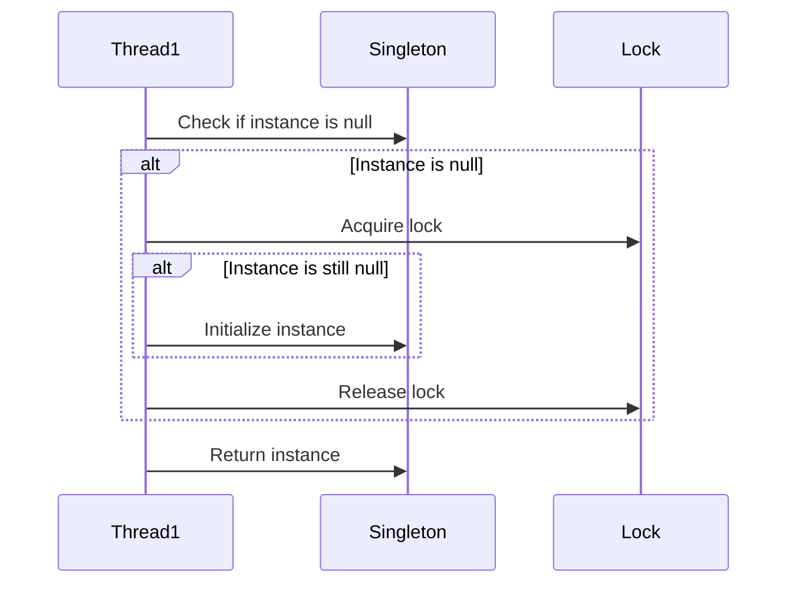

## 6.4.3 Use Cases and Examples

In the realm of concurrent programming, ensuring thread safety while maintaining performance is a critical challenge. The Double-Checked Locking (DCL) pattern is a widely recognized solution for this problem, particularly in scenarios where resource-intensive initialization is required. In this section, we will explore practical use cases where the Double-Checked Locking pattern is applied, such as implementing thread-safe singletons, initializing shared resources, and caching objects. We will also delve into the performance benefits and trade-offs associated with this pattern.

### Understanding Double-Checked Locking

Before diving into specific use cases, let's briefly revisit the concept of Double-Checked Locking. This pattern aims to reduce the overhead of acquiring a lock by first checking the condition without synchronization. Only if the condition is not met, the lock is acquired, and the condition is checked again within the synchronized block. This approach minimizes the performance cost of synchronization by ensuring that the lock is only acquired when necessary.

### Use Case 1: Thread-Safe Singleton with Lazy Initialization

One of the most common applications of the Double-Checked Locking pattern is in the implementation of a thread-safe singleton with lazy initialization. In a singleton pattern, we ensure that a class has only one instance and provide a global point of access to it. Lazy initialization delays the creation of the singleton instance until it is needed, which can save resources if the instance is never used.

#### Code Example: Singleton with Double-Checked Locking

```java
public class Singleton {
    private static volatile Singleton instance;

    // Private constructor to prevent instantiation
    private Singleton() {}

    public static Singleton getInstance() {
        if (instance == null) { // First check (no locking)
            synchronized (Singleton.class) {
                if (instance == null) { // Second check (with locking)
                    instance = new Singleton();
                }
            }
        }
        return instance;
    }
}
```

**Explanation:**

- **Volatile Keyword**: The `volatile` keyword ensures that multiple threads handle the `instance` variable correctly when it is being initialized to the `Singleton` instance.
- **First Check**: The initial check of `instance == null` is done without synchronization to avoid the overhead of acquiring a lock every time the method is called.
- **Second Check**: The second check inside the synchronized block ensures that only one thread initializes the instance.

#### Benefits

- **Performance**: The pattern reduces synchronization overhead by only acquiring the lock when the instance is `null`.
- **Thread Safety**: Ensures that the singleton instance is created safely across multiple threads.

#### Trade-offs

- **Complexity**: The pattern introduces additional complexity with double-checking and the use of `volatile`.
- **Java Memory Model**: Prior to Java 5, the Java Memory Model did not guarantee that the pattern would work correctly without `volatile`.

### Use Case 2: Initializing Shared Resources

In multi-threaded applications, there are often shared resources that are expensive to create, such as database connections or configuration settings. The Double-Checked Locking pattern can be used to initialize these resources only once, ensuring that they are shared across threads without unnecessary synchronization.

#### Code Example: Shared Resource Initialization

```java
public class ConfigurationManager {
    private static volatile ConfigurationManager configManager;
    private Properties properties;

    private ConfigurationManager() {
        // Load configuration from file or database
        properties = new Properties();
        // Example: properties.load(new FileInputStream("config.properties"));
    }

    public static ConfigurationManager getInstance() {
        if (configManager == null) {
            synchronized (ConfigurationManager.class) {
                if (configManager == null) {
                    configManager = new ConfigurationManager();
                }
            }
        }
        return configManager;
    }

    public String getProperty(String key) {
        return properties.getProperty(key);
    }
}
```

**Explanation:**

- **Initialization**: The `ConfigurationManager` class loads configuration settings in its constructor, which is only called once.
- **Access**: The `getInstance` method provides a thread-safe way to access the shared configuration.

#### Benefits

- **Resource Efficiency**: The resource is initialized only once, saving time and memory.
- **Thread Safety**: Ensures that the resource is safely shared across multiple threads.

#### Trade-offs

- **Initialization Time**: The first call to `getInstance` may take longer due to resource loading.
- **Error Handling**: Proper error handling is required during initialization to avoid inconsistent states.

### Use Case 3: Caching Objects

Caching is a common technique used to store frequently accessed data in memory to improve application performance. The Double-Checked Locking pattern can be used to initialize and update cache entries in a thread-safe manner.

#### Code Example: Object Caching

```java
public class Cache {
    private static volatile Cache instance;
    private Map<String, Object> cacheMap;

    private Cache() {
        cacheMap = new HashMap<>();
    }

    public static Cache getInstance() {
        if (instance == null) {
            synchronized (Cache.class) {
                if (instance == null) {
                    instance = new Cache();
                }
            }
        }
        return instance;
    }

    public Object get(String key) {
        return cacheMap.get(key);
    }

    public void put(String key, Object value) {
        synchronized (cacheMap) {
            cacheMap.put(key, value);
        }
    }
}
```

**Explanation:**

- **Cache Initialization**: The cache is initialized only once using the Double-Checked Locking pattern.
- **Thread-Safe Updates**: The `put` method synchronizes on the `cacheMap` to ensure thread-safe updates.

#### Benefits

- **Performance**: Reduces the need to repeatedly compute or fetch data by storing it in the cache.
- **Scalability**: Supports concurrent access and updates to the cache.

#### Trade-offs

- **Memory Usage**: Caching can increase memory usage, so it should be used judiciously.
- **Consistency**: Ensuring cache consistency in a multi-threaded environment can be challenging.

### Performance Considerations

The primary advantage of the Double-Checked Locking pattern is its ability to minimize synchronization overhead, which can significantly improve performance in scenarios where resource initialization is costly. However, it is important to consider the following:

- **Volatile Overhead**: While `volatile` ensures visibility, it may introduce some performance overhead due to memory barriers.
- **Complexity**: The pattern adds complexity to the code, which can make it harder to read and maintain.
- **Alternative Approaches**: In some cases, other concurrency patterns or constructs, such as `java.util.concurrent` classes, may provide simpler solutions.

### Try It Yourself

To deepen your understanding of the Double-Checked Locking pattern, try the following exercises:

1. **Modify the Singleton Example**: Add logging to the singleton example to track when the instance is created and accessed. Observe the log output in a multi-threaded environment.

2. **Experiment with Cache Eviction**: Extend the cache example to include a mechanism for evicting old entries. Consider using a Least Recently Used (LRU) eviction policy.

3. **Benchmark Performance**: Write a benchmark to compare the performance of the Double-Checked Locking pattern with a fully synchronized method. Measure the time taken to access the singleton instance in both cases.

### Visualizing Double-Checked Locking

To better understand how the Double-Checked Locking pattern works, let's visualize the flow of control using a sequence diagram.



**Diagram Explanation:**

- **Initial Check**: The thread first checks if the instance is `null` without acquiring the lock.
- **Lock Acquisition**: If the instance is `null`, the thread acquires the lock.
- **Second Check**: Inside the synchronized block, the thread checks again if the instance is `null` before initializing it.
- **Instance Initialization**: If the instance is still `null`, it is initialized.
- **Lock Release**: The lock is released after initialization, and the instance is returned.

### Conclusion

The Double-Checked Locking pattern is a powerful tool for optimizing performance in concurrent applications. By minimizing synchronization overhead, it allows for efficient initialization of shared resources, such as singletons, configuration settings, and caches. However, it is important to be aware of the trade-offs and complexities associated with this pattern. As with any design pattern, it should be applied judiciously, with a clear understanding of its implications.

### References and Further Reading

- [Java Concurrency in Practice](https://jcip.net/) by Brian Goetz
- [Effective Java](https://www.oreilly.com/library/view/effective-java/9780134686097/) by Joshua Bloch
- [Java Memory Model](https://docs.oracle.com/javase/specs/jls/se17/html/jls-17.html) - Oracle Documentation

## Quiz Time!



### What is the primary purpose of the Double-Checked Locking pattern?

- [x] To minimize synchronization overhead while ensuring thread safety.
- [ ] To maximize memory usage for caching.
- [ ] To simplify code readability.
- [ ] To ensure single-threaded execution.

> **Explanation:** The Double-Checked Locking pattern is designed to reduce synchronization overhead by only acquiring a lock when necessary, while still ensuring thread safety.

### In the Singleton pattern example, what role does the `volatile` keyword play?

- [x] It ensures that changes to the instance variable are visible to all threads.
- [ ] It prevents the instance from being garbage collected.
- [ ] It locks the instance variable.
- [ ] It initializes the instance variable.

> **Explanation:** The `volatile` keyword ensures that changes to the `instance` variable are visible to all threads, preventing issues with stale data.

### Why is the second check inside the synchronized block necessary in Double-Checked Locking?

- [x] To ensure that only one thread initializes the instance.
- [ ] To improve performance by reducing lock acquisition.
- [ ] To simplify the code structure.
- [ ] To prevent deadlocks.

> **Explanation:** The second check ensures that only one thread initializes the instance, even if multiple threads pass the first check simultaneously.

### What is a potential trade-off of using the Double-Checked Locking pattern?

- [x] Increased code complexity.
- [ ] Reduced memory usage.
- [ ] Simplified error handling.
- [ ] Improved readability.

> **Explanation:** The Double-Checked Locking pattern introduces additional complexity with double-checking and the use of `volatile`.

### Which of the following is a suitable use case for Double-Checked Locking?

- [x] Initializing a thread-safe singleton.
- [x] Caching objects that need to be created only once.
- [ ] Implementing a simple loop.
- [ ] Handling user input in a GUI application.

> **Explanation:** Double-Checked Locking is suitable for scenarios like initializing a singleton or caching objects, where thread safety and performance are concerns.

### What is a common alternative to Double-Checked Locking for singleton initialization in Java?

- [x] Using an `enum` to implement the singleton.
- [ ] Using a `static` block.
- [ ] Using a `final` variable.
- [ ] Using a `synchronized` method without checks.

> **Explanation:** Using an `enum` is a common alternative for implementing a singleton, as it provides thread safety and simplicity.

### How does Double-Checked Locking improve performance?

- [x] By reducing the frequency of lock acquisition.
- [ ] By increasing memory usage.
- [ ] By simplifying the code structure.
- [ ] By ensuring single-threaded execution.

> **Explanation:** Double-Checked Locking improves performance by reducing the frequency of lock acquisition, only locking when necessary.

### What is a potential issue with using Double-Checked Locking prior to Java 5?

- [x] The Java Memory Model did not guarantee correct behavior without `volatile`.
- [ ] It caused deadlocks in all scenarios.
- [ ] It was not supported by the JVM.
- [ ] It required additional libraries.

> **Explanation:** Prior to Java 5, the Java Memory Model did not guarantee that Double-Checked Locking would work correctly without the `volatile` keyword.

### In the cache example, why is the `put` method synchronized?

- [x] To ensure thread-safe updates to the cache map.
- [ ] To prevent the cache from being cleared.
- [ ] To improve performance.
- [ ] To simplify code readability.

> **Explanation:** The `put` method is synchronized to ensure that updates to the cache map are thread-safe.

### Double-Checked Locking is only applicable to single-threaded applications.

- [ ] True
- [x] False

> **Explanation:** Double-Checked Locking is specifically designed for multi-threaded applications to ensure thread safety while minimizing synchronization overhead.


