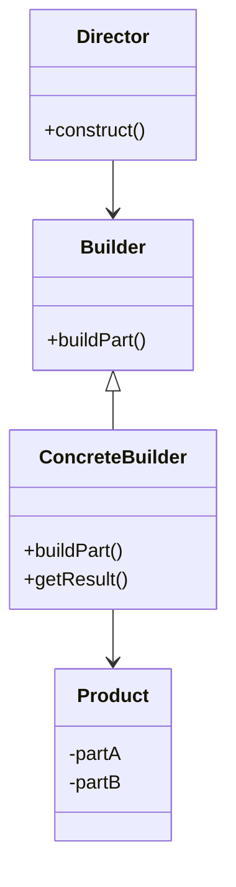

## 6.4.4 Builder Pattern in Java Libraries

The Builder pattern is a creational design pattern that provides a flexible solution to constructing complex objects. It is particularly useful when an object needs to be created with numerous optional parameters or when the construction process involves multiple steps. In this section, we will explore how the Builder pattern is utilized in various Java libraries and frameworks, highlighting its practical applications and benefits for developers.

### Intent

- **Description**: The Builder pattern aims to separate the construction of a complex object from its representation, allowing the same construction process to create different representations.

### Also Known As

- **Alternate Names**: Fluent Builder, Fluent Interface

### Motivation

The Builder pattern is essential in scenarios where a class has a large number of parameters, especially when many of them are optional. It helps in creating a clear and readable code structure, avoiding the need for multiple constructors or telescoping constructor anti-patterns.

### Applicability

- **Guidelines**: Use the Builder pattern when:
  - The object to be constructed has numerous optional parameters.
  - The construction process involves several steps.
  - You want to make the code more readable and maintainable.

### Structure



- **Caption**: The structure of the Builder pattern, illustrating the roles of Director, Builder, ConcreteBuilder, and Product.

### Participants

- **Director**: Constructs an object using the Builder interface.
- **Builder**: Specifies an abstract interface for creating parts of a Product object.
- **ConcreteBuilder**: Implements the Builder interface to construct and assemble parts of the product.
- **Product**: Represents the complex object under construction.

### Collaborations

- **Interactions**: The Director instructs the Builder to construct the product step by step. The ConcreteBuilder assembles the product, and the final product is retrieved.

### Consequences

- **Analysis**: The Builder pattern provides control over the construction process, enhances code readability, and allows for different representations of the product.

### Implementation

#### Java Standard Library: `StringBuilder`

The `StringBuilder` class in Java is a classic example of the Builder pattern. It is used to construct a mutable sequence of characters, allowing for efficient string manipulation.

```java
StringBuilder builder = new StringBuilder();
builder.append("Hello, ");
builder.append("World!");
String result = builder.toString();
System.out.println(result); // Output: Hello, World!
```

- **Explanation**: `StringBuilder` allows for efficient concatenation of strings without creating multiple immutable `String` objects.

#### Lombok's `@Builder` Annotation

Lombok is a popular Java library that reduces boilerplate code. Its `@Builder` annotation automatically generates a builder for a class.

```java
import lombok.Builder;

@Builder
public class User {
    private String name;
    private int age;
}

User user = User.builder()
                .name("Alice")
                .age(30)
                .build();
```

- **Explanation**: The `@Builder` annotation simplifies the creation of builder classes, making the code more concise and readable. More details can be found on [Project Lombok](https://projectlombok.org/).

#### Hibernate Criteria API

Hibernate's Criteria API uses a builder-like approach to construct database queries programmatically.

```java
CriteriaBuilder cb = entityManager.getCriteriaBuilder();
CriteriaQuery<User> query = cb.createQuery(User.class);
Root<User> user = query.from(User.class);
query.select(user).where(cb.equal(user.get("name"), "Alice"));
List<User> result = entityManager.createQuery(query).getResultList();
```

- **Explanation**: The Criteria API provides a type-safe way to construct queries, enhancing readability and maintainability.

#### Google's Guava Library

Guava's `ImmutableList.Builder` is another example of the Builder pattern in action.

```java
import com.google.common.collect.ImmutableList;

ImmutableList<String> list = ImmutableList.<String>builder()
    .add("one")
    .add("two")
    .add("three")
    .build();
```

- **Explanation**: `ImmutableList.Builder` allows for the construction of immutable lists, ensuring thread safety and consistency.

### Sample Use Cases

- **Real-world Scenarios**: The Builder pattern is used in various scenarios, such as constructing complex UI components, configuring network requests, and building complex data structures.

### Related Patterns

- **Connections**: The Builder pattern is related to the [6.6 Singleton Pattern]( "Singleton Pattern") in that both manage object creation but serve different purposes.

### Known Uses

- **Examples in Libraries or Frameworks**: The Builder pattern is widely used in Java libraries such as Lombok, Hibernate, and Guava, as well as in frameworks like Spring and Apache Commons.

### Benefits for Developers

The Builder pattern offers several benefits for developers:

- **Improved Readability**: By providing a fluent interface, the Builder pattern makes the code more readable and easier to understand.
- **Reduced Complexity**: It reduces the complexity of constructors and avoids the telescoping constructor anti-pattern.
- **Flexibility**: The pattern allows for flexible object construction, accommodating optional parameters and complex configurations.
- **Maintainability**: By separating the construction logic from the representation, the Builder pattern enhances maintainability and scalability.

### Conclusion

The Builder pattern is a powerful tool in the Java developer's arsenal, providing a structured approach to constructing complex objects. Its widespread use in Java libraries and frameworks underscores its utility and effectiveness. By mastering the Builder pattern, developers can create more robust, maintainable, and flexible applications.

---

## Test Your Knowledge: Builder Pattern in Java Libraries Quiz



### Which Java class is a classic example of the Builder pattern?

- [x] StringBuilder
- [ ] ArrayList
- [ ] HashMap
- [ ] LinkedList

> **Explanation:** `StringBuilder` is a classic example of the Builder pattern as it allows for efficient string manipulation.

### What is the primary benefit of using Lombok's `@Builder` annotation?

- [x] It reduces boilerplate code.
- [ ] It increases runtime performance.
- [ ] It enhances security.
- [ ] It simplifies error handling.

> **Explanation:** Lombok's `@Builder` annotation automatically generates builder classes, reducing boilerplate code and improving code readability.

### How does the Builder pattern improve code readability?

- [x] By providing a fluent interface.
- [ ] By reducing the number of classes.
- [ ] By increasing the number of methods.
- [ ] By using complex inheritance.

> **Explanation:** The Builder pattern provides a fluent interface, making the code more readable and easier to understand.

### Which library provides the `ImmutableList.Builder`?

- [x] Guava
- [ ] Apache Commons
- [ ] Spring
- [ ] Hibernate

> **Explanation:** Google's Guava library provides the `ImmutableList.Builder` for constructing immutable lists.

### What is a common use case for the Builder pattern?

- [x] Constructing complex objects with optional parameters.
- [ ] Implementing singleton instances.
- [ ] Managing database connections.
- [ ] Handling exceptions.

> **Explanation:** The Builder pattern is commonly used for constructing complex objects with numerous optional parameters.

### How does the Builder pattern enhance maintainability?

- [x] By separating construction logic from representation.
- [ ] By reducing the number of lines of code.
- [ ] By increasing the number of classes.
- [ ] By using complex algorithms.

> **Explanation:** The Builder pattern separates the construction logic from the representation, enhancing maintainability and scalability.

### Which API in Hibernate uses a builder-like approach?

- [x] Criteria API
- [ ] Session API
- [ ] Transaction API
- [ ] Query API

> **Explanation:** Hibernate's Criteria API uses a builder-like approach to construct database queries programmatically.

### What is the main advantage of using `StringBuilder` over `String`?

- [x] Efficient string manipulation.
- [ ] Better security.
- [ ] Easier error handling.
- [ ] Improved inheritance.

> **Explanation:** `StringBuilder` allows for efficient string manipulation without creating multiple immutable `String` objects.

### Which pattern is related to the Builder pattern?

- [x] Singleton Pattern
- [ ] Observer Pattern
- [ ] Factory Pattern
- [ ] Adapter Pattern

> **Explanation:** The Builder pattern is related to the Singleton Pattern in that both manage object creation but serve different purposes.

### True or False: The Builder pattern is only applicable to Java.

- [ ] True
- [x] False

> **Explanation:** The Builder pattern is a design pattern applicable in various programming languages, not just Java.



By understanding and applying the Builder pattern, Java developers can significantly enhance the quality and maintainability of their code, leveraging the pattern's benefits across various libraries and frameworks.
